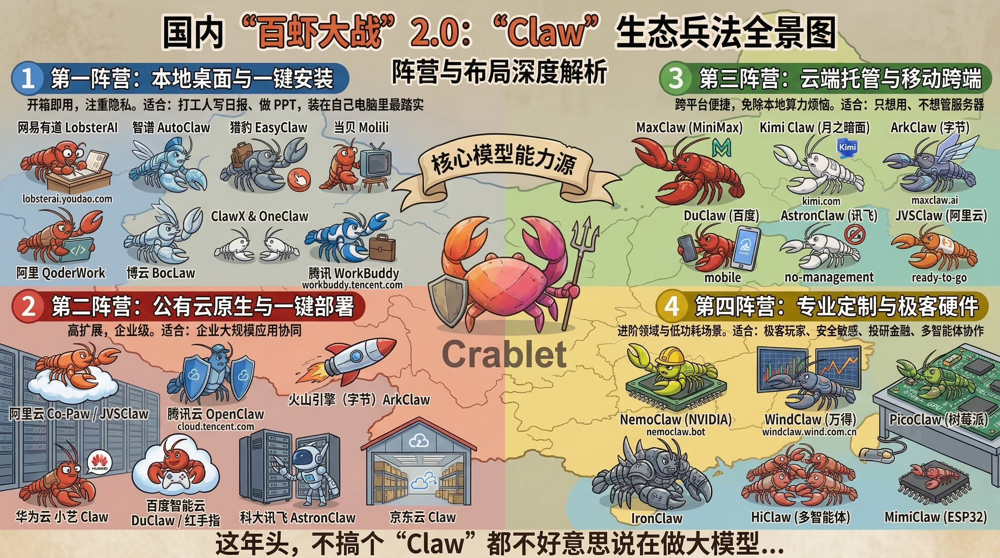

---
prev:
  text: '附录 B：社区之声与生态展望'
  link: '/cn/appendix/appendix-b'
next:
  text: '附录 D：技能开发与发布指南'
  link: '/cn/appendix/appendix-d'
---

# 附录 C：类 Claw 方案对比与选型指南

OpenClaw 的爆发催生了一个庞大的"龙虾生态"——从开源框架到商业托管、从桌面客户端到嵌入式设备、从个人助手到企业级多智能体平台。本附录系统梳理所有主流类 Claw 方案，帮你根据自身需求快速选型。

**目录**

- [1. 全景总览](#_1-全景总览)
- [2. 快速选型：30 秒找到你的方案](#_2-快速选型-30-秒找到你的方案)
- [3. 自建 vs 托管决策框架](#_3-自建-vs-托管决策框架)
- [4. 桌面客户端](#_4-桌面客户端)
- [5. 托管服务](#_5-托管服务)
- [6. 云厂商一键部署](#_6-云厂商一键部署)
- [7. 开源自建方案](#_7-开源自建方案)
- [8. 移动端与 IoT 方案](#_8-移动端与-iot-方案)
- [9. 百虾大战：国内大厂全景图](#_9-百虾大战-国内大厂全景图)

---

## 1. 全景总览

类 Claw 方案可分为五大类：

| 分类 | 代表产品 | 适合谁 | 详见 |
|------|---------|--------|------|
| **桌面客户端** | AutoClaw、ClawX、OneClaw、LobsterAI、EasyClaw、Molili、QoderWork、BocLaw、元气AIBot | 想要 GUI 体验、不想碰终端的用户 | [第 4 节](#_4-桌面客户端) |
| **托管服务** | ArkClaw、Kimi Claw、MaxClaw、WorkBuddy、DuClaw、AstronClaw | 只想用、不想管服务器的用户 | [第 5 节](#_5-托管服务) |
| **云厂商部署** | 腾讯云、阿里云、华为云、百度智能云、科大讯飞等 | 想要独立服务器但省去安装步骤的用户 | [第 6 节](#_6-云厂商一键部署) |
| **开源自建** | OpenClaw、IronClaw、CoPaw、ChatClaw、NanoClaw 等 | 想完全掌控、愿意折腾的技术用户 | [第 7 节](#_7-开源自建方案) |
| **移动端/IoT** | Xiaomi miclaw、红手指 Operator、JVSClaw、MimiClaw、droidclaw | 手机端或嵌入式硬件场景 | [第 8 节](#_8-移动端与-iot-方案) |

> 本教程主线方案为 **OpenClaw 手动安装**（第二章）。如果你是零基础用户，建议从桌面客户端（[第 4 节](#_4-桌面客户端)）开始。

换个角度看——选 AI 就像买车，你得先知道自己是要越野、通勤、还是拉货：

| 阵营 | 定位 | 代表选手 | 适合谁 |
|------|------|---------|--------|
| **第一阵营：本地桌面与一键安装** | 开箱即用，注重隐私 | [LobsterAI](https://lobsterai.youdao.com)（网易有道）、[AutoClaw](https://autoglm.zhipuai.cn/autoclaw)（智谱）、[EasyClaw](https://easyclaw.cn)（猎豹）、[Molili](https://molili.dangbei.com/)（当贝）、[QoderWork](https://qoder.com/qoderwork)（阿里）、[BocLaw](https://www.bocloud.com.cn)（博云）、[ClawX](https://clawx.com.cn)、[OneClaw](https://oneclaw.cn)、[WorkBuddy](https://workbuddy.tencent.com)（腾讯） | 打工人写日报、做 PPT，装在自己电脑里最踏实 |
| **第二阵营：公有云原生与一键部署** | 高扩展，企业级 | [阿里云](https://www.aliyun.com/benefit/scene/moltbot)、[腾讯云](https://cloud.tencent.com/act/pro/openclaw)、[火山引擎](https://www.volcengine.com/activity/codingplan)、[华为云](https://activity.huaweicloud.com/openclaw.html)、[百度智能云](https://cloud.baidu.com/doc/qianfan/s/tmlhtdwyj)、[科大讯飞](https://astronclaw.com)、[京东云](https://www.ithome.com/0/927/614.htm) | 企业大规模应用协同 |
| **第三阵营：云端托管与移动跨端** | 跨平台便捷，免除本地算力烦恼 | [MaxClaw](https://maxclaw.ai/)（MiniMax）、[Kimi Claw](https://kimi.com)（月之暗面）、[ArkClaw](https://www.volcengine.com/experience/ark?mode=claw)（字节）、[DuClaw](https://cloud.baidu.com/product/duclaw)（百度）、[AstronClaw](https://astronclaw.com)（讯飞）、[JVSClaw](https://www.aliyun.com/product/jvsclaw)（阿里云） | 只想用、不想管服务器 |
| **第四阵营：专业定制与极客硬件** | 进阶领域与低功耗场景 | [NemoClaw](https://nemoclaw.bot)（NVIDIA 企业安全栈）、[WindClaw](https://windclaw.wind.com.cn)（万得投研）、[PicoClaw](https://github.com/sipeed/picoclaw)（树莓派）、[IronClaw](https://www.ironclaw.com)（安全重写）、[HiClaw](https://hiclaw.org/)（多智能体）、[MimiClaw](https://github.com/memovai/mimiclaw)（ESP32） | 极客玩家、安全敏感、投研金融、多智能体协作 |

---

## 2. 快速选型：30 秒找到你的方案

> 别管技术参数了，对准你的场景和需求，闭眼选就完事了！

| 场景 | 推荐方案 | 一句话理由 |
|------|---------|-----------|
| 小白 / 个人轻办公 | [网易有道 LobsterAI](https://lobsterai.youdao.com) 或 [智谱 AutoClaw](https://autoglm.zhipuai.cn/autoclaw) | 开源免费 / 一键直装，基础功能拉满 |
| 零基础，不想绑定智谱 | [ClawX](https://clawx.com.cn) 或 [OneClaw](https://oneclaw.cn) + StepFun 免费模型 | 开源 GUI，自选提供商 |
| 重度文档分析师 | [Kimi Claw](https://kimi.com) | 200 万字长上下文，几十个文档扔进去直接吐核心摘要 |
| 微信生态协同 | [腾讯 QClaw](https://claw.guanjia.qq.com) | 唯一支持微信控制电脑 |
| 钉钉生态协同 | [阿里 CoPaw](https://copaw.bot/)（[GitHub](https://github.com/agentscope-ai/CoPaw)） | 钉钉原生集成，开源免费 |
| 飞书生态协同 | [字节 ArkClaw](https://www.volcengine.com/experience/ark?mode=claw) | 飞书深度集成 + Doubao-Seed-2.0 |
| 做 QQ 机器人 | [腾讯云](#_6-云厂商一键部署) 一键部署 | QQ 开放平台深度集成 |
| 一键安装 / 跨境出海 | [猎豹 EasyClaw](https://easyclaw.cn)（[国际版](https://easyclaw.com)） | 傅盛同款技能包，针对营销/小红书优化，双击安装零配置，兼顾国内与出海 |
| 只想用不想管 | [ArkClaw](https://www.volcengine.com/experience/ark?mode=claw) / [Kimi Claw](https://kimi.com) | 云端全托管，注册即用 |
| 想完全掌控配置 | [OpenClaw](https://github.com/openclaw/openclaw) 手动安装 | 本教程主线方案 |
| 安全敏感 / 企业内网 | [IronClaw](https://www.ironclaw.com)（[GitHub](https://github.com/nearai/ironclaw)） | WASM 沙盒 + 零遥测，Rust 安全重写 |
| 企业级 GPU 加速 Agent | [NVIDIA NemoClaw](https://nemoclaw.bot)（[GitHub](https://github.com/NVIDIA/NemoClaw)） | OpenClaw + 安全护栏 + Nemotron 本地推理，GTC 2026 发布 |
| 多智能体团队协作 | [HiClaw](https://hiclaw.org/)（[GitHub](https://github.com/higress-group/hiclaw)） | Manager-Worker 架构，人在回路中 |
| 预算为零 | [ClawX](https://clawx.com.cn) 或 [OneClaw](https://oneclaw.cn) + OpenRouter 免费模型 | 开源 GUI + 免费模型 = ¥0 |
| 预算最低（有付费） | [阿里云](#_6-云厂商一键部署) ¥9.9/月起 | 最低入门价，含海外节点 |
| 开发者 / 极客 | [PicoClaw](https://github.com/sipeed/picoclaw) | 10MB 极小体积，低资源占用，硬件友好 |
| 中文深度优化 | [当贝 Molili](https://molili.dangbei.com/) | 国产模型深度适配，微信遥控电脑，VLA 视觉操控 |
| 投研 / 金融分析 | [万得 WindClaw](https://windclaw.wind.com.cn) | Wind 金融数据库直连，多 Agent 投研工作流 |
| 零部署浏览器直用 | [百度 DuClaw](https://cloud.baidu.com/product/duclaw) | 无需服务器，浏览器即用，¥17.8/月 |
| 手机跨 App 自动化 | [百度红手指 Operator](https://cloud.baidu.com/product/redfinger) | 全球首个移动端 OpenClaw，跨 App 自动操作 |
| 手机一键养虾 | [阿里云 JVSClaw](https://www.aliyun.com/product/jvsclaw) | 6 核 12G 云沙箱，手机 3 分钟开箱 |
| 手机端随身 Agent | [MaxClaw](https://maxclaw.ai/) 移动 Web / 小米 miclaw（内测中） | 云端 / 系统级手机 Agent |
| Agent 安全防护 | [腾讯龙虾管家](https://guanjia.qq.com) | AI 安全沙箱，全流程行为防护与可追溯 |
| 硬件 / 嵌入式 | [MimiClaw](https://github.com/memovai/mimiclaw) / [PicoClaw](https://github.com/sipeed/picoclaw) | ESP32 / 旧手机即可运行 |

---

## 3. 自建 vs 托管决策框架

选好场景后，下一步是决定**怎么部署**。以下框架帮你在四种部署模式之间做出选择：

| 维度 | 自建部署（本教程主线） | 桌面客户端 | 云厂商一键部署 | 全托管 SaaS |
|------|---------------------|-----------|---------------|------------|
| **代表** | OpenClaw 手动安装 | AutoClaw / ClawX | 腾讯云/阿里云等 | ArkClaw / Kimi Claw |
| **控制权** | ★★★★★ 完全掌控 | ★★★★☆ 大部分 | ★★★★☆ 大部分 | ★★☆☆☆ 受限 |
| **运维成本** | 需自行维护 | 几乎无 | 半托管 | 零运维 |
| **月费** | 仅电费/VPS | 免费/按需买积分 | ¥10-100/月 | ¥10-300/月 |
| **数据主权** | 完全本地 | 本地 | 云端（可控） | 云端（受限） |
| **灵活性** | ★★★★★ 最高 | ★★★☆☆ 中等 | ★★★★☆ 较高 | ★★☆☆☆ 最低 |
| **上手难度** | ★★★☆☆ 需终端 | ★☆☆☆☆ 下载即用 | ★★☆☆☆ 买了就能用 | ★☆☆☆☆ 注册即用 |
| **适合谁** | 想深入学习的技术用户 | 零基础用户 | 想省事但保留控制的用户 | 只想用不想管的用户 |

**决策建议：**

> - 🎯 **新手首选**：AutoClaw（零门槛）→ 熟悉后迁移到 OpenClaw（完全掌控）
> - 💰 **预算最低**：ClawX 或 OneClaw + StepFun 免费模型（零成本）
> - 🔒 **安全优先**：IronClaw 自建（WASM 沙盒 + 零遥测）
> - 🏢 **企业用途**：WorkBuddy（微信生态）/ ArkClaw（飞书生态）
> - 🤖 **多智能体**：HiClaw（Manager-Worker 架构）

---

## 4. 桌面客户端

不想碰终端？以下桌面客户端提供图形化界面，下载即用。

| 产品 | 开发商 | 开源 | 平台 | 内置模型 | 预装技能 | 浏览器操作 | 飞书 | QQ | 沙盒 | MCP | IM 远程 | 出海版 | 难度 | 官网 |
|------|--------|------|------|---------|---------|-----------|------|-----|------|-----|--------|--------|------|------|
| **AutoClaw（澳龙）** | 智谱 | ❌ 闭源 | macOS / Windows | Pony-Alpha-2 + 免费积分 | 50+（含浏览器 Agent） | ✅ AutoGLM | ✅ 扫码一键 | 需配置 | — | — | — | — | ★☆☆☆☆ | [官网](https://autoglm.zhipuai.cn/autoclaw) |
| **ClawX** | ValueCell AI | ✅ MIT | macOS / Windows / Linux | ❌ 需自备 | 通过 ClawHub | ❌ | 需手动配置 | 需配置 | — | — | — | — | ★★☆☆☆ | [GitHub](https://github.com/ValueCell-ai/ClawX) / [官网](https://clawx.com.cn) |
| **OneClaw** | OneClaw 社区 | ✅ 开源 | macOS / Windows / Linux | ❌ 需自备 | 通过 ClawHub | ❌ | 需手动配置 | 需配置 | — | — | — | — | ★★☆☆☆ | [GitHub](https://oneclaw.cn) |
| **LobsterAI（有道龙虾）** | 网易有道 | ✅ MIT | macOS / Windows / Linux | ❌ 需自备 | 16 内置 + 技能商店 5,000+ | ❌ | ✅ 钉钉/飞书 | ✅ 企微/QQ (v0.2.2+) | ✅ Alpine VM | ✅ | ✅ 钉钉/飞书/企微/QQ | — | ★☆☆☆☆ | [官网](https://lobsterai.youdao.com) / [GitHub](https://github.com/netease-youdao/LobsterAI) |
| **EasyClaw（猎豹）** | 猎豹移动 | ❌ 闭源 | macOS / Windows / iOS / Android | ❌ 需自备 | 傅盛"三万"同款技能包（办公/营销/小红书） | ❌ | ✅ 飞书/钉钉 | ✅ 企微/QQ | — | — | ✅ 飞书/企微/钉钉/WhatsApp/Telegram | ✅ 企业出海专版 | ★☆☆☆☆ | [国内版](https://easyclaw.cn) / [国际版](https://easyclaw.com) |
| **元气AIBot** | 猎豹移动 | ❌ 闭源 | macOS / Windows | ❌ 需自备 | 文件处理/系统操作/办公创作 | ❌ | ✅ 飞书/钉钉 | — | — | — | ✅ 飞书/钉钉 | — | ★☆☆☆☆ | [官网](https://yuanqiai.net) |
| **Molili（当贝）** | 当贝 | ❌ 闭源 | macOS / Windows | ❌ 需自备（国产模型深度适配） | 中文优化技能 | ✅ VLA 视觉操控 | — | — | — | — | ✅ 微信遥控 | — | ★☆☆☆☆ | [官网](https://molili.dangbei.com/) |
| **QoderWork** | 阿里巴巴 | ❌ 闭源 | macOS / Windows | ❌ 需自备 | Ask/Agent/Quest 三模式 + 自定义 Skills | ❌ | — | — | — | ✅ | — | — | ★★☆☆☆ | [官网](https://qoder.com/qoderwork) |
| **BocLaw（博云）** | 博云 | ❌ 闭源 | macOS / Windows / Linux / Web | ❌ 需自备 | 开发者 + 知识工作者技能 | ❌ | — | — | — | — | ✅ 企业 IM | — | ★☆☆☆☆ | [官网](https://www.bocloud.com.cn) |

**怎么选？**

- **AutoClaw**：最适合零基础用户——下载、注册、开聊，全程不用碰终端。内置模型意味着连 API Key 都不需要。缺点是绑定智谱生态，无 Linux 版。
- **ClawX**：最适合想要 GUI 但不想绑定任何生态的用户。开源 + 三平台 + 提供商自选。内置 OpenClaw 运行时，无需另装 Node.js。
- **OneClaw**：与 ClawX 定位相似的开源桌面客户端，同样支持三平台 + 提供商自选。适合偏好轻量开源 GUI 的用户。
- **LobsterAI**：网易有道出品，国内首个 MIT 全开源桌面 Agent。16 项内置技能 + 技能商店 5,000+ + MCP 服务市场 15+，IM 覆盖最广（钉钉/飞书/企微/QQ/Telegram/Discord），Alpine VM 沙盒隔离，数据 100% 本地，无广告。适合想要**开源 + 安全 + 广泛 IM 支持**的用户。
- **EasyClaw**：猎豹移动出品，傅盛"三万"同款技能包，双击安装零配置。有移动端 App（iOS/Android），可直连飞书、企微、钉钉、QQ 等常用办公应用，适合**公司办公、营销运营和跨境出海**。
- **元气AIBot**：同为猎豹移动出品，定位"国产 OpenClaw"，主打文件处理（PDF/Word/PPT 解析）、系统操作（鼠标键盘控制、软件安装）、办公创作（写作/PPT 生成/转写），可通过飞书/钉钉远程操控。
- **Molili**：当贝出品，中文深度优化桌面客户端，对接国产大模型（DeepSeek、MiniMax、通义千问、Kimi、智谱 GLM），支持微信遥控电脑 + VLA 视觉操控。
- **QoderWork**：阿里出品，本地运行桌面 Agent，支持 Ask（问答）、Agent（自动执行）、Quest（复杂任务）三种模式，MCP 协议 + 自定义 Skills。
- **BocLaw**：博云出品，面向开发者和知识工作者的 AI 协作平台，全平台支持（含 Web 沙盒模式），数据 100% 本地，支持私有云和离网部署，个人免费。

> 本教程第一章详细介绍了 [AutoClaw 安装流程](/cn/adopt/chapter1/)。ClawX、OneClaw 和 LobsterAI 的安装也在第一章备选方案中提及。

---

## 5. 托管服务

不想管服务器？以下托管服务让你注册即用。

### 5.1 一键对比

| 产品 | 开发商 | 访问方式 | 底层模型 | 技能 | 云存储 | 免费额度 | 月费 | IM 集成 | 特色 | 适合谁 |
|------|--------|---------|---------|------|--------|---------|------|--------|------|--------|
| [**ArkClaw**](https://www.volcengine.com/experience/ark?mode=claw) | 字节跳动/火山引擎 | Web 浏览器 | Doubao-Seed-2.0 | OpenClaw 兼容 | 40GB | Coding Plan Pro 含 | ¥9.9/首月起 | 飞书 | 专属 ECS 资源隔离 | 飞书用户/字节生态 |
| [**Kimi Claw**](https://kimi.com) | 月之暗面 | Web (kimi.com) | Kimi K2.5 | 5,000+ (ClawHub) | 40GB | ❌ 需 Allegretto 会员 | ~$39/月 | Telegram | BYOC 混合部署 | 国际化用户 |
| [**MaxClaw**](https://maxclaw.ai/) | MiniMax/稀宇科技 | Web + Telegram/Discord/Slack | MiniMax M2.5 (MoE) | 内置全栈工具包 | — | ✅ 欢迎积分 + 每日积分 | ~$16/月起 | Telegram/Discord/Slack | 多模态（图/视频）内置 | 性价比/多媒体需求 |
| [**WorkBuddy**](https://workbuddy.tencent.com) / [**QClaw**](https://claw.guanjia.qq.com) | 腾讯 | 本地 + 企微 Web | Hunyuan + 多模型 | 20+ 预置技能包 | — | ✅ 5,000 欢迎积分 | 免费 | 微信/QQ/企微/钉钉/飞书 | 唯一支持微信 | 微信/企业用户 |
| [**DuClaw**](https://cloud.baidu.com/product/duclaw) | 百度 | Web 浏览器 | 文心/DeepSeek/Kimi-K2.5/GLM-5/MiniMax-M2.5 | 百度搜索/百科/学术等预置 Skills | — | ✅ 限时优惠 | ¥17.8/月 | — | 零部署浏览器直用，多模型切换 | 不想管服务器的轻度用户 |
| [**AstronClaw**](https://astronclaw.com) | 科大讯飞 | Web 浏览器 | 星火 X2/MiniMax-M2.5/Kimi-K2.5/GLM-5 | 10,000+ Skills | — | ✅ 限时优惠 | ¥16.8/月 | 企微/钉钉/飞书 | 云端沙箱隔离，一键部署 | 讯飞模型生态用户 |
| [**PineClaw**](https://pineclaw.com) | Pine AI | API/SDK + OpenClaw 插件 | — | OpenClaw 插件 + ClawHub 技能 + MCP 服务器 | — | — | — | — | AI 语音电话代理，自动拨打客服电话、账单议价、取消订阅，93% 成功率 | 需要电话自动化的用户 |

---

## 6. 云厂商一键部署

不想用全托管服务，但也不想从零搭建？各大云厂商提供预装 OpenClaw 的服务器镜像，一键购买即可使用。

### 6.1 一键对比

| 云厂商 | 一键部署 | 最低月费 | 推荐配置 | 绑定模型 | IM 集成 | 特色 | 适合谁 |
|--------|---------|---------|---------|---------|--------|------|--------|
| [**腾讯云**](https://cloud.tencent.com/act/pro/openclaw) | ✅ 镜像预装 | ~¥99/年 | 2核4G | 混元/GLM/Kimi/MiniMax | 企微/QQ/钉钉/飞书 | QQ 深度集成 + [SkillHub](https://skillhub.tencent.com) 技能镜像 | QQ 机器人用户 |
| [**阿里云**](https://www.aliyun.com/benefit/scene/moltbot) | ✅ 镜像预装 | **¥9.9/月** | 2核4G | Qwen3.5-plus | 钉钉/飞书 | 最低价 + 海外节点 + [AgentBay](https://agentbay.space) | 预算敏感/需海外 |
| [**百度智能云**](https://cloud.baidu.com/doc/qianfan/s/tmlhtdwyj) | ✅ 可视化面板 | 限时免费 | 2核4G | 文心/Qwen/DeepSeek | 钉钉/飞书 | 7 个官方千帆技能 | 百度模型生态 |
| [**火山引擎**](https://www.volcengine.com/activity/codingplan) | ✅ ECS + ArkClaw 双模 | ¥9.9/月 | 2核4G | Doubao-Seed-2.0 | 飞书/企微 | 双模（ECS + ArkClaw） | 飞书用户 |
| [**华为云**](https://activity.huaweicloud.com/openclaw.html) | ✅ 镜像预装 | ¥9.9/月 或 ¥68/年 | 2核2G | DeepSeek-V3.2/GLM-5/Kimi-K2 | 飞书/QQ/微信/钉钉 | ¥20 Token 代金券 | 新手/多 IM |
| [**京东云**](https://www.ithome.com/0/927/614.htm) | ✅ 镜像 + 人工服务 | ¥9.9 起 | — | Kimi K2.5 | — | ¥399 人工远程部署 | 完全不想动手 |
| [**科大讯飞**](https://astronclaw.com) | ✅ 云端一键部署 | ¥16.8/月 | 云端沙箱 | 星火 X2/MiniMax-M2.5/Kimi-K2.5/GLM-5 | 企微/钉钉/飞书 | 10,000+ Skills + 沙箱隔离 | 讯飞生态用户 |

---

## 7. 开源自建方案

以下方案面向想要完全掌控的技术用户。如果你是新手，建议先从[桌面客户端](#_4-桌面客户端)或[托管服务](#_5-托管服务)入门。

### 7.1 全功能框架

| 项目 | 语言 | 官网 | 定位 | 安全隔离 | 数据存储 | 记忆系统 | 遥测 | 技能生态 | IM 支持 | MCP | 前置条件 | 适合谁 |
|------|------|------|------|---------|---------|---------|------|--------|--------|-----|---------|--------|
| **OpenClaw** | TypeScript (Node.js) | [GitHub](https://github.com/openclaw/openclaw) | 全功能 Agent 执行引擎（本教程主线） | Docker 沙盒 | SQLite | 文件级 (Markdown) | 可选 | ClawHub 25,000+ | 15+ 渠道 | ✅ | Node.js >= 22 | 想深入学习的技术用户 |
| **IronClaw** | Rust | [官网](https://www.ironclaw.com) / [GitHub](https://github.com/nearai/ironclaw) | 安全优先重写版 | WASM 沙盒 + 凭证保护 + 提示词注入防御 | PostgreSQL 15+ + pgvector | 混合全文 + 向量检索 | 零遥测，完全可审计 | 兼容 OpenClaw + 动态工具构建 | 兼容 OpenClaw 渠道 | ✅ | Rust 1.85+ / PostgreSQL 15+ | 安全敏感场景（企业内网/敏感数据） |
| **NemoClaw** | Python | [官网](https://nemoclaw.bot) / [GitHub](https://github.com/NVIDIA/NemoClaw) | NVIDIA 企业安全栈（OpenClaw + 护栏） | OpenShell 策略护栏 + Agent Toolkit 安全层 | — | — | 隐私路由器 + 本地推理 | 兼容 OpenClaw + NVIDIA Agent Toolkit | 兼容 OpenClaw 渠道 | ✅ | NVIDIA GPU（RTX/DGX） | 企业级安全部署 + GPU 加速推理 |

### 7.2 轻量/极简/专项方案

以下项目各有侧重——极简设计、安全定制、多智能体协作或本地模型支持，适合学习、定制或特定场景。

| 项目 | 语言 | 定位 | GitHub |
|------|------|------|--------|
| **NanoClaw** | TypeScript | 容器沙盒隔离，极简设计，易于理解和扩展 | [qwibitai/nanoclaw](https://github.com/qwibitai/nanoclaw) |
| **ZeroClaw** | Rust | Trait 驱动、零开销架构，全可替换核心，跨环境部署 | [zeroclaw-labs/zeroclaw](https://github.com/zeroclaw-labs/zeroclaw) |
| **TinyClaw** | Shell/TS | 多智能体多团队，链式执行 + 扇出，隔离工作区 | [TinyAGI/tinyclaw](https://github.com/TinyAGI/tinyclaw) |
| **AlphaClaw** | TypeScript | OpenClaw 运维管理层：Web 面板 + 网关管理 + 自愈看门狗 + Git 自动备份 | [chrysb/alphaclaw](https://github.com/chrysb/alphaclaw) |
| **CoPaw** | Python | 阿里通义 AgentScope 团队出品，钉钉原生集成，长期记忆（ReMe 框架），支持本地模型 | [agentscope-ai/CoPaw](https://github.com/agentscope-ai/CoPaw) |
| **HiClaw** | Docker | Higress 社区多智能体协作平台，Manager-Worker 架构，人在回路中，内置 Matrix 服务器 | [higress-group/hiclaw](https://github.com/higress-group/hiclaw) |
| **GenericAgent** | Python | 复旦 A3 实验室极简自主 Agent，自组织/自学习/自进化，可自动安装/卸载 OpenClaw 等复杂系统 | [lsdefine/pc-agent-loop](https://github.com/lsdefine/pc-agent-loop) |
| **ClawRouter** | TypeScript | Agent 原生 LLM 智能路由，41+ 模型本地零延迟自动选路，ECO/AUTO/PREMIUM 三档省 92% 成本 | [BlockRunAI/ClawRouter](https://github.com/BlockRunAI/ClawRouter) |
| **nanobot** | Python | 港科大 HKUDS 出品，代码量仅 OpenClaw 1%，研究友好，pip 一键安装，支持 10+ IM 渠道 | [HKUDS/nanobot](https://github.com/HKUDS/nanobot) |
| **ClawWork** | Python | 港科大 HKUDS 出品，AI Coworker 经济基准测试：220 GDPVal 任务、44 职业、$10 起步生存挑战，基于 nanobot | [HKUDS/ClawWork](https://github.com/HKUDS/ClawWork) |
| **WildClawBench** | Python | 上海 AI 实验室 InternLM 出品，真实用户对话驱动的 Agent 能力基准测试，覆盖多轮工具调用与复杂任务评估 | [InternLM/WildClawBench](https://github.com/InternLM/WildClawBench) |
| **MetaClaw** | Python | 在线 RL 进化层，Agent 从交互中自学习、自进化，无需 GPU，一键注入 OpenClaw | [aiming-lab/MetaClaw](https://github.com/aiming-lab/MetaClaw) |
| **AutoResearchClaw** | Python | aiming-lab 出品，自动化科研工作流：文献检索、实验设计、数据分析、论文撰写，端到端 AI 科研助手 | [aiming-lab/AutoResearchClaw](https://github.com/aiming-lab/AutoResearchClaw) |
| **MiniClaw** | TypeScript | 极简 OpenClaw 替代，直接用 Claude Pro/ChatGPT Plus 订阅跑 Telegram，零 API 成本 | [htlin222/mini-claw](https://github.com/htlin222/mini-claw) |
| **ChatClaw** | Go | 智麻出品，30MB 安装包一分钟装好，内置技能市场 + 知识库 + 记忆 + MCP + 定时任务，覆盖 WhatsApp/Telegram/Slack/Discord/Gmail/钉钉/企微/QQ/飞书 | [zhimaAi/ChatClaw](https://github.com/zhimaAi/ChatClaw) |
| **ClawShield** | TS/Rust | AI Agent 治理层：Model-as-a-Judge 审计高危操作 + 实时推理链监控 + OHTTP 隐私路由 | [xinxin7/claw-shield](https://github.com/xinxin7/claw-shield) |

### 7.3 开源方案综合对比

| 项目 | 语言 | 安装难度 | 资源占用 | 安全性 | 技能生态 | 多 Agent | IM 集成 | 适合场景 |
|------|------|---------|---------|--------|---------|---------|--------|---------|
| **OpenClaw** | TypeScript | ★★☆☆☆ | 中 | ★★★☆☆ | ★★★★★ | 有限 | ★★★★★ | 通用主力 |
| **IronClaw** | Rust | ★★★★☆ | 中 | ★★★★★ | ★★★★☆ | 有限 | ★★★★☆ | 安全敏感 |
| **NemoClaw** | Python | ★★☆☆☆ | 中-高（GPU） | ★★★★★ | ★★★★☆ | 有限 | ★★★★☆ | 企业安全 + GPU 推理 |
| **CoPaw** | Python | ★★☆☆☆ | 中 | ★★★☆☆ | ★★★☆☆ | 有限 | ★★★★☆ | 钉钉生态 |
| **NanoClaw** | TypeScript | ★★☆☆☆ | 低 | ★★★☆☆ | ★★☆☆☆ | 无 | ★★☆☆☆ | 学习/定制 |
| **ZeroClaw** | Rust | ★★★☆☆ | 低 | ★★★☆☆ | ★★☆☆☆ | 无 | ★★☆☆☆ | 高性能 |
| **HiClaw** | Docker | ★★☆☆☆ | 中 | ★★★★☆ | ★★★☆☆ | ★★★★★ | ★★★☆☆ | 团队协作 |
| **GenericAgent** | Python | ★☆☆☆☆ | 低 | ★★★☆☆ | ★☆☆☆☆ | 无 | ★☆☆☆☆ | 通用自主Agent |
| **ClawRouter** | TypeScript | ★★☆☆☆ | 低 | ★★★★☆ | — | 无 | — | 多模型路由/降本 |
| **nanobot** | Python | ★☆☆☆☆ | 低 | ★★★☆☆ | ★★☆☆☆ | 无 | ★★★★☆ | 学术研究/快速原型 |
| **ClawWork** | Python | ★★☆☆☆ | 中 | ★★★☆☆ | — | 无 | ★★★★☆ | Agent 经济基准测试 |
| **WildClawBench** | Python | ★★☆☆☆ | 中 | ★★★☆☆ | — | 无 | — | 真实对话 Agent 基准测试 |
| **MetaClaw** | Python | ★☆☆☆☆ | 低 | ★★★☆☆ | ★★★☆☆ | 无 | — | Agent 自进化/RL |
| **AutoResearchClaw** | Python | ★☆☆☆☆ | 低 | ★★★☆☆ | ★★☆☆☆ | 无 | — | 自动化科研 |
| **MiniClaw** | TypeScript | ★☆☆☆☆ | 低 | ★★★☆☆ | ★☆☆☆☆ | 无 | ★☆☆☆☆ | 订阅复用/极简 |
| **ChatClaw** | Go | ★☆☆☆☆ | 低 | ★★★☆☆ | ★★★☆☆ | 无 | ★★★★★ | IM 全覆盖/开源自建 |
| **ClawShield** | TS/Rust | ★☆☆☆☆ | 低 | ★★★★★ | — | 无 | — | Agent 治理/安全审计 |

---

## 8. 移动端与 IoT 方案

### 8.1 移动端

| 产品 | 开发商 | 平台 | 定位 | 状态 |
|------|--------|------|------|------|
| **Xiaomi miclaw** | 小米 | Android（小米 17 系列） | 系统级手机 Agent，MiMo 模型，50+ 工具，覆盖人-车-家全生态，端云混合隐私计算 | 🔒 内测 |
| **红手指 Operator** | 百度 | Android（iOS 待上线） | 全球首个移动端 OpenClaw 应用，跨 App 自动交互（叫外卖、打车等），自然语言指令 | ✅ 已上线 |
| **JVSClaw** | 阿里云 | iOS / Android / iPad / Web | 手机一键养虾，每用户独享 6 核 12G 云沙箱（ClawSpace），3 分钟开箱 | ✅ 已上线 |
| **MaxClaw** | MiniMax | Web（移动端访问） | 云端 Agent，手机浏览器可用 | ✅ 已上线 |
| **droidclaw** | UnitedByAI | Android | OpenClaw 移动端适配，轻量自动化 | [开源](https://github.com/UnitedByAI/droidclaw) |
| **PokeClaw** | agents-io | Android 9+ | 开源手机端 AI Agent，本地优先（Gemma 4 端侧推理），屏幕读取 + 工具链 + 跨 App 自动化，无需账号或 API Key（本地模式），亦支持云端模型 | [开源](https://github.com/agents-io/PokeClaw) |

### 8.2 嵌入式 / IoT

| 项目 | 语言 | 硬件 | 定位 | GitHub |
|------|------|------|------|--------|
| **PicoClaw** | Go | 旧 Android 手机 / 树莓派 / 低配 VPS | 超低资源 Agent，单二进制部署 | [sipeed/picoclaw](https://github.com/sipeed/picoclaw) |
| **MimiClaw** | C | ESP32-S3 | 无操作系统，USB 供电持续运行 | [memovai/mimiclaw](https://github.com/memovai/mimiclaw) |
| **zclaw** | C | ESP32 | 最小化 AI 助手 | [tnm/zclaw](https://github.com/tnm/zclaw) |
| **NullClaw** | Zig | 通用嵌入式 | 极小二进制，低内存，高可移植 | [nullclaw/nullclaw](https://github.com/nullclaw/nullclaw) |

> 嵌入式方案适合 IoT 爱好者和硬件极客。如果你想在一块 ESP32 开发板上跑 AI 助手，MimiClaw 和 zclaw 可以实现。PicoClaw 则可以让一台闲置的旧 Android 手机变成 24/7 运行的个人 Agent。

---

## 9. 百虾大战：国内大厂全景图

2026 年初，OpenClaw 在国内引发了一场"百虾大战"——20+ 家科技公司迅速跟进，推出各自的类 Claw 产品或部署方案。

| 公司 | 产品/方案 | 类型 | 状态 |
|------|----------|------|------|
| **智谱** | [AutoClaw（澳龙）](https://autoglm.zhipuai.cn/autoclaw)一键安装版 | 桌面客户端 | ✅ 已上线 |
| **字节跳动** | [ArkClaw](https://www.volcengine.com/experience/ark?mode=claw) 全托管 + 飞书适配 + 火山引擎云部署 | 托管 + 云部署 | ✅ 已上线 |
| **腾讯** | [WorkBuddy](https://workbuddy.tencent.com) + [QClaw](https://claw.guanjia.qq.com) + [龙虾管家](https://guanjia.qq.com)（AI 安全沙箱）+ [腾讯云部署](https://cloud.tencent.com/act/pro/openclaw) + [SkillHub](https://skillhub.tencent.com) + [乐享 MCP](https://github.com/tencent-lexiang/lexiang-mcp-server) | 本地 + 托管 + 云部署 + 安全 | ✅ 部分内测 |
| **月之暗面** | [Kimi Claw](https://kimi.com) 托管版 | 托管服务 | ✅ 已上线 |
| **MiniMax** | [MaxClaw](https://maxclaw.ai/) 托管版 + 移动端 | 托管服务 | ✅ 已上线 |
| **网易有道** | [LobsterAI（有道龙虾）](https://lobsterai.youdao.com) MIT 全开源桌面 Agent + 技能商店 + MCP 市场（[GitHub](https://github.com/netease-youdao/LobsterAI)） | 桌面客户端 | ✅ 已上线 |
| **猎豹移动** | [EasyClaw](https://easyclaw.cn)（[国际版](https://easyclaw.com)）一键安装 + [元气AIBot](https://yuanqiai.net) 桌面 Agent | 桌面客户端 | ✅ 已上线 |
| **阿里** | [阿里云一键部署](https://www.aliyun.com/benefit/scene/moltbot) + [CoPaw](https://copaw.bot/)（[GitHub](https://github.com/agentscope-ai/CoPaw)）+ [QoderWork](https://qoder.com/qoderwork) 桌面 Agent + [JVSClaw](https://www.aliyun.com/product/jvsclaw) 移动端 + [AgentBay](https://agentbay.space) | 云部署 + 桌面 + 移动端 | ✅ 已上线 |
| **百度** | [千帆一键体验](https://cloud.baidu.com/doc/qianfan/s/tmlhtdwyj) + [DuClaw](https://cloud.baidu.com/product/duclaw) 零部署托管 + [红手指 Operator](https://cloud.baidu.com/product/redfinger) 移动端 | 云部署 + 托管 + 移动端 | ✅ 已上线 |
| **科大讯飞** | [AstronClaw](https://astronclaw.com) 云端一键部署，10,000+ Skills，星火 X2 模型 | 云部署 + 托管 | ✅ 已上线 |
| **华为** | [华为云一键部署](https://activity.huaweicloud.com/openclaw.html) + 小艺Claw（HarmonyOS 内置） | 云部署 + 移动端 | ✅ 已上线 / 🔒 小艺Claw 内测 |
| **京东** | 京东云一键部署 + [人工远程服务](https://www.ithome.com/0/927/614.htm) | 云部署 + 服务 | ✅ 已上线 |
| **小米** | Xiaomi miclaw 手机系统层 Agent | 移动端 | 🔒 内测 |
| **当贝** | [Molili](https://molili.dangbei.com/) 中文优化桌面客户端，国产模型深度适配，微信遥控 + VLA 视觉操控 | 桌面客户端 | ✅ 已上线 |
| **万得** | [WindClaw](https://windclaw.wind.com.cn) AI 投研智能体平台，Wind 金融数据库直连，多 Agent 投研工作流 | 桌面客户端（垂直） | ✅ 公测中 |
| **博云** | [BocLaw](https://www.bocloud.com.cn) 开发者 AI 协作平台，全平台 + Web 沙盒，数据本地，个人免费 | 桌面客户端 | ✅ 已上线 |
| **智麻** | [ChatClaw](https://github.com/zhimaAi/ChatClaw) Go 语言开源 Agent，30MB 安装包，9 大 IM 渠道全覆盖 | 开源桌面 | ✅ 已上线 |
| **美团** | 小美（AI 生活小秘书，App Store 搜索"小美-AI生活小秘书"）+ 联合联想百应远程部署服务 | 移动 App + 远程服务 | ✅ 已上线 |
| **360** | [纳米AI](https://www.n.cn/)（多智能体蜂群架构）+ [SEAF 企业智能体平台](https://sea.n.cn/) | 消费端 + 企业端 | ✅ 已上线 |

> 这场竞争的本质是**入口之争**——谁能成为用户调用 AI 能力的默认界面。从聊天平台（微信/QQ/飞书）到桌面客户端、从云服务到手机系统层，各家都在抢占自己最擅长的位置。
