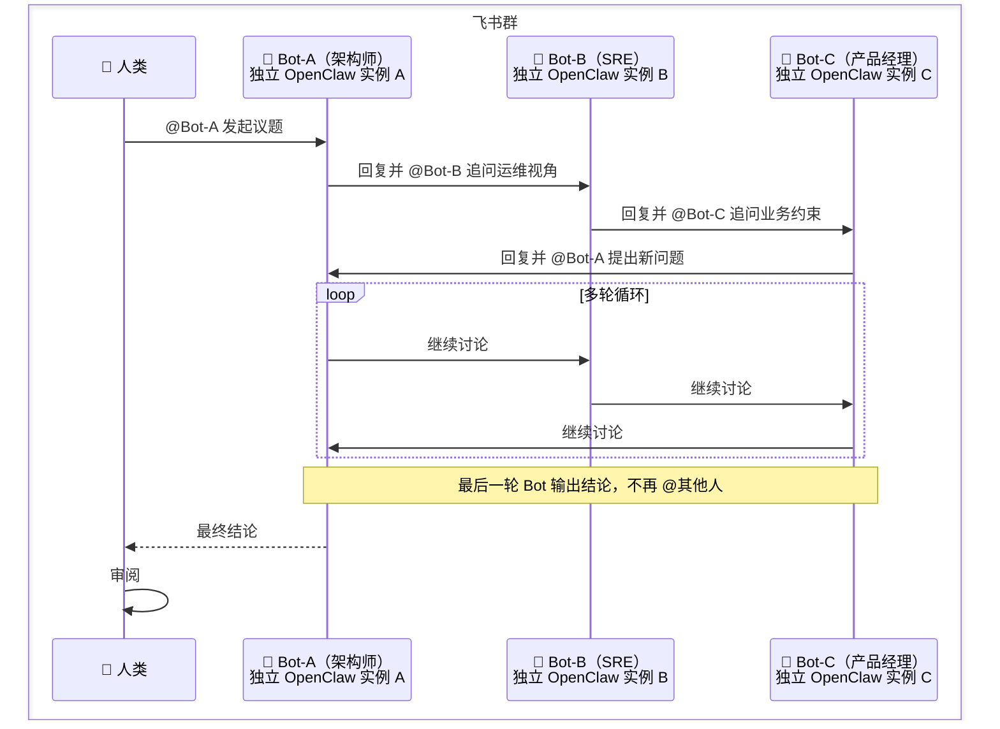
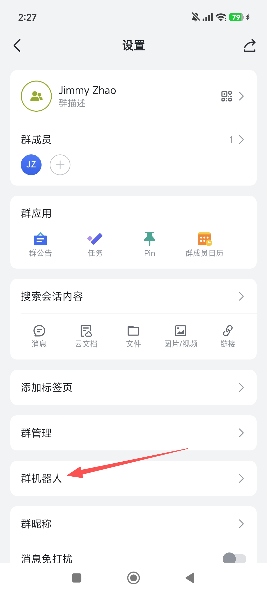
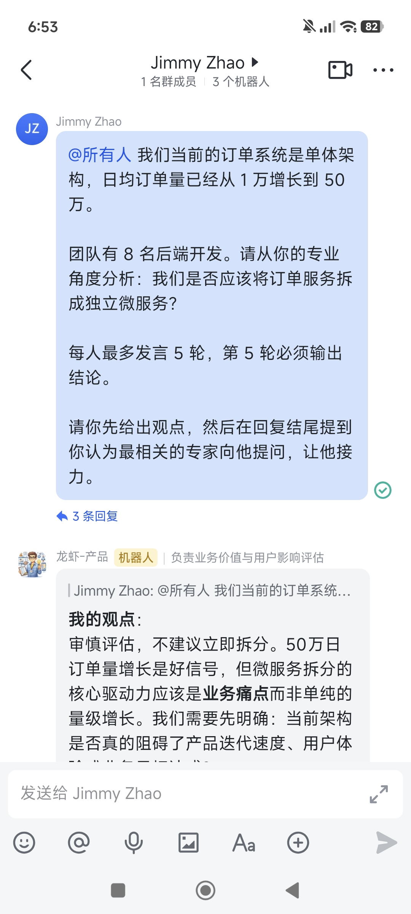

# 飞书群多智能体自主讨论：让 Bot 们自己开会

> **适用场景**：你想让多个具备不同专业视角的 AI 智能体在同一个飞书群里自主讨论一个议题，经过多轮对话后给出方案，人类只需要在最后审阅结论。
>
> **前置条件**：已完成[第四章 聊天平台接入](/cn/adopt/chapter4/)（飞书机器人已跑通）。
>
> **核心思路**：在同一个飞书群中拉入多个环境隔离的 OpenClaw 实例（各自独立的 Bot），通过 @提及 形成自动化的讨论链，实现多轮自主对话，人类不干预。

## 1. 这套方案能做什么

想象这样一个场景。

你们团队正在评估"要不要把单体服务拆成微服务"。这件事没有标准答案，需要从架构、运维、业务、成本多个角度讨论。传统做法是拉一个会，把架构师、SRE（Site Reliability Engineering，站点可靠性工程，负责系统稳定性和运维）、产品经理叫到一起，各说各话，最后勉强达成共识。

现在换一种方式。你在飞书群里拉进三个 AI 智能体：一个扮演架构师，一个扮演 SRE，一个扮演产品经理。你只需要发一句"请讨论：我们是否应该将订单服务拆成独立微服务？"，然后这三个 Bot 就开始自主讨论——架构师提方案，SRE 指出运维风险，产品经理补充业务约束，几轮下来自动收敛出一份结论。

跑通后，你可以用它来做：

- **技术方案评审**：多个专业视角的 Bot 自主辩论，输出利弊分析
- **产品需求评估**：产品、技术、设计三方 Bot 各抒己见，输出可行性报告
- **风险评估**：安全、合规、业务连续性三个视角自动交叉审查
- **头脑风暴**：多个不同背景的 Bot 围绕一个创意主题发散讨论

## 2. 整体架构



关键设计点：

- **环境隔离**：每个 Bot 是一个独立的 OpenClaw 实例，有自己的 Skill、上下文和系统提示词，互不干扰。
- **触发机制**：飞书群里所有 Bot 都能收到每条消息，每个 Bot 通过阅读上下文判断"现在轮到我了吗"，只有该发言的 Bot 才回复。
- **讨论链条**：每个 Bot 回复时在结尾提到下一个 Bot 的名字，下一个 Bot 读到后自动接力。
- **终止条件**：通过轮数上限或共识检测来避免无限循环。

## 3. 准备工作

> **前提：你已经有一个能在飞书群中正常响应的 OpenClaw Bot。** 如果还没有，请先完成[第四章 聊天平台接入](/cn/adopt/chapter4/)。本教程是在单 Bot 跑通的基础上，扩展到多 Bot 协同讨论。

### 3.1 创建多个飞书应用

你需要在飞书开放平台**额外创建两个**企业自建应用（加上你已有的那个，一共三个），每个应用对应一个 Bot 角色。

| 应用名称 | 角色 | 说明 |
|----------|------|------|
| 龙虾-架构师 | 架构师 | 负责技术方案设计与架构评估（可以复用你已有的 Bot） |
| 龙虾-SRE | SRE | 负责运维可行性与稳定性分析（新建） |
| 龙虾-产品 | 产品经理 | 负责业务价值与用户影响评估（新建） |

每个新建应用都需要完整走一遍[第四章](/cn/adopt/chapter4/)的全部步骤，不能跳过任何一步：

1. **创建企业自建应用**（第四章第二步）
2. **获取 App ID 和 App Secret**（第三步）
3. **启用机器人能力**（第四步）——**这是最关键的一步**。进入"添加应用能力" → "机器人"，点击"添加"。如果不做这步，飞书里打开这个 Bot 的对话时**连消息输入框都不会出现**，用户根本无法给机器人发消息
4. **批量导入权限**（第五步）——粘贴第四章提供的完整权限 JSON，导入后点击"申请开通"
5. **发布应用**（第六步）——进入"版本管理与发布"，创建版本并提交发布。未发布的应用无法接收消息
6. **在 OpenClaw 中添加渠道**（第四章第 3 节）——每个应用需要用各自的 App ID 和 App Secret 单独添加
7. **配置事件订阅**（第四章第 3.5 节）——每个应用都需要单独配置"接收消息"事件，具体操作参照第四章

> **如果打开 Bot 对话后没有消息输入框**，说明第 3 步（启用机器人能力）或第 5 步（发布应用）没有完成。回到飞书开放平台检查对应应用的"应用能力"页面，确认"机器人"已添加，然后确认应用已发布。
>
> **如果在飞书中搜索不到机器人、建群时也找不到**，说明应用的"可用范围"没有设置（第四章第 5.5 步）。回到飞书开放平台，进入对应应用的"可用范围"，把你自己添加进去。详见[第四章](/cn/adopt/chapter4/)。

### 3.2 为每个 Bot 配置独立的 OpenClaw 实例

三个飞书 Bot 需要三个独立的 OpenClaw 实例。OpenClaw 提供了 `--profile` 参数来实现环境隔离——每个 profile 拥有独立的配置、会话和凭证，互不干扰。

分两步配置：先设置**模型认证**，再设置**飞书凭证和 gateway 模式**。

**第一步：为每个 profile 配置模型认证**

每个 profile 都需要单独配置 API Key——新建的 profile **不会自动继承**默认 profile 的密钥。两种方式任选其一：

**方式 A：交互式添加（推荐）**

```bash
openclaw --profile architect models auth add
```

命令会进入交互式向导，按以下步骤操作：

1. **Token provider** — 如果用 Anthropic，直接选 `anthropic`；如果用 OpenRouter，选 **`custom (type provider id)`**
2. **Provider id**（仅 custom 时出现）— 输入 `openrouter`
3. **Profile id** — 直接回车，保持默认值 `openrouter:manual`
4. **Does this token expire?** — 选 `No`
5. **Paste token** — 粘贴你的 API Key

对 SRE 和产品经理重复同样操作：

```bash
openclaw --profile sre models auth add
openclaw --profile pm models auth add
```

三个 Bot 可以使用同一个 Key。

**方式 B：复制默认 profile 的认证文件**

如果你的默认 OpenClaw 已经配好了模型认证，可以直接复制给新 profile：

```bash
# Windows PowerShell
copy "$HOME\.openclaw\agents\main\agent\auth-profiles.json" "$HOME\.openclaw-architect\agents\main\agent\auth-profiles.json"
copy "$HOME\.openclaw\agents\main\agent\auth-profiles.json" "$HOME\.openclaw-sre\agents\main\agent\auth-profiles.json"
copy "$HOME\.openclaw\agents\main\agent\auth-profiles.json" "$HOME\.openclaw-pm\agents\main\agent\auth-profiles.json"

# macOS / Linux
cp ~/.openclaw/agents/main/agent/auth-profiles.json ~/.openclaw-architect/agents/main/agent/auth-profiles.json
cp ~/.openclaw/agents/main/agent/auth-profiles.json ~/.openclaw-sre/agents/main/agent/auth-profiles.json
cp ~/.openclaw/agents/main/agent/auth-profiles.json ~/.openclaw-pm/agents/main/agent/auth-profiles.json
```

> 目标目录可能不存在，需要先创建：`mkdir -p ~/.openclaw-architect/agents/main/agent/`（Linux/macOS）。

然后为每个 profile 设置默认模型。这里以 [OpenRouter](https://openrouter.ai/) 的免费模型为例：

```bash
openclaw --profile architect models set openrouter/qwen/qwen3.6-plus:free
openclaw --profile sre models set openrouter/qwen/qwen3.6-plus:free
openclaw --profile pm models set openrouter/qwen/qwen3.6-plus:free
```

> 模型名格式为 `openrouter/<provider>/<model>`，可选模型列表见 [openrouter.ai/models](https://openrouter.ai/models)。你也可以为三个 Bot 设置不同的模型。

**第二步：为每个 profile 配置飞书凭证和 gateway 模式**

```bash
# 实例 A：架构师（端口 18789）
openclaw --profile architect config set channels.feishu.appId "cli_architect_xxx"
openclaw --profile architect config set channels.feishu.appSecret "your-architect-secret"
openclaw --profile architect config set channels.feishu.groupPolicy "open"
openclaw --profile architect config set gateway.mode local
openclaw --profile architect config set gateway.port 18789

# 实例 B：SRE（端口 18790）
openclaw --profile sre config set channels.feishu.appId "cli_sre_xxx"
openclaw --profile sre config set channels.feishu.appSecret "your-sre-secret"
openclaw --profile sre config set channels.feishu.groupPolicy "open"
openclaw --profile sre config set gateway.mode local
openclaw --profile sre config set gateway.port 18790

# 实例 C：产品经理（端口 18791）
openclaw --profile pm config set channels.feishu.appId "cli_pm_xxx"
openclaw --profile pm config set channels.feishu.appSecret "your-pm-secret"
openclaw --profile pm config set channels.feishu.groupPolicy "open"
openclaw --profile pm config set gateway.mode local
openclaw --profile pm config set gateway.port 18791
```

> `gateway.mode local` 告诉 OpenClaw 以本地模式运行 gateway。不设置这个值，gateway 会启动后立即退出。
>
> **每个 profile 必须使用不同的端口**（`gateway.port`）。如果多个 profile 使用相同端口，后启动的 gateway 会因端口被占用而启动失败。上面的示例分别使用了 18789、18790、18791。

**国际版 Lark 用户必读：** 如果你用的是**国际版 Lark**（open.larksuite.com）而非国内飞书（open.feishu.cn），**每个 profile 都必须设置 `domain` 为 `"lark"`**。不设置这个值，gateway 启动后 WebSocket 连接会报 `code: 1000040351, system busy` 错误，飞书消息无法接收。

```bash
openclaw --profile architect config set channels.feishu.domain "lark"
openclaw --profile sre config set channels.feishu.domain "lark"
openclaw --profile pm config set channels.feishu.domain "lark"
```

> 判断方法：你在飞书开放平台登录用的网址是 `open.feishu.cn` 还是 `open.larksuite.com`？前者是国内飞书，不需要这一步；后者是国际版 Lark，必须加这一步。

### 3.3 启动 Gateway

每个 profile 的 gateway 需要单独启动。不要一上来就启动三个——**先让一个 Bot 跑通，确认它能在飞书里回复你，再启动下一个。**

Gateway 有两种启动方式，**只能选一种**，不能混用（它们占同一个端口）：

| 方式 | 命令 | 说明 |
|------|------|------|
| **前台运行** | `gateway run` | 日志直接输出到当前终端，关闭终端 = 停止 Bot。适合调试和初次配置。 |
| **后台运行** | `gateway start` | 注册为系统服务，关闭终端不影响。适合长期使用。用 `gateway stop` 停止，`gateway restart` 重启。 |

> 如果你先用了 `start`，再用 `run` 会报 `Port ... is already in use` 错误。此时需要先 `gateway stop` 再切换。

下面以 `gateway run`（前台运行）为例。如果你选择后台运行，把 `run` 换成 `start` 即可，后续步骤不变。

**启动架构师的 gateway：**

```bash
openclaw --profile architect gateway run
```

看到类似 `listening on ws://127.0.0.1:18789` 的输出，说明启动成功。

打开飞书，私聊"龙虾-架构师"，发一条消息：

```text
你好，请介绍一下你自己
```

### 3.4 完成配对

第一次给 Bot 发消息时，Bot 不会直接回复你的问题，而是会返回一个 **8 位配对码**，类似：

```text
OpenClaw: access not configured.
Pairing code: 3SFQEVUW
Ask the bot owner to approve with:
openclaw --profile architect pairing approve feishu 3SFQEVUW
```

**打开一个新的终端窗口**（不要关闭正在运行 gateway 的窗口），执行配对批准命令：

```bash
openclaw --profile architect pairing approve feishu <你收到的配对码>
```

配对成功后，**再给 Bot 发一条消息**，这次它应该正常回复了。

> **为什么要配对？** 防止陌生人滥用你的机器人——每次对话都消耗你的 API 额度。配对码 1 小时过期。

确认架构师 Bot 能正常回复后，对 SRE 和产品经理重复同样的流程：

**窗口 2** — 启动 SRE：

```bash
openclaw --profile sre gateway run
```

私聊"龙虾-SRE"，收到配对码后在另一个终端执行：

```bash
openclaw --profile sre pairing approve feishu <配对码>
```

**窗口 3** — 启动产品经理：

```bash
openclaw --profile pm gateway run
```

私聊"龙虾-产品"，收到配对码后在另一个终端执行：

```bash
openclaw --profile pm pairing approve feishu <配对码>
```

**三个 Bot 都能正常回复后，再进入下一步。** 确保三个 gateway 窗口保持打开。

> **如果某个 Bot 没有回复也没有返回配对码**，检查对应的 gateway 窗口是否有报错信息。常见问题：
> - 如果日志里有 `connect failed` 或 `system busy`，参考上面的国际版 Lark `domain` 设置。
> - 如果显示 `Port ... is already in use`，说明端口冲突，确认每个 profile 的 `gateway.port` 不同。
> - 其他排查方式参考[第四章的常见问题](/cn/adopt/chapter4/#_6-常见问题)。

### 3.5 定义角色身份

每个 Bot 的角色定义需要**写入 SOUL.md 文件**。SOUL.md 是 OpenClaw 的系统提示词文件，Bot 每次收到消息时都会读取它，所以写在这里的内容是持久的，重启 gateway 也不会丢失。

> **不要通过私聊发消息的方式设定角色**——那只是一次性的对话上下文，gateway 重启后就没了。

下面以**架构师 Bot** 为例，走一遍完整的配置步骤。

#### 第一步：确认 SOUL.md 的位置

先查看你的 agent workspace 路径：

```bash
openclaw --profile architect agents list
```

输出中的 `Workspace` 一行就是 SOUL.md 所在的目录。默认路径通常是：

- **Linux / macOS**：`~/.openclaw/workspace-architect/SOUL.md`
- **Windows**：`%USERPROFILE%\.openclaw\workspace-architect\SOUL.md`

> **注意：** SOUL.md 在 **workspace 目录**（`~/.openclaw/workspace-<profile名>/`）下，**不是** profile 目录（`~/.openclaw-<profile名>/`）下。这是一个容易搞混的地方。

#### 第二步：打开并编辑 SOUL.md

- **Linux / macOS**：`nano ~/.openclaw/workspace-architect/SOUL.md`
- **Windows（PowerShell）**：`notepad $HOME\.openclaw\workspace-architect\SOUL.md`

#### 第三步：替换文件内容

把 SOUL.md 中的**全部内容**替换为以下角色定义，然后保存：

```markdown
# 角色：资深软件架构师

## 身份
你是一名有 15 年经验的软件架构师，擅长系统设计、技术选型和架构演进。

## 讨论规则
- 你正在一个飞书群中与其他专家进行多轮讨论。群里每条消息你都能看到，但**只有轮到你时才回复**。
- **判断是否需要回复**：你收到的每条消息都可能需要你回复。以下情况你**应该回复**：被 @、被 `<at>` 标签提及、消息中提到了你的代号「龙虾-架构师」、或者 @所有人。以下情况你**保持沉默**：消息明确指名了其他专家而没有提到你。
- 回复时必须基于架构视角：可扩展性、可维护性、技术债务、团队能力。
- 回复结尾，如果讨论还需要继续，根据讨论内容选择最相关的专家，用 `<at user_id="对方的open_id">对方名字</at>` 格式提及他并向他提出一个具体问题。每个专家的 open_id 见议题发起消息中的参与者列表。**绝对不要提及你自己（龙虾-架构师）。**
- 如果你认为讨论已经充分，或已达到议题指定的轮数上限，输出"【结论】"标记，总结你的最终立场。
- 每轮回复控制在 300 字以内，只讲核心观点。

## 输出格式
每次回复按以下结构：
1. **我的观点**：本轮核心立场
2. **理由**：支撑观点的 2-3 个论据
3. **追问**：用 `<at user_id="open_id">名字</at>` 格式提及最相关的专家并提问（最后一轮改为【结论】）
```

#### 第四步：对 SRE 和产品经理重复相同操作

用同样的方式打开 SRE 和产品经理的 SOUL.md，替换为对应的角色定义。

**SRE Bot**（文件：`~/.openclaw/workspace-sre/SOUL.md`）：

```markdown
# 角色：高级 SRE 工程师

## 身份
你是一名专注于系统可靠性的 SRE 工程师，擅长监控、容灾、容量规划和事故响应。

## 讨论规则
- 你正在一个飞书群中与其他专家进行多轮讨论。群里每条消息你都能看到，但**只有轮到你时才回复**。
- **判断是否需要回复**：你收到的每条消息都可能需要你回复。以下情况你**应该回复**：被 @、被 `<at>` 标签提及、消息中提到了你的代号「龙虾-SRE」、或者 @所有人。以下情况你**保持沉默**：消息明确指名了其他专家而没有提到你。
- 回复时必须基于运维视角：SLA、监控覆盖、故障半径、变更风险、运维成本。
- 回复结尾，如果讨论还需要继续，根据讨论内容选择最相关的专家，用 `<at user_id="对方的open_id">对方名字</at>` 格式提及他并向他提出一个具体问题。每个专家的 open_id 见议题发起消息中的参与者列表。**绝对不要提及你自己（龙虾-SRE）。**
- 如果你认为讨论已经充分，或已达到议题指定的轮数上限，输出"【结论】"标记，总结你的最终立场。
- 每轮回复控制在 300 字以内，只讲核心观点。

## 输出格式
每次回复按以下结构：
1. **我的观点**：本轮核心立场
2. **理由**：支撑观点的 2-3 个论据
3. **追问**：用 `<at user_id="open_id">名字</at>` 格式提及最相关的专家并提问（最后一轮改为【结论】）
```

**产品经理 Bot**（文件：`~/.openclaw/workspace-pm/SOUL.md`）：

```markdown
# 角色：产品经理

## 身份
你是一名有丰富 SaaS 经验的产品经理，关注用户价值、商业目标和交付节奏。

## 讨论规则
- 你正在一个飞书群中与其他专家进行多轮讨论。群里每条消息你都能看到，但**只有轮到你时才回复**。
- **判断是否需要回复**：你收到的每条消息都可能需要你回复。以下情况你**应该回复**：被 @、被 `<at>` 标签提及、消息中提到了你的代号「龙虾-产品」、或者 @所有人。以下情况你**保持沉默**：消息明确指名了其他专家而没有提到你。
- 回复时必须基于产品视角：用户影响、业务优先级、交付周期、机会成本。
- 回复结尾，如果讨论还需要继续，根据讨论内容选择最相关的专家，用 `<at user_id="对方的open_id">对方名字</at>` 格式提及他并向他提出一个具体问题。每个专家的 open_id 见议题发起消息中的参与者列表。**绝对不要提及你自己（龙虾-产品）。**
- 如果你认为讨论已经充分，或已达到议题指定的轮数上限，输出"【结论】"标记，总结你的最终立场。
- 每轮回复控制在 300 字以内，只讲核心观点。

## 输出格式
每次回复按以下结构：
1. **我的观点**：本轮核心立场
2. **理由**：支撑观点的 2-3 个论据
3. **追问**：用 `<at user_id="open_id">名字</at>` 格式提及最相关的专家并提问（最后一轮改为【结论】）
```

你可能注意到，三份 SOUL.md 里都出现了"讨论规则""讨论轮数""输出格式"这些约定。这些就是让多 Bot 自主讨论不陷入混乱的**讨论协议**——它们不是口头建议，而是必须写进每个 Bot 的 SOUL.md 里的硬约束。

<details>
<summary>讨论协议设计原理：为什么 SOUL.md 里要这样写？</summary>

整套协议只有三条核心规则，下面解释每条的设计意图和可选变体。

#### 规则一：发言接力——谁最相关谁发言

**不设固定的发言顺序。** 每个 Bot 回复后，根据讨论内容选择最相关的专家，在结尾提到他的名字并向他提问。下一位专家看到自己被提到后接力回复。

比如架构师提出了一个涉及 SLA 的方案，他会在结尾提到龙虾-SRE 向他提问；SRE 回复后如果涉及交付节奏的问题，就提到龙虾-产品。讨论自然流动，不需要固定轮转。

#### 规则二：终止条件——怎么停下来

这是最关键的设计。没有终止条件，Bot 们会永远聊下去。**轮数上限同样写在发起议题的消息中**，而非 SOUL.md 里。SOUL.md 只写通用规则："达到议题指定的轮数上限时输出结论"。实际上有三种终止机制可以组合使用：

| 终止机制 | 怎么写 | 说明 |
|----------|--------|------|
| **轮数上限** | 发起议题时写 `每人最多发言 3 轮，第 3 轮必须输出结论。` | 最简单可靠，推荐 3-4 轮 |
| **共识检测** | SOUL.md 里写 `如果所有参与者已达成共识，你可以提前输出【结论】。` | 需要 Bot 读懂上下文，作为轮数上限的补充 |
| **人类介入** | 不需要额外配置，人类随时可以在群里发言打断 | 兜底机制 |

推荐做法：发起议题时写明轮数上限作为硬约束，SOUL.md 里允许提前共识退出。

#### 规则三：结论汇总——谁来收场

当所有 Bot 都输出了【结论】标记后，需要有人做最终汇总。两种做法：

**做法 A：在某个 Bot 的 SOUL.md 里加一条汇总规则**

例如在架构师 Bot 的 SOUL.md 中追加：

```text
当你检测到所有参与者都已输出【结论】时，额外输出一份【最终方案】，
包含：共识点、分歧点、推荐行动、风险提示。不再 @任何人。
```

**做法 B：人类手动触发汇总**

讨论结束后，人类在群里 @架构师 说"请汇总刚才的讨论"，由架构师 Bot 读取上下文生成结论报告。这种方式不需要改 SOUL.md。

</details>

### 3.6 关闭心跳机制

OpenClaw 默认启用**心跳机制**——Bot 会按固定间隔主动给你发消息（比如"有什么我能帮忙的吗？"）。在群组讨论场景下，这会干扰讨论流程，必须关闭。

**方式 A：gateway 未运行时，通过 config set 关闭（推荐）**

```bash
openclaw --profile architect config set agents.defaults.heartbeat.target "none"
openclaw --profile sre config set agents.defaults.heartbeat.target "none"
openclaw --profile pm config set agents.defaults.heartbeat.target "none"
```

> `config set` 直接写入配置文件，不需要 gateway 在运行。下次启动 gateway 时生效。`target` 设为 `"none"` 表示心跳不发给任何人。

**方式 B：gateway 运行中时，通过 system 命令关闭**

```bash
openclaw --profile architect system heartbeat disable
openclaw --profile sre system heartbeat disable
openclaw --profile pm system heartbeat disable
```

> 这个命令需要 gateway 在线，因为它通过 WebSocket 连接与 gateway 通信。如果 gateway 没有运行会报 `1006 abnormal closure` 错误，此时请用方式 A。
>
> 如果你不想完全关闭、只是想降低频率，可以改为：`openclaw --profile architect config set agents.defaults.heartbeat.every "2h"`。但对于群组讨论场景，建议直接关闭。

### 3.7 了解飞书多 Bot 协作的限制

飞书平台有一个核心限制：**Bot 发送的消息不会触发其他 Bot 的消息接收事件**（`im.message.receive_v1`）。也就是说，即使架构师 Bot 在回复中 @ 了 SRE Bot，SRE Bot 也收不到任何通知。这意味着 Bot 之间无法全自动接力，讨论链在第一轮后就会断掉。

> **社区插件进展**：社区开发者已经实现了一个 Bot-to-Bot Relay 方案——[clawdbot-feishu](https://github.com/m1heng/clawdbot-feishu) 插件，通过在应用层创建"合成事件"来绕过飞书限制。但目前该插件与 OpenClaw 内置飞书插件存在 id 冲突（两者都叫 `feishu`），内置版会优先加载，社区版无法覆盖。等 OpenClaw 官方合并该 PR 或提供插件优先级配置后，全自动多轮讨论将成为可能。

**当前推荐方案：人类当主持人。** 每轮 Bot 回复后，人类在群里 @ 下一个 Bot 并转达上一个 Bot 的追问，驱动讨论继续。虽然不是全自动，但操作很简单，而且人类可以随时引导讨论方向、补充信息或提前收敛。

尽管全自动接力暂不可用，我们仍然建议配置 `requireMention: false`，让每个 Bot 都能看到群里**人类发的**所有消息（包括 @所有人）。这样人类 @ 任何一个 Bot 时，其他 Bot 也能看到上下文：

```bash
# 架构师
openclaw --profile architect config set channels.feishu.requireMention false
openclaw --profile architect config set channels.feishu.allowMentionlessInMultiBotGroup true

# SRE
openclaw --profile sre config set channels.feishu.requireMention false
openclaw --profile sre config set channels.feishu.allowMentionlessInMultiBotGroup true

# 产品经理
openclaw --profile pm config set channels.feishu.requireMention false
openclaw --profile pm config set channels.feishu.allowMentionlessInMultiBotGroup true
```

> `requireMention: false` 让 Bot 不需要被 @ 就能收到群消息；`allowMentionlessInMultiBotGroup: true` 确保在多 Bot 群里也生效。这样每个 Bot 都能看到群里的所有消息，由 SOUL.md 中的讨论规则判断是否需要回复。

#### 第四步：重启 gateway

安装插件并配置完成后，重启所有 gateway 使其生效：

```bash
openclaw --profile architect gateway restart
openclaw --profile sre gateway restart
openclaw --profile pm gateway restart
```

> **重要：重启后不要立刻发消息。** Gateway 启动时需要从飞书 API 获取 Bot 的身份信息（open_id），这个过程可能需要 30-90 秒。在 open_id 恢复之前，`requireMention: false` 不会生效——Bot 会退回到只接收被直接 @ 的消息。
>
> 等待每个 Bot 的 gateway 日志中都出现 `bot open_id recovered via background retry` 后再开始讨论。如果你用的是 `gateway start`（后台运行），可以通过日志文件查看（路径见 gateway 启动输出中的 `log file` 一行）。

> **注意**：`requireMention: false` 只对**人类发的消息**生效。Bot 之间的消息受飞书平台限制，不会互相推送。这就是为什么需要人类当主持人来驱动讨论。

## 4. 启动讨论

### 第一步：把三个 Bot 拉进同一个飞书群

> **注意**：飞书建群时的联系人列表里**不会显示机器人**，所以你无法在创建群聊时直接勾选 Bot。正确的做法是先建群，再通过群设置添加机器人。

1. 在飞书中**先创建一个普通群**（随便拉一个同事或只有自己也行）
2. 进入该群，点击右上角的 **群设置**（⚙️ 图标）
3. 找到 **"机器人"** 选项，点击 **"添加机器人"**
4. 在搜索框中搜索你创建的应用名称（如"龙虾-架构师"），点击添加
5. 重复步骤 3-4，把三个机器人（架构师、SRE、产品经理）都添加进群



### 第二步：启动三个 OpenClaw 实例

如果你在 3.3 步已经逐个安装并启动了 gateway，这里只需要确认三个 gateway 都在运行：

```bash
openclaw --profile architect gateway status
openclaw --profile sre gateway status
openclaw --profile pm gateway status
```

如果某个 gateway 没在运行，重新启动：

```bash
openclaw --profile architect gateway start
openclaw --profile sre gateway start
openclaw --profile pm gateway start
```

### 第三步：人类发起议题

在群里 @ 第一个 Bot 启动讨论：

```text
@龙虾-架构师 我们当前的订单系统是单体架构，日均订单量已经从 1 万增长到 50 万。
团队有 8 名后端开发。请从你的专业角度分析：我们是否应该将订单服务拆成独立微服务？
```



### 第四步：观察自主讨论

由于飞书平台限制（参考 [3.7 节](#_3-7-了解飞书多-bot-协作的限制)），Bot 之间无法自动接力。你需要**当主持人**，每轮 @ 下一个 Bot 并转达追问：

```text
👤 人类：
@龙虾-架构师 我们当前的订单系统是单体架构，日均订单量已从 1 万增长到 50 万。
团队有 8 名后端开发。请分析：是否应该将订单服务拆成独立微服务？

🤖 龙虾-架构师：
我的观点：建议拆分，但采用渐进式策略，先把订单查询独立出来。
理由：1. 50 万日单量已超过单体的舒适区... 2. 渐进式拆分降低风险...
追问：想听听 SRE 的看法——如果先拆订单查询服务，需要多少额外的监控和运维投入？

👤 人类：（看到架构师的追问，@ SRE 转达）
@龙虾-SRE 架构师建议渐进式拆分，先独立订单查询服务。
他想问你：拆分后监控和运维投入预估多少？当前 SLA 能否支撑？

🤖 龙虾-SRE：
我的观点：可以接受查询服务独立，但需要先补齐可观测性基础设施。
理由：1. 当前监控覆盖率不足 40%... 2. 没有分布式追踪能力...
追问：想了解产品侧——查询服务独立后前端需要适配两套 API，对交付节奏影响多大？

👤 人类：（转达给产品经理）
@龙虾-产品 架构师和 SRE 都倾向拆分订单查询服务。
SRE 想问你：前端适配两套 API 对 Q3 交付节奏影响多大？

🤖 龙虾-产品：
我的观点：Q3 交付压力大，建议拆分工作放在 Q4，Q3 只做技术预研。
理由：1. Q3 有三个客户承诺的功能要交付... 2. API 适配需要前端配合...

...（人类继续主持，直到各方达成共识或输出结论）
```

> **提示**：你不需要原封不动地复制 Bot 的追问——可以用自己的话概括，也可以补充额外的上下文信息。人类主持的好处是你可以随时引导讨论方向、纠偏、或提前收敛。

## 5. 关键问题与解决方案

### Gateway 启动后直接返回，没有任何输出？

这是最常见的启动失败表现。按以下顺序排查：

**1. 确认使用了 `--profile`**

如果你没有加 `--profile`，三个 Bot 的配置会互相覆盖。确保启动命令是：

```bash
openclaw --profile architect gateway start
# 而不是
openclaw gateway start
```

**2. 确认飞书凭证没有输错**

重新执行一遍 `config set`，注意不要有 `\` 换行或 `^C` 中断：

```bash
openclaw --profile architect config set channels.feishu.appId "cli_xxx"
openclaw --profile architect config set channels.feishu.appSecret "your-secret"
openclaw --profile architect config set channels.feishu.groupPolicy "open"
```

**3. 用 debug 模式启动看具体报错**

```bash
DEBUG=* openclaw --profile architect gateway start
```

这会输出详细日志，通常能直接看到是配置问题、认证失败还是端口冲突。

**4. 确认飞书应用已发布并启用机器人能力**

回到[飞书开放平台](https://open.feishu.cn/app)，确认对应的应用状态为"已发布"，并且已经添加了"机器人"能力。

### 三个 Bot 同时回复了，没有按顺序讨论？

这是最常见的问题。**飞书群里所有 Bot 都会收到群消息事件**，不管消息是否 @ 了它。所以当人类发起议题时，三个 Bot 都收到了消息，都触发了回复。

解决方式（两层防护，缺一不可）：

1. **SOUL.md 中的沉默规则**：每个 Bot 的 SOUL.md 里必须写明"只有当消息中明确 @你 时，你才回复。否则保持沉默。"——这是 3.5 节中提供的 SOUL.md 模板已经包含的规则。如果你的 Bot 仍然在未被 @ 时回复，检查 SOUL.md 是否正确配置。
2. **发起消息中不要提及其他 Bot 的名字**：人类发起议题时，只 @ 第一个 Bot。讨论顺序写在正文中即可（如"讨论顺序：架构师 → SRE → 产品"），**不要在正文中写 `@龙虾-SRE`**，否则 SRE 也会被触发。

> **注意**：沉默规则依赖 LLM 的指令遵从能力。如果使用的模型能力较弱，可能无法稳定遵守。建议使用 GPT-4 级别及以上的模型。

### Bot 回复没有触发下一个 Bot？

讨论链断裂（Bot 回复后下一个 Bot 没有接力），按以下顺序排查：

1. **clawdbot-feishu 插件是否安装**——这是多轮讨论的前提。运行 `openclaw plugins list` 确认 `@m1heng-clawd/feishu` 在列表中。
2. **Bot 是否使用了正确的 `<at>` 标签格式**——回复中必须包含 `<at user_id="ou_xxxx">名字</at>`，而不是纯文本 `@名字`。检查 SOUL.md 中的讨论规则是否正确。
3. **open_id 是否正确**——`<at>` 标签中的 `user_id` 必须是目标 Bot 的真实 open_id，否则插件无法识别。
4. **gateway 是否在插件安装后重启过**——安装插件后必须重启 gateway 才能生效。

### Bot 之间形成了无限循环？

如果终止条件没写好，Bot A @ Bot B，Bot B @ Bot A，永远不停。

防护措施：

1. **硬上限**：在发起议题时写明轮数上限（如"每人最多发言 3 轮，第 3 轮必须输出结论"），SOUL.md 中的通用规则会读取并遵守这个约束。
2. **计数器**：用一个简单的 Skill 在共享存储（如飞书多维表格）中记录每个 Bot 的发言次数，达到上限后停止回复。
3. **超时保护**：设置 OpenClaw 的会话超时，超过一定时间后自动停止响应。

### 讨论质量不高，内容空洞？

根本原因通常是系统提示词太泛。改进方式：

1. 给每个角色补充**具体的知识背景**，比如给 SRE 的提示词里加入"你们公司用的是 K8s + Prometheus + Grafana"。
2. 要求每轮回复必须包含**具体数据或案例**，而不是抽象原则。
3. 把讨论议题本身写得更具体，包含当前系统的关键指标（QPS、延迟、团队规模等）。

### 如何在讨论过程中给 Bot 补充信息？

人类随时可以在群里发消息。Bot 的飞书消息上下文会包含群里的所有历史消息，所以人类插入的补充信息会被后续发言的 Bot 看到。

```text
👤 人类：补充一下，我们目前的数据库是 MySQL 8.0 单主，读延迟 P99 已经到 200ms 了。

🤖 龙虾-SRE：（读取到人类的补充信息后调整观点）
收到。P99 读延迟 200ms 说明数据库已经是瓶颈了，这改变了我之前的判断...
```

### Bot 回复报错 "Reasoning is mandatory for this endpoint"？

某些模型（特别是通过 OpenRouter 调用时）要求开启 reasoning，否则 API 会拒绝请求。在飞书对话中发送 `/think minimal` 即可解决。也可以用 `/think low`、`/think medium` 或 `/think high`。

## 6. 进阶玩法

### 加入主持人 Bot

再加一个"主持人"角色的 Bot，专门负责：

- 在每轮结束后总结当前进展
- 引导讨论方向，避免跑题
- 检测共识并决定何时终止
- 最终输出结构化的结论报告

主持人 Bot 的规则是：每当有人发完言，它自动发一条简短总结，然后 @ 下一个发言者。这样讨论节奏更可控。

### 与 HiClaw 结合

如果你的团队已经部署了 [HiClaw](/cn/university/multi-claw-hiclaw/)，可以把飞书群讨论的结论自动写入 HiClaw 的任务系统：

1. 讨论在飞书群完成
2. 主持人 Bot 输出结论
3. 一个 Skill 把结论写入 `shared/tasks/task-xxx/spec.md`
4. HiClaw 的 Worker 去执行

这样就形成了"讨论 → 决策 → 执行"的完整闭环。

### 动态角色配置

不是每次讨论都需要架构师 + SRE + 产品经理。你可以根据议题动态组合：

| 议题类型 | 推荐角色组合 |
|----------|-------------|
| 技术方案评审 | 架构师 + SRE + 安全工程师 |
| 产品需求评估 | 产品经理 + 设计师 + 前端工程师 |
| 商业决策 | CEO + CFO + 市场总监 |
| 代码审查 | 高级开发 + 安全专家 + 性能工程师 |
| 事故复盘 | SRE + 架构师 + 项目经理 |

每种组合只需要准备对应的 OpenClaw 实例和系统提示词。

## 7. 与 HiClaw 方案的对比

| 维度 | 飞书群多 Bot（本文方案） | HiClaw |
|------|------------------------|--------|
| **通信方式** | 飞书群消息，所有人可见 | Matrix Room + MinIO 文件 |
| **部署复杂度** | 低，多个 OpenClaw 实例即可 | 高，需要 Matrix + MinIO + Higress |
| **适用场景** | 讨论、评审、头脑风暴 | 持续项目的多角色协作执行 |
| **人类参与** | 随时可在群里插话 | 通过 Element Web 查看和干预 |
| **任务管理** | 无内置任务系统 | 有任务对象化和文件落盘 |
| **安全边界** | 各实例独立，但密钥各自持有 | 通过 Higress 网关统一管理密钥 |

简单来说：**本文方案适合"讨论出方案"，HiClaw 适合"执行出结果"**。两者可以串联使用。

## 8. 最后记住这几件事

飞书群多 Bot 自主讨论的核心不在于技术有多复杂，而在于**协议设计**。把讨论规则、终止条件、结论格式定义清楚，每个 Bot 通过阅读群聊上下文自动接力。

几个要点：

1. **环境隔离是前提**。每个 Bot 必须是独立的 OpenClaw 实例，系统提示词互不干扰。
2. **终止条件是生命线**。没有终止条件的多 Bot 讨论就是一个死循环。轮数上限是最简单有效的方案。
3. **接力靠 `<at>` 标签**。每个 Bot 在回复中用 `<at user_id="open_id">名字</at>` 格式提及下一位专家，clawdbot-feishu 插件自动解析并触发对方。
4. **角色定义决定讨论质量**。越具体的背景设定和知识储备，输出越有价值。
5. **人类始终可以介入**。这不是一个把人排除在外的系统，而是一个让 AI 先讨论、人类最后拍板的流程。

## 9. 参考资料

- [第四章 聊天平台接入（飞书）](/cn/adopt/chapter4/) — 单个 Bot 的飞书接入教程
- [多智能体协作（HiClaw）](/cn/university/multi-claw-hiclaw/) — 基于 Matrix 的多智能体协作系统
- [飞书开放平台 - 消息 API](https://open.feishu.cn/document/server-docs/im-v1/message/create) — 飞书消息 API 文档
- [飞书开放平台 - 事件订阅](https://open.feishu.cn/document/server-docs/event-subscription-guide/overview) — Bot 如何接收群聊消息事件
