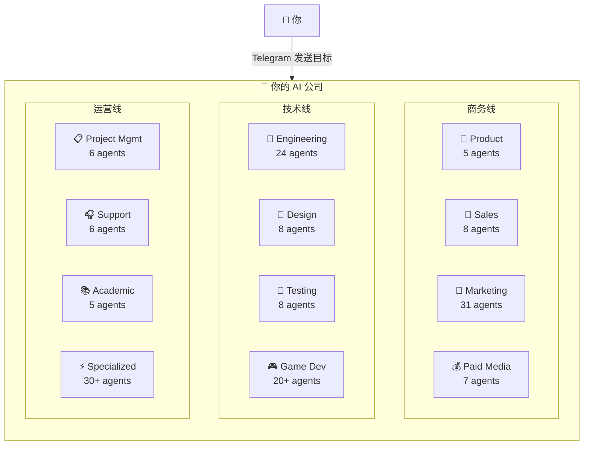
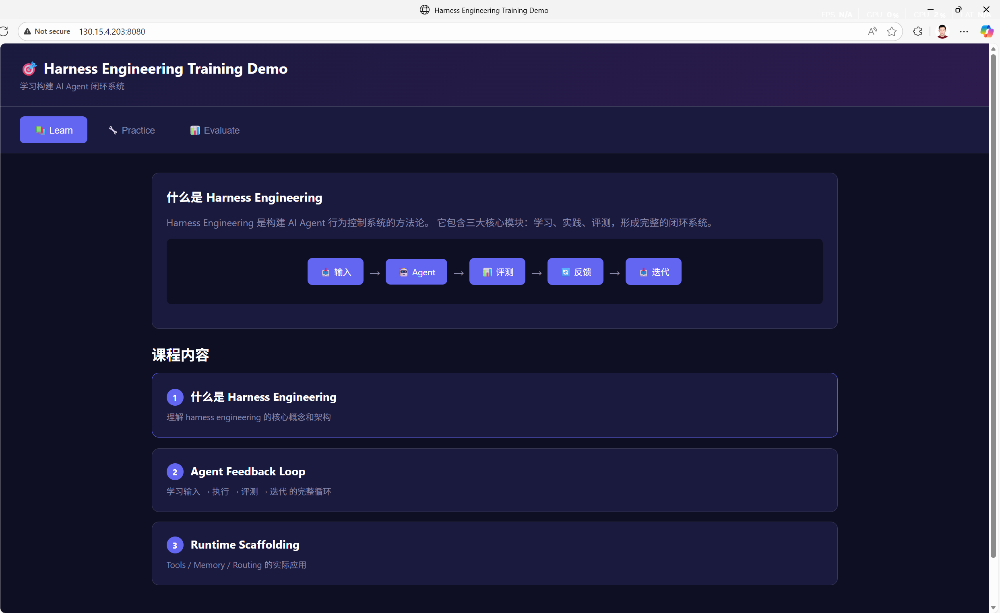

# 🏢 龙虾大学：一人公司实战（一个人，一支团队）

> **适用场景**：你是独立开发者、自由职业者或小团队创始人，想让 AI 帮你搭建一支完整的虚拟公司团队——产品、设计、工程、市场、销售、运营、HR、客户支持一应俱全。**你只需要在 Telegram 里描述商业目标，龙虾帮你拆解任务、分配给对应的 AI 专家、产出可执行的交付物。**

[agency-agents](https://github.com/msitarzewski/agency-agents) 是一个开源的 AI 专家团队集合，包含 **144 个专业化 AI Agent**，分布在 **12 个职能部门**。每个 Agent 都有独立的人设、核心工作流、技术交付物和成功指标——不是泛泛的提示词模板，而是经过实战打磨的专业角色。

配合 OpenClaw 的 Telegram 渠道，你可以直接在手机上发起商业目标，让龙虾自动调度合适的 Agent 协作完成——从需求分析到代码实现，从营销策划到上线部署，真正实现**一个人运转一家公司**。

---

## 1. 你将得到什么（真实场景价值）

跑通后，你会拥有一支**全天候待命的 AI 公司团队**：

### 场景 1：从想法到 MVP
- **问题**：有一个产品想法，但从需求分析到设计、开发、部署，一个人根本忙不过来
- **解决**：在 Telegram 里描述目标，agency-agents 自动拆解为产品需求 → UI 设计 → 前后端实现 → 部署上线的完整流程，每个环节由对应的 AI 专家负责

### 场景 2：快速搭建营销体系
- **问题**：产品做出来了，但不会写文案、不懂 SEO、没有营销策略
- **解决**：Marketing 部门的 31 个 Agent 帮你搞定内容创作、社媒运营、SEO 优化、邮件营销

### 场景 3：一人接单交付项目
- **问题**：接了一个客户项目，需要产品设计、前后端开发、测试、交付文档
- **解决**：按需调度 Product → Design → Engineering → Testing → Support 的完整交付管线

### 场景 4：商业决策支持
- **问题**：不确定该做什么方向，需要市场调研、竞品分析、用户画像
- **解决**：Product 部门的趋势研究员 + Marketing 部门的市场分析师协作，输出结构化的决策参考

---

## 2. 技能选型：为什么用 agency-agents？

### 核心架构：12 部门 × 144 个 AI 专家



### 每个 Agent 都是"专家"，不是"模板"

传统做法是写一堆通用 prompt，让 AI 角色扮演。agency-agents 不一样——每个 Agent 都包含：

| 字段 | 说明 |
|------|------|
| **Identity & Personality** | 独立人设，影响沟通风格和决策倾向 |
| **Core Workflows** | 经过实战打磨的标准化工作流 |
| **Technical Deliverables** | 明确的交付物清单（不是空谈概念） |
| **Success Metrics** | 可衡量的成功指标 |
| **Memory & Learning** | 模式识别，持续改进 |

### 重点部门速览

| 部门 | Agent 数 | 能做什么 |
|------|---------|---------|
| **Engineering** | 24 | 前端/后端开发、DevOps、数据库优化、安全审计、API 设计 |
| **Marketing** | 31 | 内容创作、SEO、社媒运营、邮件营销、平台投放策略 |
| **Design** | 8 | UI/UX 设计、品牌视觉、无障碍审计 |
| **Sales** | 8 | 外呼策略、客户发现、成交策略 |
| **Product** | 5 | 产品管理、趋势研究、行为设计 |
| **Testing** | 8 | QA、性能基准、无障碍测试 |
| **Project Mgmt** | 6 | 项目管理、流程优化、资源调度 |
| **Support** | 6 | 客服、数据分析、财务、合规 |
| **Paid Media** | 7 | PPC、搜索广告、程序化购买 |
| **Game Dev** | 20+ | 跨引擎开发、平台适配 |
| **Academic** | 5 | 历史、心理学、人类学（世界观构建） |
| **Specialized** | 30+ | 区块链审计、Salesforce 架构等垂直领域 |

### 与直接写 prompt 的区别

| 特性 | 直接写 prompt | agency-agents |
|------|-------------|---------------|
| **专业度** | 依赖你的 prompt 水平 | 预置实战工作流 |
| **协作能力** | 单一角色 | 多 Agent 协作，自动路由 |
| **交付物** | 随意输出 | 标准化交付物 + 成功指标 |
| **可复用** | 每次重写 | 注册为 skill，按需调用 |
| **扩展性** | 人工协调 | 统一注册表 + 路由引擎 |

> **关键**：agency-agents 的价值不只是"更好的 prompt"，而是一套**可注册、可组合、可路由的公司职能系统**。通过 OpenClaw 的 skill 注册机制，这些 Agent 变成了随时可调度的标准化能力。

---

## 3. 配置指南：搭建你的 AI 公司

### 3.1 前置条件

| 条件 | 说明 |
|------|------|
| OpenClaw 已安装运行 | 基础环境就绪 |
| Telegram 账号 | 用于与 OpenClaw 交互 |
| 大模型 API Key | 支持 OpenAI / Claude / DeepSeek / 本地模型等 |
| 工具配置档为 coding/full | 需要命令执行权限，详见[第七章](/cn/adopt/chapter7/) |

### 3.2 配置 Telegram 渠道

和其他龙虾大学教程一样，先配置 Telegram 机器人。如果你已经在[自动化科研实战](/cn/university/vibe-research/)中配置过，可以直接跳到 3.3。

**第一步：创建 Telegram Bot**

打开 Telegram App，搜索 `BotFather`，选择带蓝色认证标志的官方账号，点击 **Start** 开始对话，然后发送 `/newbot`：

BotFather 会依次询问：

1. **机器人显示名称**（name）——可以用中文，比如"虾兄"
2. **机器人用户名**（username）——必须以 `bot` 结尾，比如 `HelloClawClaw_bot`

完整对话示例：

```text
你：/newbot
BotFather：Alright, a new bot. How are we going to call it?
           Please choose a name for your bot.
你：虾兄
BotFather：Good. Now let's choose a username for your bot.
           It must end in `bot`.
你：HelloClawClaw_bot
BotFather：Done! Congratulations on your new bot.
           Use this token to access the HTTP API:
           8658429978:AAHNbNq3sNN4o7sDnz90ON6itCfiqqWLMrc
```

> **重要**：妥善保管这个 Bot Token，后续配置 OpenClaw 时需要用到。

**第二步：在 OpenClaw 中接入 Telegram**

回到 OpenClaw 主机，运行 onboard 命令：

```bash
openclaw onboard
```

一路 skip 和 continue，直到出现 **Select channel** 页面，选择 **Telegram (Bot API)**，把 Bot Token 粘贴进去。

**第三步：获取你的 Telegram User ID**

在 Telegram 中找到刚创建的机器人，发送 `/start`，机器人会回复你的 User ID：

```text
OpenClaw: access not configured.

Your Telegram user id: 8561283145

Pairing code: 6KKG7C7K

Ask the bot owner to approve with:
openclaw pairing approve telegram 6KKG7C7K
```

记下 User ID，填入 `allowFrom` 字段。配置完成后，选择 **restart** 重启 OpenClaw。

### 3.3 将 agency-agents 注册为 OpenClaw Skills

Telegram 渠道就绪后，接下来把 agency-agents 的 144 个 AI 专家转化为 OpenClaw 可调度的标准化 skills。

在 Telegram 里发送以下提示词：

```text
阅读仓库：https://github.com/msitarzewski/agency-agents

目标：将其重构为一组可注册到 OpenClaw 的"公司职能 skills"，
用于后续按需调用与自动路由。

要求：
1. 将现有 agents 抽象为标准化 skills
   （如：product / marketing / sales / ops / hr / support）
2. 每个 skill 必须包含：
   - name / description（清晰可检索）
   - capabilities（能解决什么问题）
   - inputs / outputs schema
   - tools / dependencies
   - prompt template（可直接执行）
   - routing tags（用于自动匹配）
3. 设计统一 skill registry 结构，支持检索与组合调用
4. 定义多-skill 协作协议（任务拆解、状态传递、反馈回路）
5. 输出为"可部署结构"（目录结构 + 示例配置），而不是解释
6. 提供至少一个端到端 workflow 示例（自动选择并调用多个 skills）

约束：优先工程可用性、可扩展性，避免仅停留在概念设计。
```


龙虾会读取整个仓库，然后输出一套完整的 skill 注册结构：

```text
agency-skills/
├── SKILL.md                    # 主入口
├── registry/
│   ├── registry.json          # 技能定义 + 路由标签
│   └── COLLABORATION.md       # 多技能协作协议
├── product/                    # 🧭 产品管理
├── marketing/                  # 📣 市场营销
├── sales/                      # 🎯 销售
├── ops/                        # ⚙️ 运营
├── hr/                         # 👥 人力资源
├── support/                    # 🎧 客户支持
├── engineering/                # 🔧 工程
├── design/                     # 🎨 设计
├── workflows/                  # 端到端工作流
└── scripts/router.py           # 路由 CLI
```

每个 skill 都包含标准化字段（name、description、capabilities、inputs/outputs schema、prompt template、routing tags），并且支持自动路由：

```text
$ python scripts/router.py "write PRD for feature X"
→ 🧭 PRODUCT (matched: feature, PRD)

$ python scripts/router.py "build outbound campaign"
→ 📣 MARKETING + 🎯 SALES
```

> **核心价值**：这一步把零散的 144 个 Agent 变成了可检索、可组合的标准化能力。后续发送任何商业目标，龙虾都能自动匹配并调度合适的 skills。

---

## 4. 第一次跑通：从目标到 MVP Demo

Skills 注册完毕后，来实战一个端到端的商业场景——**从一个商业目标到一个可运行的 Demo 网站**。

### 4.1 发送商业目标

在 Telegram 里描述你想做的事情。这里以一个 harness engineering 培训网站为例：

```text
目标：设计并实现一个 harness engineering 培训网站 Demo（MVP）

要求：快速构建一个可运行、可演示的最小系统，而不是完整产品。

任务：

1. 产品结构（最小闭环）
   设计 3 个模块：
   - Learn：基础课程（harness engineering 核心概念）
   - Practice：简单 agent harness 实验（如 prompt + eval loop）
   - Evaluate：对 agent 输出进行评测与反馈

2. 课程内容（最小集）
   提供 3 节课：
   - 什么是 harness engineering（定义 + 架构）
   - agent feedback loop（输入 → 执行 → 评测 → 迭代）
   - runtime scaffolding（tools / memory / routing）
   每节课需包含简要讲解 + 一个可运行的小实验

3. 技术实现（必须可跑）
   - 前端：简单页面（Next.js 或静态 HTML）
   - 后端：轻量 API（Node / Python）
   - agent：基于 LLM 的简单调用封装
   - eval：规则或简单评分函数

4. Demo 场景（必须打通）
   实现完整流程：
   用户输入任务 → agent 执行 → eval 打分 → 返回优化建议

约束：优先简单可运行，不追求复杂架构。
所有模块必须能串起来形成闭环。
```


### 4.2 龙虾自动调度 Skills 完成构建

发送后，龙虾会自动激活 product-launch 工作流，依次调度：

1. **Product** → 分析需求，定义产品结构和模块
2. **Design** → 设计页面布局和交互流程
3. **Engineering** → 实现前后端代码
4. **Support** → 编写使用文档

几分钟后，你会收到构建完成的消息：

```text
完成！Harness Engineering 培训网站 Demo 已构建好。

harness-training-demo/
├── README.md
├── backend/
│   ├── app.py        # Flask API (5个端点)
│   ├── agent.py      # LLM Agent 封装
│   ├── eval.py       # 规则评分系统
│   └── requirements.txt
└── frontend/
    └── index.html    # 单页应用（直接打开）
```

| 模块 | 功能 |
|------|------|
| 📚 Learn | 3 节课程，每节配有可运行的小实验 |
| 🔧 Practice | Agent 单次执行 / 反馈循环 |
| 📊 Evaluate | PRD + 营销文案两个完整 Demo |

### 4.3 运行并部署 Demo

代码生成了，但你想在浏览器里看到效果。直接告诉龙虾：

```text
请帮我运行然后想办法让我浏览 demo
```


龙虾会：
1. 启动后端服务（Flask API on port 8080）
2. 配置前端静态文件服务
3. 通过 **Cloudflare Tunnel** 自动将 Demo 暴露到公网

```text
好了！Demo 已经运行并暴露到公网：

🌐 访问链接：
https://domains-elect-atlantic-completion.trycloudflare.com

使用方法：
1. 打开链接
2. 点击任意模块（Learn / Practice / Evaluate）
3. 体验完整的 harness engineering 流程

后端状态：
• Flask API: http://localhost:8080 ✅
• 3 节课程已加载
• Agent + Evaluator 就绪
```

> **Cloudflare Tunnel**：龙虾使用免费的 `cloudflared` 服务创建临时隧道，无需你配置域名或端口转发。链接有效期随隧道进程存在，关闭后失效。

### 4.4 查看 Demo 效果

打开浏览器访问链接，你会看到一个完整的培训网站 Demo：



完整的端到端闭环已经打通：
- **Learn** → 浏览课程内容，理解核心概念
- **Practice** → 输入任务（如"写一个产品需求文档"），让 Agent 执行
- **Evaluate** → Agent 输出经过评测系统打分，返回优化建议

> **注意**：这个 Demo 只是一个最小可运行原型。如果首次访问报 404，可能是前端静态文件还未配置好——再跟龙虾说一声，它会帮你修复。实战中，MVP 的价值在于快速验证想法，而不是追求完美。

---

## 5. 进阶场景：从 MVP 到运营

### 场景 1：产品发布全流程

让多个部门协作完成产品从构思到发布的全过程：

```text
目标：完成 [你的产品名] 的发布准备

需要：
1. Product：完善 PRD 和用户故事
2. Design：设计着陆页和核心交互
3. Engineering：实现核心功能并部署
4. Marketing：撰写发布文案、准备社媒内容
5. Support：编写用户指南和 FAQ
```

龙虾会自动激活 `product-launch` 工作流：`product → design → engineering → marketing → support`，每个环节的产出物作为下一个环节的输入。

### 场景 2：快速构建营销方案

```text
目标：为我的 SaaS 产品设计一套完整的内容营销方案

需要：
- 目标用户画像和痛点分析
- 内容日历（Blog / Newsletter / 社媒）
- SEO 关键词策略
- 3 篇示例 Blog 文章
- 着陆页文案
```

Marketing 部门的 Content Creator、SEO Strategist、Social Media Manager 会协作产出一整套方案。

### 场景 3：接客户项目

```text
目标：为客户 [XXX] 构建一个数据看板

技术栈：React + FastAPI + PostgreSQL

需要：
1. 需求分析和数据模型设计
2. 后端 API 实现
3. 前端页面和图表组件
4. 测试和部署脚本
5. 交付文档
```

Engineering 部门的 Frontend Developer、Backend Architect、Database Specialist 协同作战，Project Management 部门跟进进度。

### 场景 4：竞品调研与策略制定

```text
目标：分析 [竞品A]、[竞品B]、[竞品C] 的产品策略

需要：
- 功能矩阵对比
- 定价策略分析
- 用户评价汇总
- 差异化机会识别
- 行动建议
```

Product 部门的 Trend Researcher + Marketing 部门的市场分析 Agent 联合输出结构化报告。

### 场景 5：迭代改进

第一版交付物不满意？直接追加要求：

```text
刚才的培训网站 Demo 需要改进：
1. Learn 模块增加代码示例的语法高亮
2. Practice 模块支持多轮对话
3. Evaluate 模块增加雷达图展示评测维度
4. 整体增加响应式布局，支持手机访问
```

龙虾会在现有代码基础上迭代，不需要从头开始。

---

## 6. 常见问题与排障

### 问题 1：Skills 注册后，龙虾不知道怎么用

**常见原因**：
- 提示词没有明确引用 skill 名称——在后续对话中加上"使用 product skill"或"调用 engineering 团队"
- registry.json 路由标签不够精确——回到 Telegram 让龙虾优化 routing tags

**解决方法**：

```text
查看已注册的 skills 列表，并针对以下目标自动选择 skills：
[你的目标描述]
```

### 问题 2：Demo 构建失败或代码报错

**常见原因**：
- Python/Node.js 环境缺少依赖——让龙虾先执行 `pip install` 或 `npm install`
- API Key 未配置——确保 LLM API Key 已正确设置
- 端口被占用——指定其他端口

**诊断步骤**：

```bash
openclaw logs --limit 50    # 检查 OpenClaw 日志
```

### 问题 3：Cloudflare Tunnel 无法访问

**常见原因**：
- 后端服务未启动——检查 Flask/Node 进程是否在运行
- 前端静态文件未配置——需要让后端同时服务静态文件
- 免费隧道不稳定——稍等几秒重试，或让龙虾重新创建隧道

### 问题 4：Telegram Bot 无响应

**诊断步骤**：

1. 确认 Bot Token 正确：在 BotFather 中查看
2. 确认 `allowFrom` 包含你的 User ID
3. 确认 OpenClaw 已重启：`openclaw restart`
4. 检查 OpenClaw 健康状态：`openclaw doctor`

---

## 7. 安全与合规提醒

### 提醒 1：Telegram Bot Token 安全

- **不要泄露 Bot Token**：任何拥有 Token 的人都可以控制你的机器人
- **不要将 Token 提交到 Git 仓库**：使用环境变量或 `.env` 文件管理
- **定期轮换 Token**：如果怀疑泄露，在 BotFather 中使用 `/revoke` 重新生成
- **限制 `allowFrom`**：只允许你自己的 User ID 与机器人交互

### 提醒 2：API Key 与 Demo 安全

- LLM API Key 不要硬编码在 Demo 代码中——使用环境变量
- 不要在 Telegram 聊天中反复发送 API Key 明文
- 通过 Cloudflare Tunnel 暴露的 Demo 是**公网可访问的**——不要在 Demo 中包含敏感数据
- 免费隧道链接是临时的，但在有效期内任何人都能访问

### 提醒 3：交付物审核

- agency-agents 生成的代码和方案是 AI 产出，**在正式使用前务必人工审核**
- 营销文案、法律合规相关内容需要专业人员二次确认
- Demo 代码适合用作**原型和 POC**，生产环境部署前需要安全审计

---

## 8. 总结：一个人的公司，144 个 AI 专家的团队

agency-agents 的核心价值是**将完整的公司职能 AI 化**——你只需要描述商业目标，12 个部门、144 个 AI 专家帮你完成剩下的一切：

- **全职能覆盖**：产品 → 设计 → 工程 → 测试 → 营销 → 销售 → 运营 → 支持
- **自动路由调度**：描述目标即可，龙虾自动匹配最合适的 Agent 组合
- **标准化交付**：每个 Agent 都有明确的交付物和成功指标，不是空泛的建议
- **手机端操控**：通过 Telegram 随时随地发起目标、接收成果
- **快速迭代**：不满意就追加要求，在现有基础上改进

**记住**：一人公司不是"一个人做所有事"，而是**一个人指挥一支 AI 团队做所有事**。agency-agents 把你从执行者变成了决策者——你负责想清楚"做什么"和"为什么做"，AI 团队负责"怎么做"。

## 参考资料

### agency-agents
- [agency-agents（AI 专家团队集合）](https://github.com/msitarzewski/agency-agents)
- [msitarzewski（项目作者）](https://github.com/msitarzewski)

### Telegram
- [Telegram BotFather（创建 Telegram Bot）](https://t.me/BotFather)
- [Telegram Bot API 官方文档](https://core.telegram.org/bots/api)

### 相关教程
- [自动化科研实战（说句话，出论文）](/cn/university/vibe-research/)
- [第七章 工具与定时任务](/cn/adopt/chapter7/)
- [第四章 聊天平台接入](/cn/adopt/chapter4/)
