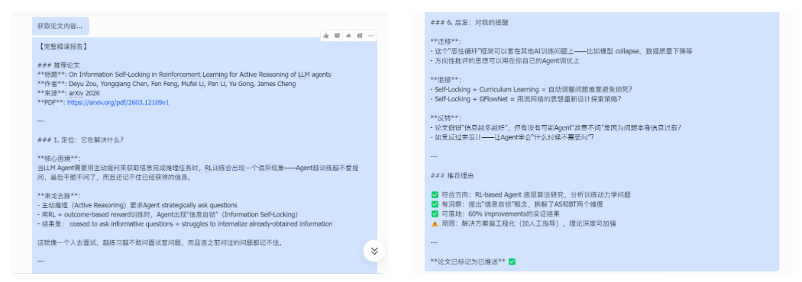
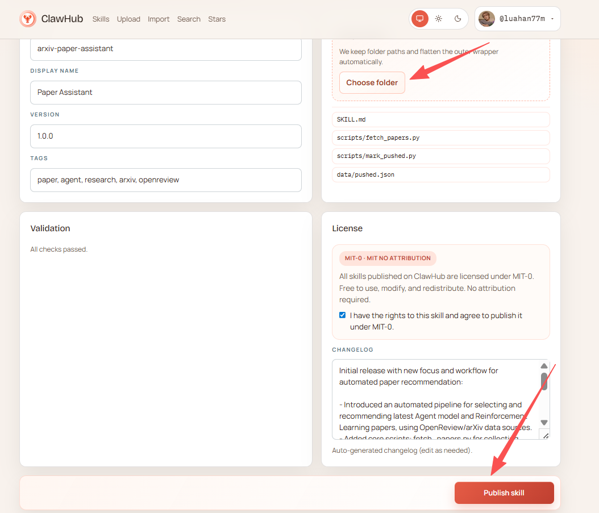
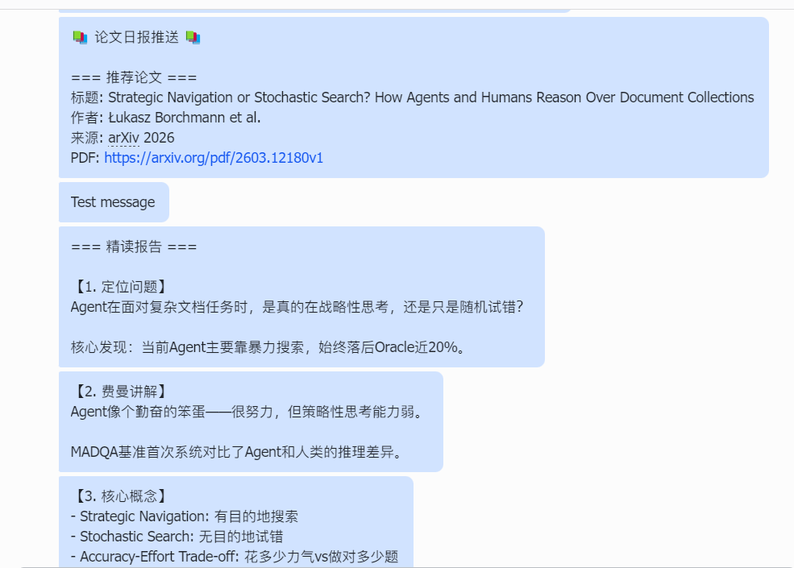
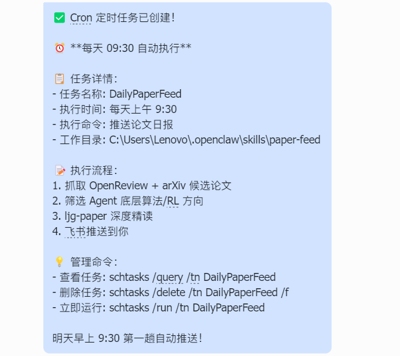

# Skill 开发实战：Agent 论文推送助手

> 每天 arXiv 会新增上百篇论文。很多时候，我们只是扫几眼标题就关掉页面，或者收藏一堆 PDF 却从未真正读过。这篇文章将用 **OpenClaw** 搭建一个自动化科研助理，让论文跟踪变成一条自动化流程： **抓取论文 → 智能筛选 → 自动精读 → 推送通知** 。
> 跑通后，你将拥有一个  **7×24 小时在线的数字科研助理** 。


# 1 这个科研助理能做什么

**想象这样一个场景：**
当你在白天摸鱼的时候，这个助理会自动从 **arXiv** 和**顶会论文池**中筛选出值得关注的新论文；而每天早上打开飞书，你都会看到一条已经整理好的论文推送——包含论文摘要、链接以及推荐理由等等。几分钟时间，就能了解当天最值得关注的一篇论文。

本文以 **Agent 领域论文** 为例进行演示，但只需要修改关键词，就可以应用到任何研究方向。



这个科研助理本质上是一条  **自动化科研情报流水线** ，主要包含三个能力模块：

* **论文抓取：** 系统会自动从 **arXiv** 和 **OpenReview** 获取最新论文，构建候选论文池。
* **智能筛选：** 利用 LLM 对论文标题和摘要进行分析，只保留与目标研究方向相关、具有研究价值的论文，同时自动过滤工程实现或工具类论文。
* **自动精读与推送：** 系统会对筛选出的论文进行结构化解析，并生成简要解读，然后通过 **飞书机器人** 自动推送到群聊。

最终形成一个完整流程：抓取论文 → 筛选论文 → 生成解读 → 推送通知

因此在实际使用中，我通常每天只需要花几分钟浏览推送内容，就能了解当天最值得关注的一篇新论文，大大减少了手动筛选论文的时间。

# 2 技能选型：最小可行工具链

为了快速搭建论文推送系统，我们只需要一个**最小工具链** 。

在 OpenClaw 中，你甚至不需要手动执行这些命令，只需要  **用自然语言告诉 AI 你要安装哪些组件** ，它就会自动完成环境配置。

```Plain
# 必须先安装核心脚本与 Skill
python scripts/setup_env.py      # 环境初始化
clawhub install paper-assistant  # 论文推送引擎（核心）
clawhub install ljg-paper        # 论文精读 Skill（灵魂）
clawhub install so-send-message  # 飞书推送插件（闭环）
```

安装完成后，一个最小可用的 **论文自动化流水线**就搭建好了：


*注意：如果不做去重处理，系统可能每天推送重复论文。*

# 3 配置指南

我提供了两种配置方式：

* **通过 ClawHub 直接安装** （推荐，配置最简单）
* **手动配置** （适合希望了解完整实现过程的读者）

## 3.1 通过clawhub直接安装

如果你不想进行  **3.2 节中的手动配置** ，可以直接使用我已经打包好的 Skill，只需要在 OpenClaw 对话框中输入以下指令：

1. 安装CLI：

```Markdown
帮我安装CLI
```

2. 安装Skill：

```Markdown
请你帮我从clawhub上下载这个skill <arxiv-paper-assistant>，安装到~/.openclaw/skills/paper-assistant
```

如果安装成功，你便可以在 `skills`目录中看到名为 `paper-assistant`的文件


3. 启动一个新的 OpenClaw 会话，以加载新 Skills

## 3.2 手动配置

如果你希望了解**整个 Skill 的实现过程** ，可以按照下面的步骤手动配置。

### 3.2.1 项目目录（自查）

我们后续搭建的 skill 项目目录如下：

```Bash
openclaw/ (这里是你的项目主文件夹)
├── openclaw.json        # 核心配置文件
└── skills/              # <--- Skill 定义目录
    ├── paper-assistant/
    │   │── scripts/             # <--- 你创建的脚本目录
    │   │   ├── paper_feed.py    # 抓取逻辑
    │   │   └── mark_pushed.py   # 去重逻辑
    │   ├── data/                # <--- 你创建的数据目录
    │   │   └── pushed.json      # 论文推送历史（数据库）
    │   └── skill.yaml
```

如果某些文件夹不存在，请手动创建。

### 3.2.2 环境初始化

1. 在 `skills` 目录下创建paper-assistant这个skill的目录，并初始化论文推送记录文件：

```Plain
创建一个名为 paper-assistant 的 Skill：
1. 在 skills 目录下生成 paper-assistant 文件夹
2. 在 paper-assistant/data 下创建 pushed.json，写入 {"pushed":[]}
```

`pushed.json` 用于记录  **已经推送过的论文 ID** ，防止重复推送。

2. 安装依赖包：

```Markdown
安装依赖 pymupdf 和 unstructured
```

这两个库用于  **后续论文解析与结构化处理** 。

### 3.2.3 部署本地脚本

在 `skills/paper-assistant/scripts/` 下创建两个脚本文件：

1. `fetch_papers.py`: 负责从 arXiv 和 OpenReview 抓取论文，并生成候选论文池。

```Plain
#!/usr/bin/env python3
"""
paper-assistant: 从 OpenReview 和 arXiv 获取 Agent 相关论文
输出 JSON 格式的候选论文列表（已排除被拒论文和已推送论文）
"""

import json
import os
import sys
import urllib.request
import xml.etree.ElementTree as ET

SCRIPT_DIR = os.path.dirname(os.path.abspath(__file__))
DATA_DIR = os.path.join(SCRIPT_DIR, "..", "data")
PUSHED_FILE = os.path.join(DATA_DIR, "pushed.json")

# API endpoints
OPENREVIEW_SEARCH = "https://api2.openreview.net/notes/search"
ARXIV_API = "https://export.arxiv.org/api/query"

# Conference configs
CONFERENCES = [
    {"group": "ICLR.cc/2026/Conference", "label": "ICLR 2026"},
    {"group": "NeurIPS.cc/2025/Conference", "label": "NeurIPS 2025"},
]

ARXIV_QUERY = "cat:cs.AI+AND+all:agent+system"


def load_pushed():
    """Load already-pushed paper IDs."""
    if not os.path.exists(PUSHED_FILE):
        os.makedirs(DATA_DIR, exist_ok=True)
        with open(PUSHED_FILE, "w") as f:
            json.dump({"pushed": []}, f)
        return set()
    with open(PUSHED_FILE, "r") as f:
        data = json.load(f)
    return set(data.get("pushed", []))


def fetch_openreview(group, label, limit=100):
    """Fetch accepted agent papers from OpenReview."""
    url = f"{OPENREVIEW_SEARCH}?query=agent&group={group}&limit={limit}"
    try:
        req = urllib.request.Request(url)
        req.add_header("User-Agent", "paper-assistant/1.0")
        with urllib.request.urlopen(req, timeout=30) as resp:
            data = json.loads(resp.read().decode())
    except Exception as e:
        print(f"[WARN] Failed to fetch {label}: {e}", file=sys.stderr)
        return []

    papers = []
    for note in data.get("notes", []):
        fc = note.get("forumContent", {})
        if not fc:
            continue

        # Extract venue info
        venueid = fc.get("venueid", {})
        venueid_val = venueid.get("value", "") if isinstance(venueid, dict) else str(venueid)
        venue = fc.get("venue", {})
        venue_val = venue.get("value", "") if isinstance(venue, dict) else str(venue)

        # Skip rejected papers
        if "Rejected" in venueid_val or "Rejected" in venue_val:
            continue

        # Only keep accepted (Poster/Spotlight/Oral)
        accepted = any(k in venue_val for k in ["Poster", "Spotlight", "Oral"])
        if not accepted:
            continue

        # Extract fields
        title = fc.get("title", {})
        title_val = title.get("value", "") if isinstance(title, dict) else str(title)

        abstract = fc.get("abstract", {})
        abstract_val = abstract.get("value", "") if isinstance(abstract, dict) else str(abstract)

        authors = fc.get("authors", {})
        authors_val = authors.get("value", []) if isinstance(authors, dict) else []

        pdf = fc.get("pdf", {})
        pdf_val = pdf.get("value", "") if isinstance(pdf, dict) else str(pdf)
        pdf_url = f"https://openreview.net{pdf_val}" if pdf_val else ""

        keywords = fc.get("keywords", {})
        keywords_val = keywords.get("value", []) if isinstance(keywords, dict) else []

        forum_id = note.get("forum", note.get("id", ""))

        papers.append({
            "id": f"openreview:{forum_id}",
            "title": title_val,
            "authors": authors_val if isinstance(authors_val, list) else [authors_val],
            "abstract": abstract_val,
            "pdf": pdf_url,
            "venue": venue_val,
            "source": label,
            "keywords": keywords_val if isinstance(keywords_val, list) else [],
        })

    return papers


def fetch_arxiv(max_results=50):
    """Fetch recent agent papers from arXiv (2026+)."""
    url = f"{ARXIV_API}?search_query={ARXIV_QUERY}&sortBy=submittedDate&sortOrder=descending&max_results={max_results}"
    try:
        req = urllib.request.Request(url)
        req.add_header("User-Agent", "paper-assistant/1.0")
        with urllib.request.urlopen(req, timeout=30) as resp:
            data = resp.read().decode()
    except Exception as e:
        print(f"[WARN] Failed to fetch arXiv: {e}", file=sys.stderr)
        return []

    ns = {"a": "http://www.w3.org/2005/Atom"}
    root = ET.fromstring(data)

    papers = []
    for entry in root.findall("a:entry", ns):
        published = entry.find("a:published", ns).text[:10]
        # Only 2026+ papers
        if published < "2026-01-01":
            continue

        title = entry.find("a:title", ns).text.strip().replace("\n", " ")
        summary = entry.find("a:summary", ns).text.strip().replace("\n", " ")
        arxiv_id = entry.find("a:id", ns).text  # e.g. http://arxiv.org/abs/2603.xxxxx
        arxiv_short = arxiv_id.split("/abs/")[-1] if "/abs/" in arxiv_id else arxiv_id

        authors = []
        for author in entry.findall("a:author", ns):
            name = author.find("a:name", ns)
            if name is not None:
                authors.append(name.text)

        papers.append({
            "id": f"arxiv:{arxiv_short}",
            "title": title,
            "authors": authors,
            "abstract": summary,
            "pdf": f"https://arxiv.org/pdf/{arxiv_short}",
            "venue": "arXiv preprint",
            "source": "arXiv 2026",
            "keywords": [],
        })

    return papers


def main():
    pushed = load_pushed()

    all_papers = []

    # Fetch from OpenReview
    for conf in CONFERENCES:
        papers = fetch_openreview(conf["group"], conf["label"])
        all_papers.extend(papers)
        print(f"[INFO] {conf['label']}: fetched {len(papers)} accepted papers", file=sys.stderr)

    # Fetch from arXiv
    arxiv_papers = fetch_arxiv()
    all_papers.extend(arxiv_papers)
    print(f"[INFO] arXiv: fetched {len(arxiv_papers)} papers (2026+)", file=sys.stderr)

    # Deduplicate by title (case-insensitive)
    seen_titles = set()
    unique_papers = []
    for p in all_papers:
        t = p["title"].lower().strip()
        if t not in seen_titles:
            seen_titles.add(t)
            unique_papers.append(p)

    # Filter out already pushed
    candidates = [p for p in unique_papers if p["id"] not in pushed]

    print(f"[INFO] Total unique: {len(unique_papers)}, already pushed: {len(unique_papers) - len(candidates)}, candidates: {len(candidates)}", file=sys.stderr)

    # Output candidates as JSON to stdout
    json.dump(candidates, sys.stdout, ensure_ascii=False, indent=2)


if __name__ == "__main__":
    main()
```

2. `mark_pushed.py`: 在论文推送完成后，将论文 ID 写入 `pushed.json`，防止重复推送。

```Plain
#!/usr/bin/env python3
"""
Mark a paper as pushed by adding its ID to data/pushed.json.
Usage: python3 mark_pushed.py <paper_id>
"""

import json
import os
import sys

SCRIPT_DIR = os.path.dirname(os.path.abspath(__file__))
DATA_DIR = os.path.join(SCRIPT_DIR, "..", "data")
PUSHED_FILE = os.path.join(DATA_DIR, "pushed.json")


def main():
    if len(sys.argv) < 2:
        print("Usage: python3 mark_pushed.py <paper_id>", file=sys.stderr)
        sys.exit(1)

    paper_id = sys.argv[1]

    os.makedirs(DATA_DIR, exist_ok=True)

    if os.path.exists(PUSHED_FILE):
        with open(PUSHED_FILE, "r") as f:
            data = json.load(f)
    else:
        data = {"pushed": []}

    if paper_id not in data["pushed"]:
        data["pushed"].append(paper_id)
        with open(PUSHED_FILE, "w") as f:
            json.dump(data, f, ensure_ascii=False, indent=2)
        print(f"Marked as pushed: {paper_id}")
    else:
        print(f"Already marked: {paper_id}")


if __name__ == "__main__":
    main()
```

### 3.2.4 编写 Skill 逻辑定义

接下来编写 Skill 的核心逻辑，配置文件路径 `skills/paper-assistant/skill.`md

这个文件决定  **OpenClaw 如何完成整个论文推送流程** ：

找论文 → 选论文 → 精读 → 推送 → 记录

因此，这是整个 Skill 中  **最关键的部分** 。

```Plain
---
# 固定元数据头（必须，AI 优先读取）
name: paper-assistant
description: 自动筛选并推荐Agent模型底层算法或强化学习方向论文
version: 1.0.0
author: 刘思怡
permissions: 网络访问权限（用于获取论文数据）
homepage: https://github.com/your-repo/paper-assistant
---

# Paper Feed Skill

## 1. Description（技能详细说明）
Paper Feed 是一个自动化论文推荐 Skill，用于从最新论文池中筛选出 **Agent 模型底层算法或强化学习方向** 的高价值论文，并生成结构化推荐内容。  
该 Skill 可作为论文推送流水线的第一环，每天或定期推荐一篇值得阅读的研究论文。

## 2. When to use（触发场景）
- 当用户希望获取最新 Agent 或强化学习方向论文推荐时  
- 当需要自动筛选论文池并避免重复推送时  
- 当需要将推荐论文与精读、推送等其他 Skill 串联时  

## 3. How to use（调用逻辑）
### 3.1 获取候选论文
运行脚本获取最新论文池：python scripts/fetch_papers.py
- 功能说明：
    从 OpenReview / arXiv 获取最新论文
    输出 JSON 列表
### 3.2 LLM 筛选论文
你现在是资深科研专家。请从以下论文 JSON 列表中筛选出一篇最符合『Agent模型底层算法或强化学习』的论文。

【筛选论文】
从候选池中，判断每篇论文是否属于 Agent 模型底层算法或强化学习 方向。
判断依据——看论文的核心贡献是什么：

  属于本方向（选入）：
  - 核心贡献是模型训练方法（如 RL、RLHF、PPO、DPO 等）
  - 核心贡献是提出新的评测基准或数据集
  - 涉及模型对齐（Alignment）、微调（Fine-tuning / PEFT）
  - 涉及注意力机制改进、模型压缩、架构创新或底层算法优化
  - 核心贡献是强化学习中的 Agent 策略迭代

  不属于本方向（排除）：
  - 仅涉及系统工程、Agent 编排框架或应用落地
  - 涉及工具调用（Tool Use）或 Web 导航等工程实现
  - 仅讨论 Agent 的规划、记忆、反思等系统级组件

  对每篇候选论文，阅读标题和摘要后做出判断。不需要逐篇输出判断过程，只需筛选出符合条件的论文。

【选择一篇推荐】
从筛选后的论文中选一篇推荐。优先策略：
1. 优先选择尚未推送过的论文
2. 在未推送论文中，优先选择来自 Oral > Spotlight > Poster > arXiv 的
3. 同等条件下，选择系统设计创新性更强的

【记录已推送】
选定论文后，将其 ID 追加到 data/pushed.json

【数据文件】
- data/pushed.json：已推送论文记录，格式为 {"pushed": ["id1", "id2", ...]}
- 如果文件不存在，脚本会自动创建

【约束】
- 只推送 2026 年 1 月 1 日之后的论文
- 论文池有限（约 400-500 篇），合理控制推送节奏
- OpenReview API 无需认证，arXiv API 无需认证，均为免费公开接口

### 3.3 输出结果
Skill 返回格式：
【推荐论文】
**标题**: {title}
**作者**: {authors}
**来源**: {venue}
**PDF**: {pdf_url}
【摘要】
{abstract}
【推荐理由】
{reason}

## Edge cases（边缘场景）
- 论文池中无符合条件的论文：Skill 可返回提示“当前论文池暂无符合条件论文”
- 重复论文：Skill 自动检测已推送记录，避免重复推送
- API 获取失败（OpenReview / arXiv）：Skill 返回提示“论文数据获取失败，请检查网络或接口状态”

## Pipeline Integration（与其他 Skill 的协作）
这个 skill 的输出是整个论文推送流水线的第一环：
- paper-assistant：推荐论文并输出标题与 PDF
- ljg-paper： 接收 PDF 链接，执行精读 pipeline（拆论文、信息榨取、白话解释、费曼讲解、博导审稿）
- so-send-message：将精读结果推送到群聊
- 定时任务触发时，依次调用这三个 skill 即可完成全流程

## Data Files（数据文件说明）
- data/pushed.json：已推送论文记录，格式为 {"pushed": ["id1", "id2", ...]}
- 如果文件不存在，脚本会自动创建

## Constraints（约束条件）
- 仅推送 2026-01-01 之后论文
- 论文池约 400–500 篇
- OpenReview / arXiv API 均无需认证，免费公开接口

## Directory Structure（目录结构）
paper-assistant
├─ skill.md
├─ scripts
│  ├─ mark_pushed.py
│  └─ fetch_papers.py
└─ data
   └─ pushed.json
```

### 3.2.5 打包成你自己的skill（可选）

如果你希望把这个 Skill 分享给其他人使用，可以发布到  **ClawHub** 。

1. 首先注册 ClawHub 账号：[https://clawhub.com](https://clawhub.com)
2. 然后在 OpenClaw 对话框中输入：

```Markdown
请你 paper-assistant 注册为 ClawHub 可用 Skill
- 检查目录结构：skill.md, scripts/, data/
- 检查依赖是否安装
- 提示用户可以直接调用 fetch 和筛选流程
```

OpenClaw 会自动：

* 检查 Skill 目录结构
* 检查依赖是否安装
* 生成 Skill 发布表单


3. 你需要确认的字段包括：

* **Slug：** Skill 的唯一标识名（用于系统识别）
* **Display name：** 用户界面显示的技能名称
* **Version：** 技能版本号，便于迭代升级
* **Tags：** 技能分类标签，方便搜索和管理

4. 选择 Skill 目录，勾选 License 后，点击 **Publish Skill** 即可完成发布。

```Plain
~/.openclaw/skills/paper-assistant
```



# 4 集成精读与推送（安装 ljg-paper）

安装 `ljg-paper` 技能，自动下载 PDF 并利用 LLM 进行深度解析。skill的论文流程：**“获取内容 → 拆 → 榨增量 → 白话方法 → 关键概念 → 速写 → 博导****审稿**** → 启发 → 生成文件”。**

进入**.openclaw/skills**目录，克隆ljg-paper skill仓库，执行：

```Plain
git clone https://github.com/lijigang/ljg-skills.git temp_repo
```

将精读技能移动到 **skills** 根目录，执行：

```Plain
# Windows
move temp_repo\ljg-paper .\

# Linux / macOS
mv temp_repo/ljg-paper ./
```

# 5 正式开启你的论文助手

## 5.1 初始化

开启你的openclaw，将下面这段prompt发送给他：

```Plain
你是一个论文推荐引擎。你的工作是从顶会和预印本中找出一篇高质量的『Agent模型底层算法或强化学习』的论文，供后续精读和推送使用。
【触发条件】：当用户说「推荐论文」「paper-feed」「获取论文」「论文推送」「每日论文」「agent 论文」时触发，也在定时任务中自动触发。即使用户只是模糊地提到想看最新的 agent 论文或顶会论文，也应触发此 skill。
【调用流程】
- 运行 paper-assistant → 获取候选论文列表
- 筛选 → 符合 Agent/RL 方向的论文
- ljg-paper 精读 → 完整拆解（问题→讲解→概念→洞见→审稿→启发）
- 标记已推送 → 更新 pushed.json
- 推送完整报告 → 到聊天
```

观察输出是否符合预期，类似：


## 5.2 跑通第一次论文推送

```Plain
现在执行一次上述工作流，帮我从 arXiv 找一篇最新的 Agent 论文，精读后推送到飞书。
```



## 5.3 设置定时任务

```Plain
openclaw gateway cron add "30 9 * * *" --message "推送论文日报"
```

观察输出是否符合预期，类似：



# 6 可能遇到的问题与处理

## 6.1 抓取不到关键论文（漏报）

若系统未获取到新的论文，可能是论文抓取脚本或检索条件设置问题。可以先单独运行抓取脚本进行测试：

```Plain
python3 scripts/fetch_papers.py
```

如果返回结果为空，可以适当扩大检索关键词范围，例如：

```Plain
agent OR multi-agent OR autonomous agent
```

## 6.2 精读报告内容空洞

若生成的论文分析内容较为空泛，可以单独测试论文解析模块是否正常运行：

```Plain
这是一篇论文的PDF链接 xxx-xxxx，
请调用 ljg-paper 进行测试并生成精读分析。
```

如果解析结果仍然较简单，可以在 Prompt 中增加结构化要求，例如：

```Plain
请输出：
1. 论文解决的问题
2. 方法创新点
3. 实验设计
```

## 6.3 推送失败或未收到通知

若系统运行完成但未收到通知，可能是推送通道配置问题。可以先发送测试消息：

```Plain
openclaw send-message "test message"
```

若发送失败，需要检查 Webhook 配置或机器人权限设置。

# 7 进阶：如何定制化你的论文助手

这套论文助手不仅可以自动推送论文，也可以根据你的研究需求进行定制。常见的调整方式包括以下几种。

## 7.1 修改论文推送方向

如果你发现推送的论文太简单，或者不是你关心的方向，你 **不需要修改代码** ，只需要修改两处：

* 抓取脚本中的关键词

```Markdown
ARXIV_QUERY = "cat:cs.AI+AND+all:agent+system"
```

可以改成：

```SQL
all:large+language+model
all:diffusion+model
all:multi-agent
all:database+system
```

* Skill Prompt 的筛选规则

```Markdown
Agent 模型底层算法或强化学习
```

替换为：

```Markdown
扩散模型训练方法
多智能体协作策略
数据库查询优化
```

## 7.2 精读指定论文

如果你已经有想要深入阅读的论文，可以直接调用 **ljg-paper** 进行解析，而不需要走自动抓取流程。

```Markdown
这是一篇论文的PDF链接：https://arxiv.org/pdf/xxxx.xxxxx  
请调用 ljg-paper 对论文进行解析，并生成精读报告
```

适用于：

* 老师推荐的论文
* 会议刚发布的重要论文
* 你准备深入研究的一篇核心论文

# 8 总结：从“搜到”到“内化”

这套工作流的核心价值在于： **让静止的论文开始自动流动** 。

* **周一至周五** ：Agent 帮你筛、帮你读。
* **周六** ：你只需要打开飞书，花 10 分钟看 5 篇已经“榨干”的笔记。

记住：龙虾（OpenClaw）不是替你学习，而是帮你省去搬运和筛选的体力活，让你把精力留在最核心的**逻辑推理与灵感启发**上。
