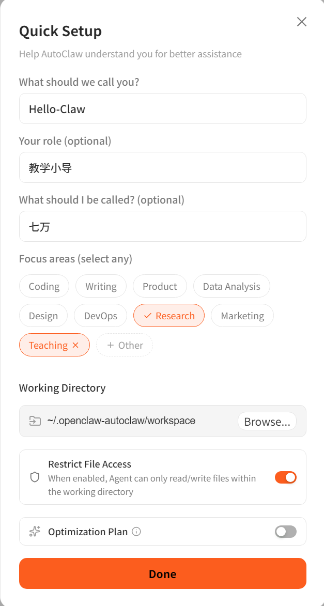
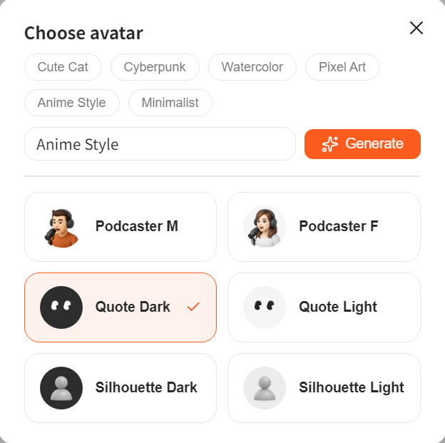

---
prev:
  text: 'Introduction'
  link: '/en/adopt/intro'
next:
  text: 'Chapter 2: Manual OpenClaw Installation'
  link: '/en/adopt/chapter2'
---

# Chapter 1: One-Click Installation with AutoClaw

> In 5 minutes, you'll have an AI assistant that can search the web, browse pages, and send you scheduled reminders — no coding required, no technical knowledge needed.

## 1. Installation

As simple as installing any regular app:

1. Visit the [AutoClaw official website](https://autoglm.zhipuai.cn/autoclaw) and download the installer (macOS / Windows)
2. Double-click to install, then open AutoClaw
3. Register with a Chinese phone number and confirm the security guide
4. Start chatting!

New users receive a limited-time gift of **2,000 credits** — get started at zero cost.

Why do we recommend AutoClaw?

- **One-click installation**: Download → double-click → done, just like any regular app. No need to install Node.js or configure API keys. Supports macOS and Windows.
- **50+ popular skills pre-installed**: Search, image generation, browser control, document processing, and more — all ready out of the box with no separate API configuration needed.
- **Built-in dedicated Lobster model**: Pony-Alpha-2 is deeply optimized for OpenClaw scenarios, delivering more reliable tool calls and seamless multi-step task execution.
- **Built-in browser control**: Integrated with AutoGLM Browser-Use to automatically complete complex, multi-step, cross-page browser tasks.
- **One-click Feishu integration**: Click "One-click Connect to Feishu" on the main interface, scan the QR code to log in, and the entire setup is automatic.
- **Freely switch models**: Defaults to Pony-Alpha-2, but also supports GLM-5, DeepSeek, Kimi, MiniMax, and any other model via API.
- **Free credits**: New users receive a limited-time gift of 2,000 credits — get started at zero cost.

## 2. Start a Conversation

There are four preset agents on the left. Click any one to start chatting:

| Agent | One-line description | How to use |
|-------|---------------------|------------|
| **AutoClaw** | General-purpose assistant — handles anything | Describe your goal directly |
| **Deep Research** | In-depth research | Fill in the research direction inside the 【】 brackets in the prompt |
| **Monitor** | Scheduled reminders | Enter the time and the subject to monitor (e.g., a stock ticker) |
| **Browser Agent** | Browser control | Describe what you want it to do on a webpage |

During a conversation you can upload files (click 📎) or paste a URL — the agent will automatically read and index them. Uploaded files appear in the **Files** sidebar on the right.

What is each agent best suited for?

**AutoClaw** — General-purpose assistant. Chat about anything, get anything done. The interface prompt reads: "Describe your goal. AutoClaw will execute step by step and stream back progress."

**Deep Research** — An in-depth research expert. When you open it you'll see the pre-set prompt:

> I want to conduct in-depth research on: 【】. Please help me: 1. Break down the problem from multiple angles; 2. Search Chinese and English sources, cross-validate data; 3. Produce a structured, data-backed, independently insightful deep report.

Simply fill in the research direction inside the 【】 brackets.

**Monitor** — A scheduled monitoring expert. Pre-set prompt:

> Set up a scheduled task to tell me 【at what time every day】 the closing price of 【】 【stock ticker:】 for that day, with a brief analysis.

Fill in the time and the subject to monitor, and it will automatically create a scheduled task. Created tasks appear in the **Cron Jobs** tab on the left.

**Browser Agent** — A browser control expert (integrated with AutoGLM Browser-Use). Pre-set prompt:

> Search Xiaohongshu for the most popular posts about lobster, pick five, compile the post content, like counts, and top three comments into an Excel file, save it to the desktop, and name it "Post Summary".

You can modify this prompt to suit your actual needs and have it complete any multi-step, cross-page browser task.

## 3. Quick Setup: Let the Agent Get to Know You

A **Quick Setup** card will pop up before your first conversation. Take 30 seconds to fill it in so the agent knows who you are and what you're good at:

Enter your name, your role, give the agent a name, and choose your areas of expertise, then click **Done**. If you skip this, no worries — just tell the agent in conversation at any time and it will configure itself.

What to fill in for each field?

| Field | Description | Example |
|-------|-------------|---------|
| **What should we call you?** | Your name | Hello-Claw |
| **Your role** (optional) | Your role / occupation | Teaching Guide |
| **What should I be called?** (optional) | Give the agent a name | Qiwan |
| **Focus areas** | Choose the agent's areas of expertise (multiple selections allowed) | Coding / Writing / Product / Data Analysis / Design / DevOps / Research / Marketing / Teaching / Other |
| **Working Directory** | The agent's working directory | `~/.openclaw-autoclaw/workspace` |
| **Restrict File Access** | When enabled, the agent can only read and write files within the working directory | Recommended: enable |
| **Optimization Plan** | Optimization plan (experimental feature) | Off by default |

Once the setup is complete, the agent's configuration is displayed in the info panel on the right. If you're not satisfied, adjust it through conversation until you are.

## 4. Run Out of Credits?

Click **Buy now** in the top-right corner to purchase a credit package. Top up as needed — no forced subscription.

---

How do I set a custom avatar for the agent?

Click the avatar in the bottom-left corner to enter the style settings page:

Choose a preset style (Cute Cat / Cyberpunk / Watercolor / Pixel Art / Anime Style / Minimalist), or enter a custom description and click **Generate** to create one in real time.

How do I create more agents?

Click **⊕** in the top-left corner to create a new agent. You can rename it, change its icon, pin it to the top, or delete it.

Want to chat with the agent directly in Feishu?

Go to the **IM Channels** tab on the left → **Connect IM Channels** → select Feishu (mainland China) or Lark (overseas), and follow the "Feishu Admin Configuration Guide" on the page.

For more chat platforms, see [Chapter 4](/en/adopt/chapter4/).

How do I view and manage scheduled tasks?

The **Cron Jobs** tab on the left shows all scheduled tasks. Create them by chatting with the "Monitor" agent.

Want deep customization? What's in Preferences?

Click the settings icon (⚙) next to the avatar in the bottom-left corner to enter the Preferences page:

The left menu has 11 sections, each described below.

**General**

- **Account & Security** — The phone number linked to your account; delete account (permanently removes all data — use with caution).
- **Theme** — Switch themes: Orange Cream (light) and Neon Noir (dark).
- **Launch at Login** — Automatically start AutoClaw at system login.
- **Show Tool Calls** — Display tool call detail blocks in conversations (useful for users who want to see "what the lobster is doing").

**Usage**

View aggregated usage statistics for all conversations on the current device: Sessions, Messages, and Total Tokens consumed. Supports breakdown by model (e.g., input/output token details for `zai_pony-alpha-2`).

**Points**

- **Total Points** — Current credit balance.
- **Top Up** — Purchase credits.
- Filter credit history by All / Spent / Earned.

**Models & API**

- **Built-in Models** — Built-in model Pony-Alpha-2 (selected by default).
- **Custom Models** — Click Add Custom Model to add third-party model APIs (e.g., DeepSeek, Kimi).
- **Gateway URL** — Gateway connection status; supports Reconnect / Reset Connection.
- **Port** — Gateway port; restarts automatically after modification. If the port is occupied, the system will try adjacent ports.

**MCP Servers**

MCP (Model Context Protocol) extends the agent's capabilities with external tools — file systems, databases, web search, and more.

- Click **Add Server** to add a custom MCP service.
- **Quick Add Templates** — Add common services with one click: File System / Brave Search / SQLite / Web Fetch.

**Skills**

AutoClaw comes with **95 skills** pre-installed, approximately 52 of which automatically meet their activation conditions and can be used immediately. Example skills:

- **1password** — 1Password CLI integration for managing passwords and keys.
- **self-reflection** — Periodically reflect on recent conversations to analyze strengths and weaknesses.
- **aminer-data-search** — AMiner academic data queries (scholars / papers / institutions / journals / patents).

You can add additional skill directories via **Extra Skill Directories**. Want to write your own skills? See [Appendix D: Skill Development and Publishing Guide](/en/appendix/appendix-d).

**IM Channels**

Same as the IM Channels tab on the left of the main interface — manage connected chat platforms.

**Workspace**

- **Default Projects Directory** — Where projects and context files are saved (default: `~/.openclaw-autoclaw/workspace`).
- **Restrict File Access** — Restrict the agent to reading and writing files only within the working directory (recommended: enable, to prevent accidental operations).
- **Auto-save Context** — Automatically save chat history and extracted content locally.
- **File Watcher** — Monitor local file changes in real time to keep the agent's context in sync.
- **Migrate from OpenClaw** — Migrate configuration, conversations, skills, and other data from OpenClaw to AutoClaw.

**Data & Privacy**

View the local data storage path (default: `~/.openclaw-autoclaw/workspace`). All data is stored locally.

**Send Feedback**

Submit issues or suggestions. Local logs (including RPA logs) are automatically attached to help pinpoint problems quickly.

**About**

View the current version. Click **Check for Updates** to check for and install updates.

