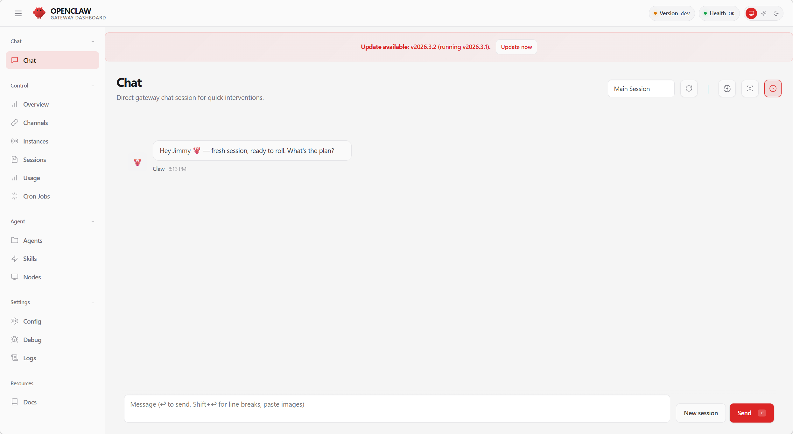

---
prev:
  text: 'Chapter 10: Security and Threat Model'
  link: '/en/adopt/chapter10'
next:
  text: 'Appendix A: Learning Resources'
  link: '/en/appendix/appendix-a'
---

# Chapter 11: Web Interfaces and Clients

> Terminal too hardcore? This chapter covers the various graphical interfaces for the claw — web-based, desktop, and terminal UI. There's something for everyone.

> **Prerequisites**: You have completed [Chapter 2: Manual OpenClaw Installation](/en/adopt/chapter2/) and the Gateway is running.

## 0. Pick the Interface You Like

Four native interfaces, all connected to the same Gateway. Switch between them freely or use them simultaneously:

| Interface | How to Open | One-Line Description | Platform |
|-----------|-------------|----------------------|----------|
| **Dashboard** | `openclaw dashboard` | Control panel for managing config and viewing conversation history | All platforms |
| **WebChat** | Open Gateway address in browser | Zero-configuration, chat right out of the box | All platforms |
| **Control UI** | Open OpenClaw.app | Native macOS desktop experience | macOS |
| **TUI** | `openclaw tui` | Chat directly in the terminal, ultra-lightweight | All platforms |

**Not sure which to pick?** Want to manage config → Dashboard; want to chat → WebChat; macOS user → Control UI; SSH remote → TUI.

## 1. Web Dashboard

The Dashboard is OpenClaw's primary management interface, running in the browser. It covers configuration, conversation history, channel status, skills, scheduled tasks, and everything else.

### Starting

```bash
openclaw dashboard
```

The browser opens `http://localhost:18789` automatically. If it doesn't, navigate there manually.



<details>
<summary>Dashboard sections at a glance</summary>

| Section | Description |
|---------|-------------|
| **Config** | Visually edit configuration; changes take effect on save |
| **Conversations** | View conversation history, message details, and tool call records |
| **Channels** | View the status of connected channels |
| **Sessions** | Manage active sessions and context |
| **Skills** | Browse skills by status filter (All / Ready / Needs Setup / Disabled); click for details, install dependencies, and set API keys |
| **Cron** | View and manage scheduled tasks |
| **Logs** | View the Gateway log stream in real time |

The Config tab provides a visual configuration editor — it has exactly the same effect as `openclaw config set <key> <value>` (see [Chapter 8: Configuration Management](/en/adopt/chapter8/#_2-configuration-management)).

</details>

### Remote Access

When the Gateway is on a remote server, use an SSH tunnel to forward the port to your local machine (see [Chapter 9: Remote Access](/en/adopt/chapter9/)):

```bash
# Run this on your local machine
ssh -N -L 18789:127.0.0.1:18789 user@remote-server
# Then open http://localhost:18789 in your browser
```

<details>
<summary>Dashboard authentication</summary>

If the Gateway is configured with authentication (`token` or `password` mode), you will be prompted for credentials when opening the Dashboard:

- **Token mode**: Enter the value of the `OPENCLAW_GATEWAY_TOKEN` environment variable
- **Password mode**: Enter the value of the `OPENCLAW_GATEWAY_PASSWORD` environment variable
- **Tailscale mode**: If `allowTailscale: true` is enabled, access from within the Tailscale network requires no password

```json5
// Authentication configuration example
{
  gateway: {
    auth: {
      mode: "token",             // token | password
      token: "${OPENCLAW_GATEWAY_TOKEN}",
      allowTailscale: true,      // Tailscale devices bypass authentication
    },
  },
}
```

> **Security reminder**: The Dashboard has full administrative access. Always set up authentication, especially when the Gateway is not running on loopback (see [Chapter 10: Security](/en/adopt/chapter10/)).

</details>

<details>
<summary>Changing the Dashboard port</summary>

If the default port `18789` conflicts with another service:

```json5
{
  gateway: {
    port: 19000,   // change to another port
  },
}
```

Or specify it at startup:

```bash
openclaw gateway --port 19000
```

After the change, the Dashboard address becomes `http://localhost:19000`.

</details>

## 2. WebChat (Built-in Web Chat)

The Gateway's built-in chat interface — zero configuration, works out of the box. No platform account registration required.

### Opening

Open `http://localhost:18789` in your browser, or click the **Chat** entry in the Dashboard.

WebChat is best suited for **initial testing** and **skill debugging**. Send `/status` to quickly check the Gateway status.

<details>
<summary>WebChat vs. Telegram / Discord: which should I use?</summary>

| Dimension | WebChat | Telegram | Discord |
|-----------|---------|----------|---------|
| Registration required | None | Bot creation required | Bot creation required |
| Public internet required | No | Webhook requires it | No |
| Mobile | Browser access | Native App | Native App |
| Group chat | Not supported | Supported | Supported |
| Push notifications | Page must stay open | System notifications | System notifications |

If you need mobile push notifications or group chat, pair with Telegram or Discord (see [Chapter 4](/en/adopt/chapter4/)).

</details>

<details>
<summary>Third-party web chat clients</summary>

Community clients (e.g. **PinchChat**: [github.com/pinchchat/pinchchat](https://github.com/pinchchat/pinchchat)) communicate with OpenClaw via the Gateway's HTTP API. You need to enable the endpoint before use:

```json5
{
  gateway: {
    http: {
      endpoints: {
        chatCompletions: { enabled: true },
      },
    },
  },
}
```

Point the client's API address to `http://127.0.0.1:18789/v1/chat/completions`, using the Gateway authentication token as the API Key (see [Chapter 8: HTTP API Endpoints](/en/adopt/chapter8/#_8-http-api-endpoints)).

</details>

## 3. Control UI (macOS Desktop Client)

A native desktop application exclusive to macOS (OpenClaw.app): lives in the menu bar, sends native notifications, and lets you manage the Gateway without a terminal. The config interface uses a collapsible tree sidebar for navigation, and the agent workspace supports expandable inline Markdown file preview.

### Installation

Usually included when installed via [AutoClaw](/en/adopt/chapter1/). You can also install it separately:

```bash
brew install --cask openclaw
```

Find **OpenClaw.app** in Applications and double-click to open it.

### Connecting to a Remote Gateway

Settings → General → "OpenClaw runs" → select **Remote over SSH** → enter the server address. The app automatically manages the SSH tunnel and WebChat works out of the box (see [Chapter 9: Remote Access](/en/adopt/chapter9/)).

<details>
<summary>What's the difference between Control UI and Dashboard?</summary>

| Dimension | Control UI | Dashboard |
|-----------|-----------|-----------|
| Platform | macOS only | All platforms (browser) |
| Installation | App download required | Built into Gateway |
| System integration | Menu bar, notifications, shortcuts | None |
| Remote connection | Built-in SSH management | Manual tunnel required |
| Recommended for | Heavy macOS users | Cross-platform and remote management |

Both can be used at the same time — Control UI manages the Gateway lifecycle while Dashboard handles fine-grained configuration.

</details>

## 4. TUI (Terminal Chat)

No browser needed, no GUI needed — chat directly in the terminal. Works anywhere a terminal is available: SSH remotes, servers, Docker containers.

### Starting

```bash
openclaw tui
```

Interactive mode: type a message and press Enter to send. Or send a one-off message:

```bash
openclaw agent --message "Write me a Python hello world"
```

<details>
<summary>Advanced TUI usage: specifying agents and piped input</summary>

**Specify thinking level**:

```bash
openclaw agent --message "Analyze the security of this code" --thinking high
```

**Specify an agent** (see [Appendix G](/en/appendix/appendix-g) for multi-agent configuration):

```bash
openclaw agent --message "Check today's schedule" --agent home
openclaw agent --message "Review this PR" --agent work
```

**Piped input**:

```bash
# Have the claw explain a piece of code
cat script.py | openclaw agent --message "Explain this code"

# Have the claw analyze logs
openclaw logs --limit 50 --plain | openclaw agent --message "Any anomalies?"
```

</details>

## 5. Interface Selection Guide

| What you want to do | Recommended |
|---------------------|-------------|
| First install — confirm everything works | `openclaw tui` |
| Day-to-day config management | Dashboard |
| Chat in a browser | WebChat |
| Chat over SSH remote | `openclaw tui` |
| Full macOS experience | Control UI |
| Debug skills | WebChat + Dashboard (inspect tool calls) |
| Call the claw from a script | `openclaw agent --message` |
| macOS desktop | Control UI + Dashboard |
| Windows / Linux desktop | Dashboard + WebChat |
| Cloud server / Docker | TUI |
| Phone / tablet | WebChat (browser) |

All four interfaces connect to the same Gateway and can be used simultaneously — conversations started in WebChat are also visible in Dashboard's Conversations view.

## 6. Additional Platform Features

### Control UI
- **Rounded corner slider**: Customize the interface corner radius, from sharp to fully rounded

### Android
- **Dark mode**: System-following dark mode covering all screens — onboarding, chat, and voice pages

### Browser Integration
- Connects directly to Brave, Edge, and other Chromium-based browsers via `userDataDir`

### Sandbox System
- **Pluggable backends**: Sandbox supports Docker, OpenShell, and SSH backends — no longer tied to Docker alone

## 7. Frequently Asked Questions

**Dashboard shows a connection failure?**

First confirm the Gateway is running: `openclaw gateway status`. If not, run `openclaw gateway restart`.

**Port 18789 is already in use?**

```bash
# macOS / Linux
ss -tlnp | grep 18789
# Windows
netstat -ano | findstr 18789
```

To change the port, see the "Changing the Dashboard port" section above.

**WebChat messages get no reply?**

Check in order: ① Run `openclaw status` to confirm the Gateway and Agent are healthy; ② run `openclaw logs --follow`, send a message, and check for errors; ③ confirm your API Key is valid (see [Chapter 5](/en/adopt/chapter5/)).

**Can I use WebChat on a remote server?**

Yes. After setting up an SSH tunnel, open `http://localhost:18789` in your local browser. Tailscale users can access it directly via the Tailscale IP (see [Chapter 9](/en/adopt/chapter9/)).

**Is Control UI only available on macOS?**

Yes. Windows / Linux users should use the Dashboard, or the community desktop client [ClawX](/en/adopt/chapter1/).
