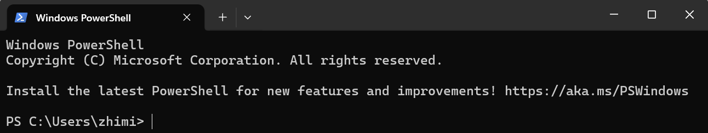
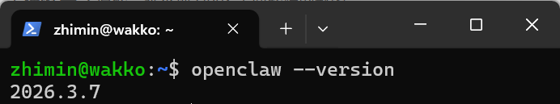
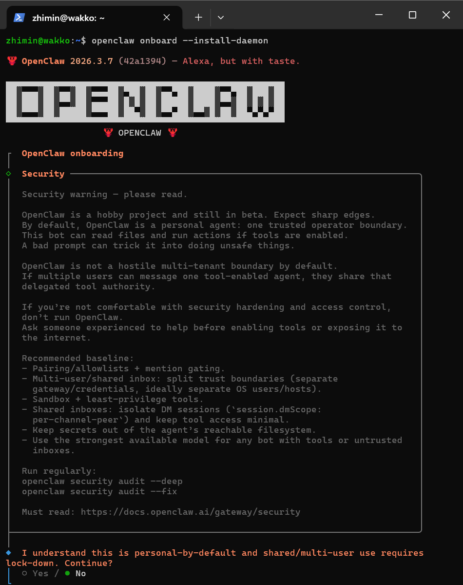
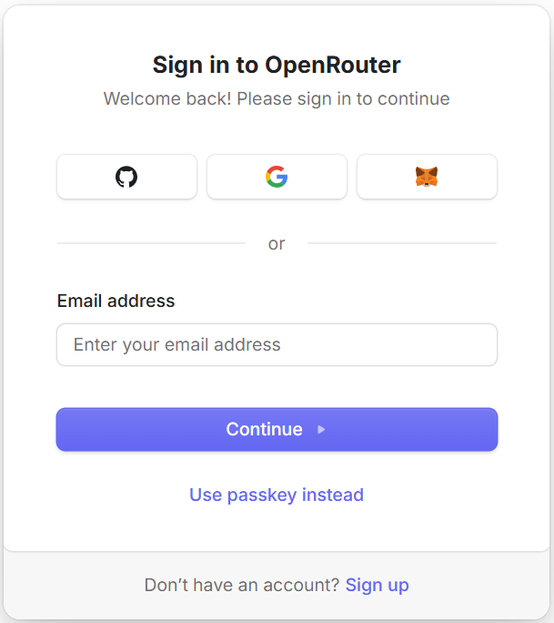
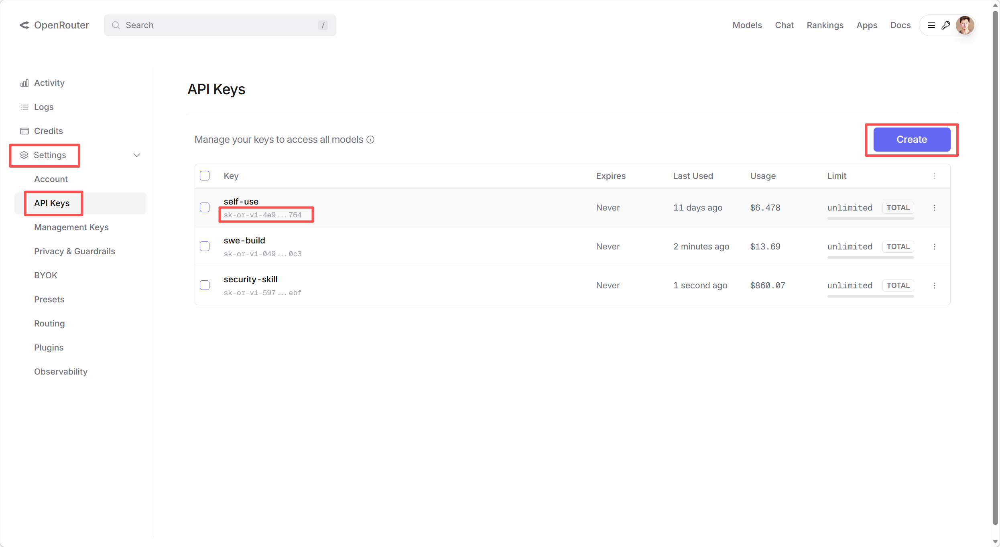
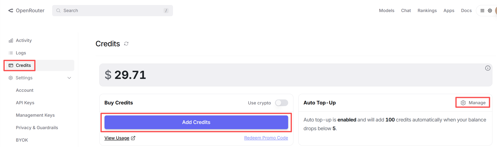
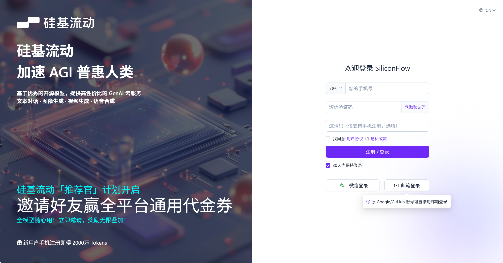
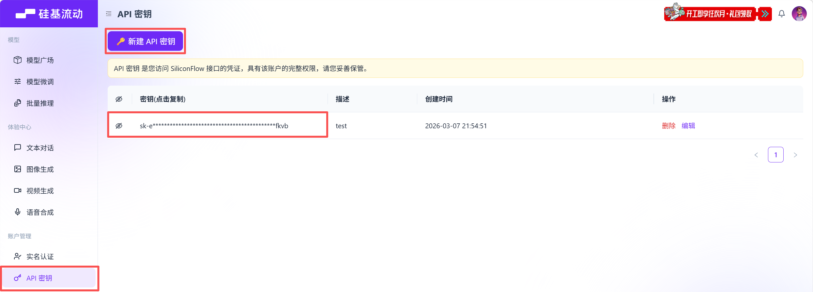
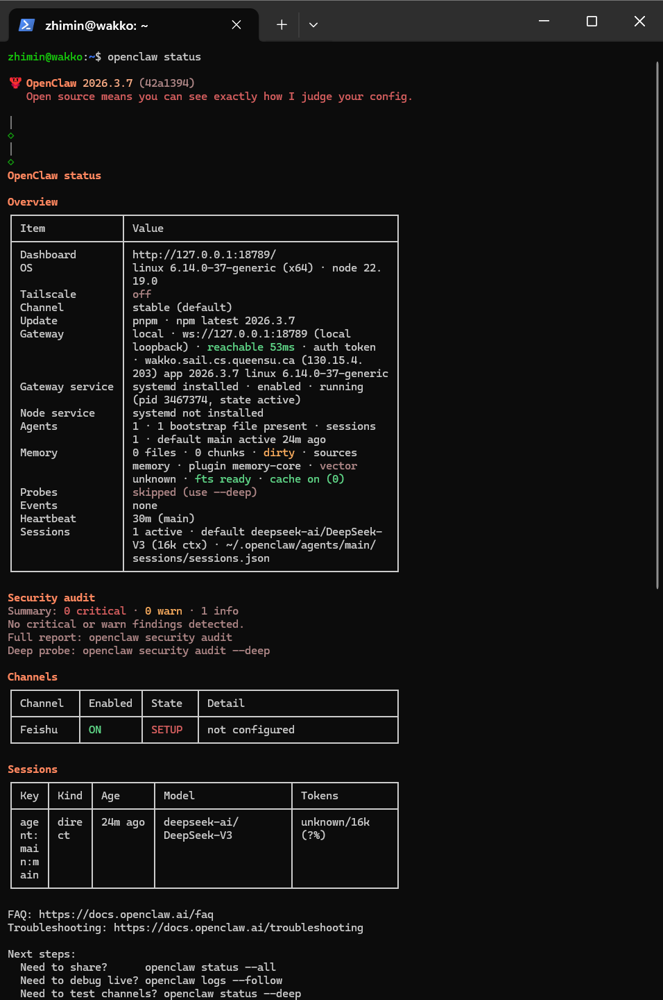

---
prev:
  text: 'Chapter 1: AutoClaw One-Click Installation'
  link: '/en/adopt/chapter1'
next:
  text: 'Chapter 3: Initial Configuration Wizard'
  link: '/en/adopt/chapter3'
---

# Chapter 2: OpenClaw Quick Installation

> By the end of this chapter, you will have a real AI assistant running on your computer — you can chat with it in the terminal and manage it through a browser dashboard. The whole process takes about 10 minutes.

> **Want to skip this?** [Chapter 1](/en/adopt/chapter1/) introduces **AutoClaw** — download → double-click → sign up and go, with built-in models and free credits, no terminal required.

## 0. Supported Platforms

OpenClaw runs on all major operating systems, and companion apps provide additional capabilities such as voice and camera support.

| Platform | Gateway Support | Companion App |
|----------|----------------|---------------|
| **macOS** | Native | Menu bar app + Voice Wake |
| **Windows** | Supported (WSL2 strongly recommended) | Planned |
| **Linux** | Native | Planned |
| **iOS** | — | Companion App: Canvas, camera, Voice Wake |
| **Android** | — | Companion App: Canvas, camera, screen sharing |

> **Note for mobile users**: Even without the companion app, you can chat with OpenClaw directly through messaging apps like WhatsApp or Telegram — no additional installation needed.

<details>
<summary>Gateway service installation methods</summary>

The Gateway runs as a background service and can be installed in several ways:

| Method | Command | Description |
|--------|---------|-------------|
| **Wizard install (recommended)** | `openclaw onboard --install-daemon` | One-stop configuration and service installation |
| **Direct install** | `openclaw gateway install` | Install the service only, without running the configuration wizard |
| **Configuration flow** | `openclaw configure` | Choose to install the Gateway service during the configuration flow |
| **Repair / migrate** | `openclaw doctor` | Auto-detect and fix service issues |

Service registration varies by operating system:
- **macOS**: LaunchAgent (`ai.openclaw.gateway`)
- **Linux / WSL2**: systemd user service (`openclaw-gateway.service`)

</details>

<details>
<summary>VPS and cloud server deployment</summary>

If you want to deploy OpenClaw on a remote server, the following hosting platforms are supported:

| Platform | Notes |
|----------|-------|
| **VPS (general)** | Any VPS works; a clean Ubuntu LTS base image is recommended |
| **Fly.io** | Containerized deployment |
| **Hetzner** | Docker deployment |
| **GCP** | Compute Engine VM |
| **exe.dev** | VM + HTTPS proxy |

> **Note**: Avoid third-party "one-click images". It is recommended to install using the installation script on a clean base image. Remote dashboard access can be achieved with tools like Tailscale.

For more cloud deployment options, see [Appendix C: Claw-like Solution Comparison and Selection](/en/appendix/appendix-c).

</details>

## 1. Installation

The **officially recommended method** is to use the one-click installation script — it automatically detects Node.js, installs the CLI, and launches the configuration wizard, all in one step.

<details>
<summary>What is a terminal?</summary>

A terminal is a text interface where you type commands and your computer executes them. How to open it:

- **Windows**: Press `Win + X`, select "Terminal" or "PowerShell"
- **macOS**: Press `Cmd + Space`, search for "Terminal"
- **Linux**: Press `Ctrl + Alt + T`



</details>

### macOS / Linux / WSL2

```bash
curl -fsSL https://openclaw.ai/install.sh | bash
```

The script automatically handles Node.js detection and installation, global OpenClaw CLI installation, and launching the configuration wizard (onboard).

> Install without configuring? Add `--no-onboard` to skip the wizard: `curl -fsSL https://openclaw.ai/install.sh | bash -s -- --no-onboard`

### Windows (PowerShell)

Open PowerShell (administrator mode) and run:

```powershell
Set-ExecutionPolicy -ExecutionPolicy RemoteSigned -Scope CurrentUser
iwr -useb https://openclaw.ai/install.ps1 | iex
```

> This script automatically installs Node.js and OpenClaw, and **immediately launches the configuration wizard (onboard)**. The wizard will prompt you to configure your model provider API Key, chat platform channels (QQ / Feishu / Telegram, etc.), and various auxiliary APIs (such as a search engine API). **It is recommended to prepare at least one model API Key in advance** (see [Step 2](#_2-configure-ai-model) for how to obtain one); other settings can be skipped for now and will be covered in later chapters.

Verify the installation:

```bash
openclaw --version
```

<details>
<summary>View verification screenshot</summary>



</details>

<details>
<summary>What is Node.js?</summary>

OpenClaw requires a Node.js 22.14+ runtime (Node 24 recommended). Node.js allows OpenClaw, which is written in JavaScript, to run on your computer. You do not need to learn JavaScript — the installation script handles everything automatically. If you already have Node.js 22.14+ installed, the script will skip this step. `openclaw update` performs a preflight check of the target version's Node requirements and shows a clear upgrade message if your runtime is too old.

</details>

<details>
<summary>Windows users: What is WSL2 and how do I install it?</summary>

WSL2 (Windows Subsystem for Linux 2) lets you run a full Linux environment on Windows. **If you don't want the extra setup, just use PowerShell directly and skip this step.**

1. Open PowerShell as administrator
2. Run: `wsl --install`
3. Restart your computer and follow the prompts to set a username and password

Afterwards, search for "Ubuntu" in the Start menu to open the WSL2 terminal and use the macOS / Linux installation script above.

> OpenClaw's official recommendation: On Windows, **using WSL2 is strongly recommended** to run OpenClaw for better compatibility and stability.

</details>

<details>
<summary>Build from source (developers / contributors)</summary>

```bash
# 1. Clone and build
git clone https://github.com/openclaw/openclaw.git
cd openclaw
pnpm install
pnpm ui:build
pnpm build

# 2. Link CLI globally
pnpm link --global
# Or skip linking and use pnpm openclaw ... inside the repository

# 3. Run the configuration wizard
openclaw onboard --install-daemon
```

> Building from source requires pnpm. VPS / cloud server users are recommended to install using the installation script on a clean Ubuntu LTS base image.

</details>

## 2. Configure an AI Model

OpenClaw does not include an AI brain of its own — it needs to connect to a "model provider" to gain intelligence. If the installation script already launched the configuration wizard, fill it in following the instructions below; if you skipped the wizard, run it manually:

```bash
openclaw onboard --install-daemon
```



The wizard will guide you through all configuration steps. Key steps:

**Security confirmation** → Select **Yes**
**Configuration mode** → Select **QuickStart**
**Model provider** → Select **Custom Provider**

Then enter the following information (using a free OpenRouter model as an example):

```
◇  API Base URL
│  https://openrouter.ai/api/v1

◇  API Key
│  sk-or-v1-your-key

◇  Endpoint compatibility
│  OpenAI-compatible

◇  Model ID
│  qwen/qwen3.6-plus:free
```

**OpenRouter is recommended** — sign up and use free models (such as Step 3.5 Flash) immediately, no top-up required, zero cost to complete all tutorial exercises.

The wizard will subsequently ask about channels, skills, and other settings — **it is recommended to skip all of these for now** — later chapters will cover them in detail.

> **Don't have an API Key yet?** Expand the guide below to obtain one.

<details>
<summary>Getting an API Key: Sign up for OpenRouter (free models, zero-cost onboarding)</summary>

**Step 1: Create an account**

1. Visit the [OpenRouter website](https://openrouter.ai)
2. Click **Sign In** in the top right; supports Google, GitHub, email, and other registration methods



**Step 2: Create an API key**

1. After signing in, click your **avatar** in the top right → select **Settings**
2. Select **API Keys** in the left menu
3. Click **Create** to generate a new API Key
4. Copy the generated key (starts with `sk-or-v1-`)



> **Important**: The API key is only shown once — copy and save it immediately. If lost, you will need to create a new one.

**Step 3: Add credits (optional)**

Models with a `:free` suffix on OpenRouter are completely free, such as `qwen/qwen3.6-plus:free`, which is sufficient for everyday learning. If you want to use more powerful paid models:

1. Click **Credits** in the left menu to go to the top-up page
2. Click **Add Credits** to add funds
3. OpenRouter supports UnionPay, VISA, and other common card types, and even supports cryptocurrency payments
4. The recommended minimum first top-up is **$5 USD**, which is more than enough for practice



> **Convenience tip**: If your usage grows later, you can enable **Auto Top Up** on the credits page to automatically replenish your balance when it runs low, avoiding service interruptions.

</details>

<details>
<summary>Alternative: Use SiliconFlow (domestic provider)</summary>

If you prefer to use a domestic provider, SiliconFlow is recommended — new registrations receive **16 CNY in free compute credits**, with Alipay / WeChat Pay top-up support.

**Sign up and get an API Key**:

1. Visit the [SiliconFlow website](https://cloud.siliconflow.cn) and register with your phone number
2. After logging in, go to the [console](https://cloud.siliconflow.cn/account/ak) and create an API key (starts with `sk-`)





**Fill in the QuickStart wizard**:

```
◇  API Base URL
│  https://api.siliconflow.cn/v1

◇  API Key
│  sk-your-key

◇  Model ID
│  deepseek-ai/DeepSeek-V3
```

> **Cost reference**: With the DeepSeek V3 model, 16 CNY supports approximately 800–1500 conversations.

</details>

> **More providers**: OpenClaw supports 15+ model providers (DeepSeek, Qwen, Kimi, GLM, OpenAI, Claude, etc.). For the full list and where to obtain them, see [Appendix E: Model Provider Selection Guide](/en/appendix/appendix-e).

> **Want to understand the configuration file structure?** The wizard generates the configuration file automatically — manual editing is rarely needed. For an explanation of each field, see [Appendix G: Configuration File Reference](/en/appendix/appendix-g).

## 3. Verify and Start Your First Conversation

After installation and configuration, verify that everything is running:

```bash
openclaw status
```

<details>
<summary>View status output screenshot</summary>



</details>

Once everything looks good, start your first conversation:

```bash
openclaw tui
```

Try typing: `Hello, please introduce yourself` — if the lobster replies, congratulations, the installation was successful!

Open the web dashboard to visually manage your lobster:

```bash
openclaw dashboard
```

The browser will automatically open the dashboard at `http://localhost:18789`:


> **What is localhost?** `localhost` means "this machine" — this page can only be opened by you.

> For more commands, see [Appendix F: Command Quick Reference](/en/appendix/appendix-f).

## 4. Frequently Asked Questions

**Q: Running `openclaw` on Windows gives "command not found"?**

A: PowerShell blocks script execution by default. Run as administrator:
```powershell
Set-ExecutionPolicy -ExecutionPolicy RemoteSigned -Scope CurrentUser
```
Then reopen the terminal. If it still does not work, try reinstalling using the [one-click installation script](#_1-installation).

**Q: What do I do if I get "API key not found"?**

A: Re-run the configuration wizard: `openclaw onboard`, and re-enter your API Key when prompted. You can also check that your environment variables are set correctly (e.g. `OPENROUTER_API_KEY`). Refer to the configuration example in [Step 2](#_2-configure-ai-model).

**Q: The bot replies slowly or times out?**

A: The model may be responding slowly. Try switching to a faster model (such as `deepseek-ai/DeepSeek-V3`), or check your network connection.

**Q: The installation script downloads slowly or times out?**

A: This is likely a network issue. Try using a proxy, or retry a few times. If the download consistently fails, you can manually visit `https://openclaw.ai/install.sh` (or `.ps1`), save it locally, and then run it.

## 5. Upgrading and Maintenance

Upgrading requires just one command — simply re-run the installation script:

```bash
curl -fsSL https://openclaw.ai/install.sh | bash
```

The script automatically detects the existing installation and upgrades it in place. After upgrading, run:

```bash
openclaw doctor           # Migrate config + health check
openclaw gateway restart  # Restart the gateway
```

> If you encounter issues after upgrading: run `openclaw doctor` again — it will usually tell you directly how to fix the problem. Community help: [Discord](https://discord.gg/clawd)

<details>
<summary>Want to know more about upgrade options? (npm/pnpm manual upgrade, channel switching, rollback)</summary>

### Before Upgrading

Before upgrading, it is recommended to back up your customizations: configuration files, credentials at `~/.openclaw/credentials/`, and workspace at `~/.openclaw/workspace/`.

### Global Install (npm/pnpm)

```bash
npm i -g openclaw@latest
# or
pnpm add -g openclaw@latest
```

Switch update channel:

```bash
openclaw update --channel beta    # Preview channel
openclaw update --channel dev     # Development channel
openclaw update --channel stable  # Stable channel (default)
```

After updating, you must run:

```bash
openclaw doctor
openclaw gateway restart
```

### Source Install

```bash
openclaw update
```

Or manually:

```bash
git pull
pnpm install
pnpm build
pnpm ui:build
openclaw doctor
```

### Controlling UI Updates

The Dashboard provides an "Update and Restart" function, equivalent to `openclaw update` (source installs only).

### Rolling Back to a Specific Version

```bash
# Install a specific version
npm i -g openclaw@<version>
openclaw doctor
openclaw gateway restart
```

Roll back by date for source installs:

```bash
git fetch origin
git checkout "$(git rev-list -n 1 --before=\"2026-01-01\" origin/main)"
pnpm install && pnpm build
openclaw gateway restart
```

### Start / Stop / Restart Gateway

```bash
openclaw gateway status    # Check status
openclaw gateway stop      # Stop
openclaw gateway restart   # Restart (apply configuration changes)
openclaw logs --follow     # View logs in real time
```

Direct system service control on macOS/Linux:

```bash
# macOS launchd
launchctl kickstart -k gui/$UID/bot.molt.gateway

# Linux systemd
systemctl --user restart openclaw-gateway.service
```

### What does openclaw doctor do?

- Migrates deprecated configuration keys and legacy configuration file locations
- Audits direct message policies and warns about risky settings
- Checks Gateway health and offers a restart option
- Migrates legacy Gateway services (launchd/systemd) to the current version

</details>

---

## 6. Uninstalling

Before uninstalling, it is recommended to back up `~/.openclaw/workspace` (which contains conversation history and memory files).

```bash
openclaw uninstall
```

<details>
<summary>Need to uninstall manually, or the CLI has been deleted but the service is still running?</summary>

**Full manual uninstall:**

```bash
openclaw gateway stop
openclaw gateway uninstall
rm -rf "${OPENCLAW_STATE_DIR:-$HOME/.openclaw}"
npm rm -g openclaw
# or pnpm remove -g openclaw

# macOS app (if present)
rm -rf /Applications/OpenClaw.app
```

> If you used `--profile`, repeat the deletion steps for each `~/.openclaw-<profile>`.

**Manually cleaning up service leftovers:**

macOS:
```bash
launchctl bootout gui/$UID/bot.molt.gateway
rm -f ~/Library/LaunchAgents/bot.molt.gateway.plist
```

Linux:
```bash
systemctl --user disable --now openclaw-gateway.service
rm -f ~/.config/systemd/user/openclaw-gateway.service
systemctl --user daemon-reload
```

Windows:
```powershell
schtasks /Delete /F /TN "OpenClaw Gateway"
Remove-Item -Force "$env:USERPROFILE\.openclaw\gateway.cmd"
```

</details>

---

## 7. Migrating to a New Machine

<details>
<summary>Switching computers? Here's how to move your lobster over completely.</summary>

The core approach is: **copy the state directory + workspace → install → doctor → restart**. No need to redo the onboarding wizard.

**What to migrate:**

| Item | Default path | Contents |
|------|-------------|---------|
| **State directory** | `~/.openclaw/` | Config, credentials, API keys, OAuth tokens, session history, channel state |
| **Workspace** | `~/.openclaw/workspace/` | MEMORY.md, USER.md, Skills notes, and other agent files |

Copying both = full migration. Copying only the workspace = no sessions or credentials are preserved.

**Step 0 — Back up on the old machine:**

```bash
openclaw gateway stop
cd ~
tar -czf openclaw-state.tgz .openclaw
```

**Step 1 — Install on the new machine:**

Install the CLI following [Step 1](#_1-installation), then copy `openclaw-state.tgz` to the new machine using `scp` or an external drive, extract it, and overwrite the newly generated `~/.openclaw/`.

**Step 2 — Run doctor + restart:**

```bash
openclaw doctor
openclaw gateway restart
openclaw status
```

**Verification checklist:**
- [ ] `openclaw status` shows Gateway is running
- [ ] Channels are still connected (WhatsApp does not need to be re-paired)
- [ ] Dashboard shows existing sessions
- [ ] Workspace files are present

**Common pitfalls:**

- **Only copied the config file**: Not enough — you must migrate the entire `~/.openclaw/` folder (credentials are stored in the `credentials/` subdirectory)
- **Permission issues**: Make sure the state directory is owned by the user running the Gateway; do not copy as root
- **Backup security**: `~/.openclaw/` contains sensitive information such as API keys — store it encrypted and do not transfer it over insecure channels

</details>
