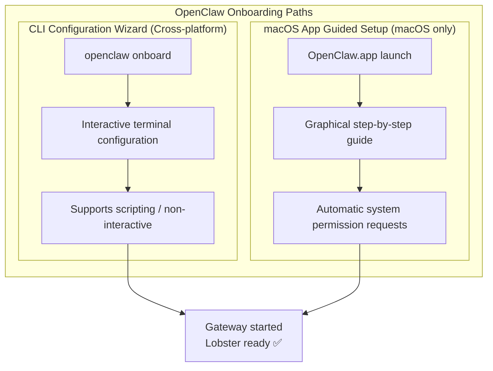

---
prev:
  text: 'Chapter 2: OpenClaw Manual Installation'
  link: '/en/adopt/chapter2'
next:
  text: 'Chapter 4: Chat Platform Integration'
  link: '/en/adopt/chapter4'
---

# Chapter 3: Initial Configuration Wizard

> After completing this chapter, the lobster will be able to speak.

> **Prerequisites**: You have completed [Chapter 2: OpenClaw Manual Installation](/en/adopt/chapter2/).

## 0. Two Paths — Choose One

**Onboarding (Configuration Wizard)** helps you tell the lobster three things: which model to use, which channel to contact you through, and where to work. OpenClaw provides two paths:




| Path | Use Case | Platform |
|------|---------|------|
| **CLI Configuration Wizard** | Need full control, remote servers, automation scripts | macOS / Linux / Windows (WSL2) |
| **macOS App Guided Setup** | Prefer graphical guidance, need native permissions for voice/camera | macOS only |

> **Already ran `openclaw onboard` in Chapter 2?** Basic configuration is complete! This chapter helps you understand what each step did and how to fine-tune.

---

## 1. CLI Configuration Wizard (All Platforms)

### 1.1 Start the Wizard

```bash
openclaw onboard
```

> **Want to install the background service at the same time?** Add `--install-daemon` to do it all at once:
> ```bash
> openclaw onboard --install-daemon
> ```

### 1.2 QuickStart vs Advanced

After the wizard starts, it will ask you the first question: **QuickStart** or **Advanced**?

| Option | Auto-configured Content | Best For |
|------|------------|--------|
| **QuickStart** | Local Gateway + default workspace + port 18789 + Token auth + coding tools policy | First-time users who want to chat quickly |
| **Advanced** | All options are customizable | Remote deployment, Tailscale, special security policies |

<details>
<summary>QuickStart Default Configuration Overview</summary>

QuickStart mode automatically applies the following defaults:

| Setting | Default Value | Description |
|--------|--------|------|
| Gateway location | Local machine (loopback) | Accessible from this machine only |
| Workspace | `~/.openclaw/workspace/` | Or use an existing workspace |
| Gateway port | 18789 | Standard port |
| Authentication | Token (auto-generated) | Authentication required even for local access |
| Tools policy | `tools.profile: "coding"` | Retains filesystem and runtime tools |
| DM isolation | `session.dmScope: "per-channel-peer"` | Independent session per channel |
| Tailscale | Disabled | Not exposed to Tailnet |
| Telegram/WhatsApp DM | Whitelist mode | Will prompt for your phone number |

> Users with existing custom `tools.profile` will not be overwritten — the wizard respects existing configuration.

</details>

### 1.3 The Six Steps of the Wizard

#### Step 1: Model and Authentication

Choose a model provider and paste your API Key. Not sure which to pick? See [Chapter 5: Model Management](/en/adopt/chapter5/).

<details>
<summary>Security Note: Model Selection and Tool Safety</summary>

If your lobster will run tools (execute commands, call APIs) or process external content from Webhooks/Hooks, be aware:

- **Prioritize the latest generation of strong models** — weaker/older models are more susceptible to prompt injection attacks
- **Maintain strict tool policies** — avoid using `tools.profile: "full"` (unrestricted mode) unless you fully trust all input sources
- See [Chapter 10: Security](/en/adopt/chapter10/) for details

</details>

<details>
<summary>Key Storage: Plaintext vs SecretRef</summary>

The wizard stores API Keys in plaintext in the config file by default. If you need a more secure storage method:

**Interactive mode**: Choose Secret Reference mode to point to an environment variable or Provider Ref (file/executable). The wizard will immediately verify that the reference is valid.

**Non-interactive mode**: Use `--secret-input-mode ref`. The provider's environment variable must already be set:
```bash
export OPENAI_API_KEY="sk-..."
openclaw onboard --secret-input-mode ref --non-interactive
```

</details>

#### Step 2: Workspace

Set the lobster's working directory (default `~/.openclaw/workspace/`), where files like IDENTITY.md and MEMORY.md are stored. Existing workspace files are preserved.

#### Step 3: Gateway Configuration

Set the port (default 18789), bind address (default local machine only), and authentication method.

<details>
<summary>Gateway Token and SecretRef</summary>

In interactive Token mode, you can choose:
- **Plaintext Token** (default): Stored in the config file
- **SecretRef**: Manage the Token via an environment variable or external program

Using SecretRef in non-interactive mode:
```bash
openclaw onboard --gateway-token-ref-env GATEWAY_TOKEN --non-interactive
```

Note: If both `gateway.auth.token` and `gateway.auth.password` are configured without setting `gateway.auth.mode`, the background service installation will be blocked until you explicitly choose one mode.

</details>

#### Step 4: Channel Integration

Select the chat platforms to connect (WhatsApp, Telegram, Discord, etc.). You can skip this and add channels later with `openclaw channels add`. See [Chapter 4](/en/adopt/chapter4/) for details.

#### Step 5: Background Service

Install the background service to automatically start the Gateway on boot. macOS uses LaunchAgent; Linux/WSL2 uses systemd.

<details>
<summary>Notes on Background Service and SecretRef</summary>

- If Token authentication uses SecretRef, the background service installation will verify the reference is valid, but will **not** persist the resolved Token into the service environment
- If the configured SecretRef cannot be resolved, background service installation will be blocked with repair suggestions
- Use `openclaw doctor` to automatically detect and fix service issues

</details>

#### Step 6: Health Check and Skill Installation

Start the Gateway, verify it is running, and install recommended skills. See [Appendix D: Skill Development and Publishing Guide](/en/appendix/appendix-d).

### 1.4 Web Search Configuration

To enable the lobster to search the web, you need to configure a search provider. Supported options:

| Provider | Description |
|--------|------|
| Perplexity | AI search engine |
| Brave | Privacy-focused search |
| Gemini | Google AI search |
| Grok | xAI search |
| Kimi | Moonshot AI search |

Paste the corresponding API Key to enable it. You can also configure this later:

```bash
openclaw configure --section web
```

---

## 2. macOS App Guided Setup

When you launch OpenClaw.app (Control UI) for the first time, it will automatically enter the graphical guided setup.

### 2.1 Guided Setup Steps Overview

| Step | Content | Action |
|------|------|------|
| ① | macOS security warning | Click "Allow" |
| ② | Local network discovery | Allow finding local network devices |
| ③ | Security notice | Read the trust model description |
| ④ | Choose Gateway location | Local / Remote / Configure later |
| ⑤ | System permission requests | Grant each permission |
| ⑥ | Install CLI (optional) | Install the `openclaw` command-line tool |
| ⑦ | Onboarding conversation | Lobster self-introduction + guide to next steps |

### 2.2 Security Notice (Step ③)

The app will display OpenClaw's trust model description. Read it and click Continue.

<details>
<summary>What does the trust model mean?</summary>

- **Default positioning**: Personal assistant, a single trusted operator boundary
- **Multi-user scenarios**: Need to split trust boundaries and minimize tool permissions — see [Chapter 10: Security](/en/adopt/chapter10/)
- **New local installations** default to `tools.profile: "coding"`, retaining filesystem and runtime tools

</details>

### 2.3 Gateway Location Selection (Step ④)

| Option | Description |
|------|------|
| **This Mac** | Run Gateway on this machine; the app directly configures authentication and credentials |
| **Remote** | Connect to a remote Gateway (via SSH or Tailnet); does not modify local authentication |
| **Configure later** | Skip setup; the app remains unconfigured |

<details>
<summary>Gateway Authentication Notes</summary>

- The wizard now generates a Token even for local loopback connections, so local WebSocket clients also require authentication
- If authentication is disabled, any local process can connect — only do this on a fully trusted machine
- For multi-machine access or non-loopback bindings, always use Token authentication

</details>

### 2.4 System Permissions (Step ⑤)

The macOS app will request the following TCC permissions:

| Permission | Purpose |
|------|------|
| **Automation** | AppleScript control of other apps |
| **Notifications** | Push message alerts |
| **Accessibility** | UI interaction control |
| **Screen Recording** | Screenshots/screen sharing |
| **Microphone** | Voice input |
| **Speech Recognition** | Voice-to-text |
| **Camera** | Visual input |
| **Location** | Location awareness |

> Permissions you don't need can be skipped and adjusted later in macOS "System Settings → Privacy & Security".

### 2.5 CLI Installation (Step ⑥)

Install the global `openclaw` CLI to enable terminal commands and scheduled tasks to work properly. Those who have already installed via [Chapter 2](/en/adopt/chapter2/) can skip this.

### 2.6 Onboarding Conversation (Step ⑦)

After setup is complete, the lobster will introduce itself and guide you through exploring features. This is a dedicated onboarding session that does not affect everyday use.

---

## 3. Custom Model Provider

Your provider isn't in the wizard's list? Select **Custom Provider** and fill in the following:

| Step | Content | Example |
|------|------|------|
| 1. Select compatibility type | OpenAI-compatible / Anthropic-compatible / Unknown (auto-detect) | OpenAI-compatible |
| 2. Enter Base URL | The provider's API address | `https://api.mycompany.com/v1` |
| 3. Enter API Key | If required | `sk-custom-...` |
| 4. Enter Model ID | Model identifier | `gpt-4o` |
| 5. Set alias (optional) | A short, memorable name | `company-gpt` |
| 6. Set Endpoint ID | Distinguishes multiple custom endpoints | `mycompany` |

<details>
<summary>Multiple Custom Endpoints Side by Side</summary>

Each Custom Provider is distinguished by its **Endpoint ID**, so you can configure multiple custom endpoints simultaneously:

```json
// Configuration example
{
  "models": {
    "providers": {
      "custom-company-a": {
        "type": "openai",
        "baseUrl": "https://api.company-a.com/v1",
        "apiKey": "sk-a-..."
      },
      "custom-company-b": {
        "type": "anthropic",
        "baseUrl": "https://api.company-b.com/v1",
        "apiKey": "sk-b-..."
      }
    }
  }
}
```

See [Appendix G: Configuration File Reference](/en/appendix/appendix-g) for details.

</details>

---

## 4. Multi-Agent Configuration

OpenClaw supports running multiple independent agents under the same instance, each with its own workspace, session, and channel bindings.

### 4.1 Adding an Agent

```bash
openclaw agents add <name>
```

### 4.2 Agent Configuration Options

| Setting | Description |
|--------|------|
| `agents.list[].name` | Agent name |
| `agents.list[].workspace` | Workspace path (default `~/.openclaw/workspace-<agentId>`) |
| `agents.list[].agentDir` | Agent configuration directory |

<details>
<summary>Non-interactive Mode and Message Routing</summary>

**Non-interactive mode flags**:
```bash
openclaw agents add worker-bot \
  --model "openrouter/qwen/qwen3.6-plus:free" \
  --agent-dir ~/.openclaw/agents/worker \
  --bind "telegram:chat:12345" \
  --non-interactive
```

**Message routing**: Use the `--bind` parameter to bind a specific channel/conversation to a particular agent. The wizard also guides you through the binding configuration.

This allows you to have different lobsters handle different chat groups or task types.

</details>

---

## 5. Reconfiguration and Maintenance

### 5.1 Re-running the Wizard

```bash
openclaw configure
```

> `configure` modifies existing configuration; `onboard` is for initial setup. The former does not reinstall the background service.

### 5.2 Resetting Configuration

```bash
# Default reset: configuration, credentials, sessions
openclaw onboard --reset

# Full reset: includes workspace
openclaw onboard --reset --reset-scope full
```

> ⚠️ `--reset` clears existing configuration. To change only a specific setting, using `openclaw configure` is safer.

### 5.3 Handling Configuration Errors

If the config file is corrupted, run `openclaw doctor` to automatically diagnose and repair. See [Chapter 8](/en/adopt/chapter8/) for details.

<details>
<summary>Non-interactive Mode (Scripted Deployment)</summary>

In CI/CD or batch deployment scenarios, you can use non-interactive mode to skip all interactive prompts:

```bash
openclaw onboard \
  --non-interactive \
  --auth-choice openai-api-key \
  --install-daemon
```

Notes:
- The `--json` flag does **not** imply non-interactive mode; it only changes the output format
- In non-interactive mode, all required configuration must be provided via command-line arguments or environment variables
- When using `--secret-input-mode ref`, the corresponding environment variable must already be set

</details>

---

## 6. Frequently Asked Questions

**Q: Where is the config file stored?**

Configuration files are stored in the `~/.openclaw/` directory, with the workspace at `~/.openclaw/workspace/`. For the config file structure, see [Appendix G](/en/appendix/appendix-g).

**Q: The wizard is done — how do I start chatting right away?**

```bash
openclaw tui         # Terminal conversation
openclaw dashboard   # Browser Dashboard (no channel configuration required)
```

See [Chapter 11](/en/adopt/chapter11/) for details.

**Q: What if my provider isn't in the list?**

Select **Custom Provider** and enter the API address and key. See [Section 3 of this chapter](#_3-custom-model-provider) for details.

**Q: Will Remote mode make changes to the remote host?**

No. It only configures how the local client connects to the remote Gateway (SSH tunnel or Tailnet); the remote host is not affected. See [Chapter 9](/en/adopt/chapter9/) for details.

**Q: Will re-running the wizard overwrite existing configuration?**

No, unless you pass the `--reset` parameter.
