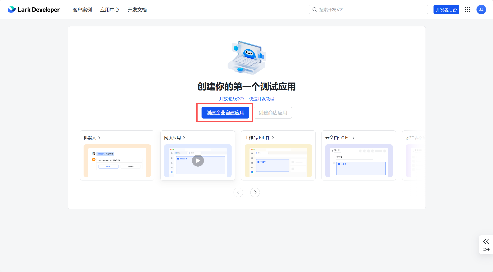
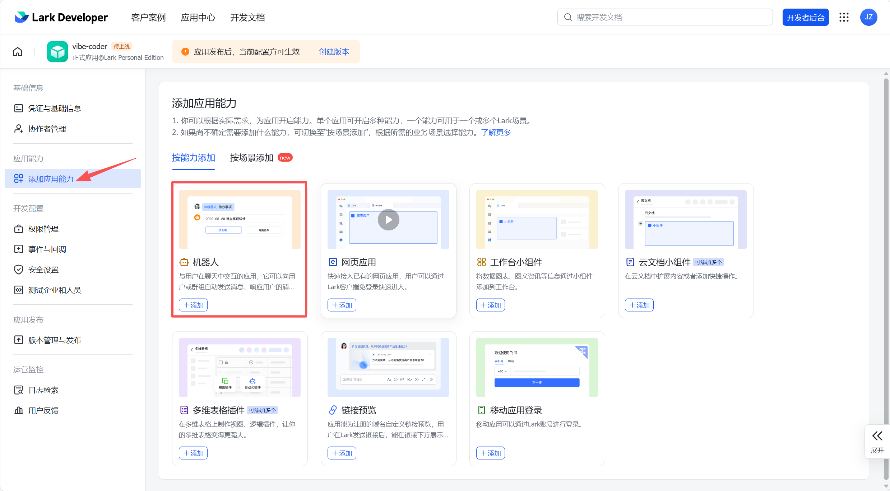
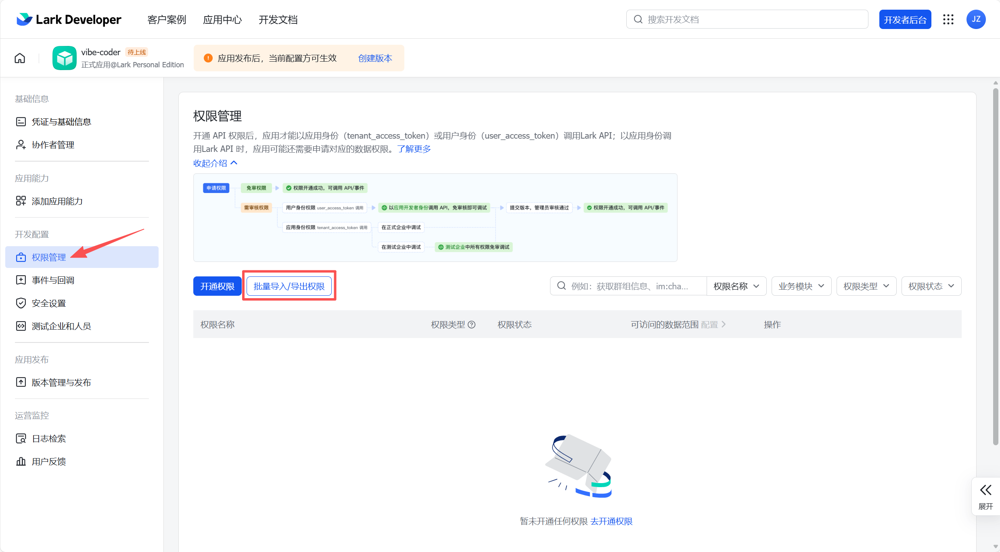
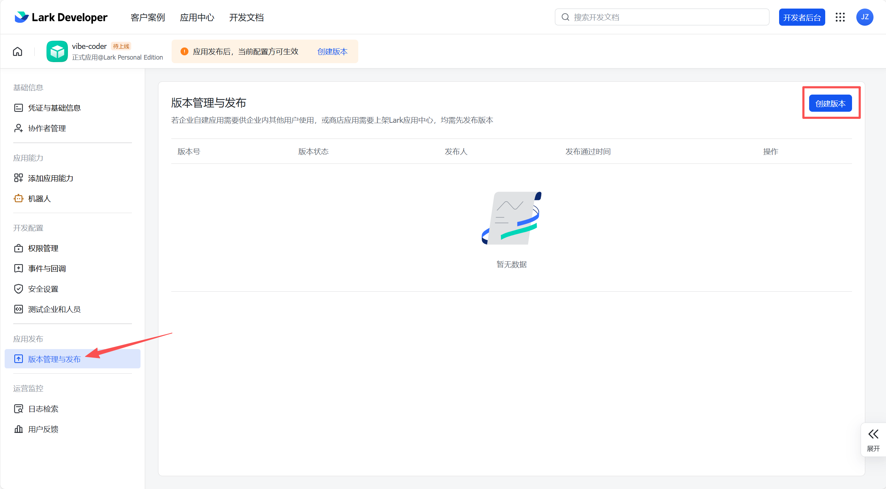
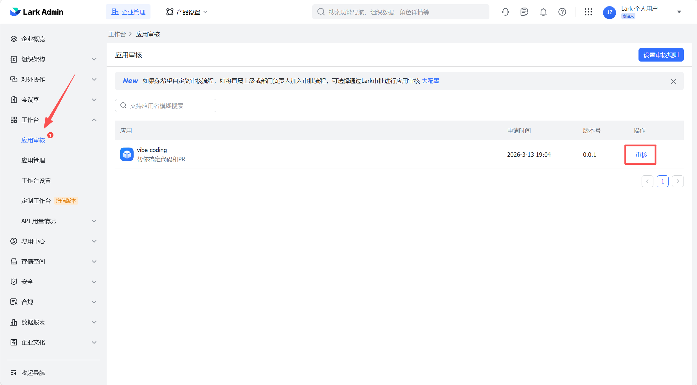

---
prev:
  text: 'Chapter 3: Initial Configuration Wizard'
  link: '/en/adopt/chapter3'
next:
  text: 'Chapter 5: Model Management'
  link: '/en/adopt/chapter5'
---

# Chapter 4: Chat Platform Integration

After completing this chapter, you'll be able to chat with the lobster on your phone.

> **AutoClaw users**: Scan the QR code in Lark to complete integration — [you can skip this chapter](/en/adopt/chapter1/).

## 0. Which Chat Platforms Are Supported?

OpenClaw supports almost all mainstream chat applications, with text messaging available across all channels.

| Channel | Description | Installation |
|---------|-------------|--------------|
| **Feishu / Lark** | WebSocket persistent connection; preferred for enterprise collaboration | Built-in |
| **WeChat** | WorkBuddy bridge; personal accounts / WeCom | Plugin |
| **QQ** | QQ Open Platform Bot API | Plugin |
| **WhatsApp** | Most popular globally; Baileys library, requires QR pairing | Built-in |
| **Telegram** | Bot API (grammY); supports group chats, most open API | Built-in |
| **Discord** | Bot API + Gateway; servers, channels, DMs; LLM auto thread naming | Built-in |
| **Slack** | Bolt SDK; workspace apps; rich replies with auto-rendered buttons/selects | Built-in |
| **Signal** | signal-cli; privacy-focused | Built-in |
| **Google Chat** | Google Chat API; HTTP webhook | Built-in |
| **iMessage** | BlueBubbles (recommended) or legacy imsg CLI | Built-in |
| **IRC** | Classic IRC server; channels + direct messages | Built-in |
| **WebChat** | Built-in web chat interface in the Gateway | Built-in |
| **LINE** | LINE Messaging API | Plugin |
| **Matrix** | Matrix open protocol | Plugin |
| **Mattermost** | Bot API + WebSocket | Plugin |
| **Microsoft Teams** | Official Teams SDK; streaming replies, welcome cards, message edit/delete, AI labeling | Plugin |
| **Nostr** | Decentralized protocol NIP-04 | Plugin |
| **Twitch** | IRC connection | Plugin |
| **Zalo** | Zalo Bot API (Vietnam) | Plugin |

<details>
<summary>Can multiple platforms be connected at the same time?</summary>

Yes. OpenClaw automatically routes messages by source — use Feishu for work and Telegram as a personal assistant, all sharing the same AI brain.

</details>

This chapter uses **Feishu** as the example — it's the preferred platform for office use in China, with deep integration for documents, calendars, and multi-dimensional tables. Telegram is simpler to configure but requires a proxy in mainland China.

## 1. Prerequisites

- Completed the installation in [Chapter 2](/en/adopt/chapter2/) (`openclaw status` shows normal)
- A Feishu account (personal account is fine; no enterprise admin permissions required)

## 2. Create a Feishu App

### Step 1: Log in to the Feishu Open Platform

Visit the [Feishu Open Platform](https://open.feishu.cn/app) and log in with your Feishu account.



<details>
<summary>Using the international Lark version?</summary>

Visit [Lark Open Platform](https://open.larksuite.com/app) and set `domain: "lark"` in the subsequent configuration.

</details>

### Step 2: Create an Enterprise Custom App

Click "Create Enterprise Custom App", fill in the name (e.g., "OpenClaw Assistant") and description, then click "Create".

### Step 3: Obtain App Credentials

Go to "Credentials & Basic Info", copy the **App ID** (format: `cli_xxx`) and **App Secret**, and save them securely.


### Step 4: Enable Bot Capability

Go to "Add App Capabilities" → "Bot" and click "Add".



> **This step must be done first**: Otherwise, when importing permissions in the next step, messaging-related permissions cannot be enabled.

### Step 5: Configure Permissions

Go to "Permission Management", click "Batch Import", and paste the following JSON:



```json
{
  "scopes": {
    "tenant": [
      "application:application:self_manage",
      "application:bot.menu:write",
      "cardkit:card:read",
      "cardkit:card:write",
      "contact:contact.base:readonly",
      "contact:user.employee_id:readonly",
      "docs:document.content:read",
      "docx:document:readonly",
      "event:ip_list",
      "im:chat",
      "im:chat.members:bot_access",
      "im:chat:read",
      "im:chat:update",
      "im:message",
      "im:message.group_at_msg:readonly",
      "im:message.group_msg",
      "im:message.p2p_msg:readonly",
      "im:message.pins:read",
      "im:message.pins:write_only",
      "im:message.reactions:read",
      "im:message.reactions:write_only",
      "im:message:readonly",
      "im:message:recall",
      "im:message:send_as_bot",
      "im:message:send_multi_users",
      "im:message:send_sys_msg",
      "im:message:update",
      "im:resource",
      "sheets:spreadsheet",
      "wiki:wiki:readonly"
    ],
    "user": [
      "base:app:copy",
      "base:app:create",
      "base:app:read",
      "base:app:update",
      "base:field:create",
      "base:field:delete",
      "base:field:read",
      "base:field:update",
      "base:record:create",
      "base:record:delete",
      "base:record:retrieve",
      "base:record:update",
      "base:table:create",
      "base:table:delete",
      "base:table:read",
      "base:table:update",
      "base:view:read",
      "base:view:write_only",
      "board:whiteboard:node:create",
      "board:whiteboard:node:read",
      "calendar:calendar.event:create",
      "calendar:calendar.event:delete",
      "calendar:calendar.event:read",
      "calendar:calendar.event:reply",
      "calendar:calendar.event:update",
      "calendar:calendar.free_busy:read",
      "calendar:calendar:read",
      "contact:contact.base:readonly",
      "contact:user.base:readonly",
      "contact:user.employee_id:readonly",
      "contact:user:search",
      "docs:document.comment:create",
      "docs:document.comment:read",
      "docs:document.comment:update",
      "docs:document.media:download",
      "docs:document:copy",
      "docx:document:create",
      "docx:document:readonly",
      "docx:document:write_only",
      "drive:drive.metadata:readonly",
      "drive:file:download",
      "drive:file:upload",
      "im:chat.members:read",
      "im:chat:read",
      "im:message",
      "im:message.group_msg:get_as_user",
      "im:message.p2p_msg:get_as_user",
      "im:message:readonly",
      "offline_access",
      "search:docs:read",
      "search:message",
      "space:document:delete",
      "space:document:move",
      "space:document:retrieve",
      "task:comment:read",
      "task:comment:write",
      "task:task:read",
      "task:task:write",
      "task:task:writeonly",
      "task:tasklist:read",
      "task:tasklist:write",
      "wiki:node:copy",
      "wiki:node:create",
      "wiki:node:move",
      "wiki:node:read",
      "wiki:node:retrieve",
      "wiki:space:read",
      "wiki:space:retrieve",
      "wiki:space:write_only"
    ]
  }
}
```

> This permission bundle covers the full set of capabilities including messaging, cloud documents, multi-dimensional tables, calendar, and tasks.

<details>
<summary>What do these permissions do?</summary>

| Permission Category | Representative Permissions | Purpose |
|--------------------|---------------------------|---------|
| **App Management (application:)** | `application:application:self_manage`, `application:bot.menu:write` | App self-management, bot menu configuration |
| **Message Cards (cardkit:)** | `cardkit:card:read`, `cardkit:card:write` | Read and write message cards |
| **Messaging (im:)** | `im:message`, `im:message:send_as_bot`, `im:resource` | Send and receive messages, images, files |
| **Group Chat (im:chat)** | `im:chat`, `im:chat.members:bot_access` | Group chat management, member access |
| **Contacts (contact:)** | `contact:user.base:readonly`, `contact:user.employee_id:readonly` | Retrieve basic user information |
| **Cloud Documents (docx:/docs:)** | `docx:document:create`, `docs:document.content:read` | Create and read Feishu documents |
| **Spreadsheets (sheets:)** | `sheets:spreadsheet` | Operate Feishu spreadsheets |
| **Multi-dimensional Tables (base:)** | `base:record:create`, `base:table:read` | Operate multi-dimensional table data |
| **Calendar (calendar:)** | `calendar:calendar.event:create`, `calendar:calendar.event:read` | Manage calendar events |
| **Tasks (task:)** | `task:task:read`, `task:task:write` | Create and manage Feishu tasks |
| **Wiki (wiki:)** | `wiki:node:read`, `wiki:wiki:readonly` | Read and write the Feishu knowledge base |
| **Cloud Storage (drive:/space:)** | `drive:file:upload`, `drive:file:download` | Upload and download files |
| **Whiteboard (board:)** | `board:whiteboard:node:create`, `board:whiteboard:node:read` | Read and write Feishu whiteboards |
| **Search (search:)** | `search:docs:read`, `search:message` | Search documents and messages |
| **Events (event:)** | `event:ip_list` | Event push IP allowlist |

If you only need basic chat functionality, the minimum required permissions are: `im:message`, `im:message.p2p_msg:readonly`, `im:message.group_at_msg:readonly`, `im:message:send_as_bot`, and `im:resource`. However, importing the full permission set is recommended for the best experience.

</details>

After importing, click "Apply for Authorization" to confirm. Enterprise admins can approve directly; otherwise, contact your admin for review.

### Step 5.5: Set Availability Scope

Go to "Availability" in the left menu (or "App Release" → "Availability"), click "Add", and select the people or departments that can use this app.

- If it's just for yourself, add only yourself
- If the whole team needs it, add the corresponding department or select "All employees"

> **What happens if you skip this?** Even after publishing, users outside the availability scope cannot find the bot in the Feishu client — it won't appear in search results or when creating groups. This is the most commonly overlooked step — the symptom is "the app is published, but the bot can't be found in Feishu."

### Step 6: Publish the App

Go to "Version Management & Publishing", click "Create Version", fill in the version number, and submit the publishing request. The app takes effect once approved by the admin (you can approve it yourself if you are the admin).



## 3. Add the Feishu Channel in OpenClaw

Return to your terminal and run:

```bash
openclaw channels add
```

Select "Feishu/Lark", enter the App ID and App Secret, and keep the rest as defaults. After adding, restart the gateway:

```bash
openclaw gateway restart
openclaw gateway status
```

Confirm that the feishu channel status in the output shows **connected**.

<details>
<summary>Equivalent CLI command (recommended)</summary>

Don't want to use the interactive wizard? You can do it in one line:

```bash
openclaw channels add --channel feishu --token "cli_xxx:your_app_secret"
openclaw gateway restart
```

> **Not recommended** to edit the config file directly — manually editing JSON is prone to missing commas or brackets, which causes configuration parsing failures. Always prefer CLI commands.

</details>

## 3.5 Configure Event Subscriptions

> This step must be performed after the previous step (adding the channel + starting the gateway). Feishu performs a real-time check for WebSocket connections when saving persistent connection settings — if the OpenClaw gateway is not running, Feishu will report an "Application connection information not detected" error and will not save.

Return to the Feishu Open Platform and go to "Events & Callbacks" → "Event Configuration":


1. Select "**Use persistent connection to receive events**"
2. Add event: `im.message.receive_v1`

<details>
<summary>Why use a persistent connection instead of a Webhook?</summary>

Webhooks require a public IP address. A persistent connection (WebSocket) has OpenClaw actively connect to Feishu — no public IP, no domain name, and it works on a home network.

</details>

## 4. Pairing and First Conversation

Find your bot in Feishu and send "Hello". The bot will reply with an **8-character pairing code**:


<details>
<summary>Why is pairing required?</summary>

To prevent strangers from abusing your bot — every conversation consumes your API quota. When a new user sends their first message, they receive a pairing code. They can only have a normal conversation after you approve them. Pairing codes expire after 1 hour.

</details>

Approve in the terminal:

```bash
openclaw pairing approve feishu <pairing-code>
```

For example: `openclaw pairing approve feishu 6KKG7C7K`. You can also click Approve in the web dashboard (`openclaw dashboard`).

Once paired, the lobster in Feishu will respond to you. Try:

```
Hello, please introduce yourself
```

## 5. Using in Group Chats

Add the bot to a Feishu group and **@mention the bot** to trigger a reply.

<details>
<summary>Group chat access control</summary>

OpenClaw controls group chat behavior via `groupPolicy`:

| Policy | Behavior |
|--------|----------|
| `"open"` | Allow all group chats; still requires @mention to reply |
| `"allowlist"` | Only allow groups on the allowlist (default) |
| `"disabled"` | Disable all group chat messages |

Configuration examples:

```bash
# Allow all group chats
openclaw config set channels.feishu.groupPolicy "open"

# Set a specific group to reply without requiring @mention
openclaw config set channels.feishu.groups.<group-id>.requireMention false
```

Each group in a group chat has its own independent conversation — group conversations do not affect your private chat history with the bot.

</details>

<details>
<summary>Direct message access policy (dmPolicy)</summary>

`dmPolicy` controls who can use your bot via direct message:

| Policy | Behavior |
|--------|----------|
| `"pairing"` | Default. New users require pairing code approval |
| `"allowlist"` | Only allow users in the `allowFrom` list |
| `"open"` | Allow everyone (requires setting `"*"` in `allowFrom`) |
| `"disabled"` | Disable direct messages |

</details>

## 6. Troubleshooting

**Event subscription fails to save?**

First confirm the gateway is running (`openclaw gateway status`). Persistent connection mode requires the gateway to be online for registration.

**Bot not replying?**

Troubleshoot in order:
1. `openclaw status` — Is the gateway running?
2. `openclaw pairing list feishu` — Has pairing been completed?
3. `openclaw logs --follow` — View real-time logs to locate the error
4. `openclaw gateway restart` — Restart and retry

**Permission review rejected?**

If you are the admin, go to the Feishu Admin Console → "Workplace" → "App Review", find the app, and click "Approve".



**Configuration changes not taking effect?**

Run `openclaw gateway restart`. For more configuration options, see [Appendix G](/en/appendix/appendix-g).

**@mentioned the bot in a group chat but no response?**

Check whether `groupPolicy` is set to `"disabled"` or `"allowlist"` (the latter requires adding the group ID to the allowlist).

## 7. Channel-Specific Features

### Feishu / Lark

- **Structured interactive approval cards**: Operation approvals are displayed as Feishu cards with one-click confirm/reject
- **Quick action launch cards**: Common operations presented as card-based shortcuts
- **Reasoning stream rendering**: The Agent's thinking process is displayed in real-time as Markdown blockquotes within the same card
- **Per-session ACP and sub-agent binding**: Supports binding specific Agent configurations at the session level

### Telegram

- **DM forum topic auto-naming**: After the first message arrives, the system uses LLM to generate a meaningful topic label automatically
- **`#General` topic routing recovery**: When Telegram omits forum metadata, automatically falls back to topic 1 (`#General`), including native commands, interactive callbacks, and inbound message context
- **Silent error reply mode**: Bot error messages can optionally be sent without notification sounds to avoid disturbing users
- **Photo dimension preflight**: Automatically checks photo dimensions and aspect ratio before sending; falls back to document sends when invalid, preventing `PHOTO_INVALID_DIMENSIONS` errors
- **403 error detail preservation**: Preserves actionable membership/block/kick details; treats `bot not a member` as permanent delivery failure, stopping retries

### Discord

- **LLM auto thread naming**: Enable via `autoThreadName: "generated"` for asynchronous LLM-generated thread titles; message-based naming remains the default
- **Timeout visible reply**: Sends a visible timeout reply when inbound worker times out before the final reply starts, including auto-created thread targets and queued-run ordering
- **Gateway error supervision**: Centralized lifecycle error handling prevents Carbon gateway teardown crashes

### Slack

- **Rich reply restoration**: Direct delivery messages restore rich reply parity; trailing `Options:` lines auto-render as buttons/selects
- **Runtime defaults optimization**: Trimmed DM reply overhead, restored Codex auto transport, tightened DM preview threading, cache scoping, and explicit web-search opt-in defaults

### WhatsApp

- **Group echo suppression**: Tracks gateway-sent message IDs and suppresses only matching group echoes, preserving owner `/status`, `/new`, `/activation` commands
- **Implicit group reply detection restored**: Unwraps `botInvokeMessage` payloads and reads `selfLid` from `creds.json`, restoring bot mention detection in linked-account group chats

### Microsoft Teams

- **Official Teams SDK integration**: Migrated to official SDK following AI-agent best practices
- **Streaming 1:1 replies**: Supports streaming message replies
- **Welcome cards with prompt starters**: Displays welcome cards with common prompts when new users join
- **Message edit and delete**: Supports editing and deleting sent messages, with in-thread fallbacks when no explicit target is provided
- **AI labeling and status indicators**: Native AI labeling, typing indicators, and informative status updates
