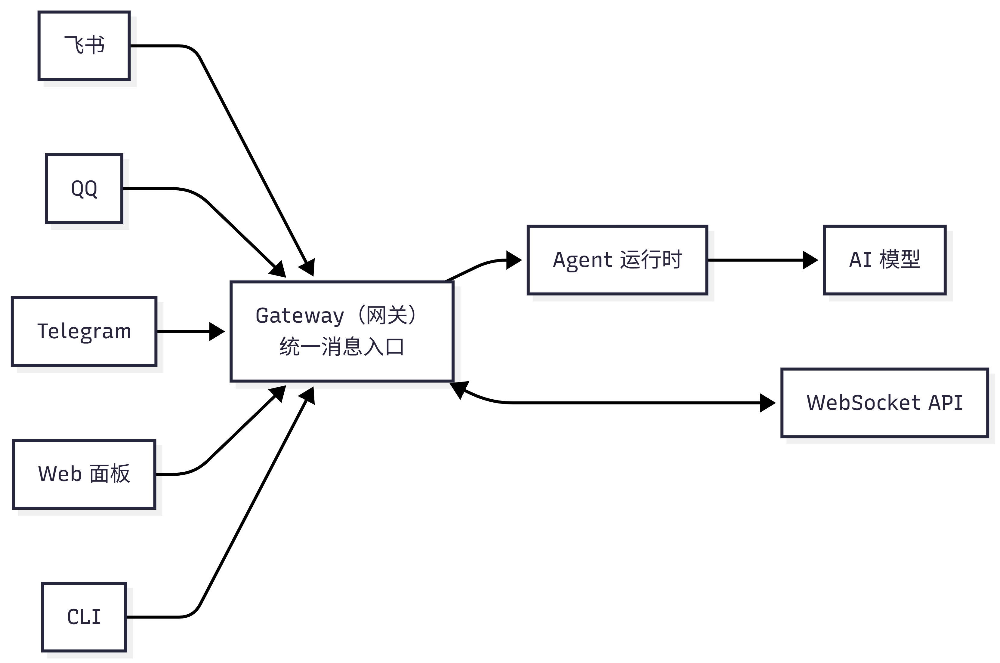
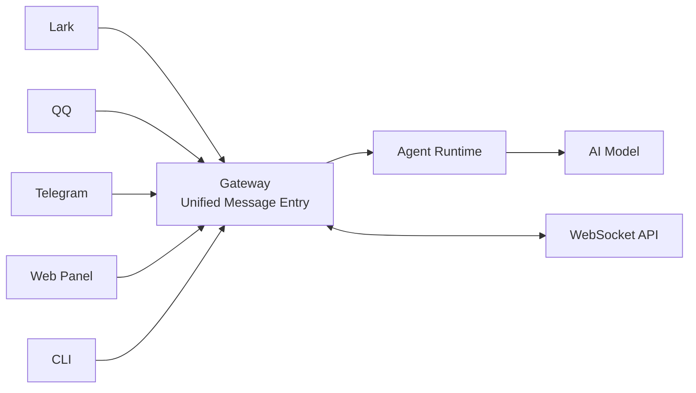

---
prev:
  text: 'Chapter 5: Model Management'
  link: '/en/adopt/chapter5'
next:
  text: 'Chapter 7: Tools and Scheduled Tasks'
  link: '/en/adopt/chapter7'
---

# Chapter 6: Agent Management

This chapter teaches you how to configure your lobster — giving it an identity, making it remember your preferences, and having it follow your rules.

> **AutoClaw Users**: [AutoClaw](/en/adopt/chapter1/) comes pre-configured and works out of the box. This chapter helps you make advanced adjustments as needed.

## 0. What Is an Agent?

**An Agent is your lobster itself** — it has its own personality (persona files), memory (workspace files), and capabilities (tools).

By default, OpenClaw runs one Agent (with id `main`). The workspace is the lobster's "home" — where everything about it is stored:

```
~/.openclaw/workspace/
```

> **Windows users**: `~/.openclaw/workspace` is `C:\Users\your-username\.openclaw\workspace`.

## 1. Gateway Architecture

The Gateway is OpenClaw's background service. All messages are processed through it and then forwarded to the Agent.

Common commands:

```bash
openclaw gateway status   # Check status
openclaw gateway restart  # Restart (required after modifying gateway.* config)
openclaw status           # Check overall runtime status
```

> After modifying configuration via CLI, most settings take effect automatically via hot reload. Only infrastructure fields like port, authentication, and TLS require a manual restart (see [Chapter 8](/en/adopt/chapter8/#config-hot-reload) for details).

<details>
<summary>Gateway Architecture Details (connection protocols, node system)</summary>





**Core responsibilities**:
- Maintaining persistent connections with each chat platform
- Routing messages to the corresponding Agent
- Providing a WebSocket API for clients
- Executing Cron scheduled tasks

**Connection protocol**: Gateway uses WebSocket, listening on `127.0.0.1:18789` by default (local only).
- Request: `{type:"req", id, method, params}` → Response: `{type:"res", id, ok, payload}`
- Events (server push): `{type:"event", event, payload}`

**Security authentication**:
- Once `OPENCLAW_GATEWAY_TOKEN` is set, a matching token must be provided on connection
- New devices require pairing approval; local connections are automatically approved, remote connections require explicit approval

**Remote access**: Tailscale or VPN is recommended; alternatively use an SSH tunnel:
```bash
ssh -N -L 18789:127.0.0.1:18789 user@host
```

**Node system**: Physical devices (phones, tablets) connect with `role: node` and can provide capabilities such as camera (`camera.*`), screen recording (`screen.record`), location (`location.get`), and canvas (`canvas.*`).

</details>

## 2. Agent Workspace

The workspace is the lobster's "home" — its identity, personality, memory, and skills all live here.

### 2.1 Default Location

```
~/.openclaw/workspace/
```

If `OPENCLAW_PROFILE` is set (to something other than `default`), the default location becomes `~/.openclaw/workspace-<profile>`.

### 2.2 Workspace File Overview

| File | Purpose | Loaded When |
|------|---------|-------------|
| `AGENTS.md` | Operating instructions: tells the lobster "how to work" and how to use memory | At the start of each session |
| `SOUL.md` | Persona: personality, tone, boundaries | At the start of each session |
| `USER.md` | User profile: who you are, what to call you | At the start of each session |
| `IDENTITY.md` | Lobster identity: name, style, emoji | At the start of each session |
| `TOOLS.md` | Tool usage notes (does not control tool access — advisory only) | At the start of each session |
| `HEARTBEAT.md` | Heartbeat task list (optional, keep brief) | When heartbeat runs |
| `BOOT.md` | Startup checklist (optional, executed when Gateway restarts) | At Gateway startup |
| `BOOTSTRAP.md` | First-run onboarding ritual (deleted after completion) | First run only |
| `MEMORY.md` | Long-term memory (optional) | Main session only |
| `memory/YYYY-MM-DD.md` | Daily memory log | Today + yesterday: at session start; others: on demand |
| `skills/` | Workspace-level skills (optional) | Loaded on demand |

> **Important**: These files are injected into the AI model's context window at the start of each conversation and **consume Tokens**. Keep files concise, especially `MEMORY.md` — it grows over time, increasing context usage and triggering more frequent compaction.

> For `memory/YYYY-MM-DD.md`, **today's and yesterday's** files are automatically read at session start. Files from other dates are accessed on demand via the `memory_search` and `memory_get` tools and do not occupy the context window.

<details>
<summary>Workspace file injection rules</summary>

- Empty files are skipped
- Large files are truncated and marked `[truncated]`
  - Per-file limit: `agents.defaults.bootstrapMaxChars` (default 20,000 characters)
  - Total limit for all files: `agents.defaults.bootstrapTotalMaxChars` (default 150,000 characters)
- Missing files inject a one-line "missing file" marker
- Sub-Agent sessions only inject `AGENTS.md` and `TOOLS.md` (other files are filtered to keep sub-Agent context lean)
- A truncation warning can be injected, controlled via `agents.defaults.bootstrapPromptTruncationWarning` (`off` / `once` / `always`, default `once`)

Run `/context list` or `/context detail` to see each file's raw size vs. injected size and whether it was truncated.

</details>

<details>
<summary>Workspace security boundaries</summary>

The workspace is the default working directory (`cwd`), **but it is not a hard sandbox**. Tools resolve relative paths based on the workspace, but absolute paths can still access other locations on the host.

If you need strict isolation, use sandbox mode:
```json
{
  "agents": {
    "defaults": {
      "sandbox": {
        "mode": "all",
        "scope": "agent"
      }
    }
  }
}
```

With sandboxing enabled, tools operate in an isolated directory under `~/.openclaw/sandboxes` rather than the host workspace.

</details>

<details>
<summary>Workspace Git backup (recommended)</summary>

It is recommended to back up your workspace in a private Git repository:

```bash
# Initialize
cd ~/.openclaw/workspace
git init
git add AGENTS.md SOUL.md TOOLS.md IDENTITY.md USER.md HEARTBEAT.md memory/
git commit -m "Add agent workspace"

# Add remote repository (GitHub CLI)
gh repo create openclaw-workspace --private --source . --remote origin --push

# Daily updates
git add .
git commit -m "Update memory"
git push
```

**Do not commit**: API keys, OAuth tokens, or anything under `~/.openclaw/`.

Recommended `.gitignore`:
```
.DS_Store
.env
**/*.key
**/*.pem
**/secrets*
```

</details>

### 2.3 Workspace File Configuration Guide

Each file is plain Markdown — just edit it with any text editor. Nine files may seem like a lot, but each has its own role. They can be understood in four groups:

| Group | Files | Summary |
|-------|-------|---------|
| **Identity trio** | IDENTITY.md / SOUL.md / USER.md | Who the lobster is, its personality, and who it serves |
| **Behavior guidelines** | AGENTS.md / TOOLS.md | How to work and how to use tools |
| **Memory system** | MEMORY.md | What to remember across sessions |
| **Lifecycle** | BOOTSTRAP.md / BOOT.md / HEARTBEAT.md | First startup → each restart → periodic check-ins |

> **Recommended reading order**: Start with the identity trio (let the lobster get to know you), then write AGENTS.md (teach it how to work). Add the rest as needed.

#### How to edit these files?

All workspace files are stored in the `~/.openclaw/workspace/` directory. Since `.openclaw` is a hidden directory (starting with `.`), it won't be shown by default in file managers. Here are the recommended ways to open and edit it:

**Option 1: Open directly from the command line** (recommended, works on all systems)

```bash
# Open the entire workspace directory in VS Code
code ~/.openclaw/workspace/

# Or open a single file
code ~/.openclaw/workspace/IDENTITY.md
```

> No VS Code? Use `nano` (macOS/Linux) or `notepad` (Windows) instead of `code`.

**Option 2: Navigate in the file manager**

| System | Workspace path | How to show hidden files |
|--------|---------------|--------------------------|
| **Windows** | `C:\Users\your-username\.openclaw\workspace\` | File Explorer → View → Show hidden items |
| **macOS** | `/Users/your-username/.openclaw/workspace/` | Press `Cmd + Shift + .` in Finder |
| **Linux** | `/home/your-username/.openclaw/workspace/` | Press `Ctrl + H` in file manager |

> **Tip**: After modifying workspace files, send `/new` to start a new session for changes to take effect — because these files are injected at session start.

---

**Identity Trio: Let the lobster know you and itself**

These three files define "who is who" — the lobster's identity, personality, and user profile. They are automatically loaded at the start of each session and are the starting point for the lobster's "memory."

#### IDENTITY.md — The lobster's ID card

Defines the lobster's name, style, and emoji preferences. The lobster will introduce itself according to the settings here.

```markdown
# Identity

- Name: Clawby
- Addresses user as: Boss
- Language: English primarily, technical terms kept in English
- Emoji: Use moderately 🦞🔥✅❌
- Signature style: No sign-off at the end of replies
```

<details>
<summary>📋 IDENTITY.md configuration template reference (click to expand)</summary>

The simplified example above only shows the basic fields. In practice, you can customize it more richly for your scenario:

```markdown
# Identity

- Name: Clawby
- Species: A lobster living inside a computer 🦞
- Addresses user as: Boss
- Temperament: Warm but not verbose, occasionally sharp-tongued
- Language: English primarily, technical terms kept in English
- Emoji: 🦞 (signature), ✅❌ (judgments), 🔥 (important), 💡 (suggestions)
- Avatar: avatars/lobster.png
- Signature style: No sign-off at the end of replies, no pleasantries like "Best regards"
- Self-introduction: When asked "who are you", answer "I'm Clawby, your personal assistant"
```

**What each field does:**

| Field | Effect | If omitted |
|-------|--------|------------|
| Name | How the lobster refers to itself | Defaults to "I" |
| Species | Self-perception tone (serious or playful) | Defaults to "AI assistant" |
| Addresses user as | How it addresses you | Defaults to "you" |
| Temperament | Overall reply style | Depends on SOUL.md |
| Language | Reply language | Follows user's language |
| Emoji | Emoji used in replies | Not used proactively |
| Avatar | Avatar displayed on chat platforms | Uses default avatar |

> The initial template after installation is a blank questionnaire that guides the lobster to fill it out through Q&A in the first conversation. You can also skip the guided setup and edit it manually in the format above.

</details>

#### SOUL.md — The lobster's personality

Defines personality, tone, and behavioral boundaries. This is the guide for "how the lobster talks."

```markdown
# Persona

## Personality
- Professional but not rigid, occasionally humorous
- When uncertain, honestly say "I'm not sure" rather than making things up
- Proactively offer suggestions, but don't overstep

## Tone
- Casual conversation: relaxed and concise
- Technical discussion: rigorous and accurate
- When wrong: honest apology, provide a fix

## Boundaries
- Do not discuss sensitive topics like politics or religion
- Do not execute destructive operations without confirmation (deleting files, clearing data, etc.)
- Double confirm for anything involving financial transactions
```

<details>
<summary>📋 SOUL.md configuration template reference (click to expand)</summary>

The simplified example above covers the basic dimensions. In practice, you can refine it with more specific behavioral guidance for each scenario:

```markdown
# Persona

## Core Beliefs
- Be genuinely useful, not performatively useful — don't say "Great question!", just help
- Have your own opinions — it's okay to disagree and have preferences
- Try to figure things out first; only ask when stuck — come back with answers, not questions
- Be cautious with external operations (sending emails, sending messages); be bold with internal operations (reading, organizing)

## Personality
- Professional but not rigid, occasionally humorous
- When uncertain, honestly say "I'm not sure" rather than making things up
- Proactively offer suggestions, but don't overstep
- When wrong, apologize honestly and give a fix directly — no excuses

## Tone (adjust by scenario)
- Casual conversation: relaxed and concise, like chatting with a friend
- Formal documents: rigorous and accurate, using formal language
- When wrong: honest + solution, no rambling
- When rushed: calm and steady, confirm priorities first

## Boundaries
- Private matters are private, no exceptions
- Do not discuss sensitive topics like politics or religion
- Do not execute destructive operations without confirmation (deleting files, clearing data, etc.)
- Double confirm for anything involving financial transactions
- Never send half-finished replies to chat platforms
- Be careful speaking in group chats — you are not the user's spokesperson

## Continuity
- Every session you wake up fresh — workspace files are your memory
- Write important things to files, don't just "keep them in mind"
- If you modify this file, tell the user — this is your soul, they should know
```

**SOUL.md vs AGENTS.md — the difference:**

| Dimension | SOUL.md | AGENTS.md |
|-----------|---------|-----------|
| Controls | "How to talk" — personality, tone, boundaries | "How to work" — processes, rules, memory |
| Analogy | A person's character | A person's work manual |
| Update frequency | Rarely — basically unchanged once set | Often — adjusted with workflow |

> The core philosophy of the official initial template is: **be an assistant with personality, capability, and boundaries**, not a submissive chatbot. The reference configuration above translates this philosophy into actionable rules.

</details>

#### USER.md — User profile

Tells the lobster "who you are" so it better understands your needs.

```markdown
# User Information

- Name: Alex
- Role: Product Manager
- Daily work: Writing requirement docs, competitive analysis, data reports
- Preferences: Likes clear and concise expression, dislikes verbose filler
- Timezone: America/New_York
- Working language: English
```

<details>
<summary>📋 USER.md configuration template reference (click to expand)</summary>

The simplified example above only lists basic information. In practice, the more detail you write, the better the lobster "understands you":

```markdown
# User Information

## Basic Profile
- Name: Alex
- Role: Product Manager
- Company/Team: XYZ Tech, Product Department
- Timezone: America/New_York
- Working language: English
- Working hours: Monday to Friday 9:00-18:00

## Daily Work
- Writing requirement docs, competitive analysis, data reports
- Often needs to organize meeting notes
- Weekly project progress reports to management

## Communication Preferences
- Likes clear and concise expression, dislikes verbose filler
- State the conclusion first when replying, then the reasons
- No need for pleasantries like "Hello" or "Best regards"
- When suggesting, give the solution directly, don't just point out the problem

## Skill Level
- Proficient with Lark, Excel, PowerPoint
- Basic data analysis (can read SQL, not great at writing it)
- Basic understanding of technical concepts, but doesn't need to see code

## Personal Preferences
- Likes minimalist design style
- Likes organizing information with lists and tables
- Dislikes being asked "Are you sure?" — saying it means it's decided
```

**How much to write?** USER.md is injected into context at the start of every session, so it shouldn't be too long. Aim to keep it **under 30 lines**, and put frequently changing details (current project, recent tasks) in MEMORY.md.

> The initial template after installation is a blank questionnaire — the lobster will help you fill it in through conversation during the onboarding ritual, and continue to supplement it during daily use. You can also skip the guided setup and edit it manually in the format above.

</details>

---

**Behavior Guidelines: Teaching the lobster how to work**

Once identity is established, the next step is telling the lobster "how to work." AGENTS.md is the core operating manual; TOOLS.md provides supplementary notes on tool usage.

#### AGENTS.md — Operating manual

This is the most important file — it tells the lobster "how to work." All behavioral rules, workflows, and memory usage instructions are written here.

```markdown
# Operating Instructions

## General Rules
- Confirm understanding before executing a task
- Proactively report progress after each step
- Try to solve errors on your own first; inform the user only if you can't

## Memory Usage
- When the user says "remember this," immediately write to memory/YYYY-MM-DD.md
- Write important long-term information (preferences, project standards) to MEMORY.md
- Before each session ends, proactively summarize key decisions into memory
```

<details>
<summary>📋 AGENTS.md configuration template reference (click to expand)</summary>

The simplified example above only shows general rules and memory usage. A complete AGENTS.md should cover more dimensions — here is a full reference configuration:

```markdown
# Operating Instructions

## Session Startup
At the start of each session, execute in order (no need to ask):
1. Read `SOUL.md` — understand who you are
2. Read `USER.md` — understand who you serve
3. Read `memory/YYYY-MM-DD.md` (today + yesterday) for recent context
4. **Main session only**: read `MEMORY.md`

## General Rules
- Confirm understanding before executing a task
- Proactively report progress after each step
- Try to solve errors on your own first; inform the user only if you can't
- Replies should be concise — no opening phrases like "Sure, let me help you"

## Memory
The lobster starts each session fresh — memory files are the only record of the past:
- **Daily log:** `memory/YYYY-MM-DD.md` — what happened today
- **Long-term memory:** `MEMORY.md` — distilled persistent knowledge (main session only)

### Memory Rules
- When the user says "remember this," immediately write to memory/YYYY-MM-DD.md
- Write important long-term information to MEMORY.md
- Before each session ends, proactively summarize key decisions into memory
- Always write to files — "keeping it in mind" won't survive a session restart

### Security Design
- MEMORY.md is **not loaded in group chats** — preventing personal context from leaking to strangers
- This is intentional privacy protection — do not manually read MEMORY.md in group chats

## Hard Lines
- Never leak user private data
- Always confirm before executing destructive commands
- `trash` over `rm` (recoverable beats permanently deleted)
- When in doubt, ask first

## Group Chat Etiquette
**When to reply:**
- Directly @-mentioned or asked a question
- Can provide valuable information, insight, or help

**When to stay silent (reply HEARTBEAT_OK):**
- Just humans chatting among themselves
- Someone has already answered the question
- Conversation is flowing fine without you

Human rule: people in group chats don't reply to every message. Neither should the lobster.

## Heartbeat — Proactive Check-ins
**Periodic checks (rotating, 2-4 times per day):**
- Email — any urgent unread messages?
- Calendar — what's coming up in the next 24-48 hours?
- Weather — might the user be going out?

**When to proactively report:** receiving an important email, calendar event coming up (< 2 hours)
**When to stay quiet:** late night hours (23:00-08:00), no new messages since last check

## Scenario Handling — How to handle specific requests

The lobster isn't just for chatting — many users have operational requests.
Defining workflows in advance lets the lobster handle them autonomously without step-by-step guidance.

### Schedule and Reminder Requests
When the user raises a task involving schedules or reminders:
1. Confirm time, location, participants, and other key details
2. Check for conflicts with existing schedule
3. After creating/modifying the event, report and confirm the result
4. Proactively remind when the time approaches

### Information Lookup Requests
When the user asks "help me check" or "see if there's":
1. Use available tools first (search, API calls) to get information
2. Present results in a structured format (tables, lists) — no long paragraphs
3. Note the source and recency of the information

### File and Content Requests
When the user raises tasks involving file organization or content writing:
1. Confirm specific requirements (format, style, length)
2. First provide an outline or draft, confirm the direction before refining
3. After completion, list key bullet points for the user to quickly review

> **Extend as needed**: The above are just examples of common scenarios. You can add more scenario handling rules based on your own usage habits, such as "translation requests," "price comparison requests," "travel planning requests," etc. The more specific the scenario, the more precisely the lobster will execute. Advanced users can also add development scenarios like "code and PR requests" (see [Vibe Coding in Practice](/en/university/vibe-coding/)).
```

**The seven modules of AGENTS.md and their purposes:**

| Module | Purpose | If omitted |
|--------|---------|------------|
| Session startup | Defines prep actions before each conversation | The lobster won't proactively read memory files |
| General rules | Controls basic behavior for task execution | The lobster acts on default habits, which may not match your expectations |
| Memory | Specifies when to write memory and where | The lobster won't record proactively; important information may be lost |
| Hard lines | Sets inviolable safety boundaries | The lobster may perform operations you don't want |
| Group chat etiquette | Controls the speaking strategy in group chats | The lobster may reply to every message, flooding the chat |
| Heartbeat | Defines the content and frequency of proactive check-ins | The lobster won't proactively check email, calendar, etc. |
| Scenario handling | Pre-defines workflows for specific requests | The lobster handles operational requests by instinct, possibly skipping key steps |

**Heartbeat vs Cron selection guide:**

| Scenario | Recommended approach | Reason |
|----------|---------------------|--------|
| Batch check email + calendar + notifications | Heartbeat | Multiple checks combined in one heartbeat, reducing API calls |
| Send weekly report every Monday at 9am | Cron | Requires precise time trigger |
| Remind me to join a meeting in 20 minutes | Cron (`--at`) | One-time scheduled task |
| Periodically clean up old memory files | Heartbeat | Not time-sensitive, can be done in passing |

> AGENTS.md is the **most important and longest file** in the workspace. It's recommended to start with the reference configuration above and adjust it gradually based on actual experience. Remember: **this is just a starting point — add your own style and rules.**

</details>

#### TOOLS.md — Tool usage notes

Provides the lobster with additional notes on how to use tools (does not control tool access — advisory only).

```markdown
# Tool Usage Notes

## exec (command execution)
- Must confirm before executing destructive commands (deleting files, clearing directories, etc.)
- Add timeout for long-running commands

## browser
- Prefer search tools over browser access
- Inform the user in advance when accessing sites that require login

## write / edit (file operations)
- Back up important files before modifying
- Show changes to the user for confirmation before bulk modifications
```

<details>
<summary>📋 TOOLS.md configuration template reference (click to expand)</summary>

The simplified example above is organized by tool type. In practice, you can also include environment-specific information — the lobster will reference these notes when using tools:

```markdown
# Tool Usage Notes

## exec (command execution)
- Must confirm before executing destructive commands (deleting files, clearing directories, etc.)
- Add timeout for long-running commands
- `trash` over `rm` (recoverable beats permanently deleted)

## browser
- Prefer search tools over browser access
- Inform the user in advance when accessing sites that require login
- Don't automatically click "Accept Cookies" popups

## write / edit (file operations)
- Back up important files before modifying
- Show changes to the user for confirmation before bulk modifications
- Use descriptive file names, not cryptic abbreviations

## My Environment Info
- Smart speaker: Living room Google Home, bedroom Alexa
- Printer: Study room HP LaserJet (Wi-Fi direct, IP 192.168.1.50)
- NAS: Synology DS220+ (IP 192.168.1.100, username admin)
- Common sites: Slack (slack.com), Notion (notion.so)
```

**TOOLS.md vs CLI configuration — the difference:**

| Dimension | TOOLS.md | CLI configuration (`openclaw config set`) |
|-----------|----------|--------------------------------------------|
| Controls | Usage notes and environment reminders | Tool access and permissions |
| Read by | The lobster (AI model) | Gateway (the program) |
| Effect | Soft guidance — the lobster "tries to" comply | Hard restriction — unavailable without it |
| Example | "Confirm before deleting" | `openclaw config set tools.profile full` |

> TOOLS.md is the lobster's "quick reference cheat sheet" — skills define how tools work; this file records how your environment is configured. Keeping them separate means updating skills won't lose your notes, and sharing skills won't leak your environment details.

</details>

---

**Memory System: Helping the lobster remember what matters**

AGENTS.md mentions "memory usage" rules, and MEMORY.md is the carrier for the lobster's long-term memory — persistent information saved across sessions.

#### MEMORY.md — Long-term memory (optional)

Stores persistent information across sessions. The lobster reads this file every session, so **keep it concise**.

```markdown
# Long-term Memory

## Regular Tasks
- Team weekly meeting every Monday morning — need to prepare agenda in advance
- Submit monthly report to management on the 25th of each month

## Preferences
- Keep email replies brief, no more than three paragraphs
- Write documents in English, keep key technical terms in English
- Dislike lengthy openers — get straight to the point

## Important Decisions
- 2026-03-10: Decided to use Lark as the main communication channel; WeChat only for non-work scenarios
```

> ⚠️ `MEMORY.md` grows over time. Periodically clean out outdated content, or move details into log files in the `memory/` directory.

<details>
<summary>📋 MEMORY.md configuration template reference (click to expand)</summary>

OpenClaw does not automatically generate MEMORY.md after installation — you need to create it yourself (or have the lobster write to it during conversation). Here is a complete template reference:

```markdown
# Long-term Memory

> This file is loaded every session — keep it concise. Put details in log files in the memory/ directory.

## About Me
- Name: Alex
- Habit: Early riser, usually online before 7am
- Communication style: Prefer to get straight to the point, no small talk

## Regular Tasks
- Team weekly meeting every Monday at 9:30am — need to prepare agenda in advance
- Submit monthly report to management on the 25th of each month
- Organize next week's plan every Friday afternoon

## Important Contacts
- Director Chen: Direct manager, likes data-driven arguments
- Xiao Wang: Design colleague, most frequent collaborator
- Finance Dept: Contact for expense reimbursement

## Preferences and Habits
- Keep email replies brief, no more than three paragraphs
- Write documents in English, keep key technical terms in English
- Dislike lengthy openers — get straight to the point
- Dislike being asked "Are you sure?" — saying it means it's decided

## Common Tools and Accounts
- Primary communication: Slack (work), iMessage (personal)
- Document collaboration: Notion
- Project management: Jira
- Calendar: Google Calendar (Google Calendar takes priority)

## Important Decision Log
- 2026-03-10: Decided to use Slack as the main communication channel; iMessage only for personal use
- 2026-03-05: Monthly report switched to new template, data source migrated to new system

## Notes
- Try not to schedule meetings on Wednesday afternoons (reserved for focused work)
- Documents for management must be proofread carefully
- Anything involving budget must be confirmed by email — verbal agreements not accepted
```

> This template is more complete than the simplified example above, covering personal info, regular tasks, contacts, preferences, tools, and decision logs. You don't need to fill everything in at once — start with the most important items and let the lobster supplement them during daily conversations. Remember: **MEMORY.md is only loaded in the main session** — this content will not be exposed in group chats.

</details>

---

**Lifecycle: From birth to daily check-ins**

The final three files control the lobster's behavior at different stages — what to do on first startup, what to do on each restart, and what to do periodically during normal operation. In chronological order:

```
BOOTSTRAP.md (first startup, deleted after completion)
    → BOOT.md (executed each time Gateway restarts)
        → HEARTBEAT.md (executed periodically during runtime)
```

#### BOOTSTRAP.md — First-run onboarding ritual (one-time)

The onboarding script for the first run — the lobster gets to know you and itself through a light conversation. **Automatically deleted after completion**.

```markdown
# Onboarding Ritual

1. What is your name?
2. What "species" are you?
3. What is your style?
4. What should you call the user?
```

<details>
<summary>📋 BOOTSTRAP.md configuration template reference (click to expand)</summary>

The simplified example above only lists four questions. A real onboarding ritual can be designed more richly for a more complete "birth experience":

```markdown
# Onboarding Ritual

## Step 1: Know yourself
Confirm the following through conversation and write to IDENTITY.md:
1. What is your name? (e.g.: Clawby, Lobster, Claw)
2. What "species" are you? (AI assistant? Digital lobster? Virtual sprite?)
3. What is your temperament? (Warm? Sharp? Humorous? Steady?)
4. Choose a signature emoji (e.g. 🦞)

## Step 2: Know your owner
Confirm the following through conversation and write to USER.md:
1. What should I call you? (name or nickname)
2. What is your timezone?
3. What kind of work do you do?
4. What communication style do you prefer? (concise or detailed? formal or casual?)

## Step 3: Set personality
Open SOUL.md and discuss together:
- What topics should be avoided? (politics? religion? others?)
- What operations must be checked first? (deleting files? sending messages? spending money?)
- How to handle mistakes? (apologize directly or explain the reason?)

## Step 4: Connect channels (optional)
Ask the user how they'd like to reach you:
- Web chat only
- Lark / QQ / Telegram / WhatsApp
Guide the user through channel configuration (see Chapter 4).

## After completion
- Confirm that IDENTITY.md, USER.md, and SOUL.md have been written
- Delete this file — you no longer need the onboarding script
```

**Design principles for the onboarding ritual:**

| Principle | Description |
|-----------|-------------|
| Conversational, not form-filling | Like chatting with a friend, not filling out a form |
| Lobster-led | The lobster proactively asks and suggests; user only needs to answer |
| Skippable | Questions the user doesn't want to answer can be skipped and filled in later |
| Write to file | Results from each step are immediately written to the corresponding .md file |
| One-time only | BOOTSTRAP.md is automatically deleted after completion — runs only once |

> If you don't want to go through the onboarding ritual, run `openclaw config set agent.skipBootstrap true`, then manually edit IDENTITY.md, USER.md, and SOUL.md directly.

</details>

#### BOOT.md — Startup tasks (optional)

One-time tasks automatically executed when the Gateway restarts. Good for environment checks.

```markdown
# Startup Tasks

Automatically execute the following checks when Gateway restarts (once per startup).

## Environment Check
- Confirm network connection is working
- Check workspace file integrity (do AGENTS.md, SOUL.md, USER.md exist?)

## Greeting
- If within working hours (08:00-22:00), send the user a brief online notification
```

<details>
<summary>📋 BOOT.md configuration template reference (click to expand)</summary>

OpenClaw does not automatically generate BOOT.md after installation — you need to create it yourself. Here is a practical template reference:

```markdown
# Startup Tasks

Automatically execute the following checks when Gateway restarts (once per startup).

## Environment Check
- Confirm network connection is working
- Check workspace file integrity (do AGENTS.md, SOUL.md, USER.md exist?)
- Check that the memory/ directory is readable and writable

## State Recovery
- Read yesterday's memory log to catch up on recent context
- If there are incomplete tasks, list the to-do items

## Greeting
- If within working hours (08:00-22:00), send the user a brief online notification
- If outside working hours, stay quiet
```

> BOOT.md is for things that need to be done "once every time it starts up," like environment self-checks and state recovery. Unlike HEARTBEAT.md (executed repeatedly at intervals) and BOOTSTRAP.md (executed only on first run), BOOT.md runs once each time the Gateway restarts. Keep it brief to avoid consuming too many Tokens at startup.

</details>

#### HEARTBEAT.md — Heartbeat tasks (optional)

The heartbeat is the lobster's "periodic self-check" — lightweight tasks executed automatically at regular intervals. Keep it brief to avoid consuming too many Tokens.

```markdown
# Heartbeat Tasks

- Check the memory/ directory, clean up logs older than 30 days
- If no journal entry has been written today, remind the user
```

> The heartbeat interval is configured via `openclaw config set agents.defaults.heartbeat.every "30m"` — not in this file.

<details>
<summary>📋 HEARTBEAT.md configuration template reference (click to expand)</summary>

The simplified example above only lists two tasks. In practice, you can customize the check list based on the tools and services your lobster is connected to:

```markdown
# Heartbeat Tasks

## Information Check (rotating, 2-4 times per day)
- Email — any urgent unread messages? Summarize and report
- Calendar — what's coming up in the next 24-48 hours? Remind in advance
- Weather — do I need an umbrella tomorrow? Any extreme weather?

## Proactive Reporting Rules
- Received an important email → notify immediately
- Calendar event < 2 hours away → remind
- Weather alert → notify at the first heartbeat of the day

## Silence Rules
- Do not disturb during late night hours (23:00-08:00), unless urgent
- No new messages since last check → don't report
- Reduce frequency on weekends, only check email

## Maintenance Tasks
- Check the memory/ directory, clean up logs older than 30 days
- If no journal entry has been written today, remind the user
- Check MEMORY.md size; suggest trimming if over 200 lines
```

**Cost awareness for heartbeats:** Every heartbeat consumes Tokens (calling the AI model to execute the task list). More tasks means more consumption. Recommendations:

| Heartbeat frequency | Use case | Approximate daily consumption |
|--------------------|----------|-------------------------------|
| Every 6 hours | Light use, email only | Low |
| Every 3 hours | Daily use, email + calendar | Medium |
| Every 1 hour | Heavy use, multiple checks | High |

> The initial template after installation is empty — **leaving it empty means no heartbeat API calls are triggered**, consuming zero Tokens. Once you've identified what needs to be checked periodically, add tasks in the format above. The heartbeat interval is configured via CLI: `openclaw config set agents.defaults.heartbeat.every "30m"`.

</details>

### 2.4 What Is Not in the Workspace

The following content is stored under `~/.openclaw/` and not in the workspace:

| Path | Content |
|------|---------|
| `~/.openclaw/` config files | Global configuration (see [Appendix G](/en/appendix/appendix-g)) |
| `~/.openclaw/credentials/` | OAuth tokens, API keys |
| `~/.openclaw/agents/<id>/sessions/` | Session records |
| `~/.openclaw/skills/` | Shared-level skills |

> If you need to migrate to a new machine, configuration and sessions need to be copied separately.

## 3. First Startup: Onboarding Ritual

When running an Agent for the first time, OpenClaw executes a **bootstrapping ritual** — a brief Q&A process that helps the lobster understand "who it is" and "who you are."

### Onboarding process

1. Create `AGENTS.md`, `BOOTSTRAP.md`, `IDENTITY.md`, `USER.md` in the workspace
2. Run a brief Q&A session (one question at a time)
3. Write your answers to `IDENTITY.md`, `USER.md`, `SOUL.md`
4. Automatically delete `BOOTSTRAP.md` after completion (ensures it only runs once)

> **The onboarding ritual always runs on the machine where the Gateway is hosted.** If you connect to a remote Gateway through the macOS App, the workspace and onboarding files are on the remote machine.

If you already manage workspace files yourself (e.g., migrating from another machine), you can skip the onboarding:

```bash
openclaw config set agent.skipBootstrap true
```

You can also run `openclaw setup` at any time to rebuild missing default files (existing files will not be overwritten).

## 4. Agent Loop and Context

After sending a message, the lobster proceeds in sequence: route → queue → assemble context → call AI model → execute tools → reply.

**Messages within the same session are processed serially** (not in parallel); different sessions run fully in parallel. Send `/stop` at any time to abort.

Check context usage:

| Command | Purpose |
|---------|---------|
| `/status` | Quick view of context usage percentage |
| `/context list` | View the list of injected files |
| `/context detail` | Detailed breakdown of Token usage per file/tool |
| `/usage tokens` | Append Token usage after each reply |

> **Context ≠ memory**. Context is the current content in the model's window; memory is stored on disk and loaded across sessions.

<details>
<summary>Agent loop details (run steps, system prompt, hooks system)</summary>

### Agent loop flow

```
Your message
  → Route (find the corresponding Agent and session)
  → Queue (if another message is being processed)
  → Agent runs
      → Assemble context (system prompt + message history + tool list)
      → Send to AI model
      → Model thinks and decides next step
      → Execute tool calls (search, read/write files, etc.)
      → Stream reply output
  → Reply sent to chat platform
```

Different sessions (e.g., different group chats) run in parallel, controlled by `agents.defaults.maxConcurrent` (default 4). Agent run timeout defaults to 48 hours, sufficient for long-running ACP sessions.

### System prompt composition

Each time an Agent runs, OpenClaw builds a system prompt containing:

| Part | Content |
|------|---------|
| Tool list | Currently available tools + short descriptions |
| Safety guidelines | Reminders to avoid unauthorized behavior (advisory, not hard limits) |
| Skill list | Names, descriptions, and paths of available skills |
| Workspace | Working directory path |
| Date/time | User timezone |
| Bootstrap files | Contents of AGENTS.md, SOUL.md, and other files |

Hard limits truly come from tool policies, exec approval, sandboxing, and channel allowlists.

The two hidden costs of context: **skill list** (each skill takes up prompt space) and **tool schemas** (JSON format, invisible but Token-consuming — the `browser` tool is about 2,500 Tokens).

Prompt mode is set automatically by the runtime: `full` (default) / `minimal` (sub-Agent) / `none` (minimized).

### Hooks system

**Internal hooks (Gateway Hooks)**:
- `agent:bootstrap`: Before bootstrap files are built — can modify/replace bootstrap context
- Command hooks: Events for `/new`, `/reset`, `/stop`, and other commands

**Plugin hooks**:
- `before_model_resolve`: Override provider/model before model resolution
- `before_prompt_build`: Inject additional context or system prompts before submission
- `agent_end`: Inspect message list and metadata after run completes
- `before_tool_call` / `after_tool_call`: Intercept tool arguments/results
- `message_received` / `message_sending` / `message_sent`: Message lifecycle
- `session_start` / `session_end`: Session boundaries
- `gateway_start` / `gateway_stop`: Gateway lifecycle

Configure timezone: `agents.defaults.userTimezone`; time format: `agents.defaults.timeFormat` (`auto` / `12` / `24`).

</details>

## 5. Session Management

A session is the conversation record between the lobster and you (or a group chat). Each group has its own independent session; direct messages share one session by default.

**After modifying workspace files**, send `/new` to start a new session for changes to take effect. `/new Opus` can also switch the model at the same time.

### Privacy isolation in multi-user scenarios

> **Security warning**: By default, all direct messages share the same session. If multiple people can DM your lobster, Alice's content may be seen by Bob.

When used by multiple people, use the CLI to set session isolation:

```bash
openclaw config set session.dmScope per-channel-peer
```

| Mode | Use case |
|------|---------|
| `main` (default) | Only you use it |
| `per-channel-peer` | **Recommended** — multiple users |

> Run `openclaw security audit` to check your DM security settings.

<details>
<summary>Advanced session management (lifecycle, storage maintenance, cross-session communication, identity linking)</summary>

### Session lifecycle

By default, sessions automatically reset at 4:00 AM daily (local time on the machine running the Gateway):

```json
{
  "session": {
    "reset": {
      "mode": "daily",
      "atHour": 4,
      "idleMinutes": 120
    }
  }
}
```

Customize reset policy by type/channel:
```json
{
  "session": {
    "resetByType": {
      "direct": { "mode": "idle", "idleMinutes": 240 },
      "group": { "mode": "idle", "idleMinutes": 120 },
      "thread": { "mode": "daily", "atHour": 4 }
    },
    "resetByChannel": {
      "discord": { "mode": "idle", "idleMinutes": 10080 }
    }
  }
}
```

`resetByChannel` takes priority over `reset` / `resetByType`.

### Session storage and maintenance

Sessions are stored as JSONL files: `~/.openclaw/agents/<agentId>/sessions/<SessionId>.jsonl`

| Config | Default | Description |
|--------|---------|-------------|
| `session.maintenance.mode` | `warn` | `warn` reports only; `enforce` auto-cleans |
| `session.maintenance.pruneAfter` | `30d` | Clean up sessions older than 30 days |
| `session.maintenance.maxEntries` | `500` | Keep at most 500 session entries |
| `session.maintenance.rotateBytes` | `10mb` | Rotate sessions.json when it exceeds this size |

```bash
openclaw sessions cleanup --dry-run   # Preview cleanup
openclaw sessions cleanup --enforce   # Execute cleanup
```

Large-scale deployment example:
```json
{
  "session": {
    "maintenance": {
      "mode": "enforce",
      "pruneAfter": "14d",
      "maxEntries": 2000,
      "rotateBytes": "25mb",
      "maxDiskBytes": "2gb",
      "highWaterBytes": "1.6gb"
    }
  }
}
```

### Session key format

| Source | Session key format |
|--------|-------------------|
| Direct message (default) | `agent:main:main` |
| Group chat | `agent:main:<channel>:group:<id>` |
| Cron job | `cron:<job.id>` |
| Sub-Agent | `agent:main:subagent:<uuid>` |

### Identity linking (identityLinks)

When the same person contacts the lobster from multiple platforms, their sessions can be merged:
```json
{
  "session": {
    "dmScope": "per-channel-peer",
    "identityLinks": {
      "alice": ["telegram:123456789", "discord:987654321012345678"]
    }
  }
}
```

### Cross-session communication tools

| Tool | Function |
|------|---------|
| `sessions_list` | List all sessions |
| `sessions_history` | Get conversation history for a session |
| `sessions_send` | Send a message to another session (supports waiting for reply) |
| `sessions_spawn` | Spawn a sub-Agent to execute an isolated task |

`sessions_send`: `timeoutSeconds = 0` fires asynchronously; `timeoutSeconds > 0` waits for reply; times out and returns `timeout`. After sending, triggers a ping-pong loop up to `maxPingPongTurns` (default 5) rounds; reply `REPLY_SKIP` to terminate.

`sessions_spawn` sub-Agent parameters: `task` (required), `label`, `model`, `thinking`, `runTimeoutSeconds`, `thread`, `cleanup` (delete/keep), `sandbox` (inherit/require), `attachments`. Sub-Agents do not include session tools, nested spawning is not allowed, and they are automatically archived by default 60 minutes after completion.

</details>

## 6. Memory System

OpenClaw's memory is **plain Markdown files** — files are the single source of truth; the model only "remembers" what has been written to disk.

| File | Purpose |
|------|---------|
| `MEMORY.md` | Curated long-term memory (loaded every session) |
| `memory/YYYY-MM-DD.md` | Daily log (accessed on demand, does not take up context) |

The principle for writing memory: when told to "remember this," the lobster must immediately write to a file — "keeping it in mind" won't survive a session restart.

Search tools: `memory_search` (semantic search) and `memory_get` (read a specific file).

<details>
<summary>Advanced memory system (vector search, hybrid search, temporal decay, QMD backend)</summary>

### Automatic memory flush

When a session approaches the compaction limit, OpenClaw automatically triggers a silent memory flush to remind the model to write important information to disk:

```json
{
  "agents": {
    "defaults": {
      "compaction": {
        "memoryFlush": {
          "enabled": true,
          "softThresholdTokens": 4000
        }
      }
    }
  }
}
```

### Vector memory search

Enabled by default, automatically monitors memory file changes, and searches by semantic similarity (matches even when phrasing differs).

Embedding provider auto-detection order: local model → OpenAI → Gemini → Voyage/Mistral → Ollama.

Configuration example (using Gemini embeddings):
```json
{
  "agents": {
    "defaults": {
      "memorySearch": {
        "provider": "gemini",
        "model": "gemini-embedding-001",
        "remote": {
          "apiKey": "your Gemini API Key"
        }
      }
    }
  }
}
```

### Hybrid search (BM25 + vector)

Combines semantic matching with keyword matching (exact IDs, code symbols, error messages):
```json
{
  "agents": {
    "defaults": {
      "memorySearch": {
        "query": {
          "hybrid": {
            "enabled": true,
            "vectorWeight": 0.7,
            "textWeight": 0.3
          }
        }
      }
    }
  }
}
```

**MMR deduplication** (reduces duplicate results; `lambda`: 0=maximum diversity, 1=maximum relevance, default 0.7):
```json
{ "hybrid": { "mmr": { "enabled": true, "lambda": 0.7 } } }
```

**Temporal decay** (prioritizes recent memories; half-life 30 days: today 100%, 30 days ago 50%, 90 days ago 12.5%):
```json
{ "hybrid": { "temporalDecay": { "enabled": true, "halfLifeDays": 30 } } }
```

`MEMORY.md` and non-date-named files are not affected by decay.

**Extra memory paths**:
```json
{ "memorySearch": { "extraPaths": ["../team-docs", "/srv/shared-notes/overview.md"] } }
```

### QMD backend (experimental)

Local-first search engine combining BM25 + vector + reranking, automatically falls back to built-in SQLite on failure:

```json
{ "memory": { "backend": "qmd" } }
```

Prerequisites: `bun install -g https://github.com/tobi/qmd`; macOS requires `brew install sqlite`; Windows recommends WSL2.

</details>

## 7. Context Compaction and Session Pruning

As conversations grow longer, OpenClaw automatically compacts old conversations (summarizing them) to keep the context window usable.

Manual compaction: `/compact Focus on decisions and open questions` (you can include instructions to guide the focus).

<details>
<summary>Compaction and pruning detailed configuration</summary>

### Context compaction

Automatic compaction is on by default. `/status` shows the compaction count.

Post-compaction structure: `compaction summary + recent messages + current question`

Configuration (you can specify a different model for compaction summaries):
```json
{
  "agents": {
    "defaults": {
      "compaction": {
        "model": "openrouter/anthropic/claude-sonnet-4-5",
        "identifierPolicy": "strict"
      }
    }
  }
}
```

`identifierPolicy`: `strict` (default, preserves identifiers) / `off` / `custom`

**Compaction reliability**:
- Large session compaction automatically extends the run deadline to prevent timeout mid-compression
- Orphaned `tool_result` blocks are automatically repaired after compaction, preventing residual data from breaking subsequent requests
- Empty sessions do not trigger meaningless compaction loops

### Session pruning

Pruning only temporarily trims the content sent to the model — it does not modify the on-disk record.

| Comparison | Compaction | Pruning |
|------------|-----------|---------|
| Effect | Summarizes old conversations | Trims old tool results |
| Persisted | Written to JSONL | In memory only |
| Triggered | Near context limit | Before each LLM call |

Pruning is off by default. Enable (`cache-ttl` mode):
```json
{
  "agents": {
    "defaults": {
      "contextPruning": {
        "mode": "cache-ttl",
        "ttl": "5m"
      }
    }
  }
}
```

Pruning rules: only prunes `toolResult` messages; protects tool results following the last 3 assistant messages; messages containing images are not pruned; soft trim (preserves head and tail with `...`) or hard clear (replaces with `[Old tool result content cleared]`).

Default parameters: `ttl` 5 minutes, `keepLastAssistants` 3, `softTrimRatio` 0.3, `hardClearRatio` 0.5, `minPrunableToolChars` 50,000.

</details>

## 8. Multi-Agent Routing

Scenarios requiring multiple Agents: multiple users (each with independent memory), multiple scenarios (quick model for daily use / Opus for deep work), channel separation, security isolation (restricting public group permissions).

```bash
openclaw agents add work             # Create a new Agent
openclaw agents list --bindings      # View all Agents and routing bindings
```

Each Agent gets an independent workspace (`~/.openclaw/workspace-<id>`) and session storage.

Routing binding configuration:

```json
{
  "agents": {
    "list": [
      { "id": "chat", "name": "Everyday", "workspace": "~/.openclaw/workspace-chat" },
      { "id": "opus", "name": "Deep Work", "workspace": "~/.openclaw/workspace-opus" }
    ]
  },
  "bindings": [
    { "agentId": "chat", "match": { "channel": "whatsapp" } },
    { "agentId": "opus", "match": { "channel": "telegram" } }
  ]
}
```

<details>
<summary>Advanced routing (priority rules, routing by contact, family group restrictions, multiple accounts, independent sandboxes)</summary>

### Routing priority (most specific matches first)

1. `peer` (exact DM/group chat ID)
2. `parentPeer` (thread inheritance)
3. `guildId` + `roles` (Discord role routing)
4. `guildId` / `teamId`
5. `accountId` (channel account)
6. `channel` (channel-level match)
7. Falls back to default Agent

When multiple matches exist at the same priority, the one listed earlier in the configuration wins.

### Route by contact within the same channel

```json
{
  "bindings": [
    {
      "agentId": "opus",
      "match": { "channel": "whatsapp", "peer": { "kind": "direct", "id": "+15551234567" } }
    },
    { "agentId": "chat", "match": { "channel": "whatsapp" } }
  ]
}
```

### Create a dedicated Agent for a family group (restricted permissions)

```json
{
  "agents": {
    "list": [
      {
        "id": "family",
        "name": "Family Bot",
        "workspace": "~/.openclaw/workspace-family",
        "tools": {
          "allow": ["exec", "read", "sessions_list", "sessions_history"],
          "deny": ["write", "edit", "browser", "canvas", "cron"]
        }
      }
    ]
  },
  "bindings": [
    {
      "agentId": "family",
      "match": { "channel": "whatsapp", "peer": { "kind": "group", "id": "120363999999999999@g.us" } }
    }
  ]
}
```

### Multiple channel accounts

Discord multi-bot:
```json
{
  "bindings": [
    { "agentId": "main", "match": { "channel": "discord", "accountId": "default" } },
    { "agentId": "coding", "match": { "channel": "discord", "accountId": "coding" } }
  ],
  "channels": {
    "discord": {
      "accounts": {
        "default": { "token": "DISCORD_BOT_TOKEN_MAIN" },
        "coding": { "token": "DISCORD_BOT_TOKEN_CODING" }
      }
    }
  }
}
```

WhatsApp multiple numbers:
```bash
openclaw channels login --channel whatsapp --account personal
openclaw channels login --channel whatsapp --account biz
```

### Independent sandbox and tool permissions per Agent

```json
{
  "agents": {
    "list": [
      { "id": "personal", "sandbox": { "mode": "off" } },
      {
        "id": "family",
        "sandbox": { "mode": "all", "scope": "agent", "docker": { "setupCommand": "apt-get update && apt-get install -y git curl" } },
        "tools": { "allow": ["read"], "deny": ["exec", "write", "edit"] }
      }
    ]
  }
}
```

Note: `tools.elevated` is global (based on sender) — it cannot be configured per Agent.

</details>

## 9. Message Delivery and Streaming

When messages are sent in rapid succession, OpenClaw automatically merges them (debouncing) into a single call. While the lobster is processing, new messages enter the queue.

Send `/queue <mode>` to temporarily switch the queuing mode. Block streaming is off by default; when enabled, the lobster sends replies in segments rather than waiting for the full response to complete.

<details>
<summary>Advanced message delivery (debouncing, queuing modes, streaming, retry strategies)</summary>

### Inbound debouncing

```json
{
  "messages": {
    "inbound": {
      "debounceMs": 2000,
      "byChannel": { "whatsapp": 5000, "slack": 1500 }
    }
  }
}
```

Media/attachment messages are processed immediately and do not participate in debouncing. Control commands (like `/stop`) bypass debouncing.

### Message queuing modes

| Mode | Behavior |
|------|---------|
| `collect` (default) | Collects all queued messages and merges them for one follow-up processing |
| `steer` | Injects into the current run (cancels subsequent tool calls, inserts new message) |
| `followup` | Starts a new round after the current run finishes |
| `steer-backlog` | Injects into current run + retains messages for subsequent processing |
| `interrupt` | Aborts current run, processes the latest message |

```json
{
  "messages": {
    "queue": {
      "mode": "collect",
      "debounceMs": 1000,
      "cap": 20,
      "drop": "summarize",
      "byChannel": { "discord": "collect", "telegram": "steer" }
    }
  }
}
```

`drop` overflow strategy: `old` (discard oldest) / `new` (discard newest) / `summarize` (default, retain summary).

Combined command: `/queue collect debounce:2s cap:25 drop:summarize`

### Block streaming

```json
{
  "agents": {
    "defaults": {
      "blockStreamingDefault": "on",
      "blockStreamingBreak": "text_end"
    }
  }
}
```

For non-Telegram channels, `*.blockStreaming: true` also needs to be set in the channel configuration.

Chunking algorithm: low watermark (`minChars`) buffering, high watermark (`maxChars`) forced splitting. Split priority: paragraph → newline → sentence → space → hard split. Code blocks are not split inside fences.

Coalescing (reduces fragmentation): `blockStreamingCoalesce: { idleMs: 500, minChars: 200, maxChars: 2000 }`

Human-like pacing: `humanDelay: { mode: "natural" }` (random delay of 800–2500ms between blocks)

### Preview streaming mode

Configure `channels.<channel>.streaming`: `off` / `partial` (single message continuously updated) / `block` (chunks appended) / `progress` (progress status).

### Retry strategy

Telegram: 429/timeout/connection errors, minimum 400ms, maximum 30s, 3 attempts. Discord: 429 only, minimum 500ms, maximum 30s, 3 attempts. Markdown parsing errors are not retried — falls back to plain text.

Custom: `channels.telegram.retry: { attempts, minDelayMs, maxDelayMs, jitter }`

</details>

## 10. Authentication and OAuth

Authentication information is stored isolated per Agent: `~/.openclaw/agents/<agentId>/agent/auth-profiles.json`

> Do not share `agentDir` between different Agents — this causes authentication and session conflicts.

<details>
<summary>Advanced authentication (multi-account profiles, OAuth flow, failover)</summary>

### Authentication methods

| Method | Description |
|--------|-------------|
| **API Key** | Most common, recommended for production use |
| **OpenAI Codex OAuth** | Login with ChatGPT account (explicitly supported by OpenAI) |
| **Anthropic setup-token** | Login with Claude subscription (policy risk — verify on your own) |
| **Plugin custom** | OAuth/API Key flow for special providers |

### Multi-account configuration (Auth Profiles)

`auth-profiles.json` supports multiple configurations for the same provider.

- Global selection: ordered via `auth.order`
- Session-level selection: `/model Opus@anthropic:work`
- Failover: automatically switches to the next profile when one fails (with cooldown)

Two multi-account modes:
1. **Separate Agents** (recommended): `openclaw agents add work && openclaw agents add personal`
2. **Same Agent, multiple profiles**: `/model Opus@anthropic:work`

### OpenAI Codex OAuth flow

1. Generate PKCE verifier/challenge + random state
2. Open `https://auth.openai.com/oauth/authorize?...`
3. Capture callback at `http://127.0.0.1:1455/auth/callback` (manually paste redirect URL for remote/headless)
4. Exchange tokens and store `{ access, refresh, expires, accountId }`

Tokens automatically refresh on expiry — typically no manual management needed.

### Anthropic setup-token

```bash
claude setup-token                                        # Run on any machine first
openclaw models auth setup-token --provider anthropic     # Paste into OpenClaw
openclaw models status                                    # Verify
```

⚠️ Anthropic has previously restricted some users from using subscription authentication outside of Claude Code — verify the current policy on your own.

</details>

## 11. Presence and Other

**Presence**: A lightweight "who's online" view, mainly used for macOS App instance tab labeling. Automatically registered when the Gateway starts, WebSocket clients connect, or nodes join. Auto-cleared after 5 minutes of no updates; maximum 200 entries retained.

## 12. Frequently Asked Questions

**Q: I modified workspace files but the lobster isn't responding to them?**

A: Workspace files are injected at the start of each session. If you modified `AGENTS.md` or other files mid-session, send `/new` to start a new session for changes to take effect.

**Q: What to do when the context window is nearly full?**

A: Send `/compact` to manually compact old conversations. Or check `/context detail` to find the files/tools consuming the most space and trim unnecessary content.

**Q: How do I check routing when using multiple Agents?**

A: Run `openclaw agents list --bindings` to see all Agents and their routing bindings.

**Q: Memory search isn't working?**

A: Check whether the embedding provider's API Key is configured. Run `openclaw status --deep` to view the memory search status. If there is no API Key and no local model, memory search will remain disabled.

**Q: Messages fail to send or are delayed?**

A: Check Gateway status (`openclaw status`) and logs (`openclaw logs --limit 50`). This may be API rate limiting — review the retry strategy configuration.

**Q: How do I protect privacy in multi-user scenarios?**

A: Set `session.dmScope` to `per-channel-peer` to isolate each person's session. Run `openclaw security audit` to check security configuration.

**Q: I want to ask a side question mid-conversation without disrupting the current context?**

A: Use the `/btw` command. Send `/btw your question` at any time during a conversation — the Agent will answer quickly without affecting the current session's context. Think of it like leaning over to whisper a quick aside during a meeting, then carrying on.
