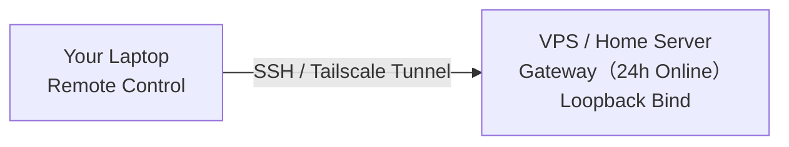

---
prev:
  text: 'Chapter 8: Gateway Operations'
  link: '/en/adopt/chapter8'
next:
  text: 'Chapter 10: Security and Threat Modeling'
  link: '/en/adopt/chapter10'
---

# Chapter 9: Remote Access and Networking

Want to control your lobster from anywhere? This chapter covers remote access.

> **Prerequisite**: You have completed [Chapter 8: Gateway Operations](/en/adopt/chapter8/) and Gateway is running normally.

Gateway runs locally by default (`127.0.0.1:18789`). To access it from other devices, you need a "tunnel". **Two-minute version:** Tailscale is recommended — install it and one command gets you set up.

## 1. Which Option Should You Choose?

| Option | Best For | Difficulty |
|--------|----------|------------|
| **Tailscale Networking** | Multi-device cross-network, best experience | ⭐⭐ |
| **SSH Tunnel** | Works anywhere you have SSH, most universal | ⭐ |
| **LAN Direct Connect** | Within the same local network | ⭐ |

Not sure which to pick? **Start with Tailscale** — automatic HTTPS, no manual port forwarding, multi-device sharing.

## 2. SSH Tunnel (Most Universal Method)

At a coffee shop and want to connect back to your home Gateway? One command sets up a tunnel:

```bash
ssh -N -L 18789:127.0.0.1:18789 user@remote-host-ip
```

Open another terminal to verify:

```bash
openclaw status --deep
```

Seeing the Gateway status means it's connected.

<details>
<summary>Tired of typing the long command every time? Configure SSH Config to simplify it</summary>

Edit `~/.ssh/config` and add:

```
Host my-gateway
    HostName 172.27.187.184        # Replace with your remote host IP
    User jefferson                  # Replace with your username
    LocalForward 18789 127.0.0.1:18789
    IdentityFile ~/.ssh/id_rsa
```

Afterwards, just run:

```bash
ssh -N my-gateway
```

**Passwordless login**: Copy your public key to the remote host so you never need to type a password again:

```bash
ssh-copy-id -i ~/.ssh/id_rsa user@remote-host-ip
```

</details>

**Token Authentication**: If Gateway has authentication enabled, you also need to provide a token when connecting:

```bash
# macOS
launchctl setenv OPENCLAW_GATEWAY_TOKEN "your-token"

# Linux
export OPENCLAW_GATEWAY_TOKEN="your-token"
```

Or write it to a config file to persist it:

```json5
{
  gateway: {
    mode: "remote",
    remote: {
      url: "ws://127.0.0.1:18789",
      token: "your-token",
    },
  },
}
```

> SSH tunneling transparently forwards traffic, so the URL remains `ws://127.0.0.1:18789`.

<details>
<summary>Auto-start tunnel on boot (macOS LaunchAgent)</summary>

Save as `~/Library/LaunchAgents/ai.openclaw.ssh-tunnel.plist`:

```xml
<?xml version="1.0" encoding="UTF-8"?>
<!DOCTYPE plist PUBLIC "-//Apple//DTD PLIST 1.0//EN"
  "http://www.apple.com/DTDs/PropertyList-1.0.dtd">
<plist version="1.0">
<dict>
    <key>Label</key>
    <string>ai.openclaw.ssh-tunnel</string>
    <key>ProgramArguments</key>
    <array>
        <string>/usr/bin/ssh</string>
        <string>-N</string>
        <string>my-gateway</string>
    </array>
    <key>KeepAlive</key>
    <true/>
    <key>RunAtLoad</key>
    <true/>
</dict>
</plist>
```

Load it:

```bash
launchctl bootstrap gui/$UID ~/Library/LaunchAgents/ai.openclaw.ssh-tunnel.plist
```

Common management commands:

```bash
ps aux | grep "ssh -N my-gateway" | grep -v grep  # Check if running
lsof -i :18789                                      # Check port
launchctl kickstart -k gui/$UID/ai.openclaw.ssh-tunnel  # Restart
launchctl bootout gui/$UID/ai.openclaw.ssh-tunnel       # Stop
```

</details>

<details>
<summary>Auto-start tunnel on boot (Linux systemd)</summary>

Create `~/.config/systemd/user/openclaw-tunnel.service`:

```ini
[Unit]
Description=OpenClaw SSH Tunnel
After=network-online.target

[Service]
ExecStart=/usr/bin/ssh -N -L 18789:127.0.0.1:18789 my-gateway
Restart=always
RestartSec=10

[Install]
WantedBy=default.target
```

```bash
systemctl --user enable --now openclaw-tunnel
systemctl --user status openclaw-tunnel
```

</details>

## 3. Tailscale Networking (Recommended)

[Tailscale](https://tailscale.com) makes all your devices feel like they're on the same local network — phones, laptops, VPS can all access Gateway directly, with automatic HTTPS and no manual port forwarding needed.

### 3.1 Quickest Start: Tailscale Serve

Configure Tailscale Serve via CLI:

```bash
openclaw config set gateway.bind loopback
openclaw config set gateway.tailscale.mode serve
openclaw gateway restart
```

After restarting, access from any device within your tailnet: `https://<your-MagicDNS-address>/`

Or equivalently, one command:

```bash
openclaw gateway --tailscale serve
```

> **Prerequisite**: Tailscale must be installed and you must be logged in with `tailscale up`, and HTTPS must be enabled on your tailnet.

<details>
<summary>Can Serve mode skip the token?</summary>

Yes. After setting `gateway.auth.allowTailscale: true`, devices within the tailnet can access the Control UI and WebSocket **without a token** — Tailscale identity headers authenticate automatically.

Note: HTTP API endpoints such as `/v1/*` and `/tools/invoke` **still require token authentication**.

If untrusted code might run on the host, it is recommended to disable this:

```json5
{
  gateway: {
    auth: { allowTailscale: false },
  },
}
```

</details>

<details>
<summary>Need public internet access? Use Tailscale Funnel</summary>

Funnel exposes Gateway to the public internet — **password authentication must be configured**:

```json5
{
  gateway: {
    bind: "loopback",
    tailscale: { mode: "funnel" },
    auth: {
      mode: "password",
      password: "replace-with-strong-password",
    },
  },
}
```

CLI equivalent:

```bash
openclaw gateway --tailscale funnel --auth password
```

> Use the environment variable `OPENCLAW_GATEWAY_PASSWORD` for the password rather than hardcoding it in the config file.

Funnel requirements: Tailscale v1.38.3+, MagicDNS, HTTPS, only ports 443/8443/10000 are supported, macOS requires the open-source client.

</details>

<details>
<summary>Skip Serve/Funnel and bind directly to the Tailnet IP</summary>

```json5
{
  gateway: {
    bind: "tailnet",
    auth: {
      mode: "token",
      token: "your-token",
    },
  },
}
```

Access URL: `http://<tailscale-ip>:18789/` (note: `127.0.0.1:18789` is not available in this mode)

</details>

Reference docs: [Tailscale Serve](https://tailscale.com/kb/1312/serve) · [Tailscale Funnel](https://tailscale.com/kb/1223/tailscale-funnel)

<details>
<summary>Common deployment architecture reference</summary>

**Architecture 1: VPS online 24/7, laptop as remote control**

Laptop frequently sleeping with the lid closed? Run Gateway on a VPS or home server:




Recommended: Gateway `bind: "loopback"` + Tailscale Serve or SSH tunnel.

---

**Architecture 2: Desktop + Laptop**

macOS users can use OpenClaw.app's built-in **"Remote over SSH"** mode directly: Settings → General → "OpenClaw runs" → select "Remote over SSH". The app manages the SSH tunnel automatically.

---

**Architecture 3: Laptop is your primary machine, other devices access occasionally**

Use Tailscale Serve to expose the Control UI; keep Gateway on loopback binding.

</details>

<details>
<summary>How do messages flow from chat apps to nodes?</summary>

```
Telegram message
    ↓
Gateway receives message
    ↓
Gateway runs Agent, decides whether to call node tools
    ↓
Gateway calls node via WebSocket (node.* RPC)
    ↓
Node returns result
    ↓
Gateway replies to Telegram
```

Key point: nodes do not run Gateway — they are peripheral devices connected via WebSocket. Only one Gateway runs per host (unless using `--profile` for isolation).

</details>

## 4. Credentials and Authentication

One-line rule: **Explicit parameters (`--token`, `--password`) take highest priority, followed by environment variables, then the config file.**

When using `--url` to override the connection address, credentials from the config file are not carried over automatically — you must also pass `--token` or `--password`.

<details>
<summary>Full credential priority table</summary>

**Local mode**:

```
Token: --token > OPENCLAW_GATEWAY_TOKEN > gateway.auth.token > gateway.remote.token
Password: --password > OPENCLAW_GATEWAY_PASSWORD > gateway.auth.password > gateway.remote.password
```

**Remote mode**:

```
Token: gateway.remote.token > OPENCLAW_GATEWAY_TOKEN > gateway.auth.token
Password: --password > OPENCLAW_GATEWAY_PASSWORD > gateway.remote.password > gateway.auth.password
```

Other details:
- `gateway.remote.token` / `gateway.remote.password` are **client credentials** and do not control server-side authentication
- When `gateway.auth.token` is configured via SecretRef but resolution fails, authentication **fails immediately** (no fallback, to avoid masking configuration errors)
- Remote probe/status strictly uses `gateway.remote.token` and does not fall back to the local token
- Legacy `CLAWDBOT_GATEWAY_*` environment variables are only kept for backward compatibility

</details>

## 5. Security Best Practices

> **Golden rule: Keep Gateway on loopback binding unless you are certain you need to expose it externally.**

| Configuration | Recommendation |
|---------------|----------------|
| Gateway binding | `loopback` + SSH or Tailscale Serve (most secure) |
| Non-loopback binding | Token or password authentication is **required** |
| Plaintext `ws://` | Loopback only; private networks require `OPENCLAW_ALLOW_INSECURE_PRIVATE_WS=1` |
| TLS fingerprint pinning | Use `gateway.remote.tlsFingerprint` to pin certificates for remote `wss://` |
| Tailscale Serve | Can set `allowTailscale: true` to skip token; HTTP API still requires authentication |
| Funnel | **Must** use password authentication (automatically enforced) |
| Browser control | Treat as operator-level access — tailnet-only, pair nodes with care |

<details>
<summary>Secure configuration for cross-machine browser control</summary>

Run the node (node host) on the machine where the browser is located, with both machines on the same tailnet. Gateway proxies browser operations to the node via WebSocket — no additional Serve URL is needed. **Avoid using Funnel for browser control** — node pairing permissions are equivalent to operator access.

</details>

<details>
<summary>Can't connect? Troubleshooting</summary>

**SSH tunnel troubleshooting:**

```bash
ps aux | grep "ssh -N" | grep -v grep  # Check if tunnel is running
lsof -i :18789                          # Check if port is in use
openclaw status                         # Manually test connection
```

**Common issues:**

| Symptom | Possible Cause | Solution |
|---------|----------------|----------|
| `connection refused` | Tunnel not established or Gateway not running | Check SSH tunnel and Gateway status |
| `401 Unauthorized` | Token mismatch | Check that `OPENCLAW_GATEWAY_TOKEN` matches the Gateway configuration |
| Tailscale Serve inaccessible | HTTPS not enabled | Enable HTTPS in the Tailscale admin console |
| Funnel fails to start | Password not configured or Tailscale version too old | Set `auth.mode: "password"` and upgrade Tailscale |
| `--url` parameter authentication fails | `--url` does not reuse config file credentials | Also pass `--token` or `--password` |

**Verify remote connection:**

```bash
# Via SSH tunnel
ssh -N -L 18789:127.0.0.1:18789 my-gateway &
openclaw status --deep

# Via Tailscale
openclaw gateway status --url ws://<tailscale-ip>:18789 --token your-token
```

</details>

## Summary

| Your Scenario | Recommended Option |
|---------------|--------------------|
| Just need SSH, simplest option | SSH tunnel + loopback |
| Multi-device cross-network, best experience | Tailscale Serve + loopback |
| Need public internet access | Tailscale Funnel + password |
| Same local network | LAN binding + token authentication |
