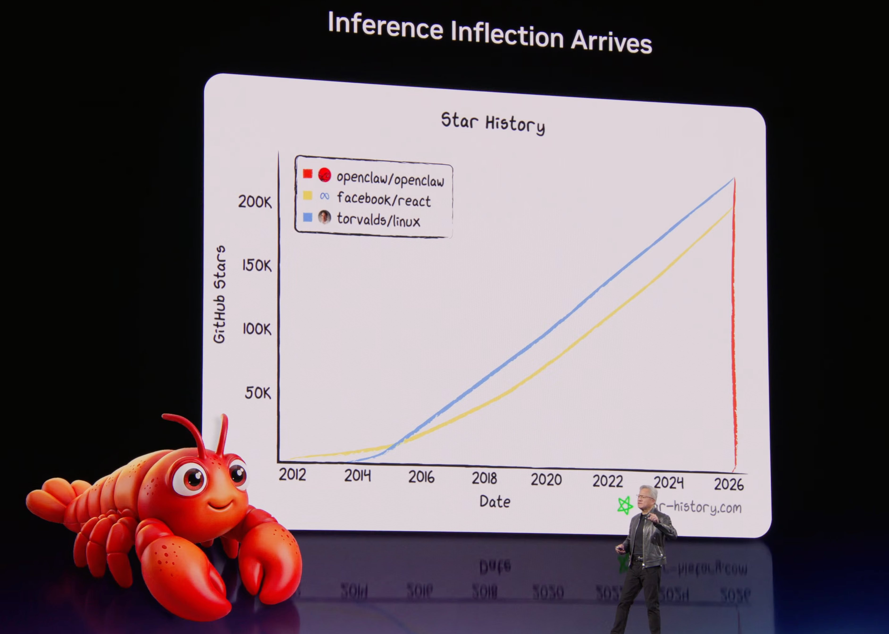

# OpenClaw: The AI Revolution from Conversation to Action

> ChatGPT gives you advice. OpenClaw gets it done.

In early 2026, [OpenClaw](https://github.com/openclaw/openclaw) amassed 247,000 GitHub stars in just two months, surpassing Linux to become the fastest-growing open-source project in history. Thirteen major domestic tech companies followed suit, sparking the ["Lobster Wars"](#lobster-wars).


<small>GTC 2026 Keynote: Jensen Huang presenting OpenClaw's growth curve from zero to 318K stars in four months</small>

This is not another chatbot. It is an **AI employee that lives on your computer and actually gets work done** — and behind this lies a fundamental leap in how we interact with AI.

From Prompt Engineering (teaching AI *how to ask*), to Context Engineering (teaching AI *what to feed*), to today's [**Harness Engineering**](https://openai.com/index/harness-engineering) — **putting AI on a real leash so it can work continuously and autonomously on your behalf**. OpenClaw is that leash.

---

## Not Chat, But Action

You may be used to AI that works like this:

```
You: Help me organize my inbox
ChatGPT: Here are some tips for organizing your email...
```

OpenClaw is different:

```
You: Help me organize my inbox
OpenClaw: [Connecting to Gmail API...]
          [Read 127 unread emails...]
          [Categorized by topic, generating summary...]
          Done! Emails sorted into 5 categories, 3 high-priority messages flagged.
```

**One gives advice. The other takes action.** That is the fundamental difference.

OpenClaw (the lobster) can read and write files, execute commands, control browsers, send and receive messages, and run scheduled checks — all with data staying on your own device. You can have it send you a morning news briefing, auto-reply to emails, write code, submit PRs, and run tests.

<details>
<summary>What OpenClaw really is: an autonomous AI Agent</summary>

OpenClaw is an open-source autonomous AI Agent execution engine created by developer Peter Steinberger. According to [Wikipedia](https://en.wikipedia.org/wiki/OpenClaw), it is a free and open-source autonomous AI agent project that uses messaging platforms (WhatsApp, Telegram, Discord, Slack, etc.) as its primary user interface.

Core characteristics:

- **Runs locally**: Your data stays under your control, never sent to someone else's servers
- **Actually executes**: Doesn't just generate code — it runs, verifies, and fixes it
- **Autonomous decision-making**: Can decompose tasks, choose tools, self-check, and iterate
- **Multi-platform integration**: Control it anytime via Telegram, Discord, Slack, Feishu, and more

</details>

<details>
<summary>History: From Clawdbot to OpenClaw</summary>

- **2025.11**: First released under the name Clawdbot
- **Brief rename**: Changed to Moltbot due to trademark issues with Anthropic
- **2026.01**: Officially renamed OpenClaw
- **2026.02**: Went viral, becoming the fastest-growing project in GitHub history
- **2026.02.14**: Developer announced joining OpenAI; project transferred to an open-source foundation

</details>

---

## Why Did the Lobster Blow Up?

Just like DeepSeek's explosive rise last year — **it took capabilities that a small group of people were already enjoying and brought them to a much wider audience for the first time**.

| Design Decision | Why It Works | Trade-off |
|----------------|-------------|-----------|
| **Chat interface as the entry point** | Reuses existing habits from WeChat/Feishu/WhatsApp — near-zero learning curve | Linear conversation, process is not observable |
| **Unified context + persistent memory** | Remembers everything across platforms and sessions — "it actually gets me" | Memory is a black box; cross-project contamination is easy |
| **Rich Skills ecosystem** | 25,000+ composable skills, and the AI can even write new ones itself | 12% of third-party skills contain malicious code |

These three elements form a **flywheel effect**: memory compounds data, skills enable self-evolution, ease of use drives frequency — the more you use it, the more powerful it gets.

> For a more complete analysis, see [Appendix B: Community Voices and Ecosystem Outlook](/en/appendix/appendix-b).

### Lobster Wars

A panoramic view of 13 major domestic tech companies following OpenClaw:


<small>Image source: [TheBlockBeats](https://www.theblockbeats.info)</small>

<details>
<summary>Deep dive: Core architecture</summary>

OpenClaw's architecture is divided into four layers:

1. **Channels**: Telegram, Discord, Slack, Feishu, CLI, and other access points
2. **Brain**: LLM reasoning, task decomposition and planning, tool selection and invocation
3. **Skills plugin system**: File operations, shell commands, browser control, API integration, and more
4. **Memory & Identity system**: A set of Markdown files — IDENTITY.md (identity), SOUL.md (personality), USER.md (your information), MEMORY.md (long-term memory), and others

This layered design makes OpenClaw both flexible and controllable. For details, see [Chapter 6: Agent Management](/en/adopt/chapter6/).

</details>

<details>
<summary>Deep dive: Value and cost</summary>

**Advantages**:

- **Parallel exploration**: Multiple sub-agents search, analyze, and synthesize simultaneously — much faster than serial execution
- **Context isolation**: Sub-tasks run in clean contexts, avoiding "context degradation"
- **Expanded reasoning capacity**: Breaks through the context window limit of a single agent

**Costs**:

- Token costs jump from 1x to 15x
- Context details can be lost between agents (the "telephone game" effect)
- Implicit decision conflicts may arise with multiple agents running in parallel

> From Anthropic's experience: "Some teams spend months building complex multi-agent architectures, only to find that improving the prompts for a single agent achieves the same result."

**Rule of thumb**: Loosely coupled tasks (search, information gathering) are good candidates for splitting; tightly coupled tasks (architecture design, core coding) should stay with a single agent.

</details>

<details>
<summary>Deep dive: Use cases</summary>

**Personal productivity**: Auto-deliver a morning briefing with weather, calendar, and email digest; automatically categorize emails and flag priorities.

**Developer workflows**: Automatic code review after a PR is submitted; auto-update API docs when function signatures change.

**Enterprise applications**: Multi-channel customer support automation; automatic weekly data analysis reports.

</details>

---

## Start Your Journey

### Four Ways to Use OpenClaw

| Method | Best For | In a Nutshell | Details |
|--------|----------|--------------|---------|
| **AutoClaw Quick Install** | Zero-experience users | Download → Double-click → Register and go, with built-in model and free quota | [Chapter 1](/en/adopt/chapter1/) |
| **Manual Installation** | Users who want full control | A few terminal commands, free choice of model and configuration | [Chapter 2](/en/adopt/chapter2/) |
| **Security-First / Multi-Agent** | Privacy-sensitive / Team collaboration | [IronClaw](https://www.ironclaw.com/) (WASM sandbox) / [HiClaw](https://hiclaw.org/) (multi-lobster collaboration) | [Chapter 1 Alternatives](/en/adopt/chapter1/) |
| **Cloud Hosting / Docker** | Server deployment | Managed solutions from major cloud providers | [Appendix C](/en/appendix/appendix-c) |

### The Four-Step Adoption Method: Raising a Lobster Like Hiring an Employee

Adopting a lobster is essentially like hiring an employee — you just need four things:


| Step | Analogy | What You Do | Chapter |
|------|---------|------------|---------|
| **Set up a workspace** | Give the employee a desk | Install OpenClaw (local machine or cloud server) | [Chapter 1](/en/adopt/chapter1/) / [Chapter 2](/en/adopt/chapter2/) |
| **Buy food** | Pay the employee's salary | Configure a model API Key (tokens are the lobster's "fuel") | [Chapter 2](/en/adopt/chapter2/) / [Chapter 5](/en/adopt/chapter5/) |
| **Give a contact channel** | Let clients reach the employee | Connect a chat platform (QQ / Feishu / Telegram) | [Chapter 4](/en/adopt/chapter4/) |
| **Train and onboard** | Teach the employee how to work | Configure agents, tools, and scheduled tasks | [Chapter 6](/en/adopt/chapter6/) / [Chapter 7](/en/adopt/chapter7/) |

> The first two steps (workspace + food) are the **minimum requirements** — once OpenClaw is installed and a model API Key is configured, the lobster can chat with you in the terminal. The last two steps take it from "can talk" to "can work."

### Learning Paths

**Adopt a Claw** — the user guide, 11 chapters. Getting your lobster up and running from scratch:
- 📦 **Installation** (Chapters 1–3) — AutoClaw quick start → Manual installation → Configuration wizard
- ⚙️ **Core Configuration** (Chapters 4–6) — Chat platform integration → Model management → Agent management
- 🔌 **Extensions & Operations** (Chapters 7–9) — Tools and scheduled tasks → Gateway operations → Remote access
- 🛡️ **Security & Clients** (Chapters 10–11) — Security hardening → Web interface and clients

**Lobster University** — the hands-on guide, curated skill combinations by scenario to build reusable automation loops:
- 🎓 **Getting Started** — ClawHub skill selection principles → Installation and debugging → Featured menu
- 📧 **Office Automation** — Email assistant (163 mail walkthrough) → Voice research (speak a question, get a report)
- 💻 **Developer Tools** — Vibe Coding (say it, ship it) → Paper digest bot (Skill development walkthrough)
- 🤝 **Advanced Practice** — Multi-agent collaboration (HiClaw) → Security risks and comprehensive protection

**Build a Claw** — the developer guide, opening the hood and going from "driver" to "engineer":
- 🏗️ **Core Principles** (Chapters 1–3) — Architectural design philosophy → ReAct loop → Prompt system
- 🔧 **System Mechanics** (Chapters 4–6) — Tool system → Message loop and event-driven design → Unified gateway
- 🛡️ **Security & Optimization** (Chapters 7–9) — Security sandbox → Lightweight solutions → Security hardening
- 🔩 **Hardware & Extensions** (Chapters 10–13) — Hardware options (running on "shrimp") → Skill development

**Appendix** — 7 reference manuals (A–G):
- 📚 **Getting Started Reference** — Learning resources (A) → Community voices and ecosystem outlook (B)
- 🔍 **Selection Guides** — Claw-like solutions compared (C) → Model provider selection (E)
- 🛠️ **Developer Reference** — Skill development and publishing guide (D) → Command cheat sheet (F) → Configuration file reference (G)

Let's get started. 🦞
