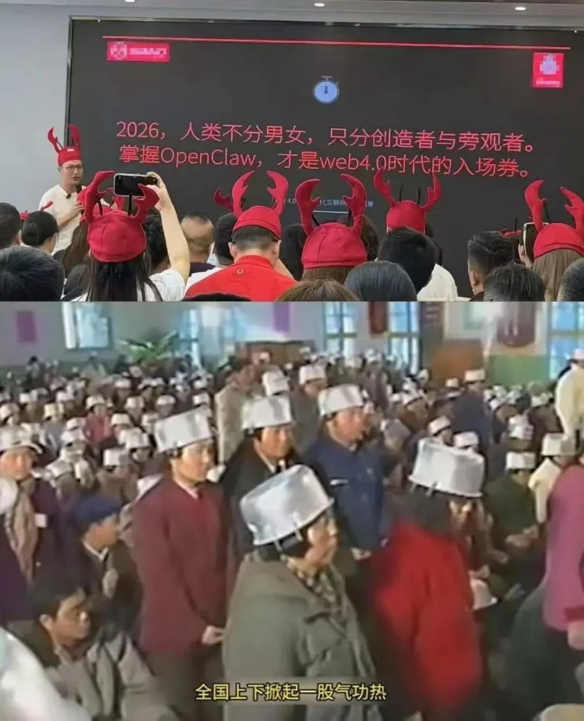
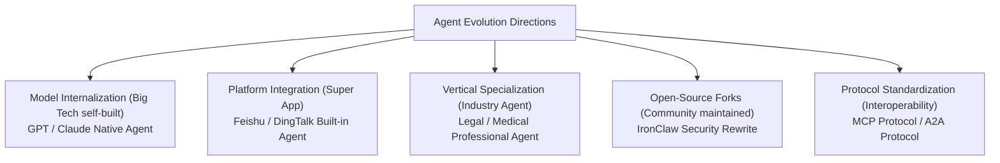

---
prev:
  text: 'Appendix A: Learning Resources'
  link: '/en/appendix/appendix-a'
next:
  text: 'Appendix C: Comparison and Selection of Claw-like Solutions'
  link: '/en/appendix/appendix-c'
---

# Appendix B: Community Voices and Ecosystem Outlook

> This appendix is divided into two parts. The first half is compiled from real discussions in the Chinese-language community around OpenClaw, covering five major topics: capabilities and value, adoption and trends, security risks, costs and interest chains, and rational reflection. The second half is an in-depth analysis that examines from a higher level why OpenClaw took off, what it got right, what its limitations are, and how these insights can translate into improvements to our own productivity. All community viewpoints have been anonymized and do not represent the position of this tutorial — they are provided solely for reference and reflection.

---

## Table of Contents

**Part One: Community Voices**

1. [Capabilities and Value: Has AI Made You More Capable, or Just Given You an Illusion?](#_1-capabilities-and-value-has-ai-made-you-more-capable-or-just-given-you-an-illusion)
2. [Adoption and Trends: From Personal Toy to Industrial Ecosystem](#_2-adoption-and-trends-from-personal-toy-to-industrial-ecosystem)
3. [Security and Risk: Community War Stories](#_3-security-and-risk-community-war-stories)
4. [Costs and Interest Chains: Who's Paying the Bill, Who's Fanning the Flames?](#_4-costs-and-interest-chains-whos-paying-the-bill-whos-fanning-the-flames)
5. [Rational Reflection: Trial-and-Error Costs and Accumulated Experience](#_5-rational-reflection-trial-and-error-costs-and-accumulated-experience)

**Part Two: Ecosystem Outlook**

6. [In-Depth Analysis: Why OpenClaw Took Off, and What It Means for Us](#_6-in-depth-analysis-why-openclaw-took-off-and-what-it-means-for-us)

---

## Part One: Community Voices

## 1. Capabilities and Value: Has AI Made You More Capable, or Just Given You an Illusion?

### The Skeptics

> "AI instantly gives you the illusion of crossing disciplines — one moment you're a top financial analyst, the next a seasoned product manager. But AI won't give you capabilities beyond your own. If it seems to, it's just that you find something new and exciting that is actually common knowledge."

> "It's very hard to ask questions outside your own cognitive horizon."

> "And if your understanding isn't deep enough, you can't tell whether what it does is correct or not."

> "The code AI writes is neither concise — it uses 100 lines to do what 20 lines could — nor robust. There are problems everywhere."

> "OpenClaw is a fox riding on a tiger's coattails. This thing has zero technical difficulty."

> "The code is a pile of crap. The only thing with any value is its Prompt files."

> "The Agent concept wasn't even OpenClaw's idea. OpenClaw itself has no value or innovation — it only blew up because of marketing hype."

> "AutoGPT has been around for years and still hasn't gone anywhere. This concept appeared a long time ago."

> "Give most people a high-school-level intern and their efficiency won't improve much — let alone AI."

> "99% of people are like someone with a hammer looking for nails, thinking the lobster is almighty, when all they actually need is a basic, fast chat app."

> "The needs being satisfied are fake. Most work is honestly better done yourself. You spend an afternoon implementing a feature that gets shipped automatically in the next update — that frustration is far stronger than the novelty."

> "Don't fantasize that OpenClaw can handle everything for you. You think OpenClaw is the Agent, but the real Agent is you."

### The Supporters

> "If AI can't help you do things beyond your own abilities, what gives it the right to disrupt the world?"

> "You don't know design — it can help you do it. That's beyond your ability. A humanities student can write code, can produce animated short dramas."

> "I can't write code, but I can describe requirements and let AI write them. I just need to check if it runs; I can have AI fix it later."

> "With AI assistance, what used to take me ten-plus days to research an industry now takes one day."

> "Tools can ebb and flow. But the concepts they leave behind don't. This is an entirely new Agent era with Skills, heartbeat, and memory capabilities."

> "OpenClaw imposes more structured constraints on Skills, which allows even weaker models to be supported reasonably well."

> "The accumulation of Skills and Workflows is the ultimate asset for individuals and organizations."

> "This is the beginning of a wave. The tide hasn't really come in yet."

> "This is a conceptual breakthrough, not a testament to the bridge itself being great. This is innovation — enthusiasts have played countless variations on it."

> "Teaching AI is harder than teaching people. But once trained, it's more useful than a person."

> "If you don't know how to use it, just don't install it." — "Behind the high abandonment rate: most people use it as 'a faster search engine' rather than 'an employee who can get things done.' Misaligned expectations cause people to abandon any tool."

> "A good product doesn't need cutting-edge technology. Products are about satisfying user needs — technology is less relevant."

> "In the right hands it's a sharp instrument; treat it like a toy, and it's a toy."

### Editor's Note

OpenClaw is an **efficiency amplifier**, not a replacement for capability. It can dramatically lower the execution barrier (for example, letting people who don't know code write Skills), but **decision quality still depends on your own level of understanding**. Think of OpenClaw as a "super intern" — strong execution, fast, but it needs you to oversee direction and quality. At the same time, OpenClaw's core innovation lies not in code quality but in its **architectural concept**: the Skill system + heartbeat mechanism + workspace memory + multi-channel access together form a complete "AI assistant operating system" paradigm. As the community says — "OpenClaw will ebb, but the Agent concept will only grow hotter." Understanding this design philosophy (see the [Introduction: Architecture Overview](/en/adopt/intro/)) has more long-term value than simply using the tool itself.

Deep Dive: The Dunning-Kruger Effect and AI Amplification / OpenClaw vs. Earlier Frameworks

#### The Dunning-Kruger Effect and AI Amplification

At its core, this debate is about the **Dunning-Kruger Effect** amplified in the AI era:

- **Novice trap**: AI lowers the barrier to "making something," but not to "making the right thing." People who don't know code can use AI to produce working code, but they cannot judge its quality, security, or maintainability.
- **Expert acceleration**: For those who already have domain knowledge, AI is a genuine accelerator — they can ask the right questions, evaluate output quality, and iterate toward better results.
- **Practical advice**: When using AI output in a domain you're unfamiliar with, always have someone from that domain review it. OpenClaw's Skill review mechanism (see [Appendix C](/en/appendix/appendix-c)) is designed precisely for this purpose.

#### OpenClaw vs. Earlier Agent Frameworks

| Dimension | AutoGPT (2023) | OpenClaw (2025) | Difference |
|-----------|----------------|-----------------|------------|
| **Task persistence** | In-memory, lost on restart | Workspace filesystem + heartbeat | Interruptible, resumable |
| **Capability extension** | Python plugins | SKILL.md (Markdown Prompt) | Zero-code barrier |
| **Multi-channel** | Web UI only | QQ / Feishu / Telegram / WhatsApp, etc. | Integrated into daily communication |
| **Community ecosystem** | Fragmented | ClawHub 25,000+ Skills | Standardized reuse |
| **Model compatibility** | OpenAI-only | Any OpenAI/Anthropic-compatible model | Cost flexibility |

OpenClaw's true breakthrough was transforming Agents from "technical demos" into "everyday tools." The value of this paradigm shift far exceeds the code itself.

---

## 2. Adoption and Trends: From Personal Toy to Industrial Ecosystem

### The "Only for Individuals" Camp

> "OpenClaw was never designed for enterprise scenarios. Enterprise scenarios first need to solve permissions and HITL (Human-in-the-Loop) problems."

> "For us to use it, we need layers of approvals, cross-department coordination, and Finance has to calculate ROI."

> "Enterprises that actually deploy want stability and control, so they prioritize workflow-based approaches."

> "The reason OpenClaw can't be deployed in enterprises is that it wasn't designed for enterprises — it lacks enterprise-grade role permissions, data management, and similar capabilities."

### The "Enterprises Are Already Using It" Camp

> "My company, and colleagues of mine at Microsoft and NVIDIA, all say their companies are already using it."

> "Companies with the highest market caps globally are using it, and our company is pushing it hard."

> "Our company has over 100,000 employees — we're rolling it out and using it."

> "One person who uses it well becomes a one-person company."

### The Pessimists

> "The tide has already turned. Endless open-source wrappers, then iterations from big tech — at most a one-month cycle."

> "Large model providers won't stay under OpenClaw indefinitely."

> "Large models keep evolving, trending toward human-level, with error rates getting lower and lower. Going forward, more and more applications will replace humans."

### The Optimists

> "Agents are the inevitable form for the next decade. The castrated dialogue mode of conversational large models is gone for good."

> "With a community this large, you can't surpass it by just copying its model without proposing something more disruptive."

> "Just get things done first, then wait for the tools and models to iterate."

> "OpenClaw represents the approach of intelligent agent architecture. If you think the tide has turned, you just haven't figured out how to use it."

> "Seize the advantage first, adapt to the market. Versions iterate fast and developers are keeping up."

> "OpenClaw will ebb, but its siblings will dominate the world."

### The Middle Ground

> "OpenClaw is more like a philosophy — an exploration of AI OS. We're still far from the final answer."

> "It truly is the thing I love most and maintain projects best with after AI coding. But beyond that, there's honestly not much practical use."

> "In fact, RPA can do many things better, but RPA requires setup and has a learning curve. OpenClaw lowered the barrier of RPA, which is why it's been so hot in the short term. But for production use, RPA is still more appropriate and stable."

> "The so-called Agents today are all wrappers around large models — eventually they'll all be internalized into the models."

> "I know it's not far from the ebb." — "You seem to be ignoring one important thing: iteration."

> "On one hand people say OpenClaw is full of holes; on the other, big tech companies are all copying it."

### Editor's Note

OpenClaw's core positioning is indeed as a **personal AI assistant**, but the boundary between "personal" and "enterprise" is blurring. Many developers use OpenClaw in enterprise environments to automate personal workflows, not to replace enterprise systems. If you use it in an enterprise context, be sure to observe: the principle of least privilege, sandbox isolation, and data security (see [Chapter 10: Security and Threat Modeling](/en/adopt/chapter10/)). Meanwhile, 13 major domestic tech companies following suit (see [Introduction: The "Hundred Shrimps Battle" Panorama](/en/adopt/intro/)) precisely confirms that the Agent model's value has been validated by the industry. OpenClaw itself may be replaced by more mature products, but the capabilities you learn in this tutorial — **writing Skills, configuring workspaces, orchestrating automated tasks, multi-Agent collaboration** — are transferable to any Agent platform. Rather than worrying about "whether OpenClaw will ebb," focus your energy on accumulating your own Skills and Workflow assets.

An interesting social phenomenon illustrates the real temperature of this wave: on Xianyu (China's secondhand marketplace), just a few days ago there were services charging hundreds of yuan to "install OpenClaw," and now a flood of services have appeared charging 299 yuan to "uninstall and wipe OpenClaw." Going from paid installation to paid uninstallation reveals the multiple anxieties ordinary users have after trying it — security risks, operational complexity, and Token consumption costs. Meanwhile, local governments in several regions have introduced policies supporting OpenClaw-related application scenarios, encouraging the new OPC (One Person Company) organizational model. Cities like Shenzhen have even offered special subsidies for enterprises using OpenClaw, indicating that this wave has overflowed from the tech world into industrial policy and fiscal support.

> Top: The "People's Park" lobster hat scene in 2026; Bottom: Qigong rallies from the 1980s–90s. Two eras, the same kind of mass technology fever. History doesn't repeat itself, but it rhymes.

Deep Dive: Enterprise Agent Evolution Path / Agent Track Evolution Directions

#### Enterprise Agent Evolution Path

The community debate reflects three stages of Agent technology's deployment in enterprises:

| Stage | Characteristics | Representative Solution |
|-------|----------------|------------------------|
| **Individual exploration** | Developers adopt spontaneously, informal promotion | OpenClaw personal deployment |
| **Team pilot** | IT department evaluates, small-scale trial, usage norms established | OpenClaw + enterprise security hardening |
| **Organizational scaling** | Unified management, permission systems, audit compliance | HiClaw multi-agent collaboration, enterprise custom solutions |

For readers who want to drive Agent deployment in enterprises, it's recommended to start from "individual efficiency improvement," use real results to persuade the team, and then expand gradually. HiClaw's (see [Chapter 1](/en/adopt/chapter1/)) Manager-Worker architecture and enterprise-grade security design were built precisely for this scenario.

#### Agent Track Evolution Directions

From community discussions and industry trends, four parallel evolution paths are visible:

- **Model internalization**: Large model providers like GPT and Claude build Agent capabilities directly in, potentially compressing OpenClaw's value as an intermediate layer
- **Platform integration**: Enterprise IM tools (Feishu, DingTalk) provide Agent capabilities directly, reducing the need for third-party deployments
- **Vertical specialization**: In professional domains like law, medicine, and finance, customized Agent solutions are needed
- **Open-source forks**: IronClaw (security rewrite), HiClaw (multi-agent collaboration), and others optimized for specific scenarios
- **Protocol standardization**: MCP, A2A, and similar protocols allow different Agent frameworks to interoperate

Whichever path wins, **understanding the core design patterns of Agents** (Skill systems, memory mechanisms, tool calling, multi-channel communication) will be a lasting technical asset.

---

## 3. Security and Risk: Community War Stories

### Real Cases

> "While OpenClaw was executing an automated task, the system constructed an incorrect Bash command when calling Shell commands to create a GitHub Issue, accidentally triggering command injection that caused a large number of sensitive environment variables to be exposed."

> "Permissions were too high and things got randomly deleted. Also, many Skills have backdoors."

> "More than 10 years ago, this kind of stuff was what antivirus software chased down. Now you slap an AI skin on it and people will install it on their computers without a second thought?"

> "It deleted all the files on my file server."

> "Our company has banned all personal deployments."

> "Isn't this just like the old Panda Burning Incense virus?" — "Not quite — people installed this one themselves."

> "Every update breaks some of the settings I had configured before. But because of the security updates, I can't skip updates. This pain is quite heavy."

> "Just run it in Docker and you'll be fine. Security vulnerabilities only matter to people who misuse it." — "Have you seen how many security vulnerabilities there are? Major vendors have all warned people not to install it for now."

### Community Consensus

> "Confidentiality alone is hard to clear."

> "Personal deployments definitely need to be banned. If something goes wrong and permissions were set too high, everything gets exposed and everything shuts down."

> "Those with the capability should rewrite their own customized version."

> "The lobster can't access permissions it doesn't have — but to automatically help you do things, it must have permissions." — "So security and usability are inherently a contradiction."

### Official Response

The community's concerns were not unfounded — official bodies have taken notice of the risks. The National Computer Network Emergency Response Technical Team (CNCERT) issued an urgent risk warning, noting that open-source OpenClaw's default security configuration is extremely fragile and attackers can easily gain full control of the system. Risks concentrate in four areas: **prompt injection leading to key leakage, accidental deletion of important files, Skills poisoning turning devices into "bots," and multiple disclosed medium-to-high severity vulnerabilities**. There are already users who lost 12,000 yuan in 3 days due to stolen API keys. The Ministry of Industry and Information Technology's network security threat and vulnerability information sharing platform subsequently released a "six dos and six don'ts" guide for safe use, with core principles of **least privilege, proactive defense, and continuous auditing**.

In the face of the security dilemma, the entry of major domestic tech companies has provided solutions:

- **Tencent**: Launched a security product matrix — cloud-side risk lockdown through environment isolation, port control, and one-click snapshot rollback; local protection via the AI security sandbox in PC Manager 18.0 with anti-tampering and anti-poisoning isolation; also packaged security capabilities as a Skill (e.g., EdgeOne ClawScan security checkup), letting the "lobster" run security scans on itself
- **Alibaba**: Centrally manages credentials like API keys via AIGateway to eliminate leakage risks, while also supporting enterprises in building private Skills libraries
- **ByteDance**: Feishu CEO Xie Xin emphasized "the security floor determines whether something can enter the work scenario — otherwise the more powerful it is, the more dangerous it is." ArkClaw has completed enterprise-grade security certification

> Transforming "dangerous" open-source prototypes into safe and controllable commercial services through engineering refinement and compliance adaptation is the core opportunity for large tech companies in the "lobster" track.

### Editor's Note

Security is one of OpenClaw's biggest weaknesses, and the community's concerns are well-founded. This tutorial strongly recommends:

1. **Principle of least privilege**: Don't give OpenClaw system permissions beyond what the task requires; use `tools.profile: "coding"` rather than `full`
2. **Sandbox isolation**: In production environments, always enable sandboxing and network isolation
3. **Skill security review**: Be cautious about installing third-party Skills from unknown sources; prefer officially reviewed skills from ClawHub
4. **Systematic security**: For a complete threat model, protective measures, and self-audit checklist, see [Chapter 10: Security and Threat Modeling](/en/adopt/chapter10/)

Deep Dive: Community Security Incident Classification

From security incidents reported by the community, four categories of risk can be identified:

| Risk Type | Typical Manifestation | Protective Measures |
|-----------|----------------------|---------------------|
| **Command injection** | Shell commands constructed incorrectly, environment variables exposed | Enable sandbox, restrict Shell tool permissions |
| **Permission escalation** | Deleting files, modifying system configurations | `tools.profile: "coding"`, least privilege |
| **Supply chain attack** | Third-party Skills containing backdoors | ClawHub official review, skill-vetter scanning |
| **Data exfiltration** | Sensitive information sent to external APIs | Network isolation, local models, SecretRef credential management |

For detailed MITRE ATLAS threat classification and attack chain analysis, see [Chapter 10](/en/adopt/chapter10/).

---

## 4. Costs and Interest Chains: Who's Paying the Bill, Who's Fanning the Flames?

### The "It Burns Through Tokens" Camp

> "Tokens flow like water. It can handle simple things — it works — but it's not that magical. It needs a lot of manual tuning."

> "How many Tokens does it use? Supposedly a lot."

> "Afraid to connect GPT — it really does burn through Tokens."

> "Our company uses Cline for coding. Even though it's on a company plan, everything is priced. You can easily spend $200 a day. So I've always known Tokens are expensive — definitely more expensive than a cheap domestic intern."

> "Feishu gives you 500,000 Tokens per day, and a few questions use it all up."

> "Might as well subscribe to a grad student — unlimited Tokens." — "Grad students are cheap, just a few hundred in compensation fees."

> "These products that heavily consume large model Tokens are exactly what large model companies love to see."

> "Every generation has its own intelligence tax. Every generation has its own line of people waiting for free eggs."

> "What's even smarter: large model providers don't make OpenClaw-like products themselves. They let you use open-source software and just provide compute. That way, if there are privacy issues, it's entirely the user's and the open-source software's problem — nothing to do with the large model providers. They just quietly make money."

> "Solved the problem of Tokens being consumed too slowly — vendors earning too slowly."

> "Solved the spiritual anxiety of not keeping up with AI trends."

> "Solved the demand from tech enthusiasts to write articles and sell tutorials."

> "Solved the need for self-entertainment and emotional value."

> "Solved the product manager's problem of not knowing what requirements to write."

> "Solved the problem of Feishu/QQ/WeCom/DingTalk's daily active user growth."

### The "It's Fine" Camp

> "I connected DeepSeek — it's okay. $5 doesn't run out in a week."

> "I'm currently using it to assist with Xianyu (secondhand marketplace) aggregation, writing Skills as plugins to interface with it. This way Token consumption is very low."

### The Industrial Interest Chain: Who's Fueling the Lobster?

> This community reflection reveals the interests of various parties in the OpenClaw ecosystem — something every user should understand.

OpenClaw's viral explosion was no accident. Behind it lies a complete industrial interest chain. Here's the community's summary:

#### Who's Driving the "Lobster Craze"? Beneficiaries and Motives

| Role | How They Benefit | Community Quote |
|------|-----------------|-----------------|
| **OpenClaw authors** | Fame + absorbed by OpenAI | "The author is thrilled — got famous and joined OpenAI, made a killing" |
| **Large model providers** | Token consumption brings API revenue + investment story | "OpenClaw burns through Tokens, and the more popular OpenClaw gets, the more investment it attracts" |
| **Hardware vendors** | Mac Mini, server sales surge | "Apple is happy — Mac Minis sold like crazy again" |
| **Cloud service providers** | One-click deployments drive server sales | "With one-click deployment, many curious people trying it out will buy a server" |
| **Entrepreneurs / listed companies** | New AI Agent story + valuation narrative | — |
| **Knowledge commerce / self-media** | Packaging new concepts into courses, new topics for traffic | — |
| **Installation service providers** | Direct service fees | — |
| **Security researchers** | Expanded attack surface | "Hackers are happy — they've never fought such a rich war" |
| **Ordinary users** | Experiencing AI Agent, getting conversation topics | "Feeling like you've raised a lobster means you've kept up with the times" |

### Editor's Note

Token consumption varies enormously depending on model choice and usage patterns. Key strategies:

- **Tiered usage**: Use low-cost models for lightweight tasks (e.g., DeepSeek, free models from Stairway Star), reserve high-end models for important tasks — see [Chapter 5: Model Management](/en/adopt/chapter5/)
- **Skill encapsulation**: Wrap repetitive tasks into Skills to avoid starting conversations from scratch each time, dramatically reducing conversation rounds
- **Memory enhancement**: For long conversation scenarios, consider installing the OpenViking memory plugin — tests show a 91% reduction in Token consumption

The interest chain analysis may seem pointed, but the logic is clear — every new technology wave has a similar interest structure. **Understanding the interest chain is not about dismissing the technology's value, but about staying clear-headed**:

- Don't be swept up in marketing speak; use what you need, within your means
- Focus on real efficiency gains, not "looks cool"
- Free/low-cost solutions can fully meet most individual needs (see [Chapter 2](/en/adopt/chapter2/))
- Before paying, evaluate ROI: how much time will this Skill save me per month?

Deep Dive: Token Optimization Strategy Comparison / Detailed Analysis of Beneficiaries and Drivers

#### Token Consumption Optimization Strategy Comparison

| Strategy | Savings | Applicable Scenario | Implementation Difficulty |
|----------|---------|---------------------|--------------------------|
| **Free model to start** | 100% (zero cost) | Learning, exploration, lightweight tasks | Very low |
| **Domestic low-cost models** | 70–90% | Daily conversation, simple automation | Low |
| **Skill encapsulation and reuse** | 50–80% | Repetitive tasks | Medium |
| **Model routing (Failover)** | 30–60% | Mixed workload scenarios | Medium |
| **OpenViking memory** | Up to 91% | Long-term conversation, complex tasks | Higher |
| **Local models (Ollama)** | 100% (electricity cost only) | Privacy-sensitive, offline scenarios | Higher |

For specific configuration methods, see [Chapter 5](/en/adopt/chapter5/) and [Appendix E: Model Provider Quick Reference](/en/appendix/appendix-e).

#### Detailed Analysis of the Interest Chain

The beneficiaries and drivers table above reveals a classic platform economy structure: the platform (OpenClaw) creates ecological niches, and various parties find commercial opportunities around those niches. This is not unique to OpenClaw — the iPhone ecosystem, the WeChat ecosystem, and the Douyin ecosystem all went through similar stages. Understanding this structure helps us maintain independent judgment when facing AI product marketing.

---

## 5. Rational Reflection: Trial-and-Error Costs and Accumulated Experience

> A widely resonated reflection from the community, which put a rational capstone on the entire discussion.

> "Think about it: ordinary end users, at such a low overall cost, can experience trial and error in the AI industry and accumulate some experience. Isn't that a good thing? Is the alternative — opening a bubble tea shop, driving for rideshare, delivering food — really a better way to pay for that learning?"

> "Workers should spend more time thinking about how to improve work efficiency — write a Skill, or manage your Workspace more systematically. Free up more time to slack off." — "Slacking off is key."

### Editor's Note

This observation points to an easily overlooked fact: **the cost of experimenting with OpenClaw is extremely low**.

| Way to Experiment | Initial Cost | Time Investment | Cost of Failure |
|-------------------|-------------|-----------------|-----------------|
| Open a bubble tea shop | 100,000–500,000 yuan | 6–12 months | Total loss |
| Drive rideshare / deliver food | 10,000–30,000 yuan | Ongoing | Sunk time |
| Learn programming for a career change | 0–50,000 yuan | 3–12 months | Opportunity cost |
| **Try OpenClaw to experience AI** | **0–50 yuan** | **A few hours** | **Near zero** |

Even if OpenClaw "ebbs" tomorrow, the **cognitive upgrade** you gained in the process is real:

- You understand how AI Agents work
- You've learned to describe requirements in natural language (Prompt Engineering)
- You've experienced the power of automated workflows
- You've accumulated the judgment to evaluate AI tools

These experiences are reusable with any AI product in the future. **The trial-and-error cost you truly cannot afford is choosing to sit out entirely in the AI era.**

---

## Part Two: Ecosystem Outlook

## 6. In-Depth Analysis: Why OpenClaw Took Off, and What It Means for Us

> This section peels back the layers from a higher vantage point: what exactly did OpenClaw get right, why was it the one to go viral, and what does this mean for us?

OpenClaw went viral at the end of January 2026. Official accounts were blanketing the internet with guides on how to configure it; cloud service providers rushed to launch one-click deployments, afraid to miss the moment. At the same time, all kinds of performance art was flying everywhere: ClawdBot, MoltBot, OpenClaw — three name changes in a week. During one of the renamings, the account was even squatted, and a token called $CLAWD scammed 16 million dollars. Security vulnerabilities were endless: 12% of third-party Skills contained malicious code, and many people left their consoles exposed on the public internet with no password. For a while it felt like the entire field was nothing but contradictory noise, leaving people at a loss: should I install this or not? What will I miss if I don't? What are the risks if I do? Is this the next productivity revolution, or another toy that'll be forgotten in two weeks?

### 6.1 The Core Argument: Why It Went Viral

**The reason OpenClaw went viral is highly similar to the reason DeepSeek went viral at the same time last year.**

When DeepSeek became popular, the AI most people in China were using was pure chat — no search capability, frequently making things up. ChatGPT and Claude had gained reasoning and search capabilities and were much smarter, but they weren't accessible in China. When DeepSeek introduced reasoning and search capabilities, it was the first time most people experienced an AI that could search and think, and it brought a kind of shock — wow, AI can actually be this useful — and so it went viral. In other words, it didn't go viral because it was technically superior to its competitors. In fact, DeepSeek in terms of pure model capability did not crush GPT-4o or Claude 3.5 at the time. Rather, it went viral because it **took something a small group of people were enjoying and accustomed to, and brought it in front of a much larger user group** — to use Geoffrey Moore's words, it crossed the hardest chasm on the technology adoption curve (Crossing the Chasm), jumping in one step from Early Adopters to Early Majority. That's what made it go viral.

OpenClaw is the same. In early 2026, there was actually a gap in the Agentic AI space: products like ChatGPT were popular, but compared to locally-capable Agentic programming AI like Cursor/Claude Code/Codex, they were at least one generation behind (more on why below). But tools like Cursor are very niche — basically only used by programmers. Most people were still using consumer-grade products like ChatGPT, and felt like AI hadn't made much progress in the past two years and had very limited capabilities. Then OpenClaw, for the first time, connected the kind of locally-capable Agent represented by Cursor with popular communication software like WhatsApp/Slack/Feishu, giving a much broader non-technical user group their first exposure to an Agentic AI that can read and write files, execute commands, has memory, and can continuously iterate — and so it went viral. The same chasm crossing — no new technology was created, but Agentic AI was brought from the small circle of programmers to the general public for the first time.

But this doesn't mean OpenClaw and DeepSeek are all show and not worth learning from. On the contrary, DeepSeek offers a lot of historical insight. For example, after DeepSeek went viral, who actually benefited from it? Whether you jumped on and played with DeepSeek itself right away isn't actually that important. Many people played with it for a while and then cooled off. **The people who truly benefited were those who genuinely understood why DeepSeek went viral, and integrated its two key factors — search and reasoning — into their own workflows.** Similarly, after OpenClaw went viral, we can certainly jump on and install and try it out, but doing that alone won't suddenly transform us and multiply our productivity. Because an important prerequisite for a phenomenon-level product to go viral is that it's designed for the broadest possible users — so many design decisions involve compromises, and using it directly is often not the most efficient approach. What's more critical is to understand the design philosophy behind it, analyze the reasons for its virality, draw lessons from it, and improve your own workflow.

> **After all, tools come and go, but understanding the essence of tools does not. Extract the transferable insights and weave them into your own workflow — that's the insider move.**

### 6.2 The Chat Interface: The Foundation of Popularity, and Also the Ceiling

Before analyzing OpenClaw's design specifically, let's look at a concrete example to explain what "designed for the broadest possible users" actually means.

One very critical reason OpenClaw took off is that it chose the chat software everyone uses every day as the interaction entry point, rather than asking you to install another piece of software on your computer like Cursor does. This reuses existing usage habits and channels, making the mental load of using the tool particularly low — you're already using Slack/Feishu anyway, so when you see OpenClaw right there, you naturally think to use it. On the other hand, because people are already very familiar with these apps, it compressed the learning curve to near zero. No need to install an IDE, no need to learn programming terminology and concepts, just pick up your phone and use it — this is the foundation of its ability to break out to the mainstream.

But if you've used an Agentic AI programming tool like Cursor, you'll find that a chat window like Slack is quite a constrained interaction mode for AI. Specifically, there are limitations at three levels:

**The constraint of linear conversation.** Chat windows like Slack and WeChat are primarily just messages stacked downward, one after another. But deep knowledge work is often non-linear. For example, you need to reference content from another thread, merge two directions of exploration together, or fork off from a conversation. These all have dedicated UI in desktop environments like Cursor and [OpenCode](https://github.com/anomalyco/opencode), but doing them in a chat window is particularly awkward.

**Insufficient information density.** If you're just doing toy-level research and development, the chat window is fine. But for anything requiring more complex analysis and thinking, the information density quickly becomes insufficient. For example, analysis reports with mixed text and images, complex tables, and long formatted text — these are quite painful to read in a chat. Meanwhile, different platforms' support for Markdown varies widely, making the experience inconsistent.

**Process unobservability.** Especially for tasks that take multiple steps to complete, after I hand over execution authority to the AI, it's natural to want to know what it's actually doing. For example, is it making steady progress, or is it going in circles? What tools did it call, what files did it modify? These are naturally surfaced in tools like Cursor and Claude Code, but in a chat window you can only see "typing..." or an emoji saying it's processing. For particularly complex tasks, you have to wait quite a long time in OpenClaw before getting a message saying it's done — or that it got stuck in the middle.

There's a very clear trade-off here. If you want to make the tool easy to use and target the largest user group, you must use chat tools that everyone is already using as the carrier. But this simultaneously brings the drawbacks of conversational format, information density, and so on. In this continuous trade-off space from "easy-to-use but awkward" to "native but niche," OpenClaw chose extreme ease of use. This is the foundation of its ability to go viral. But we also need to clearly recognize the limitations that this design decision brings — when integrating it into your own workflow, don't mindlessly adopt all of OpenClaw's design choices. Instead, adapt to your circumstances and find your own sweet spot on this trade-off axis based on your actual needs.

### 6.3 Elements of Popularity Beyond the Interface

The chat interface is the foundation of OpenClaw's popularity, but it's only the most superficial point. What truly makes users feel that this AI is "genuinely smart, useful, and understands me" is the three design decisions behind it.

#### Unified Entry Point and Context

Comparing with Cursor makes this clear. In Cursor, each project's context is isolated — open project A, the AI only knows about project A; switch to project B, and all the previous conversation about project A is gone. Claude Code and OpenCode are the same — each startup is bound to a working directory. But OpenClaw is the complete opposite. By default, it pools all conversation context together. You had it help organize emails in Telegram this morning, write a report in Slack this afternoon, and schedule tomorrow's calendar in WhatsApp tonight — it remembers all of it. The feeling this gives is that it's particularly smart, as if it truly knows you.

#### Persistent Memory

But just mixing all the context together isn't useful on its own, because the context window fills up quickly. OpenClaw handles memory very cleverly. At a high level, it uses a file-based memory system — the same approach as Manus. For example, it maintains a SOUL.md that defines the AI's core persona and behavior guidelines; USER.md stores the user's profile; MEMORY.md holds long-term memories; plus daily raw logs and so on.

What's particularly clever here is its **self-maintenance mechanism**: the AI automatically reviews recent raw logs at regular intervals (heartbeat), extracts valuable information into MEMORY.md, and cleans up outdated entries along the way. The entire process requires no user intervention. This self-maintenance mechanism stratifies memory — raw logs are short-term memory, the daily MEMORY.md is medium-term memory, and distilled personality and preferences settle into IDENTITY.md as long-term memory. For users, the experience shifts from "having to re-explain everything every time you restart" to "it seems to be growing" (self-improving) — and that perceptual difference is enormous.

#### Rich Skills

The third design is rich Skills. This significance goes far beyond saving the user a bit of time. The benefit from the number of tools is not linear — the capability gain from 6 tools vs. 4 is much greater than from 4 vs. 2. This is because **tools can be combined**. Connecting Slack enables command issuance and status reporting; connecting image generation enables drawing; connecting a PPT service enables slide creation; connecting deep research enables investigation. Put these together, and you can combine and evolve into many complete business capabilities and application scenarios.

#### The Flywheel Effect

These three designs don't simply add together — they mutually reinforce each other.

**Memory + Unified Context = Data Compounding.** Because of persistent memory, conversations accumulate across sessions; because of the unified entry point, data from all sources flows into the same memory pool. Work discussions in Feishu, schedules arranged in Telegram, personal conversations in WhatsApp — all mixed together, forming an increasingly complete understanding of you, and future task completion becomes ever more tailored to you.

**Memory + Skills = Self-Evolution.** What's learned today is still there tomorrow, and capabilities accumulate; the AI can write new Skills and remember their existence and usage, entering a virtuous cycle. Particularly worth highlighting here is the coding capability. Because OpenClaw can write code itself, when there's no existing Skill available, it can create one on the spot. This new Skill gets saved and directly reused next time a similar situation arises. This forms a closed loop of self-evolution.

**Capability + Ease of Use = Usage Frequency.** The smoother the entry point, the more frequently it's invoked; the faster the flywheel spins, the stronger the capabilities become.

In summary, OpenClaw is quite an impressive product. Its various decisions — whether technical (entry point, memory, tools) or non-technical (interface) — all serve the same flywheel, giving ordinary people their first true grasp of the complete form of Agentic AI.

### 6.4 Limitations and Trade-offs

We've covered why it's impressive — now for the complaints. But first, it needs to be explained: the limitations below aren't oversights on OpenClaw's part — they are the direct consequences of the trade-off described earlier: the price that must be paid to create a blockbuster product.

The interface limitations have already been discussed: linear, low information density, low observability. In deep usage these quickly become bottlenecks, so we won't go over them again.

#### The Deeper Problems with Memory

OpenClaw's memory system is very friendly for beginners — you don't have to manage it; it takes care of itself and evolves on its own. But for those who want to turn knowledge into assets, this is actually an obstacle.

For example, say we complete a piece of research and produce a 5,000-word long-form document or a Product Requirements Document (PRD). In Cursor/the file system, it's just a file: `docs/research.md` — reference it with @, upgrade it with a new version, compare with diff. But in OpenClaw, this thing is like human memory — it might get automatically summarized, automatically rewritten, or even deleted entirely (forgotten) at some point, and the entire process is completely out of your control. You can't clearly tell it: "Going forward, use this document as the authoritative source; whenever a related question comes up, you must reference it, don't compress it into three lines." In short, **knowledge cannot be explicitly managed**.

What's even more frustrating is that the entire update process is a **black box**. What gets stored in MEMORY.md, how it's organized, when it gets cleaned — this is primarily done automatically by the AI during the heartbeat period. You see the result; you can't really see the reason: which entries were changed this time, why a particular entry was deleted, why two unrelated things were merged together. When problems occur, it's hard to trace the root cause, and therefore hard to improve.

#### Cross-Scenario Information Interference

Unified memory naturally creates the feeling of "it understands me," but it also means information can easily cross-pollinate across projects: project A's preferences, or even a temporary decision, might inexplicably affect project B. For beginners it seems like it remembers everything, but for advanced users who actually want to get work done, it's more like "how did it lead me astray again?"

#### The Skills Security Paradox

Among the thousands of skills on ClawHub, security audits found that hundreds contained malicious code — cryptocurrency theft, reverse shell backdoors, credential theft, all present. Simon Willison raised the concept of a **fatal triangle**: when an AI system simultaneously possesses access to private data, exposure to untrusted environments, and the ability to communicate externally, the risk amplifies exponentially. OpenClaw hits all three.

This creates a strange paradox. For a great experience, you need to give it many tools and permissions. But this introduces security issues, so permissions have to be tightened. But tightened permissions turn it into something like a cloud-based Agent service like Manus, losing the pleasure of a local Agent. Security and usability seem to be a fundamental contradiction.

#### Three Engineering Bottlenecks

Beyond the design-level trade-offs above, native OpenClaw has three specific technical bottlenecks at the engineering level that directly affect the day-to-day experience:

**Communication channels were not designed for AI.** Once AI starts sending messages in bulk or frequently, platforms easily flag it as anomalous behavior — at best rate-limiting, at worst outright banning the account. This means it's hard to put into a genuinely high-frequency real work flow — a few messages via Slack or Feishu is fine, but once task density goes up, the communication channel itself becomes the bottleneck.

**Memory retrieval efficiency drops sharply as scale increases.** The native solution uses SQLite plus keyword search, which works when content is sparse, but once memory accumulates, retrieval gets slower and slower and often imprecise. What's worse, as time stretches on, every conversation has to load an ever-growing amount of historical context, and Token consumption goes up with it.

**Web browsing is particularly Token-hungry.** Many browser automation tools, when working, feed the entire page HTML to the model. Open a few web pages and the context window fills up. Not only is the experience poor, the cost is also absurd — after just a few uses people lose patience. This is also why "tokens flow like water" complaints are so widespread in the community — a large portion of consumption actually comes from inefficient web processing, not from the core task itself.

### 6.5 So What: From Insights to Action

At this point, someone will naturally ask: after all this analysis, so what? What does this have to do with me?

The answer is: you can use these insights to build something more ergonomic than OpenClaw on top of existing tools. Let's talk through a few key decisions.

#### Reuse the Agentic Loop Rather Than Build Your Own

The first decision — and the most important one — is to not implement an Agentic AI system from scratch, but instead **reuse an open-source CLI programming tool like OpenCode as the foundation**.

Behind this decision is a deeper judgment. Building a functional Agentic Loop — that is, calling APIs, parsing tool calls, executing tools, returning results to the AI, requesting the next response, and repeating this cycle — sounds simple, but getting it to a level that supports real use involves many details: filesystem read/write, adding, deleting, and replacing file content, sandboxed environments, permission management... each is a pitfall. These things are tedious to implement, full of traps, and have little to do with the value we ultimately want to create. The core point is that **the Agentic Loop is manual labor that should be outsourced; what truly deserves effort is Agentic Architecture** — that is, how to inject business logic into an AI system so it directly creates value.

Tools like OpenCode and Claude Code are precisely a great outsourcing option. They've already made the Agentic Loop very mature — can read and write files, run commands, iterate continuously, and are evolving rapidly. Using them as a foundation is essentially getting the entire Agentic programming toolchain for free, minimizing your own development costs. Choosing OpenCode also has some additional benefits: it's fully open-source and hackable, supports parallel sub-agents (Cursor and Codex still don't have this), and supports multiple coding plans — not as Token-hungry as calling APIs directly.

#### Files as Memory: Inheriting and Advancing OpenClaw's Philosophy

The second decision concerns the memory system. Tools like OpenCode/Claude Code have an inherent **disk-as-memory** philosophy — as programming tools, after all, files are their basic unit. When you have both disk-based memory and direct visibility and control over files, the problems with OpenClaw's memory system identified in the analysis above are solved. Want to accumulate assets? Write a file. Want to force the AI to follow certain rules? Write AGENTS.md. Want to manage the memory structure? Directly edit the Markdown. The issues described earlier — knowledge can't be explicitly managed, and the update process is a black box — are naturally solved with OpenCode's fine-grained control and the file system.

But just having a file system isn't enough. You can also port over OpenClaw's persona self-evolution mechanism. Specifically, divide memory into two layers: project-level memory (each project's own context, decision records, technical solutions) and persona-level memory (user profile, behavioral preferences, communication style). Then add a persona maintenance workflow in AGENTS.md, having the AI automatically review conversations at the end of sessions and update MEMORY.md and USER.md. The same self-evolution, but running on a fully controllable file system, with Git for version management.

As for the unified context problem, there's a simple and direct solution: a **Mono Repo**. Put different projects in different folders within the same repo, and the AI naturally has cross-project access to all contexts. Want isolation? Isolate. Want sharing? Share. Want to merge two directions of exploration? Just @. Want to fork off? Copy the files — all of this is native file system and OpenCode operations, far more natural than awkwardly doing these things in OpenClaw's chat window.

#### Skills and Security

On the Skills front, the OpenCode ecosystem has a large number of MCP servers and Skills available — calendars, email, browsers, search, and more — with comparable feature coverage to ClawHub. On the security side, the recommended approach is to not directly install third-party Skills, but instead **have AI first review the source code and understand the logic, then rewrite a clean version**. In today's AI-assisted programming world, this process usually takes just a few minutes, but dramatically reduces the risk of supply chain attacks.

#### The Last Mile: Mobile

The first three decisions address the foundation, memory, and tools — but one critical piece is still missing: the entry point. **One important reason OpenClaw went viral is that you don't need to be sitting in front of a computer.** But existing programming tools are genuinely weak here — VSCode has a Code Server for remote access, but it's very unfriendly on iPad; OpenCode has a Web Client, but honestly it only solves the "exists vs. doesn't exist" problem and is very difficult to use; Cursor's Web Client is tightly coupled to GitHub; Claude Code has no Web Client at all.

To solve this problem, you can build a native mobile app as a remote client for OpenCode. Note that this app is not about moving the chat window to a phone — it's a work interface truly designed for mobile: you can see the AI's real-time work progress, every tool call, every file operation; you can switch models for A/B testing; you can browse Markdown files and review changes; it supports voice input; it supports public internet access via HTTPS or SSH tunnels; and on iPad there's a three-panel split view. The result is that an iPad that had been collecting dust becomes a productivity tool again, and the experience of directing AI from the couch is far better than OpenClaw's chat window. Out to dinner when an on-call alert comes in, you can directly assign the task to the AI and figure out the root cause on the spot — all while maintaining complete control over the AI throughout.

### 6.6 Summary

Returning to the core argument. What made OpenClaw and DeepSeek go viral is essentially the same thing: **taking capabilities that a small group of people were already enjoying, and bringing them in front of a wider audience for the first time.** DeepSeek let people experience an AI that can search and reason for the first time; OpenClaw let people get their first hands-on experience with an Agentic AI that can read and write files, has memory, and can self-evolve.

But precisely because they're targeting the widest possible general audience, these products inevitably make substantial design compromises. DeepSeek did this, and so did OpenClaw. The chat interface brings ease of use but sacrifices expressiveness; unified memory creates the feeling of "it understands me" but sacrifices controllability; the open Skills ecosystem brings capabilities but introduces security risks.

For those already using Cursor/Claude Code/OpenCode, what's more worth doing than blindly following the crowd and installing OpenClaw is understanding why it went viral — unified entry point, persistent memory, tool ecosystem, and the flywheel between them — and then weaving these insights into your own existing toolchain, playing to its strengths and avoiding its weaknesses.

> **After all, tools come and go, but understanding the essence of tools does not.**

---

> **A final word**: The community's voices are a mirror, reflecting the expectations and anxieties within a wave of technology. Whether you're a newcomer just starting out or a seasoned veteran, maintaining the balance of **open mindset + critical thinking** is the most important capability in the AI era. The mission of this tutorial is to help you find your own place in that balance.
