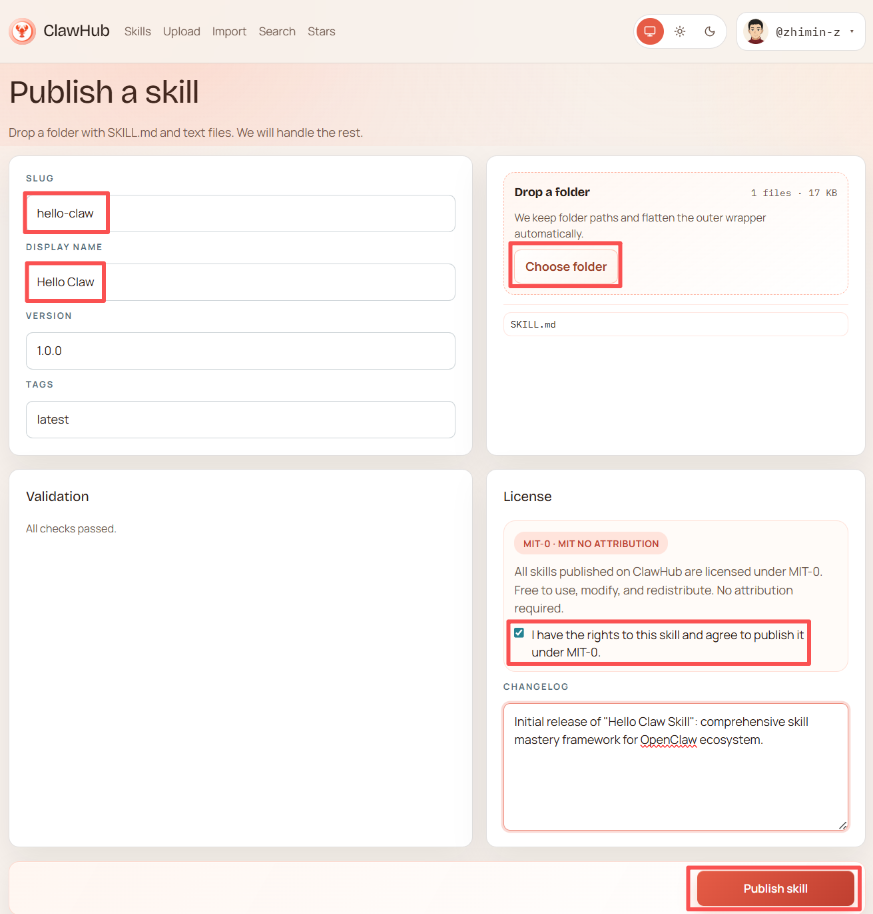

---
prev:
  text: 'Appendix C: Comparison and Selection of Claw-like Solutions'
  link: '/en/appendix/appendix-c'
next:
  text: 'Appendix E: Model Provider Selection Guide'
  link: '/en/appendix/appendix-e'
---

# Appendix D: Skill Development and Publishing Guide

The Skill system in OpenClaw is its core extension mechanism — by writing a single `SKILL.md` file, you can teach an AI Agent new capabilities. This appendix walks you through skill structure, the development workflow, and how to publish skills from scratch.

> **Recommended Tool**: Anthropic's official [skill-creator](https://github.com/anthropics/skills/tree/main/skills/skill-creator) is the most mature skill development assistant available. This appendix uses it as the primary reference.

---

## I. What Is a Skill?

### Skills vs Tools

Let's clarify two concepts first:

| | Tools | Skills |
|---|---|---|
| **Analogy** | Hands, feet, and permission switches | Mini-programs / plugins |
| **Purpose** | Determines what types of actions an Agent can perform | Adds specific capabilities to an Agent |
| **Examples** | File read/write, shell execution, network requests | Web search, weather lookup, code review |

Simply put: Tools are "capability channels," and Skills are "the specific abilities loaded into those channels."

### Three-Level Skill Loading

OpenClaw loads skills in priority order from highest to lowest:

| Priority | Type | Location | Description |
|:---:|------|------|------|
| 1 | Workspace Skills | `~/.openclaw/workspace/skills/` | Exclusive to the current workspace; highest priority |
| 2 | Managed Skills | `~/.openclaw/skills/` | Shared skills installed via ClawHub |
| 3 | Built-in Skills | Bundled with OpenClaw | Official built-ins; lowest priority |

Skills with the same name are overridden by higher-priority ones. A lazy-loading strategy is used — the body of `SKILL.md` is only read when the skill is actually invoked.

---

## II. Skill Structure

Each skill is a folder, with `SKILL.md` at its core:

```
my-skill/
├── SKILL.md           # Required: skill definition file (YAML frontmatter + Markdown instructions)
├── scripts/           # Optional: executable scripts (search, API calls, etc.)
├── references/        # Optional: reference documentation (loaded on demand, not in persistent context)
└── assets/            # Optional: templates, icons, and other static assets
```

### SKILL.md Format

`SKILL.md` consists of two parts: **YAML frontmatter** (metadata) + **Markdown body** (instructions).

````markdown
---
name: my-skill
description: Skill description (the most important field — the AI uses this to decide when to invoke the skill)
user-invocable: true
disable-model-invocation: false
metadata:
  openclaw:
    requires:
      env:
        - MY_API_KEY
      bins:
        - node
---

# Skill Instructions

Write clear Markdown here describing how the AI should use this skill.

You can use `{baseDir}` to reference the skill's directory — OpenClaw replaces it with the actual path at runtime.
````

### Frontmatter Field Reference

| Field | Required | Description |
|------|:---:|------|
| `name` | Yes | Skill identifier: lowercase letters and hyphens (e.g., `my-awesome-skill`) |
| `description` | Yes | **Determines when the AI invokes this skill** — describe clearly "what it does" and "when to use it" |
| `user-invocable` | No | Whether the skill can be manually invoked via a slash command (default: `true`) |
| `disable-model-invocation` | No | Set to `true` to prevent automatic AI triggering; manual invocation only (default: `false`) |
| `homepage` | No | Link to the skill's or service's official website |
| `metadata.openclaw.requires.env` | No | Required environment variables (skill is marked "unavailable" if not set) |
| `metadata.openclaw.requires.bins` | No | Required system commands (e.g., `node`, `python`, `curl`) |
| `metadata.openclaw.requires.config` | No | Required configuration paths |

### Three-Level Loading Mechanism

Skill content is loaded on demand in stages to conserve context window space:

| Level | Content | When Loaded | Recommended Size |
|:---:|------|---------|---------|
| 1 | `name` + `description` | Always in context | ~100 words |
| 2 | SKILL.md body | When the skill is triggered | <500 lines |
| 3 | Files in `references/` | When the body instructs reading them | Unlimited |

> **Writing tip**: Keep the SKILL.md body under 500 lines. For larger content, place detailed documentation in the `references/` directory and guide the AI from the body with phrases like "For more on X, read `{baseDir}/references/x.md`."

---

## III. Developing a Skill (Recommended: skill-creator)

[skill-creator](https://github.com/anthropics/skills/tree/main/skills/skill-creator) is an official Anthropic tool that guides you through the complete process from concept to tested skill.

> This guide includes the full source of skill-creator in the `docs/en/appendix/skill-creator/` directory for offline reference.

### Installing skill-creator

skill-creator is itself an OpenClaw skill, so installation works the same as any other skill:

```bash
# Option 1: Install via ClawHub (recommended)
clawhub install skill-creator

# Option 2: Manual install to workspace
# Copy the skill-creator folder to:
# ~/.openclaw/workspace/skills/skill-creator/
```

After installation, skill-creator will automatically appear in OpenClaw's available skill list:

```bash
openclaw skills list | grep skill-creator
```

### Usage Workflow

skill-creator uses a **conversational development** approach — just describe the skill you want in chat, and it guides you through every step:

**Step 1: Describe your intent**

In the OpenClaw chat interface, tell the Agent what you want to build:

```
Help me create a weather lookup skill
```

Or more specifically:

```
I want a skill that automatically calls the QWeather API to return real-time weather when a user asks about the weather
```

skill-creator will ask a few clarifying questions:
- What should the Agent do with this skill?
- When should it trigger? (What does the user say?)
- What format should the output be?
- Do you need test cases?

**Step 2: Auto-generate SKILL.md**

skill-creator generates a complete SKILL.md based on your answers, including:
- Frontmatter metadata (name, description, dependency declarations)
- Markdown instruction body
- Any required script files (e.g., API call scripts)

**Step 3: Test and iterate**

skill-creator generates 2–3 test cases simulating real user conversation scenarios, then:

1. Runs these tests with your skill
2. Shows you the results for review
3. Improves the skill based on your feedback
4. Repeats until you're satisfied

<details>
<summary>skill-creator full directory structure</summary>

```
skill-creator/
├── SKILL.md              # Skill definition (core instructions, ~480 lines)
├── LICENSE.txt            # Apache 2.0 license
├── agents/               # Dedicated sub-agent instructions
│   ├── grader.md          # Grader agent: evaluates whether assertions pass
│   ├── comparator.md      # Comparator agent: blind A/B comparison
│   └── analyzer.md        # Analyzer agent: interprets benchmark results
├── scripts/              # Automation scripts
│   ├── run_loop.py        # Description optimization main loop
│   ├── run_eval.py        # Trigger rate evaluation
│   ├── improve_description.py  # Description improvement
│   ├── aggregate_benchmark.py  # Benchmark aggregation
│   ├── generate_report.py      # Report generation
│   ├── package_skill.py        # Skill packaging
│   └── quick_validate.py       # Quick validation
├── references/
│   └── schemas.md         # JSON data structure specifications
├── assets/
│   └── eval_review.html   # Evaluation result review UI template
└── eval-viewer/
    └── generate_review.py # Visual evaluation result viewer
```

</details>

<details>
<summary>skill-creator advanced features</summary>

**Description Optimization**

The `description` field is the sole basis on which the AI decides whether to invoke a skill. skill-creator has a built-in automatic optimization workflow:

1. Generates 20 test queries (10 that should trigger + 10 that should not)
2. After you review and confirm, runs the optimization loop
3. Automatically splits the evaluation set into 60% training / 40% test
4. Runs up to 3 iterations per round for reliable trigger rates
5. Selects the description with the highest score on the test set (not the training set) to avoid overfitting

**Blind Comparison**

Want to rigorously compare two versions of a skill? skill-creator can pass both versions' outputs to an independent agent for blind evaluation — it doesn't know which is the new version and which is the old one, and scores based on quality alone.

**Benchmarking**

Each iteration automatically generates a `benchmark.json` containing:
- Pass rate for each assertion
- Comparison of time and token usage
- Mean ± standard deviation + delta

</details>

### Manual Development (Without skill-creator)

If you prefer to work manually, the steps are:

1. **Create the directory**
   ```bash
   mkdir -p ~/.openclaw/workspace/skills/my-skill
   ```

2. **Write SKILL.md** (following the format described in Section II of this appendix)

3. **Validate**
   ```bash
   openclaw skills check
   openclaw skills info my-skill
   ```

4. **Test**: Send a trigger keyword in chat and observe whether the skill works correctly.

---

## IV. Real-World Example: The tavily-search Skill

Using [tavily-search](https://clawhub.ai/arun-8687/tavily-search) (v1.0.0) from ClawHub as an example, let's look at the complete structure of a real skill. This skill provides AI Agents with web search capability via the [Tavily API](https://tavily.com).

### Directory Structure

```
tavily-search-1.0.0/
├── SKILL.md           # Skill definition (frontmatter + usage instructions)
├── _meta.json         # ClawHub publishing metadata
└── scripts/
    ├── search.mjs     # Web search implementation
    └── extract.mjs    # Web page content extraction implementation
```

### SKILL.md Contents

```markdown
---
name: tavily
description: AI-optimized web search via Tavily API. Returns concise, relevant results for AI agents.
homepage: https://tavily.com
metadata: {"clawdbot":{"emoji":"...","requires":{"bins":["node"],"env":["TAVILY_API_KEY"]},"primaryEnv":"TAVILY_API_KEY"}}
---

# Tavily Search

AI-optimized web search using Tavily API. Designed for AI agents - returns clean, relevant content.

## Search

​```bash
node {baseDir}/scripts/search.mjs "query"
node {baseDir}/scripts/search.mjs "query" -n 10
node {baseDir}/scripts/search.mjs "query" --deep
node {baseDir}/scripts/search.mjs "query" --topic news
​```

## Options

- `-n <count>`: Number of results (default: 5, max: 20)
- `--deep`: Use advanced search for deeper research (slower, more comprehensive)
- `--topic <topic>`: Search topic - `general` (default) or `news`
- `--days <n>`: For news topic, limit to last n days

## Extract content from URL

​```bash
node {baseDir}/scripts/extract.mjs "https://example.com/article"
​```

Notes:
- Needs `TAVILY_API_KEY` from https://tavily.com
- Use `--deep` for complex research questions
- Use `--topic news` for current events
```

### Design Notes

**Frontmatter Design**

| Field | Value | Purpose |
|------|---|------|
| `name` | `tavily` | Skill identifier after installation |
| `description` | `AI-optimized web search...` | The AI uses this to decide when to invoke — clearly stating "what it does" is key |
| `homepage` | `https://tavily.com` | Helps users sign up to get an API Key |
| `metadata.requires.bins` | `["node"]` | Declares a Node.js requirement; checked automatically at load time |
| `metadata.requires.env` | `["TAVILY_API_KEY"]` | Marks the skill "unavailable" rather than crashing when not set |
| `metadata.primaryEnv` | `TAVILY_API_KEY` | Tells the configuration wizard which key to prompt the user for |
| `metadata.installRecipe` | `{ "bins": ["node"], "npm": ["tavily"] }` | One-click install recipe: CLI and Control UI auto-prompt for dependency installation when requirements are missing |

**Script Design Patterns**

Core logic of `search.mjs` (~100 lines):

```javascript
// 1. Read the API Key from environment variables
const apiKey = (process.env.TAVILY_API_KEY ?? "").trim();
if (!apiKey) { console.error("Missing TAVILY_API_KEY"); process.exit(1); }

// 2. Call the Tavily API
const resp = await fetch("https://api.tavily.com/search", {
  method: "POST",
  headers: { "Content-Type": "application/json" },
  body: JSON.stringify({ api_key: apiKey, query, search_depth: searchDepth, ... }),
});

// 3. Format output as Markdown (AI-friendly format)
if (data.answer) console.log("## Answer\n" + data.answer);
for (const r of results) {
  console.log(`- **${r.title}** (relevance: ${(r.score * 100).toFixed(0)}%)`);
  console.log(`  ${r.url}`);
}
```

Four key principles:

| Principle | Approach | Reason |
|------|------|------|
| Output Markdown | `console.log("## Answer\n" + ...)` | AI Agents can parse structured results directly |
| Validate parameters first | `process.exit(1)` when Key is missing | Lets OpenClaw catch the error and prompt the user, rather than throwing an exception |
| Truncate results | `content.slice(0, 300)` | Prevents overly long output from filling the context window |
| `{baseDir}` variable | Reference script paths in SKILL.md | Automatically replaced with the actual path at runtime; no hardcoding needed |

**Configuration**

Set the API Key after installation and the skill is ready to use:

```bash
# Set environment variable (recommended: write to ~/.openclaw/.env)
echo 'TAVILY_API_KEY=tvly-your-key-here' >> ~/.openclaw/.env
```

Skills installed via ClawHub are enabled by default. Use `openclaw skills list` to check status, and `openclaw skills info <name>` to view details (including API key setup guidance and storage path hints). Skills with missing dependencies are labeled **Needs Setup** instead of "missing".

---

## V. Publishing to ClawHub

Once your skill is complete, you can publish it to the [ClawHub](https://clawhub.ai) community so OpenClaw users worldwide can install and use it.

### Pre-Publication Checklist

Make sure your skill folder structure is complete:

```
my-skill/
├── SKILL.md           # Required: contains complete frontmatter and instructions
├── scripts/           # Optional: script files
└── ...                # Other supporting files (plain text only)
```

> **Note**: ClawHub only accepts folders containing `SKILL.md` and plain text files. Binary files, images, and similar assets are not supported for upload.

### Publishing Steps

**1. Log in to ClawHub**

Visit [clawhub.ai](https://clawhub.ai) and log in with your GitHub account.

**2. Go to the publish page**

Click the **"Publish"** button at the top of the page to enter the skill publishing interface:



**3. Fill in the publishing details**

| Field | Description | Example |
|------|------|------|
| **Slug** | URL identifier for the skill (lowercase letters + hyphens) | `hello-claw` |
| **Display name** | Display name for the skill | `Hello Claw` |
| **Version** | Version number following [Semantic Versioning](https://semver.org/) (SemVer) | `1.0.0` |
| **Tags** | Version tag, defaults to `latest` | `latest` |

**4. Upload the skill folder**

Drag the folder containing `SKILL.md` into the **"Drop a folder"** area, or click **"Choose folder"** to select it manually.

After uploading, the detected `SKILL.md` file will appear on the right side of the page. The system automatically strips any outer wrapper directory — you just need to ensure `SKILL.md` is inside the folder.

**5. Automatic validation**

ClawHub automatically checks whether the skill meets community requirements:

- Whether `SKILL.md` exists and is correctly formatted
- Whether the frontmatter contains the required `name` and `description`
- Whether all files are plain text

A **"All checks passed"** message is displayed upon successful validation.

**6. Confirm the license**

The default license is **MIT-0** (MIT No Attribution):

> Anyone may freely use, modify, and redistribute the skill without attribution.

Check **"I have the rights to this skill and agree to publish it under MIT-0"** to confirm.

> **Note**: MIT-0 is one of the most permissive open-source licenses and is well-suited for community sharing. If your skill contains proprietary content, confirm license compatibility before publishing.

**7. Write a Changelog (optional)**

Briefly describe what this version contains, for example:

```
Initial release of "Hello Claw Skill" - comprehensive skill mastery framework for OpenClaw ecosystem.
```

**8. Publish**

Once everything looks good, click the **"Publish skill"** button in the bottom right. After successful publication, other users can install the skill with:

```bash
clawhub install your-username/my-skill
```

### Updating a Published Skill

After modifying a skill, simply increment the version number and re-upload:

1. Update the content in SKILL.md
2. Enter the new version number on the publish page (e.g., `1.0.0` → `1.1.0`)
3. Upload the updated folder
4. Write a Changelog describing the changes
5. Click Publish

Users can get the latest version via `clawhub update`.

---

## VI. Skill Management

### CLI Commands

```bash
# View all available skills
openclaw skills list

# Show only ready skills
openclaw skills list --eligible

# Show detailed information (including missing dependencies)
openclaw skills list -v

# View details of a specific skill
openclaw skills info <skill-name>

# Check status of all skills
openclaw skills check
```

### Installing Skills via ClawHub

```bash
# Search for skills
clawhub search <keyword>

# Install a skill
clawhub install <skill-name>

# View installed skills
clawhub list

# Update a skill
clawhub update <skill-name>
clawhub update --all

# Uninstall a skill
clawhub uninstall <skill-name>
```

> For the full ClawHub CLI reference, see Appendix A.

### Enabling Skills in Configuration

Skills installed via ClawHub are enabled by default. To manage skill status manually:

```bash
openclaw skills list              # View all skills and their status
openclaw skills info <skill-name> # View details of a specific skill
```

For fine-grained control over enabling/disabling skills in the configuration file, see [Appendix G: Configuration File Reference](/en/appendix/appendix-g).

### Configuring Credentials (SecretRef)

For skills that require an API Key, it is recommended to use environment variables or SecretRef for secure storage:

```bash
# Option 1: Environment variable (most common)
echo 'TAVILY_API_KEY=tvly-your-key-here' >> ~/.openclaw/.env

# Option 2: Interactive SecretRef configuration
openclaw secrets configure

# Option 3: Check secret status
openclaw secrets audit --check
```

Supported SecretRef `source` types:

| source | Description | Use Case |
|--------|------|---------|
| `env` | Read from environment variable | Most common; suitable for local development |
| `file` | Read from a file | Suitable for shared servers with multiple users |
| `exec` | Read from command execution output | Suitable for integrating with secret management systems |

---

## VII. Plugin Development

For extension needs more complex than skills (such as custom Transports or new Tool types), you can develop a plugin.

::: tip Plugin Development Notes
- Plugin development uses the modular `openclaw/plugin-sdk/*` interface. See the [Plugin SDK documentation](https://github.com/openclaw/openclaw/tree/main/packages/plugin-sdk).
- **ClawHub is the preferred distribution channel**: When running `openclaw plugins install`, the system searches ClawHub first, falling back to npm only if the package is not found.
- **Cross-ecosystem compatibility**: Supports discovering and installing plugin packages from Claude, Codex, and Cursor — their Skills are automatically mapped into the OpenClaw skill system.
:::

### Plugin Management Commands

```bash
# List installed plugins
openclaw plugins list

# Install a plugin (from 3.22, ClawHub is checked first; falls back to npm)
openclaw plugins install <path|.tgz|npm-spec>

# Enable/disable a plugin
openclaw plugins enable <id>
openclaw plugins disable <id>

# Plugin diagnostics
openclaw plugins doctor
```

### Image Generation Model Configuration

Image generation capabilities in plugins are managed through the unified `agents.defaults.imageGenerationModel` configuration path.

---

## VIII. Troubleshooting

### Skill Fails to Load

```bash
# Check skill status (shows missing dependencies)
openclaw skills check

# View detailed information
openclaw skills info <skill-name> -v

# View gateway logs
openclaw logs --follow
```

Common causes:
- Missing environment variables (variables declared in `metadata.requires.env` are not set)
- Missing system commands (commands declared in `metadata.requires.bins` are not installed)
- SKILL.md formatting errors (frontmatter missing `name` or `description`)

### Skill Does Not Trigger

- Check whether `description` accurately describes the trigger scenario
- Confirm that `disable-model-invocation` is not set to `true`
- Try adding trigger keywords to the description (skill-creator's description optimization feature can help with this)

### Skill Permission Issues

Ensure the skill directory has the correct read permissions:

```bash
# macOS / Linux
chmod -R 755 ~/.openclaw/workspace/skills/my-skill/
```

---

## IX. Development Checklist

Before developing a skill, confirm each item on this checklist:

- [ ] SKILL.md frontmatter includes `name` and `description`
- [ ] `description` clearly describes the trigger conditions and capabilities (the AI relies on this to decide when to invoke the skill)
- [ ] Environment variable requirements are declared in `metadata.requires.env`
- [ ] System command dependencies are declared in `metadata.requires.bins`
- [ ] Scripts output in Markdown format (AI-friendly)
- [ ] Sensitive information uses environment variables or SecretRef — no hardcoding
- [ ] Error handling is thorough (`exit(1)` when Key is missing; clear error output on API failure)
- [ ] Local testing passes (`openclaw skills check` + real conversation testing)
- [ ] When ready to publish: folder contains only SKILL.md and plain text files
