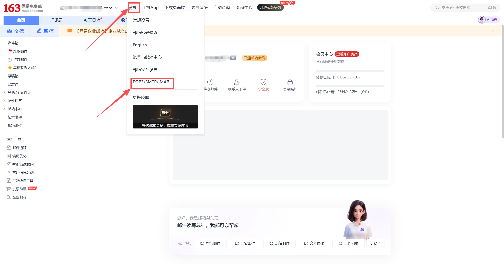
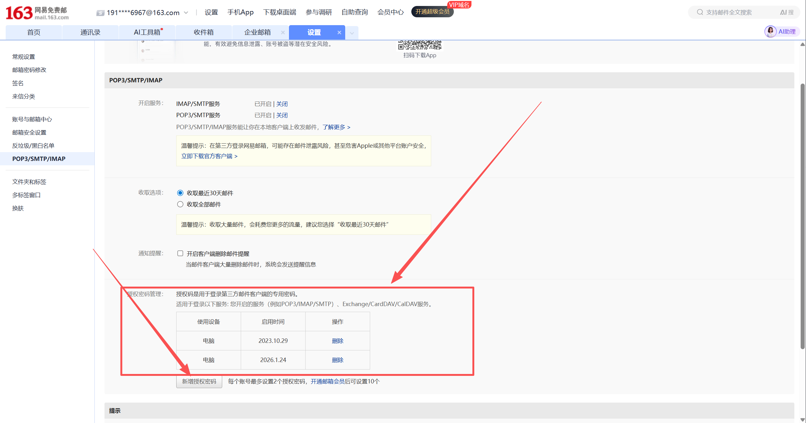
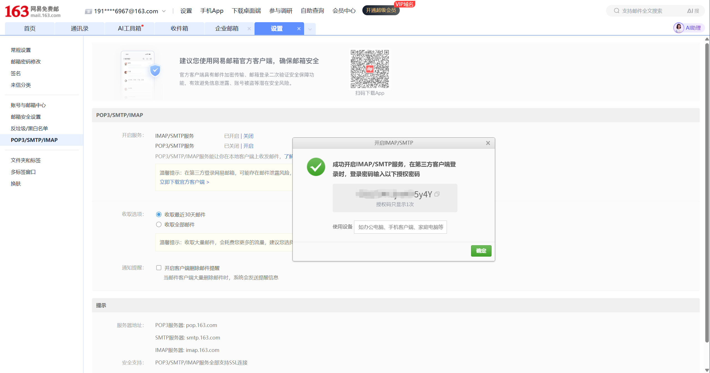
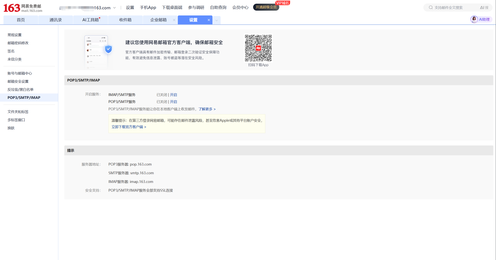

# Email Assistant in Practice: Using NetEase 163 Mail as an Example

If your goal is simply to have a script periodically read NetEase 163 mail, the shortest path is actually quite clear:

1. Enable `IMAP/SMTP` on the web client
2. Generate and save an authorization code
3. Use `imap.163.com:993` to get your first Python script working

This article is written for people doing email automation for the first time. After reading it, you should be able to take away three things:

- When to prefer `IMAP` over `POP3`
- The complete path to enable 163 mail from the web interface to generating an authorization code
- A working Python verification script

Other email providers are only covered with migration tips here — no step-by-step screenshots for those.

One environment boundary to clarify upfront:

- The 163 mail `IMAP` script reading was verified with a real run in `WSL Ubuntu`
- But the mail protocol itself does not depend on `WSL` — as long as your Python environment can reach `imap.163.com:993`, it will work on Windows, macOS, or Linux
- `WSL` primarily affects the `OpenClaw cron / gateway` layer in this context, not the mail protocol itself

## 1. The Conclusion First: For 163 Mail Automation, IMAP + Authorization Code Is the Main Path

Many people doing email automation for the first time will look for web API endpoints, cookies, or so-called "email tokens."
For personal mailboxes like 163 mail, the standard mail protocols are actually the more reliable entry point.

- `IMAP`: suited for reading mail and syncing state
- `POP3`: can also receive mail, but is closer to "downloading the inbox"
- `SMTP`: handles sending, not reading

The same applies to credentials.
What your script should prioritize is usually not the web login password, but the **authorization code** generated from the mail settings page.

So the main thread of this article is very simple:

- Prefer `IMAP` for reading
- Prefer authorization codes for authentication
- Get the connection working first, then build automation on top

## 2. Understanding the Protocol: Why IMAP Is Recommended Here

If your only goal is to download mail to your local machine, `POP3` can get the job done.
But if you want to build an "email assistant" that you can continue to extend, `IMAP` is more appropriate.

The reason is straightforward. `IMAP` is more like "remotely operating a mailbox on the server" rather than just pulling mail down:

- Read/unread status is easier to keep in sync with the web client
- State is easier to sync across multiple clients
- More room to expand when you later need to handle mail by folder

NetEase's help center makes this explicit: once `IMAP` is enabled, actions like deleting or marking as read in a client are reflected back to the server, so the state seen in the web and the client is usually consistent.

The comparison diagram below makes the difference more concrete:


If you want one sentence to remember:

- `POP3` is more like a downloader
- `IMAP` is more like a sync protocol

## 3. Step 1: Access the 163 Mail Web Interface

Start by opening the NetEase mail login page: <https://email.163.com/>


After logging in, you will land on the 163 mail home page.


At this point, you have only completed "web mail login."
There is one critical step remaining before a script can read mail: enabling the mail protocol service and generating an authorization code.

## 4. Step 2: Navigate to POP3/SMTP/IMAP from Settings

Click "Settings" in the top navigation, then go to `POP3/SMTP/IMAP`.



This is also the official path given in NetEase's help center:

- Log in to the web mail first
- Then go to `Settings -> POP3/SMTP/IMAP`
- Enable the service and complete verification as needed

For this article, the focus is only on `IMAP/SMTP`.

## 5. Step 3: Enable IMAP/SMTP First

If your goal is "let a script read 163 mail," enable `IMAP/SMTP` first.

After clicking "Enable," the page will show a confirmation prompt before proceeding:


After completing the verification required by the page, you will see a success message:


If you later need to support legacy devices, old systems, or an existing `POP3` workflow, you can also enable `POP3/SMTP` in addition.
The corresponding success message looks like this:


But for Python-based automated reading, `IMAP/SMTP` remains the first priority.

## 6. Step 4: Open Authorization Code Management and Save a New Code

Once `IMAP/SMTP` is enabled, an authorization code management section will appear at the bottom of the page. Two things to check here:

- Whether you have already generated an authorization code
- Whether you need to generate a new one for your script



If you already have old authorization code records here, it is safer to clean up unused old records before generating a new one.

If you click to add or regenerate, the page will show a dialog with the authorization code. This string of characters is the login credential that third-party clients or Python scripts will use.



One important detail: the authorization code is not permanently displayed like a web password.
Once you close the dialog, it is gone — so make sure to copy it carefully.

The safest approach here is:

1. Generate the authorization code
2. Copy it immediately
3. Save it to a secure location first
4. Then write your script configuration

## 7. The Script Parameters You Actually Need to Prepare

If you are going to read NetEase 163 mail, the minimum configuration for a first version is typically just these:

```env
MAIL_HOST=imap.163.com
MAIL_PORT=993
MAIL_USER=your_name@163.com
MAIL_PASSWORD=replace_with_authorization_code
MAIL_FOLDER=INBOX
MAIL_FETCH_LIMIT=10
```

The two fields most commonly filled in incorrectly:

1. `MAIL_HOST` — do not use the web address `email.163.com`
2. `MAIL_PASSWORD` — do not use the web login password; try the authorization code first

Keep these two addresses separate:

- `https://email.163.com/` is the web entry point for humans
- `imap.163.com:993` is the service endpoint commonly used by scripts connecting via mail protocol

You can also see this set of protocol server addresses in the 163 mail settings page:



This also matches the third-party mail configuration documentation from Huawei's official support pages.

## 8. Up and Running in 3 Minutes: From Configuration to First Read

If you want to get it working right now without piecing together steps, just follow the instructions below.

### Step 1: Prepare the example directory

All the ready-made files for this section are in the `examples/` directory alongside this file:

- `examples/imap_connect_test.py`
- `examples/yesterday_mail_report.py`
- `examples/.env.example`
- `examples/requirements.txt`
- `examples/README.md`
- `examples/openclaw_setup_prompt.md`

### Step 2: Copy `.env.example`

In the `examples/` directory, copy `.env.example` to `.env`, then fill in your own email address and authorization code.

```env
MAIL_HOST=imap.163.com
MAIL_PORT=993
MAIL_USER=your_name@163.com
MAIL_PASSWORD=replace_with_authorization_code
MAIL_FOLDER=INBOX
MAIL_FETCH_LIMIT=5
```

### Step 3: Run the commands

If you already have a working `python` locally:

```powershell
pip install -r requirements.txt
python imap_connect_test.py
```

If you prefer to use `uv` directly, you can run everything in one step:

```powershell
uv run --with python-dotenv imap_connect_test.py
```

### Step 4: What a successful run looks like

At minimum, seeing the following signals means the connection is working:

- `tcp_tls = success`
- `login_status = OK`
- `id_status = OK`
- `result = success`

If you can also see `subject / from / date / preview` for the most recent emails, the script is not just connected — it has actually read the mail.

## 9. First Python Script: Verify "Can We Connect?"

The first script does not need to do too much.
Verifying that Python can read your 163 mail over `IMAP` is already enough.

The script below only depends on the Python standard library, making it suitable for an initial connectivity check:

```python
import email
import imaplib
import os
from email.header import decode_header


def decode_mime_words(value: str) -> str:
    if not value:
        return ""
    parts = decode_header(value)
    decoded = []
    for text, encoding in parts:
        if isinstance(text, bytes):
            decoded.append(text.decode(encoding or "utf-8", errors="replace"))
        else:
            decoded.append(text)
    return "".join(decoded)


def fetch_recent_emails():
    host = os.environ["MAIL_HOST"]
    port = int(os.environ.get("MAIL_PORT", "993"))
    user = os.environ["MAIL_USER"]
    password = os.environ["MAIL_PASSWORD"]
    folder = os.environ.get("MAIL_FOLDER", "INBOX")
    limit = int(os.environ.get("MAIL_FETCH_LIMIT", "10"))

    mail = imaplib.IMAP4_SSL(host, port)
    mail.login(user, password)
    mail.select(folder)

    status, data = mail.search(None, "ALL")
    if status != "OK":
        raise RuntimeError("failed to search mailbox")

    mail_ids = data[0].split()
    target_ids = mail_ids[-limit:]

    results = []
    for mail_id in reversed(target_ids):
        status, msg_data = mail.fetch(mail_id, "(RFC822)")
        if status != "OK":
            continue

        raw_message = msg_data[0][1]
        message = email.message_from_bytes(raw_message)

        results.append(
            {
                "id": mail_id.decode(),
                "subject": decode_mime_words(message.get("Subject", "")),
                "from": decode_mime_words(message.get("From", "")),
                "date": message.get("Date", ""),
            }
        )

    mail.close()
    mail.logout()
    return results


if __name__ == "__main__":
    emails = fetch_recent_emails()
    for item in emails:
        print("=" * 60)
        print("ID:", item["id"])
        print("From:", item["from"])
        print("Date:", item["date"])
        print("Subject:", item["subject"])
```

This script does only three things:

- Log in to 163 mail
- Read the most recent N emails
- Print the subject, sender, and date

Once this version is working, adding unread filtering, body extraction, attachment downloading, and scheduled tasks are all incremental extensions.

However, if you plan to use this directly with 163 mail, the recommended approach is to use the tested version in the `examples/` directory alongside this file.
The reason is simple: the `examples/` script has already been verified with a real 163 connection and includes the connection details needed for it to work — it is better suited for direct reuse.

If you want to follow along directly, start with:

- `examples/README.md`
- `examples/imap_connect_test.py`
- `examples/.env.example`
- `examples/requirements.txt`

### Live Run Results (2026-03-14, WSL Ubuntu environment)

I have already done a real run in the current environment. The verified working path can be summarized as follows:

- `TCP/TLS` connection successful
- `LOGIN` successful
- Server capability check passed
- `SELECT INBOX` successful
- Successfully retrieved the mailbox list and subject, sender, date, and preview for the 5 most recent emails

The actual output, with sensitive information redacted, is shown below. To keep this concise, only one email record is shown as an example:

```json
{
  "host": "imap.163.com",
  "port": 993,
  "user": "191***67@163.com",
  "tcp_tls": "success",
  "login_status": "OK",
  "connection": "login_success",
  "imap_id": {
    "capability_status": "OK",
    "capabilities": [
      "IMAP4rev1 XLIST SPECIAL-USE ID LITERAL+ STARTTLS APPENDLIMIT=71680000 XAPPLEPUSHSERVICE UIDPLUS X-CM-EXT-1 SASL-IR AUTH=XOAUTH2"
    ],
    "id_supported": true,
    "id_sent": true,
    "id_status": "OK"
  },
  "mailbox": {
    "folder": "INBOX",
    "total_messages": 5,
    "fetched_items": [
      {
        "message_id": "5",
        "subject": "New device login alert",
        "from": "NetEase Mail Account Security <safe@service.netease.com>",
        "date": "Sat, 14 Mar 2026 11:59:43 +0800 (CST)",
        "preview": "@media screen and (min-width:750px)..."
      }
    ]
  },
  "result": "success"
}
```

This result is sufficient to confirm that your 163 mail `IMAP` address, authorization code, and script reading pipeline are working in the current environment.

The verification scope is also worth stating clearly:

- What has been verified: the `WSL Ubuntu + Python + 163 IMAP + authorization code` pipeline
- What can reasonably be migrated: the same Python script placed in any other networked local environment will generally work
- What requires extra attention: if you later connect `OpenClaw cron`, the gateway startup method may differ across host environments

## 10. Handing It Over to the Lobster: Script, Environment Variables, Prompts, Scheduler

If your next goal is not "run the script manually" but rather to have the lobster automatically report yesterday's mail every morning, it is worth breaking this into four layers:

1. Script layer: only responsible for reading the mailbox and outputting structured data
2. Environment variable layer: only responsible for credentials and connection parameters
3. Prompt layer: only responsible for categorization, summarization, and report format
4. Scheduler layer: only responsible for when it triggers each day

### 10.1 Where to Put the Script

For the first version, the easiest approach is not to package it as a Skill right away, but to put the script directly in the lobster's current working directory.

A working directory structure that is sufficient:

```text
your-openclaw-workspace/
  .env
  scripts/
    yesterday_mail_report.py
```

You can reuse the script directly from the `examples/` directory:

- `examples/yesterday_mail_report.py`

If you do not want to manually create the `scripts/` directory and copy files, you can also upload the script file to the lobster and use a ready-made prompt to have it save the file:

- `examples/openclaw_setup_prompt.md`

### 10.2 Where to Put the Environment Variables

This repository's documentation on OpenClaw environment variables is clear.
The load priority is:

1. Parent process environment variables
2. `.env` in the current working directory
3. `~/.openclaw/.env`

So the shortest path is to write the mail configuration into the **current working directory `.env`**:

```env
MAIL_HOST=imap.163.com
MAIL_PORT=993
MAIL_USER=your_name@163.com
MAIL_PASSWORD=replace_with_authorization_code
MAIL_FOLDER=INBOX
```

### 10.3 How to Write the Prompt

It is recommended to separate responsibilities here:

- `yesterday_mail_report.py` only outputs JSON
- The reporting format is left to the lobster to organize according to the prompt

You can give the lobster this prompt directly:

```text
Please run scripts/yesterday_mail_report.py in the current working directory.

Read the JSON output from the script and report only the mail from yesterday 00:00-23:59.

Organize the output into four categories:
1. Needs my attention
2. Security alerts
3. System notifications
4. Ignorable mail

For each email, keep only:
- Subject
- Sender
- Time
- One-sentence summary

End with a "Today's Priority Items" section.

If total_messages = 0, simply tell me: no new mail to report from yesterday.
```

If you want the lobster to also handle "saving the script to the working directory" rather than manually copying the file first, use:

- `examples/openclaw_setup_prompt.md`

It already includes three ready-to-copy prompts:

1. Have the lobster save only the script and `.env.example`
2. Have the lobster create only the daily 9 AM cron job
3. Have the lobster do both "save script + set cron" in one go

### 10.4 Setting a 9 AM Daily Schedule

OpenClaw supports `cron` scheduling.
If you want a daily report on yesterday's mail at 9 AM, add it like this:

```bash
openclaw cron add \
  --name "163 Yesterday Mail Summary" \
  --cron "0 9 * * *" \
  --session isolated \
  --message "Please run scripts/yesterday_mail_report.py in the current working directory. Read the JSON output and report only mail from yesterday 00:00-23:59, organized into: needs my attention, security alerts, system notifications, ignorable mail; if total_messages = 0, just tell me there is no new mail to report from yesterday." \
  --announce
```

After creating it, confirm with:

```bash
openclaw cron list --json
```

This repository's `cron` documentation notes that tasks scheduled on the hour may be automatically spread across the `0-5` minute window.
So a more accurate way to describe this is "a morning task targeting 9:00."

### 10.5 If You Are on Windows + WSL

This article does not require WSL.
If your OpenClaw is running in macOS, Linux, or native Windows, just follow your own installation method.

But if you are in the same setup as this test run — **Windows host + WSL Ubuntu** — two details are worth noting upfront:

1. `cron` commands depend on the gateway being started first
2. In this WSL environment, using `cron list --json` for checks is more reliable

In this test run, WSL required running this first:

```bash
systemctl --user start openclaw-gateway.service
```

Then `cron status`, `cron add`, `cron rm`, and similar commands.

One more observation confirmed during testing:
If you run `cron` commands immediately after the gateway restarts, you may encounter:

```text
gateway closed (1006 abnormal closure)
```

The safer approach is: start or restart the gateway, wait `2-3` seconds, then run `cron list`, `cron add`, `cron rm`.

Another observation from this test run:
In the current WSL environment, it is more reliable to use `cron list --json` as the primary check command.
On one hand it is better suited for programmatic evaluation; on the other, if the gateway is not yet ready, both the text and JSON versions may fail together — in that case, waiting and retrying is more reliable than interpreting the result as "no tasks."

So if you are on the WSL path, treat this as your default check command:

```bash
openclaw cron list --json
```

If you find the `openclaw` command is not in your current shell's `PATH`, do not immediately conclude it is "not installed."
Check first:

- Whether OpenClaw was installed via `nvm` or similar at a different path
- Whether the current shell has inherited the correct Node environment
- Whether the gateway service is actually running

In short, WSL here is best understood as **a verified viable environment that requires attention to startup order and PATH**, not a "required path."

### 10.6 Both Prompt-Based and Command-Based Are Valid Paths

You do not need to commit to just one approach.

- Running `openclaw cron add` yourself is command-based deployment
- Attaching the script and prompt to the lobster and letting it save and schedule is prompt-based deployment

Both work.
If you want to ensure nothing goes off track, the command-based approach gives more control; if you want to hand it entirely to the lobster, the prompt-based approach is less hands-on.

### 10.7 When to Package It as a Skill

If you are just getting it working for yourself, this version is sufficient.
If you later want to use it long-term or have multiple workspaces call this email assistant directly, then packaging it as a workspace skill makes more sense.

The workspace skills directory given in this repository's documentation is:

```text
~/.openclaw/workspace/skills/
```

## 11. Scripts Default to Polling — No Need to Rush Into Real-Time Listening

A very common question when writing an email assistant for the first time: can `IMAP` push mail in real time like a message notification?

The more accurate engineering answer is:

- Most first versions of scripts are built as **polling**
- The `IMAP` protocol itself also supports `IDLE`, which is closer to "waiting for server notifications"
- In practice, many projects still start with polling

The simplest polling approach is:

```python
import time

while True:
    fetch_recent_emails()
    time.sleep(60)
```

The reasons are practical:

- Easiest to write
- Easiest to debug
- For 163 mail integration, getting authentication and the protocol working is more important first

If you genuinely need stronger real-time behavior later, that is the right time to look into `IMAP IDLE` and long-connection reconnect strategies.

## 12. The 4 Most Common Pitfalls

### Pitfall 1: Using the Web Address as the Script Connection Address

These two addresses have different roles:

- `email.163.com` is the web mail entry point
- `imap.163.com` is the protocol service address commonly used by scripts reading mail

### Pitfall 2: Putting the Web Login Password Directly into the Script

If you have already enabled `IMAP/SMTP` and the script still reports authentication failure, check this first.
Many problems are not caused by incorrect Python code, but by using the wrong credentials.

### Pitfall 3: The Page Looks Like the Service Is On, but Verification Was Not Completed

NetEase's help center explicitly states that enabling these services requires completing verification as prompted by the page.
If the process is not completed, the script may still be unable to log in.

### Pitfall 4: Making the Workflow Too Complex From the Start

A more reliable order is:

1. Verify that the account can connect
2. Verify that mail can be enumerated
3. Then add rules, scheduling, auto-summarization, and notifications

This significantly reduces the cost of debugging.

## 13. Migrating to Other Mail Providers

This article uses 163 as the primary example. For other providers, only migration guidance is given.

### 126 Mail

Essentially the same approach as 163:

- Enable `IMAP/POP3/SMTP` services
- Complete verification as prompted by the page
- Use an authorization code in the script

### QQ Mail

Similar approach:

- Enable `IMAP` or `POP3` first
- Generate an authorization code for use by third-party clients
- Use the authorization code when the script logs in

### Self-Hosted Mail

For self-hosted mail, the key is not whether it is self-hosted, but:

- Whether the server has `IMAP` enabled
- Whether the server allows password authentication
- Whether you have a master password, an application password, or some other authentication method

If the server allows `IMAP + password authentication`, the script can usually read mail directly.
If basic authentication is disabled and only OAuth or other methods are available, you cannot directly replicate the 163 approach.

## 14. References

- NetEase mail login page: <https://email.163.com/>
- NetEase Help Center:
  <https://help.mail.163.com/faqDetail.do?code=d7a5dc8471cd0c0e8b4b8f4f8e49998b374173cfe9171305fa1ce630d7f67ac2ce06e19477e7f498>
  <https://help.mail.163.com/faqDetail.do?code=d7a5dc8471cd0c0e8b4b8f4f8e49998b374173cfe9171305fa1ce630d7f67ac25ef2e192b234ae4d>
- Huawei Official Support: Third-party mail configuration and authorization code guide
  <https://consumer.huawei.com/cn/support/content/zh-cn15952466/>
- Huawei Official Support: 163 mail server addresses and ports
  <https://consumer.huawei.com/cn/support/content/zh-cn15842561/>

### Additional References: IMAP / POP3 and Client Compatibility

- Apple Support: iCloud Mail server settings for other email client apps
  <https://support.apple.com/102525>
- Thunderbird Help: The difference between IMAP and POP3
  <https://support.mozilla.org/en-US/kb/difference-between-imap-and-pop3>
- Thunderbird Help: Manual Account Configuration
  <https://support.mozilla.org/en-US/kb/manual-account-configuration>
- Microsoft Support: POP, IMAP, and SMTP settings for Outlook.com
  <https://support.microsoft.com/en-gb/office/pop-imap-and-smtp-settings-for-outlook-com-d088b986-291d-42b8-9564-9c414e2aa040>

---

What is the most valuable first step?
Enable `IMAP/SMTP` on the web interface, save the authorization code, then use `imap.163.com:993` to get your first Python script working. Once that succeeds, the rest of the email assistant has a reliable foundation to build on.
