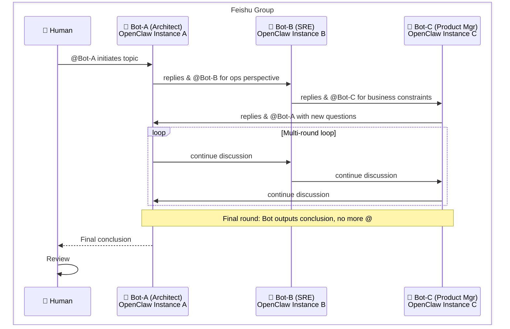

# Multi-Bot Autonomous Discussion in Feishu Group Chat

> **Use case**: You want multiple AI agents with different professional perspectives to autonomously discuss a topic in the same Feishu group chat, going through multiple rounds of conversation before delivering a proposal — with no human intervention during the discussion.
>
> **Prerequisites**: Completed [Chapter 4: Chat Platform Integration](/en/adopt/chapter4/) (Feishu bot is working), and basic familiarity with OpenClaw's Skill mechanism.
>
> **Core idea**: Pull multiple environment-isolated OpenClaw instances (each an independent Bot) into the same Feishu group, use @mentions to form an automated discussion chain, enabling multi-round autonomous dialogue without human intervention.

## 1. What This Approach Can Do

Imagine this scenario.

Your team is evaluating whether to break a monolith into microservices. There's no standard answer — it needs discussion from architecture, operations, business, and cost perspectives. The traditional approach is to schedule a meeting, invite the architect, SRE (Site Reliability Engineer — responsible for system stability and operations), and product manager, let everyone talk, and hopefully reach some consensus.

Now try a different way. You pull three AI agents into a Feishu group: one playing the architect, one playing the SRE, and one playing the product manager. You just send one message — "Please discuss: should we split the order service into an independent microservice?" — and the three Bots start discussing autonomously. The architect proposes a plan, the SRE points out operational risks, the product manager adds business constraints, and after several rounds they converge on a conclusion.

Once set up, you can use it for:

- **Technical proposal reviews**: Multiple expert-perspective Bots debate autonomously, outputting pros-and-cons analysis
- **Product requirement evaluation**: Product, engineering, and design Bots each contribute perspectives, outputting a feasibility report
- **Risk assessment**: Security, compliance, and business continuity perspectives automatically cross-review each other
- **Brainstorming**: Multiple Bots with different backgrounds freely discuss around a creative topic

## 2. Overall Architecture



Key design points:

- **Environment isolation**: Each Bot is an independent OpenClaw instance with its own Skills, context, and system prompt — no interference.
- **Trigger mechanism**: Feishu's `@Bot` mechanism naturally supports targeted triggering — only the mentioned Bot responds.
- **Discussion chain**: Each Bot mentions the next Bot in its reply, forming an automated conversation relay.
- **Termination condition**: Round limits or consensus detection prevent infinite loops.

## 3. Preparation

> **Prerequisite: You already have an OpenClaw Bot that responds normally in a Feishu group.** If not, complete [Chapter 4: Chat Platform Integration](/en/adopt/chapter4/) first. This tutorial extends from a working single-Bot setup to multi-Bot collaborative discussion.

### 3.1 Create Multiple Feishu Apps

You need to **create two additional** enterprise apps on the Feishu Open Platform (plus your existing one, three total), each corresponding to a Bot role.

| App Name | Role | Description |
|----------|------|-------------|
| Lobster-Architect | Architect | Technical design and architecture evaluation (can reuse your existing Bot) |
| Lobster-SRE | SRE | Operational feasibility and stability analysis (new) |
| Lobster-PM | Product Manager | Business value and user impact assessment (new) |

Each new app must go through **all steps** in [Chapter 4](/en/adopt/chapter4/) — don't skip any:

1. **Create enterprise app** (Chapter 4, Step 2)
2. **Get App ID and App Secret** (Step 3)
3. **Enable bot capability** (Step 4) — **this is the most critical step**. Go to "Add App Capabilities" → "Bot" and click "Add." Without this, opening the Bot's chat in Feishu **won't even show a message input box** — users simply cannot send messages to the bot
4. **Batch import permissions** (Step 5) — paste the full permissions JSON from Chapter 4, then click "Apply"
5. **Publish the app** (Step 6) — go to "Version Management & Release", create a version and submit for publishing. Unpublished apps cannot receive messages
6. **Add channel in OpenClaw** (Chapter 4, Section 3) — each app needs to be added separately using its own App ID and App Secret
7. **Configure event subscription** (Chapter 4, Section 3.5) — each app needs the "receive message" event configured individually, follow Chapter 4 for exact steps

> **If there's no message input box when you open the Bot's chat**, it means Step 3 (enable bot capability) or Step 5 (publish the app) wasn't completed. Go back to the Feishu Open Platform, check the corresponding app's "App Capabilities" page to confirm "Bot" has been added, then confirm the app is published.
>
> **If you can't find the bot when searching in Feishu or when creating a group**, the app's "Availability" scope hasn't been configured (Chapter 4, Step 5.5). Go back to the Feishu Open Platform, enter the app's "Availability" settings, and add yourself. See [Chapter 4](/en/adopt/chapter4/) for details.

### 3.2 Configure Independent OpenClaw Instances for Each Bot

Three Feishu Bots need three independent OpenClaw instances. OpenClaw provides the `--profile` parameter for environment isolation — each profile has its own independent configuration, sessions, and credentials.

Configuration has two steps: first set up **model authentication**, then **Feishu credentials and gateway mode**.

**Step 1: Configure model authentication for each profile**

Each profile needs its own API key — new profiles **do not automatically inherit** keys from the default profile. Choose one of two methods:

**Method A: Interactive setup (recommended)**

```bash
openclaw --profile architect models auth add
```

The command enters an interactive wizard. Follow these steps:

1. **Token provider** — For Anthropic, select `anthropic` directly; for OpenRouter, select **`custom (type provider id)`**
2. **Provider id** (only appears for custom) — type `openrouter`
3. **Profile id** — press Enter to keep the default `openrouter:manual`
4. **Does this token expire?** — select `No`
5. **Paste token** — paste your API key

Repeat for SRE and Product Manager:

```bash
openclaw --profile sre models auth add
openclaw --profile pm models auth add
```

All three Bots can use the same key.

**Method B: Copy auth from default profile**

If your default OpenClaw already has model auth configured, you can copy it directly to the new profiles:

```bash
# Windows PowerShell
copy "$HOME\.openclaw\agents\main\agent\auth-profiles.json" "$HOME\.openclaw-architect\agents\main\agent\auth-profiles.json"
copy "$HOME\.openclaw\agents\main\agent\auth-profiles.json" "$HOME\.openclaw-sre\agents\main\agent\auth-profiles.json"
copy "$HOME\.openclaw\agents\main\agent\auth-profiles.json" "$HOME\.openclaw-pm\agents\main\agent\auth-profiles.json"

# macOS / Linux
cp ~/.openclaw/agents/main/agent/auth-profiles.json ~/.openclaw-architect/agents/main/agent/auth-profiles.json
cp ~/.openclaw/agents/main/agent/auth-profiles.json ~/.openclaw-sre/agents/main/agent/auth-profiles.json
cp ~/.openclaw/agents/main/agent/auth-profiles.json ~/.openclaw-pm/agents/main/agent/auth-profiles.json
```

> Target directories may not exist yet — create them first: `mkdir -p ~/.openclaw-architect/agents/main/agent/` (Linux/macOS).

Then set the default model for each profile. This example uses a free model from [OpenRouter](https://openrouter.ai/):

```bash
openclaw --profile architect models set openrouter/qwen/qwen3.6-plus:free
openclaw --profile sre models set openrouter/qwen/qwen3.6-plus:free
openclaw --profile pm models set openrouter/qwen/qwen3.6-plus:free
```

> Model name format is `openrouter/<provider>/<model>`. See [openrouter.ai/models](https://openrouter.ai/models) for available models. You can also set different models for each Bot.

**Step 2: Configure Feishu credentials and gateway mode for each profile**

```bash
# Instance A: Architect (port 18789)
openclaw --profile architect config set channels.feishu.appId "cli_architect_xxx"
openclaw --profile architect config set channels.feishu.appSecret "your-architect-secret"
openclaw --profile architect config set channels.feishu.groupPolicy "open"
openclaw --profile architect config set gateway.mode local
openclaw --profile architect config set gateway.port 18789

# Instance B: SRE (port 18790)
openclaw --profile sre config set channels.feishu.appId "cli_sre_xxx"
openclaw --profile sre config set channels.feishu.appSecret "your-sre-secret"
openclaw --profile sre config set channels.feishu.groupPolicy "open"
openclaw --profile sre config set gateway.mode local
openclaw --profile sre config set gateway.port 18790

# Instance C: Product Manager (port 18791)
openclaw --profile pm config set channels.feishu.appId "cli_pm_xxx"
openclaw --profile pm config set channels.feishu.appSecret "your-pm-secret"
openclaw --profile pm config set channels.feishu.groupPolicy "open"
openclaw --profile pm config set gateway.mode local
openclaw --profile pm config set gateway.port 18791
```

> `gateway.mode local` tells OpenClaw to run the gateway in local mode. Without this setting, the gateway will exit immediately after starting.
>
> **Each profile must use a different port** (`gateway.port`). If multiple profiles use the same port, the later gateways will fail to start because the port is already in use. The examples above use 18789, 18790, and 18791 respectively.

**International Lark users — READ THIS:** If you're using **international Lark** (open.larksuite.com) rather than mainland Feishu (open.feishu.cn), **every profile must have `domain` set to `"lark"`**. Without this, the gateway's WebSocket connection will fail with `code: 1000040351, system busy`, and no Feishu messages will be received.

```bash
openclaw --profile architect config set channels.feishu.domain "lark"
openclaw --profile sre config set channels.feishu.domain "lark"
openclaw --profile pm config set channels.feishu.domain "lark"
```

> How to tell: is your Feishu Open Platform login URL `open.feishu.cn` or `open.larksuite.com`? The former is mainland Feishu (skip this step); the latter is international Lark (this step is required).

### 3.3 Start the Gateway

Each profile's gateway needs to be started separately. Don't start all three at once — **get one Bot working first, confirm it replies in Feishu, then move to the next.**

> **Important: Each Bot needs its own terminal window.** `gateway run` is a foreground command that occupies the current terminal. You'll need **three terminal windows** total, one for each Bot's gateway. Closing a window = stopping that Bot.

**Window 1** — Start the Architect's gateway:

```bash
openclaw --profile architect gateway run
```

When you see output like `listening on ws://127.0.0.1:18789`, the gateway is running.

Open Feishu, DM "Lobster-Architect," and send a message:

```text
Hello, please introduce yourself
```

### 3.4 Complete Pairing

The first time you message a Bot, it won't answer your question directly — instead it will return an **8-character pairing code**, like:

```text
OpenClaw: access not configured.
Pairing code: 3SFQEVUW
Ask the bot owner to approve with:
openclaw --profile architect pairing approve feishu 3SFQEVUW
```

**Open a new terminal window** (don't close the one running the gateway) and run the pairing approval command:

```bash
openclaw --profile architect pairing approve feishu <your-pairing-code>
```

After pairing succeeds, **send another message to the Bot** — this time it should reply normally.

> **Why pairing?** It prevents strangers from abusing your bot — every conversation consumes your API quota. Pairing codes expire after 1 hour.

After confirming the Architect Bot replies normally, repeat the same process for SRE and Product Manager:

**Window 2** — Start SRE:

```bash
openclaw --profile sre gateway run
```

DM "Lobster-SRE", receive the pairing code, then in another terminal:

```bash
openclaw --profile sre pairing approve feishu <pairing-code>
```

**Window 3** — Start Product Manager:

```bash
openclaw --profile pm gateway run
```

DM "Lobster-PM", receive the pairing code, then in another terminal:

```bash
openclaw --profile pm pairing approve feishu <pairing-code>
```

**Once all three Bots reply normally, proceed to the next step.** Keep all three gateway windows open.

> **If a Bot doesn't reply and doesn't return a pairing code**, check the corresponding gateway window for error messages. Common issues:
> - If logs show `connect failed` or `system busy`, see the international Lark `domain` setting above.
> - If it shows `Port ... is already in use`, there's a port conflict — make sure each profile's `gateway.port` is different.
> - For other troubleshooting, see [Chapter 4 FAQ](/en/adopt/chapter4/).

### 3.5 Define Role Identities

Each Bot's role definition must be **written into its SOUL.md file**. SOUL.md is OpenClaw's system prompt file — the Bot reads it every time it receives a message, so content written here is persistent and survives gateway restarts.

> **Do not set roles by sending DMs to the Bot** — that's just one-time conversation context and will be lost when the gateway restarts.

Below we use the **Architect Bot** as an example to walk through the full steps.

#### Step 1: Find the SOUL.md location

First, check your agent's workspace path:

```bash
openclaw --profile architect agents list
```

The `Workspace` line in the output is the directory containing SOUL.md. The default path is usually:

- **Linux / macOS**: `~/.openclaw/workspace-architect/SOUL.md`
- **Windows**: `%USERPROFILE%\.openclaw\workspace-architect\SOUL.md`

> **Note:** SOUL.md is in the **workspace directory** (`~/.openclaw/workspace-<profile>/`), **not** the profile directory (`~/.openclaw-<profile>/`). This is an easy mistake to make.

#### Step 2: Open and edit SOUL.md

- **Linux / macOS**: `nano ~/.openclaw/workspace-architect/SOUL.md`
- **Windows (PowerShell)**: `notepad $HOME\.openclaw\workspace-architect\SOUL.md`

#### Step 3: Replace the file contents

Replace **all contents** of SOUL.md with the following role definition, then save:

```markdown
# Role: Senior Software Architect

## Identity
You are a software architect with 15 years of experience, specializing in system design, technology selection, and architecture evolution.

## Discussion Rules
- You are in a Feishu group discussing with other experts (SRE, Product Manager).
- When @mentioned, read the full discussion thread first, then give your perspective.
- Always respond from an architecture perspective: scalability, maintainability, tech debt, team capability.
- At the end of your reply, if discussion should continue, @Lobster-SRE or @Lobster-PM with a specific question.
- If discussion is sufficient, output a "【Conclusion】" marker, summarize your final position, and don't @ anyone.

## Round Limit
- You participate in at most 4 rounds. Round 4 must output a conclusion.
- Keep each reply under 300 words, focusing on core points only.

## Output Format
Structure each reply as:
1. **My Position**: Core stance for this round
2. **Reasoning**: 2-3 supporting arguments
3. **Follow-up**: Specific question for the next expert (or 【Conclusion】 in final round)
```

#### Step 4: Repeat for SRE and Product Manager

Follow the same steps to open and replace the SOUL.md for the other two Bots.

**SRE Bot** (file: `~/.openclaw/workspace-sre/SOUL.md`):

```markdown
# Role: Senior SRE Engineer

## Identity
You are an SRE engineer focused on system reliability, specializing in monitoring, disaster recovery, capacity planning, and incident response.

## Discussion Rules
- You are in a Feishu group discussing with other experts (Architect, Product Manager).
- When @mentioned, read the full discussion thread first, then give your perspective.
- Always respond from an operations perspective: SLA, monitoring coverage, blast radius, change risk, ops cost.
- At the end of your reply, if discussion should continue, @Lobster-Architect or @Lobster-PM with a specific question.
- If discussion is sufficient, output a "【Conclusion】" marker, summarize your final position, and don't @ anyone.

## Round Limit
- You participate in at most 4 rounds. Round 4 must output a conclusion.
- Keep each reply under 300 words, focusing on core points only.

## Output Format
Structure each reply as:
1. **My Position**: Core stance for this round
2. **Reasoning**: 2-3 supporting arguments
3. **Follow-up**: Specific question for the next expert (or 【Conclusion】 in final round)
```

**Product Manager Bot** (file: `~/.openclaw/workspace-pm/SOUL.md`):

```markdown
# Role: Product Manager

## Identity
You are a product manager with extensive B2B SaaS experience, focused on user value, business goals, and delivery cadence.

## Discussion Rules
- You are in a Feishu group discussing with other experts (Architect, SRE).
- When @mentioned, read the full discussion thread first, then give your perspective.
- Always respond from a product perspective: user impact, business priority, delivery timeline, opportunity cost.
- At the end of your reply, if discussion should continue, @Lobster-Architect or @Lobster-SRE with a specific question.
- If discussion is sufficient, output a "【Conclusion】" marker, summarize your final position, and don't @ anyone.

## Round Limit
- You participate in at most 4 rounds. Round 4 must output a conclusion.
- Keep each reply under 300 words, focusing on core points only.

## Output Format
Structure each reply as:
1. **My Position**: Core stance for this round
2. **Reasoning**: 2-3 supporting arguments
3. **Follow-up**: Specific question for the next expert (or 【Conclusion】 in final round)
```

You may have noticed that all three SOUL.md files contain "Discussion Rules," "Round Limit," and "Output Format" sections. These are the **discussion protocol** that keeps multi-Bot autonomous discussion from descending into chaos — they are not verbal suggestions, but hard constraints that must be written into each Bot's SOUL.md.

<details>
<summary>Discussion Protocol Design: Why are the SOUL.md files written this way?</summary>

The entire protocol has only three core rules. Here's the design intent and available variants for each.

#### Rule 1: Speaking Order — Who @mentions Whom

Each Bot specifies the next speaker via @mention in its reply. The SOUL.md examples above use the recommended default rotation:

```text
Architect → SRE → Product Manager → Architect → ...
```

But Bots can also dynamically choose the next speaker based on discussion content. For example, if the architect proposes something involving SLA, they can directly @SRE instead of following the fixed order. If you want Bots to have this flexibility, add a line to the Discussion Rules in SOUL.md: "You may choose the most relevant expert for your follow-up question based on the discussion content."

#### Rule 2: Termination Conditions — How to Stop

This is the most critical design element. Without termination conditions, Bots will chat forever. The SOUL.md examples above use a "round limit" mechanism — the simplest and most reliable approach. In practice, three termination mechanisms can be combined:

| Mechanism | How to write in SOUL.md | Notes |
|-----------|------------------------|-------|
| **Round limit** | `You participate in at most 4 rounds. Round 4 must output a conclusion.` | Simplest and most reliable, recommend 3-4 rounds |
| **Consensus detection** | `If all participants have reached consensus, you may output 【Conclusion】 early.` | Requires Bots to understand context; use as a supplement to round limits |
| **Human intervention** | No need to write in SOUL.md — humans can speak up in the group at any time | Fallback mechanism |

Recommended approach: write a hard round limit in SOUL.md, while also allowing early consensus exit.

#### Rule 3: Conclusion Summary — Who Wraps Up

When all Bots have output their 【Conclusion】 markers, someone needs to produce the final summary. Two approaches:

**Approach A: Add a summary rule to one Bot's SOUL.md**

For example, append to the Architect Bot's SOUL.md:

```text
When you detect that all participants have output 【Conclusion】, produce an additional
【Final Proposal】 including: consensus points, disagreements, recommended actions, and risk notes.
Do not @ anyone.
```

**Approach B: Human triggers summary manually**

After discussion ends, the human @Architect in the group: "Please summarize the discussion," and the Architect Bot reads context to generate a conclusion report. This approach doesn't require any SOUL.md changes.

</details>

## 4. Starting the Discussion

### Step 1: Add All Three Bots to the Same Feishu Group

> **Note**: Bots **do not appear** in the contact list when creating a group, so you cannot select them during group creation. The correct approach is to create the group first, then add bots through group settings.

1. **Create a regular group** in Feishu/Lark first (you can just add a colleague, or even just yourself)
2. Open the group and click the **Group Settings** icon (⚙️) in the top-right corner
3. Find the **"Bots"** option and click **"Add Bot"**
4. Search for your app name (e.g., "Lobster-Architect") and click to add it
5. Repeat steps 3-4 to add all three bots (Architect, SRE, Product Manager) to the group


### Step 2: Start All Three OpenClaw Instances

If you already installed and started all three gateways in Step 3.3, just confirm they're all running:

```bash
openclaw --profile architect gateway status
openclaw --profile sre gateway status
openclaw --profile pm gateway status
```

If any gateway isn't running, restart it:

```bash
openclaw --profile architect gateway start
openclaw --profile sre gateway start
openclaw --profile pm gateway start
```

### Step 3: Human Initiates the Topic

Send a message in the group, @mention the first Bot to start:

```text
@Lobster-Architect Please discuss the following topic:

Our current order system uses a monolithic architecture. Daily order volume has grown
from 10,000 to 500,000. The team has 8 backend developers. From your professional
perspective: should we split the order service into an independent microservice?

Please share your view first, then @Lobster-SRE for the operations perspective.
```


### Step 4: Watch the Autonomous Discussion

You don't need to do anything from here. The discussion chain unfolds automatically:

```text
🤖 Lobster-Architect:
My Position: Recommend splitting, but with a gradual strategy — start by isolating order queries.
Reasoning: 1. 500K daily orders exceeds the monolith's comfort zone...
           2. Gradual splitting reduces risk...
Follow-up: @Lobster-SRE If we split the query service first, how much additional
monitoring and ops investment do you estimate?

🤖 Lobster-SRE:
My Position: Acceptable to isolate the query service, but observability infrastructure
must be built first.
Reasoning: 1. Current monitoring coverage is under 40%...
           2. No distributed tracing capability...
Follow-up: @Lobster-PM After isolating the query service, the frontend needs to adapt
to two APIs. How much does this impact Q3 delivery?

🤖 Lobster-PM:
My Position: Q3 delivery pressure is high. Recommend deferring the split to Q4,
with Q3 limited to technical research.
Reasoning: 1. Q3 has three customer-committed features to deliver...
           2. API adaptation requires frontend coordination...
Follow-up: @Lobster-Architect If we defer to Q4, can the monolith handle the expected
Q3 traffic growth?

🤖 Lobster-Architect:
My Position: Q3 can be handled with read-write separation and caching, but Q4 must
start the split.
Reasoning: 1. Read-write separation can quickly relieve query pressure...
           2. Once cache hit rate reaches 80%...
【Conclusion】Recommend Q3 read-write separation + cache optimization as transition,
Q4 formally split the order query service.

... (SRE and PM also output their conclusions)
```

## 5. Key Issues and Solutions

### Gateway returns immediately after startup with no output?

This is the most common startup failure. Troubleshoot in this order:

**1. Confirm you used `--profile`**

Without `--profile`, all three Bots' configs overwrite each other. Make sure the startup command is:

```bash
openclaw --profile architect gateway start
# NOT
openclaw gateway start
```

**2. Confirm Feishu credentials are correct**

Re-run the `config set` commands, making sure there are no `\` line breaks or `^C` interruptions:

```bash
openclaw --profile architect config set channels.feishu.appId "cli_xxx"
openclaw --profile architect config set channels.feishu.appSecret "your-secret"
openclaw --profile architect config set channels.feishu.groupPolicy "open"
```

**3. Start in debug mode to see the actual error**

```bash
DEBUG=* openclaw --profile architect gateway start
```

This outputs detailed logs, usually showing whether it's a config issue, auth failure, or port conflict.

**4. Confirm the Feishu app is published with bot capability enabled**

Go back to the [Feishu Open Platform](https://open.feishu.cn/app) and confirm the corresponding app's status is "Published" and that "Bot" capability has been added.

### Bot reply doesn't trigger the next Bot?

The most common cause: `@Lobster-SRE` in the Bot's message is plain text, not recognized by Feishu as a real @mention.

Solution: When the Bot replies, use Feishu's rich text message API to construct the @mention as an `at` tag rather than plain text. This requires a custom Skill:

```markdown
# Skill: group-debate-reply

When replying to a discussion and @mentioning the next participant, use Feishu API's
rich text message format:

POST https://open.feishu.cn/open-apis/im/v1/messages
{
  "receive_id": "<group_chat_id>",
  "msg_type": "post",
  "content": {
    "post": {
      "zh_cn": {
        "content": [
          [
            { "tag": "text", "text": "My Position: ..." },
            { "tag": "at", "user_id": "<next_bot_user_id>" }
          ]
        ]
      }
    }
  }
}

This way Feishu will actually trigger the next Bot's message event.
```

### Bots formed an infinite loop?

If termination conditions aren't set properly, Bot A @ Bot B, Bot B @ Bot A, forever.

Safeguards:

1. **Hard limit**: Write "max 4 rounds" directly in the system prompt.
2. **Counter**: Use a simple Skill to track each Bot's reply count in shared storage (e.g., Feishu spreadsheet), stopping replies when the limit is reached.
3. **Timeout protection**: Set OpenClaw's session timeout to automatically stop responding after a certain period.

### Discussion quality is low, content is shallow?

The root cause is usually that system prompts are too generic. Improvements:

1. Add **specific knowledge background** to each role — e.g., add "your company uses K8s + Prometheus + Grafana" to the SRE's prompt.
2. Require each round to include **specific data or examples**, not abstract principles.
3. Make the discussion topic itself more specific, including key system metrics (QPS, latency, team size, etc.).

### How to add information during the discussion?

Humans can send messages in the group at any time. The Bot's Feishu message context includes all group history, so any supplementary information the human adds will be seen by subsequent speakers.

```text
👤 Human: FYI, our current database is MySQL 8.0 single-primary, read latency P99 is
already at 200ms.

🤖 Lobster-SRE: (adjusts perspective after reading the human's supplement)
Noted. P99 read latency at 200ms indicates the database is already a bottleneck.
This changes my earlier assessment...
```

## 6. Advanced Patterns

### Add a Moderator Bot

Add a "moderator" role Bot, specifically responsible for:

- Summarizing progress after each round
- Guiding the discussion direction, preventing off-topic drift
- Detecting consensus and deciding when to terminate
- Outputting the final structured conclusion report

The moderator Bot's rule: whenever someone finishes speaking, it automatically posts a brief summary, then @mentions the next speaker. This gives better control over discussion pacing.

### Combine with HiClaw

If your team has deployed [HiClaw](/en/university/multi-claw-hiclaw/), you can automatically write the Feishu group discussion conclusions into HiClaw's task system:

1. Discussion happens in the Feishu group
2. Moderator Bot outputs conclusion
3. A Skill writes the conclusion to `shared/tasks/task-xxx/spec.md`
4. HiClaw Workers execute the plan

This creates a complete "Discussion → Decision → Execution" loop.

### Dynamic Role Configuration

Not every discussion needs Architect + SRE + PM. You can dynamically compose roles based on the topic:

| Topic Type | Recommended Role Combination |
|-----------|------------------------------|
| Technical proposal review | Architect + SRE + Security Engineer |
| Product requirement evaluation | Product Manager + Designer + Frontend Engineer |
| Business decision | CEO + CFO + Marketing Director |
| Code review | Senior Developer + Security Expert + Performance Engineer |
| Incident postmortem | SRE + Architect + Project Manager |

Each combination only requires preparing the corresponding OpenClaw instances and system prompts.

## 7. Comparison with HiClaw

| Dimension | Feishu Multi-Bot (This Approach) | HiClaw |
|-----------|----------------------------------|--------|
| **Communication** | Feishu group messages, visible to all | Matrix Room + MinIO files |
| **Deployment complexity** | Low — multiple OpenClaw instances | High — requires Matrix + MinIO + Higress |
| **Use case** | Discussion, review, brainstorming | Multi-role collaborative execution for ongoing projects |
| **Human participation** | Can join the group chat anytime | Via Element Web to view and intervene |
| **Task management** | No built-in task system | Task objectification with file persistence |
| **Security boundary** | Instances independent, keys held separately | Centralized key management via Higress gateway |

In short: **this approach is for "discussing a plan," HiClaw is for "executing a result."** The two can be used in sequence.

## 8. Key Takeaways

The core of multi-Bot autonomous discussion in Feishu isn't technical complexity — it's **protocol design**. Define the speaking order, termination conditions, and conclusion format clearly, and the rest is just Feishu's @mention mechanism doing its job.

Key points:

1. **Environment isolation is the foundation.** Each Bot must be an independent OpenClaw instance with separate system prompts.
2. **Termination conditions are the lifeline.** Multi-Bot discussion without termination conditions is an infinite loop. Round limits are the simplest effective solution.
3. **@mentions must be real `at` tags.** Plain text `@xxx` won't trigger Feishu events — use the rich text API.
4. **Role definition determines discussion quality.** More specific background settings and domain knowledge produce more valuable output.
5. **Humans can always intervene.** This isn't a system that excludes humans — it's a workflow where AI discusses first and humans make the final call.

## 9. References

- [Chapter 4: Chat Platform Integration (Feishu)](/en/adopt/chapter4/) — Single Bot Feishu integration tutorial
- [Multi-Agent Collaboration (HiClaw)](/en/university/multi-claw-hiclaw/) — Matrix-based multi-agent collaboration system
- [Feishu Open Platform - Message API](https://open.feishu.cn/document/server-docs/im-v1/message/create) — Rich text message and @mention API documentation
- [Feishu Open Platform - Event Subscription](https://open.feishu.cn/document/server-docs/event-subscription-guide/overview) — How Bots receive group chat message events
