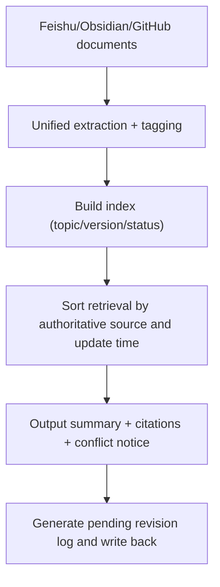

# Multi-Agent Collaboration in Practice: Knowledge Base Sharing and Retrieval

> **Use case**: Team agents, customer support, and multiple business units are all writing documents across different media — the latest version is hard to find, and repeated Q&A is constant. This guide focuses on "unified indexing + layered retrieval + traceable citations," helping you first retrieve the most current and authoritative information, then gradually enrich custom capabilities.

## 1. What You'll Get

Once it's running, you'll have:

- Multi-source documents indexed uniformly with automatic tagging
- Retrieval that surfaces "most relevant + most recent" results first, with source links by default
- Automatic generation of "summary + citation + recommendation" for each answer, supporting decision-making
- Multiple agents sharing the same knowledge base, significantly reducing repeated Q&A

## 2. Copy This Prompt to Claw First

```text
Please help me build a "knowledge base sharing and retrieval" workflow: first pull from three sources — Feishu, Obsidian, and GitHub — sort retrieval results by most recently updated and current status, every answer must include a summary, source link, and expiry status, and automatically generate a "pending revision log" indicating which conflicts require human review.
```

If you just want to quickly cross-check versions, add: "prioritize returning GitHub docs, since we treat it as the authoritative source."

## 3. Which Skills You Need

A quick look at what each skill does:

- `skill-vetter`
  Link: <https://llmbase.ai/openclaw/skill-vetter/>
  Purpose: Security scan before installation.
- `feishu-doc`
  Link: <https://www.tmser.com/2026/03/02/%E6%AF%8F%E5%A4%A9%E4%B8%80%E4%B8%AAopenclaw-skill-feishu-doc/>, <https://clawhub.ai/skills/feishu-doc>
  Purpose: Read Feishu documents and extract structured content.
- `github`
  Link: <https://playbooks.com/skills/openclaw/skills/github>
  Purpose: Pull in knowledge from README, PRD, and Issue content.
- `summarize`
  Link: <https://termo.ai/skills/summarize>
  Purpose: Compress long documents into summaries and comparative conclusions.
- `obsidian`
  Link: <https://openclawskills.wiki/skill/obsidian>
  Purpose: Manage local notes and long-term knowledge retention.

Install with:

```bash
clawhub install skill-vetter
clawhub install feishu-doc
clawhub install github
clawhub install summarize
clawhub install obsidian
```

| Skill | Purpose |
| --- | --- |
| `skill-vetter` | Security scan |
| `feishu-doc` | Read and extract structured content from Feishu documents |
| `github` | Sync knowledge from README/PRD/Issues |
| `summarize` | Compress long documents and extract comparative content |
| `obsidian` | Local note archiving and long-term management |

If you want to connect more private sources, treat the custom retrieval skill in Section 6 as a fallback.

## 4. What You'll See Once It's Running

```text
[3-Line Summary]
"Customer handoff process" follows Feishu PRD v3 as the authority, last updated 2026-03-20. GitHub docs still says "48 hours" — recommend following the PRD.

[Detailed Citations]
1) Feishu PRD: "Customer Handoff Process v3" 2026-03-20 Wang Wu
2) GitHub docs /handoff.md 2026-02-28 (conflicts with PRD)

[Recommended Action]
"Pending revision log" generated: update "48 hours" to "24 hours" in GitHub docs.
```

If the output gives conclusions without citations, it means you don't yet have a working skill combination.

## 5. How to Set It Up Step by Step

### Workflow Architecture



### Configuration Steps

1. Define the authority source order, e.g., "GitHub docs > Feishu PRD > Obsidian notes."
2. Standardize metadata fields: topic, status (draft/active/archived), owner, last updated.
3. In the prompt, require "summary first, then citations, then conflicts/recommendations."
4. Configure `summarize` with "max 3-line summary, each with a link, ask again if conflicting."
5. Use `feishu-doc` to write back the "pending revision log," recording the source and reason for each update.

## 6. If No Existing Skill Fits, Have Claw Build One

If your knowledge sources are too private, write a minimal skill:

```
kb-retrieval/
├── SKILL.md
└── scripts/
    └── search.py
```

Minimal `SKILL.md`:

```md
---
name: kb-retrieval
description: Multi-source knowledge retrieval + source citation
---

# KB Retrieval

Invoke when consolidating information from Feishu/GitHub/Obsidian.
```

The script just needs to "read multiple sources, sort by update time, output structured citations, and generate a pending revision log."

## 7. Further Optimization

- Add "owner + update time + status" to each citation so it's easy to tell if it's outdated.
- Add "explain reasoning when defaulting to authoritative source during conflicts" to the prompt for accountability.
- Have Claw generate a weekly knowledge update report (e.g., track 5 changes every Friday).

## 8. Frequently Asked Questions

**Q1: Too many retrieval results to read through?**
A: Show only the top three "authoritative and recent" results first, then offer an "all results" link.

**Q2: Conflicting conclusions across sources?**
A: Add "if conflicting, present the conflict content + suggested resolution" to the prompt.

**Q3: Knowledge base growing too large to maintain?**
A: Set a "status" field; auto-downrank by "draft/active/archived" and auto-archive expired content.

## 9. Related Reading

- [Customer Support and CRM Coordination Assistant](/en/university/revops-assistant/)
- [Meeting Scheduling and Minutes Automation](/en/university/meeting-ops/)
