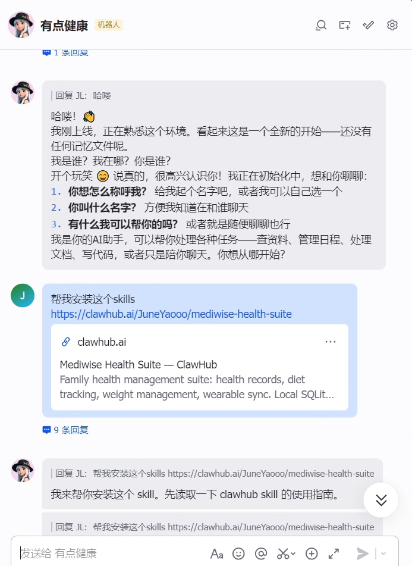
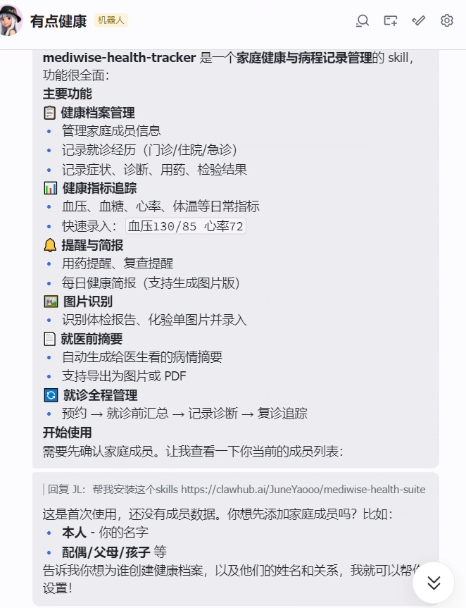
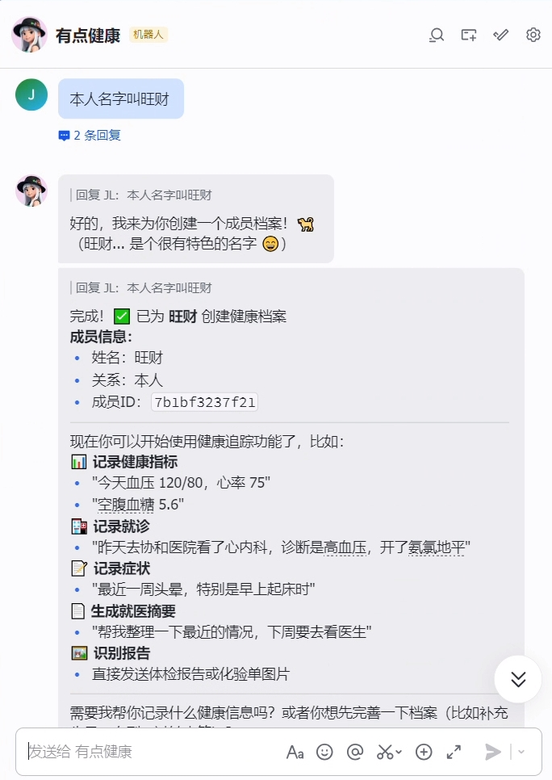

# Skill Development in Practice: Local Health Management Assistant

> Health management has two common pitfalls: **gaps in records** and **not being able to find critical information when you need it**. This hands-on guide will walk you through building a "local-first" family health assistant on top of OpenClaw, connecting daily logging, trend tracking, and pre-appointment preparation into one reusable workflow.
>
> Once you have it running, you will have a health data hub you can use long-term: **record anytime, query anytime, and quickly organize before a doctor's visit**.

# Part 1: Build a Minimal Health Skill Yourself (From Zero to One)

If you want hands-on practice, there is no need to build a complete system right away. Start with a minimal viable version:

- Add family members
- Log daily metrics (e.g., blood pressure, heart rate)
- Query the most recent records

Get these 3 things working first, then gradually add capabilities like diet, weight, and visit summaries.

## 1.1 Define the Minimal Goal (MVP)

The first version covers only 3 actions:

1. `add-member`: Add a member
2. `add-metric`: Log a metric
3. `summary`: View recent health records

The benefits of this approach:

- Simple structure, less likely to get stuck on complex design
- Quickly validates the core pipeline: "conversation → structured data → query result"
- Future extensions won't require starting over

## 1.2 Create the Directory

```Bash
skills/
└── local-health-mini/
    ├── SKILL.md
    ├── scripts/
    │   ├── member.py
    │   ├── metric.py
    │   └── query.py
    └── data/
        └── health.db
```

## 1.3 Code: Minimal Runnable Example

### A) `scripts/member.py` (Member Management)

```python
#!/usr/bin/env python3
import argparse
import sqlite3
from pathlib import Path

DB = Path(__file__).resolve().parent.parent / "data" / "health.db"


def init_db(conn):
    conn.execute(
        """
        CREATE TABLE IF NOT EXISTS members (
            id INTEGER PRIMARY KEY AUTOINCREMENT,
            name TEXT NOT NULL,
            relation TEXT NOT NULL,
            created_at DATETIME DEFAULT CURRENT_TIMESTAMP
        )
        """
    )


def list_members(conn):
    rows = conn.execute("SELECT id, name, relation FROM members ORDER BY id").fetchall()
    if not rows:
        print("No members yet")
        return
    for r in rows:
        print(f"{r[0]}. {r[1]} ({r[2]})")


def add_member(conn, name, relation):
    conn.execute("INSERT INTO members (name, relation) VALUES (?, ?)", (name, relation))
    conn.commit()
    print(f"Member added: {name} ({relation})")


def main():
    parser = argparse.ArgumentParser()
    sub = parser.add_subparsers(dest="cmd", required=True)

    sub.add_parser("list")
    p_add = sub.add_parser("add")
    p_add.add_argument("--name", required=True)
    p_add.add_argument("--relation", required=True)

    args = parser.parse_args()

    DB.parent.mkdir(parents=True, exist_ok=True)
    conn = sqlite3.connect(DB)
    init_db(conn)

    if args.cmd == "list":
        list_members(conn)
    elif args.cmd == "add":
        add_member(conn, args.name, args.relation)


if __name__ == "__main__":
    main()
```

### B) `scripts/metric.py` (Metric Logging)

```python
#!/usr/bin/env python3
import argparse
import sqlite3
from pathlib import Path

DB = Path(__file__).resolve().parent.parent / "data" / "health.db"


def init_db(conn):
    conn.execute(
        """
        CREATE TABLE IF NOT EXISTS metrics (
            id INTEGER PRIMARY KEY AUTOINCREMENT,
            member_id INTEGER NOT NULL,
            type TEXT NOT NULL,
            value TEXT NOT NULL,
            measured_at TEXT NOT NULL,
            created_at DATETIME DEFAULT CURRENT_TIMESTAMP
        )
        """
    )


def add_metric(conn, member_id, mtype, value, measured_at):
    conn.execute(
        "INSERT INTO metrics (member_id, type, value, measured_at) VALUES (?, ?, ?, ?)",
        (member_id, mtype, value, measured_at),
    )
    conn.commit()
    print(f"Metric recorded: member_id={member_id}, {mtype}={value}, time={measured_at}")


def main():
    parser = argparse.ArgumentParser()
    sub = parser.add_subparsers(dest="cmd", required=True)

    p_add = sub.add_parser("add")
    p_add.add_argument("--member-id", type=int, required=True)
    p_add.add_argument("--type", required=True)
    p_add.add_argument("--value", required=True)
    p_add.add_argument("--measured-at", required=True)

    args = parser.parse_args()

    DB.parent.mkdir(parents=True, exist_ok=True)
    conn = sqlite3.connect(DB)
    init_db(conn)

    if args.cmd == "add":
        add_metric(conn, args.member_id, args.type, args.value, args.measured_at)


if __name__ == "__main__":
    main()
```

### C) `scripts/query.py` (Recent Records Summary)

```python
#!/usr/bin/env python3
import argparse
import sqlite3
from pathlib import Path

DB = Path(__file__).resolve().parent.parent / "data" / "health.db"


def summary(conn, member_id, days):
    rows = conn.execute(
        """
        SELECT type, value, measured_at
        FROM metrics
        WHERE member_id = ?
          AND date(measured_at) >= date('now', ?)
        ORDER BY measured_at DESC
        LIMIT 20
        """,
        (member_id, f"-{days} day"),
    ).fetchall()

    if not rows:
        print(f"No records in the last {days} days.")
        return

    print(f"Records from the last {days} days (member_id={member_id}):")
    for t, v, m in rows:
        print(f"- {m} | {t}: {v}")


def main():
    parser = argparse.ArgumentParser()
    sub = parser.add_subparsers(dest="cmd", required=True)

    p_sum = sub.add_parser("summary")
    p_sum.add_argument("--member-id", type=int, required=True)
    p_sum.add_argument("--days", type=int, default=7)

    args = parser.parse_args()

    conn = sqlite3.connect(DB)

    if args.cmd == "summary":
        summary(conn, args.member_id, args.days)


if __name__ == "__main__":
    main()
```

### D) `SKILL.md` (Minimal Action Mapping Example)

```markdown
---
name: local-health-mini
description: Minimal local health logging Skill (members, metrics, summary)
---

# local-health-mini

When the user expresses any of the following intents, call the scripts according to the rules below:

1. Add a member
   - First run: `python3 {baseDir}/scripts/member.py list`
   - Then run: `python3 {baseDir}/scripts/member.py add --name "<name>" --relation "<relation>"`

2. Log a metric (blood pressure / heart rate / blood sugar / weight)
   - Run: `python3 {baseDir}/scripts/metric.py add --member-id <id> --type <type> --value "<value>" --measured-at "<datetime>"`

3. View recent health status
   - Run: `python3 {baseDir}/scripts/query.py summary --member-id <id> --days 7`

When returning results to the user, summarize them in natural language rather than pasting raw structured output.
```

## 1.4 Acceptance Test: 6 Conversation Turns

Run through all 6 of the following prompts successfully and your minimal Health Skill is complete:

```Plain
Add a family member named Aunt Li — she is my mother
Log Aunt Li's blood pressure today: 138/88
Log Aunt Li's heart rate today: 76
Log Aunt Li's fasting blood sugar today: 6.4
Show me Aunt Li's health status for the last 7 days
List any abnormal metrics separately
```

## 1.5 Expand by Priority (Recommended Order)

Once the minimal version is stable, gradually add:

1. Image/PDF recognition for data entry
2. Medications and reminders
3. Diet logging
4. Weight and exercise trends
5. Pre-appointment summary (text → image/PDF export)

---

# Part 2: Use the Ready-Made Health Management Skill (`/mediwise-health-suite`) Directly

If you prefer something that works out of the box, you can install the mature solution `mediwise-health-suite` directly.

## 2.1 What This Ready-Made Skill Can Do

MediWise Health Suite is an OpenClaw Skill suite designed for family use. Its core capability is managing all health-related information locally with support for conversational data entry and queries.

It covers the following high-frequency needs:

- **Image recognition logging**: Recognizes physical exam reports, lab results, and prescription images/PDFs, and extracts key health information
- **Health management**: Family member profiles, medical history records, medication tracking, and metric management for blood pressure/blood sugar/heart rate, etc.
- **Exercise management**: Weight goals, exercise logging with calorie tracking, and trend analysis
- **Visit management**: Pre-appointment summary preparation (recent condition, medical history, current medications)
- **Scheduled reminders**: Health logging on schedule, follow-up reminders, and daily reminders
- **Local-first privacy protection**: SQLite local storage by default, with medical and lifestyle data stored in separate databases

The direct benefits of this approach:

- **Your personal health data stays under your control**, with no dependency on external platforms for daily management
- **Local storage is more secure**, reducing unnecessary external exposure
- **Supports future export and migration**, so historical data remains usable when switching devices or environments

## 2.2 Using MediWise as the Example

This guide uses the open-source project MediWise as its example:

- GitHub: <https://github.com/JuneYaooo/mediwise-health-suite>
- ClawHub: <https://clawhub.ai/JuneYaooo/mediwise-health-suite>

It is used here only as a runnable example to demonstrate how to set up a "record, track, and organize" health management workflow. You can substitute your own existing health management Skill — the approach is the same.


## 2.3 Install Directly

```Bash
# Enter your OpenClaw workspace first
cd ~/.openclaw/workspace-health

# Install into the skills/ directory of the current workspace
clawdhub install JuneYaooo/mediwise-health-suite
```

Or install manually:

```Bash
git clone https://github.com/JuneYaooo/mediwise-health-suite.git \
  ~/.openclaw/workspace-health/skills/mediwise-health-suite
```

## 2.4 Two Ways to Use It

### Method A: Slash Command Entry (if your client supports it)

```Plain
/mediwise-health-suite
```

### Method B: Natural Language Directly (universal)

```Plain
Add a family member named Uncle Wang, age 62
Log Uncle Wang's blood pressure today: 145/92, heart rate 80
Give me a summary of Uncle Wang's recent health status
```

## 2.5 Quick Verification After Installation (Including Multimodal)

### Method A: Have the Claw Install the Skill (Conversational)

If your OpenClaw can connect to the internet and execute install commands, you can ask it to install via natural language:

```Plain
Please install this skill for me: JuneYaooo/mediwise-health-suite
Install it into the skills directory of the current workspace, and tell me the installation path when done.
```

After installation, it is recommended to continue with the path check and multimodal verification below.

### Method B: Command-Line Installation and Check

```Bash
# Enter your OpenClaw agent workspace first (path depends on your actual configuration)
cd ~/.openclaw/workspace-health

# Install the skill into skills/ under the current directory
clawdhub install JuneYaooo/mediwise-health-suite
```

> Note: Make sure to enter the correct workspace before installing, to avoid triggering the `escapes plugin root` issue.

After installation, you can run the path check script:

```Bash
bash ~/.openclaw/workspace-health/skills/mediwise-health-suite/install-check.sh
```

### Multimodal Configuration (for Image/PDF Recognition)

```Bash
cd ~/.openclaw/workspace-health/skills/mediwise-health-suite/mediwise-health-tracker/scripts

# List available vision model presets
python3 setup.py list-vision-providers

# Configure the vision model (example)
python3 setup.py set-vision \
  --provider siliconflow \
  --api-key sk-xxx

# Test whether the multimodal configuration is working
python3 setup.py test-vision
```

### Frontend UI Operation Screenshots

#### 1) Download and install skills from the frontend

| 1 | 2 |
|---|---|
|  |  |

#### 2) Configure the multimodal model and upload a test image to verify recognition

| 1 | 2 | 3 |
|---|---|---|
|  |  |  |

### Conversation Verification

After installation is complete, restart the OpenClaw session and send any of the following:

```Plain
Add a family member named Zhang San — he is my father
Log today's blood pressure: 130/85, heart rate 72
Show me the recent health status
```



## 2.6 Four Capabilities to Try First

1. Family member profiles and medical history (`mediwise-health-tracker`)
2. Diet logging (`diet-tracker`)
3. Weight and exercise management (`weight-manager`)
4. Pre-appointment summary preparation (text first, then export to image/PDF)


## 2.7 Recommended Practical Workflow: From Daily Logging to Pre-Appointment Preparation

Follow this sequence to experience the complete closed loop:

1. Create family member profiles
2. Upload a lab result or physical exam report to verify image recognition and data entry
3. Log health metrics continuously for 3–7 days (blood pressure, heart rate, blood sugar)
4. Add exercise and weight records
5. Trigger a "pre-appointment summary" request
6. Set up a scheduled reminder (e.g., log blood pressure every evening)

Example conversation:

```Plain
Add a family member named Dad Zhang, age 65
I'm uploading a physical exam report image — please extract the key metrics and record them
Log Dad Zhang's blood pressure today: 150/95, heart rate 78
Log today's exercise: brisk walking for 45 minutes
Log today's weight: 65kg
I'm about to see a doctor — please summarize the recent situation for me
Please remind me to log my blood pressure every evening at 9 PM
```

---

# Closing

- To learn by building: follow Part 1 and start with the minimal version (code is ready to copy)
- To use something immediately: follow Part 2 and install `/mediwise-health-suite` directly

Both paths can be pursued in parallel: **use the mature solution to meet your immediate needs, then practice the core implementation with the minimal version.**
