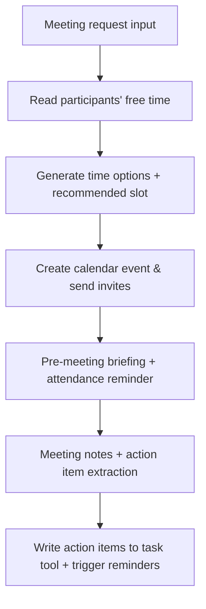

# Business Sales in Practice: Meeting Scheduling and Minutes Automation

> **Use case**: Sales and project teams deal with frequent meetings, scheduling conflicts, insufficient prep, and lost follow-up notes. This guide corresponds to "Meeting Scheduling and Minutes" in the README. The goal is to hand the entire flow — scheduling → pre-meeting → during → post-meeting — to Claw for end-to-end handling.

## 1. What You'll Get

Once it's running, you'll have a reusable meeting operating system:

- Detects conflicts and offers three time options, then returns the top recommendation
- Generates an agenda and background briefing immediately after the meeting is created
- Outputs structured minutes within 5 minutes of the meeting ending, and writes action items into the task system
- Overdue action items trigger automatic reminders at 09:30 and 17:00 daily, preventing "meetings that go nowhere"

## 2. Copy This Prompt to Claw First

```text
Please help me build a "meeting scheduling and minutes automation" workflow: read participants' calendars, give me 3 time options and recommend one, automatically send a briefing package before the meeting, output conclusions/risks/action items within 5 minutes after the meeting ends, and send overdue reminders every day at 09:30 and 17:00. Output summary first, then the full version.
```

If you just want to manage the scheduling phase first, add: "when recommending times, prioritize keeping customer meetings conflict-free" for a simplified version.

## 3. Which Skills You Need

A quick look at what each skill does:

- `skill-vetter`
  Link: <https://llmbase.ai/openclaw/skill-vetter/>
  Purpose: Security check to prevent risky skills from entering the workflow.
- `caldav-calendar`
  Link: <https://playbooks.com/skills/openclaw/skills/caldav-calendar>
  Purpose: Fetch free time, detect conflicts, create and update meetings.
- `feishu-doc`
  Link: <https://www.tmser.com/2026/03/02/%E6%AF%8F%E5%A4%A9%E4%B8%80%E4%B8%AAopenclaw-skill-feishu-doc/>, <https://clawhub.ai/skills/feishu-doc>
  Purpose: Output agendas, minutes, and action items.
- `agentmail`
  Link: <https://docs.agentmail.to/integrations/openclaw>
  Purpose: Generate and send external confirmation emails.

Install with:

```bash
clawhub install skill-vetter
clawhub install caldav-calendar
clawhub install feishu-doc
clawhub install agentmail
```

| Skill | Purpose |
| --- | --- |
| `skill-vetter` | Security check to prevent risky skills from entering production workflows |
| `caldav-calendar` | Fetch free time, detect conflicts, create/update time slots |
| `feishu-doc` | Output agendas, minutes, and action items, with archiving |
| `agentmail` | Generate and send external confirmation emails |

A stable slug for scheduled reminders hasn't been found in the public directory yet. Recommended approach: use `openclaw cron` + a Feishu messaging script to wire it together, or have Claw write a reminder skill in the advanced section.

## 4. What You'll See Once It's Running

```text
[Meeting Recommendation]
Customer meeting at 14:00 (no conflicts, recommended). Friday 16:00 conflicts with internal standup — suggest moving to Wednesday 15:30.

[Pre-Meeting Briefing]
Objective: Confirm delivery scope and resources
Focus areas: budget, risks, dependencies (see attached links)

[Post-Meeting Minutes]
Conclusion: Customer accepts phased delivery
Action items:
- Li Si: deliver formal proposal by Thursday
- Wang Wu: submit progress report by Monday
```

Clear structure that fits on one screen means the prompt is ready to ship.

## 5. How to Set It Up Step by Step

### Workflow Architecture



### Configuration Steps

1. Write scheduling rules: "allow 10:00–18:00 hours, customer meetings take priority, alert if overlap exceeds 15 minutes."
2. Fix the pre-meeting briefing template (meeting objective + questions to confirm + background links).
3. Post-meeting output only: "conclusion / risks / action items," with action items including owner + deadline.
4. Use `openclaw cron` to set two reminders: daily 09:30 for today's action items, every Friday 17:00 for overdue summary.
5. Optional: connect `agentmail` to generate a confirmation email draft, with a prompt to "confirm manually before sending."

## 6. If No Existing Skill Fits, Have Claw Build One

You can start by treating reminder capabilities as a small skill with this structure:

```
meeting-reminder/
├── SKILL.md
└── scripts/
    └── remind.py
```

`SKILL.md` just needs to tell Claw three things: trigger conditions, the three modes (pre-meeting / post-meeting / overdue), and to call `python scripts/remind.py --mode before|after|overdue`. The first version only needs to generate the three types of reminders; you can extend it with `feishu-doc`, `todoist`, and others later.

## 7. Further Optimization

- Add meeting source (customer, internal, external) as metadata for easy template switching.
- Add multi-timezone support: "include each participant's local time and UTC in the output."
- Have minutes auto-generate clickable links and attachment IDs, and write changes back into the retrospective document.

## 8. Frequently Asked Questions

**Q1: Multiple people across timezones — recommendations never quite fit. What do I do?**
A: In the prompt, calculate all times in participants' local time zones, and set the cross-timezone overlap window as a hard constraint.

**Q2: Minutes are too long and nobody reads them. What do I do?**
A: Limit output to "summary + 1 full-length section," and require action items to include owner + deadline.

**Q3: Nobody claims action items. What do I do?**
A: Enforce the rule "no unassigned items leave the meeting," and let automation simply enforce that rule.

## 9. Related Reading

- [Customer Support and CRM Coordination Assistant](/en/university/revops-assistant/)
- [Knowledge Base Sharing and Retrieval](/en/university/knowledge-base/)
- [Automated Research in Practice](/en/university/vibe-research/)
