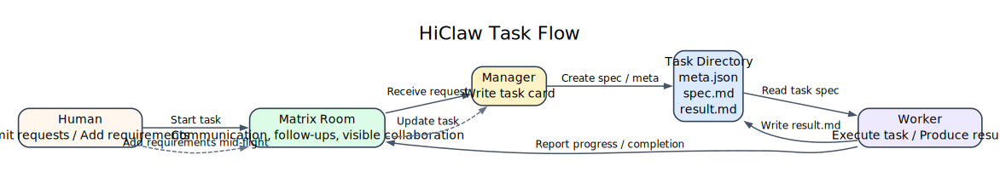
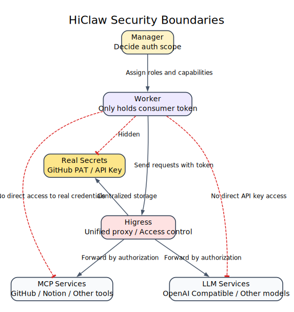
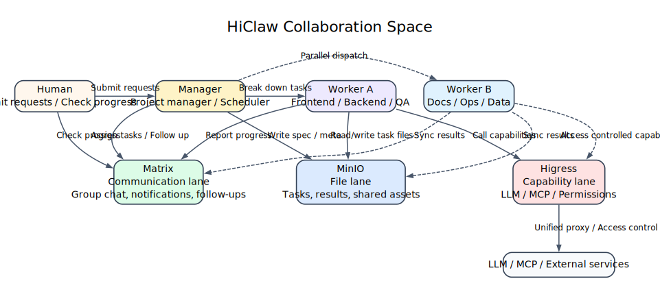
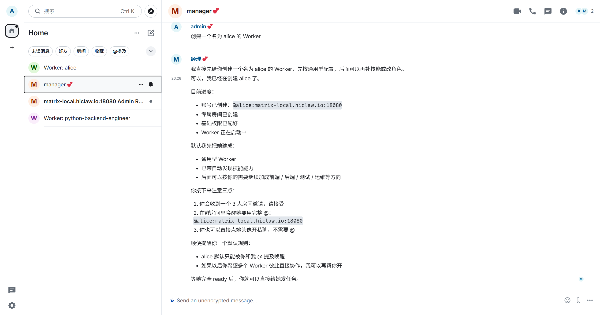
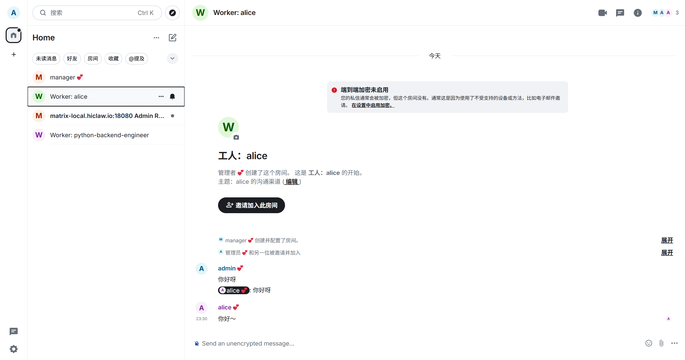

# Multi-Agent Collaboration: Multi OpenClaw / HiClaw

If you only occasionally ask a few questions and tweak a few lines of code, this content won't be of much help to you.
But if your project has been running for many days and you're starting to run into problems like context amnesia, difficulty with multi-person collaboration, untraceable processes, and unclear credential boundaries, then you've hit the limits of the single-Worker approach. Multi-agent collaboration systems like HiClaw are designed to solve exactly these problems.

This content is divided into two parts. The first half explains why a single Worker gets stuck and what HiClaw actually solves. The second half walks you through a local deployment on Windows + WSL2 + Docker, and ends with creating and verifying your first Worker.

## 1. Why a Single Worker Gets Stuck

Let's look at a very common project scenario.

On Day 1, you ask the AI to write a backend API, progress is smooth, and the user authentication module comes together quickly. On Day 3 you come back to continue, and the AI has already forgotten the original database design conventions — you have to re-explain everything. On Day 5 you want to push the frontend in parallel, so you start a new conversation, only to find the two AIs start doing their own thing, and their styles grow increasingly inconsistent. On Day 10 you want to look back at an API contract that was agreed upon a week ago, but it's buried deep in a long chat history. By Day 15 as the project approaches completion, the AI can barely remember the original requirements at all.

The real problem here is usually not that the model isn't smart enough — it's that the collaboration structure is too primitive. The single-Worker approach repeatedly hits four problems in complex projects:

- **Context amnesia.** Early agreements only exist in the session and get buried by later content as the conversation grows.
- **No parallelism.** A single session can only advance one execution thread at a time; multi-role collaboration becomes very awkward.
- **Process black box.** Intermediate state is never persisted to disk, making it hard for humans to supervise or intervene midway.
- **No traceability.** Requirements, results, and state are all scattered across messages, making handoffs and retrospectives expensive.

HiClaw doesn't make the same chat window longer — it transforms "session accumulation" into "task objects + clear role assignments + visible processes."

## 2. What HiClaw Actually Solves

HiClaw's approach is not complicated. It doesn't simply spin up more AI instances; it treats multiple Workers as a manageable small team. The Manager handles coordination and assignment, Workers handle execution, and humans can always view progress, add requirements, interrupt, and adjust — all within the same collaborative space.

This approach works because of four key mechanisms.

### 1. Dual-Track Communication: Messages Are Visible, Files Persist

If tasks are communicated entirely through chat, trying to figure out the current status three days later means scrolling through messages. After requirements have changed three times, it becomes very hard to tell which version is the final one.

HiClaw splits collaboration into two tracks. The message track handles notifications, follow-ups, and coordination — typically through Matrix Rooms. The file track stores requirements, results, and state — typically through shared storage like MinIO. This way, chat no longer carries the substance of tasks; it only handles action synchronization.

A typical workflow looks like this:

1. The Manager announces a new task in the room.
2. The requirements are written to `shared/tasks/task-001/spec.md`.
3. The Worker reads the requirements file from shared storage.
4. After completing the work, the Worker writes the result back to `result.md`.
5. The Worker reports completion back in the room.

The benefits are straightforward. The communication process is visible to humans, task materials have a fixed address, and external capabilities and credentials can be managed within clearer boundaries.

### 2. Task Objectification: Verbal Instructions Become Trackable Cards

If a Manager only says "build a login feature" in a group chat, the Worker will very likely build a form based on their own interpretation, only to discover after completion that what was actually needed was OAuth login. The problem isn't in the execution — it's that the requirement was never objectified from the start.

In HiClaw, a task is typically laid out in a directory like this:

```text
shared/tasks/task-001/
├── meta.json     # task status, assignee, priority
├── spec.md       # requirements document, acceptance criteria
└── result.md     # output, completion notes
```

The division of responsibility is clear. `spec.md` captures the requirements and acceptance criteria, `meta.json` stores status, assignee, and priority, and `result.md` describes what was ultimately delivered. When you look up a task, you start with the task object itself — no need to scroll through chat history first.



The most important point of this diagram is: chat handles communication, and the task directory carries the substance of the task. When requirements change, the Manager updates the task card, and Workers continue execution based on the latest file.

### 3. Worker Identity Definition: Not Every Worker Is a "General-Purpose AI"

If all Workers are just "generic AI," the boundary between a frontend Worker and a backend Worker becomes very blurry. It also becomes hard to specify which Worker can access the test environment, which one is only allowed to handle documentation, and which one has permission to call GitHub capabilities.

HiClaw's approach is to define a Worker's identity file first — for example, `SOUL.md`. This file typically specifies the role, task scope, capabilities, and permission boundaries up front. When the Manager creates a Worker, it reads these definitions so the Worker has a clear role from day one.

Think of this step as "issuing an onboarding profile before assigning work." This way, a frontend Worker, a backend Worker, and a test Worker are no longer just the same model with different names — they are role instances with distinct responsibilities.

### 4. Layered Boundaries: Manager Handles Scheduling, Workers Handle Execution, Gateway Handles Capabilities

The biggest risk in multi-agent collaboration is not scheduling complexity — it's loss of access control. If 5 Workers all share the same OpenAI Key or GitHub PAT, a single misconfigured or misused Worker can cause consequences that are very difficult to clean up.

HiClaw addresses this with layering. The Manager handles coordination and scheduling, Workers handle execution, MinIO stores tasks and results, and a gateway like Higress acts as a centralized proxy for external capabilities and credentials. This means Workers typically hold internal credentials rather than having external secrets stuffed directly into each container.

The benefits are:

- Workers don't need to directly hold a GitHub PAT or LLM API Key.
- Real credentials can be centrally managed on the gateway side.
- Which Worker can call which API can be individually authorized — and individually revoked.



The key point of this diagram is simple: Workers hold internal tokens — external credentials are not stuffed directly into them.

## 3. Understanding the Overall Architecture

Using a frontend-backend collaboration scenario as an example, the overall relationship in HiClaw can be understood through this diagram:



When looking at this diagram, just focus on three lines.

The first is the communication line. Humans, the Manager, and Workers collaborate in Matrix rooms — task progression, follow-up questions, and synchronization all happen here.
The second is the file line. Task descriptions, state, and results are not buried in messages — they are persisted to shared storage.
The third is the capability line. If a Worker needs to access an LLM, MCP, or other external service, it doesn't connect directly — it goes through a controlled gateway.

If you keep these three lines in mind and look back at the four mechanisms above, the whole system will no longer feel abstract.

## 4. When Is HiClaw Worth Using

HiClaw is suited for ongoing projects, not one-off Q&A sessions.

If your project will run for multiple days or even weeks, requires parallel work across roles like frontend, backend, testing, and documentation, and you want humans to be able to view progress and intervene at any time, then a collaboration system like HiClaw starts to make sense. Especially when you no longer want to hand production environment credentials directly to every Worker, its boundary design becomes very valuable.

Conversely, if you're just writing a few temporary code snippets, asking occasional questions, don't want to maintain extra components like Matrix, MinIO, and Docker, or you prefer an extremely minimal CLI — there's no need to introduce this system.

## 5. Getting Started from Scratch: Windows + WSL2 + Docker

This is where the tutorial begins. This isn't a high-level overview — it follows executable steps.
After completing this section, you should be able to do three things:

1. Start a single-machine HiClaw instance locally.
2. Log into Element Web and the Higress console.
3. Create a first Worker and verify it can actually respond.

Keep one boundary in mind: the commands below come in two environments.

- Commands marked as `powershell` are executed in Windows PowerShell.
- Commands marked as `bash` are executed in the WSL Ubuntu terminal.

If you're already in the Ubuntu terminal, commands like `cat`, `source`, `mkdir -p`, and `df -h` should be run there directly — don't switch back to Windows PowerShell.

### Step 1: Prepare the Environment

Keep the following checklist in mind:

- A working Windows machine.
- A working LLM API Key.
- The corresponding Base URL and model name.
- Docker Desktop.
- A WSL2 Ubuntu environment.

If WSL is not yet installed, run this in an administrator PowerShell:

```powershell
wsl --install
```

If you want to explicitly install Ubuntu 22.04, also run:

```powershell
wsl --install -d Ubuntu-22.04
```

After installation, restart Windows as prompted. The first time Ubuntu starts, it will ask you to create a Linux username and password.

Once installed, it's a good idea to confirm WSL status with:

```powershell
wsl --list --verbose
```

You should see `Ubuntu-22.04` or a similar distribution, ideally with a status of `Running`.

If Docker Desktop isn't installed yet, download it from the official page: <https://www.docker.com/products/docker-desktop/>. During installation, make sure to confirm you're using the `WSL 2 backend`. After installation, check in Windows PowerShell:

```powershell
docker --version
docker info
```

Then enter the WSL Ubuntu terminal and run these two commands to confirm Docker works in WSL as well:

```bash
docker --version
docker ps
```

If both commands run without errors, Docker is working in both the host and WSL.

Before continuing, do two quick checks. First, check ports:

```bash
ss -tuln | grep -E ':(18080|18001|18088)'
```

If there's no output, the default HiClaw ports are likely free. Then check disk space:

```bash
df -h .
```

Make sure you have more than 10GB of free space available.

### Step 2: Prepare the Non-Interactive Installation Configuration

All commands from this point on are run in the WSL Ubuntu terminal by default.

First, create a working directory:

```bash
mkdir -p ~/projects/hiclaw-deployment
cd ~/projects/hiclaw-deployment
```

Then create an `env.sh` file with the core variables the installation will need:

```bash
cat > env.sh << 'EOF'
#!/bin/bash
export HICLAW_NON_INTERACTIVE=1

export HICLAW_LLM_PROVIDER="openai-compat"
export HICLAW_OPENAI_BASE_URL="https://your-endpoint/v1"
export HICLAW_DEFAULT_MODEL="your-model"
export HICLAW_LLM_API_KEY="sk-your-key"

export HICLAW_ADMIN_PASSWORD="admin123456"
EOF
```

Using `env.sh` instead of interactive prompts isn't about being clever — it makes the process more AI-friendly and much easier to reproduce and debug. Interactive installation works fine too, but if you later want AI to help you review the configuration or repeatedly adjust variables, an environment variable file is far more convenient.

If you're using Alibaba Cloud Bailian, the core configuration would look like this:

```bash
export HICLAW_OPENAI_BASE_URL="https://dashscope.aliyuncs.com/compatible-mode/v1"
export HICLAW_DEFAULT_MODEL="qwen-plus"
export HICLAW_LLM_API_KEY="sk-your-dashscope-key"
```

If you're using another OpenAI-compatible service, use this form:

```bash
export HICLAW_OPENAI_BASE_URL="https://your-endpoint/v1"
export HICLAW_DEFAULT_MODEL="gpt-4o-mini"
export HICLAW_LLM_API_KEY="sk-your-key"
```

### Step 3: Run the Installation

Once `env.sh` is ready, run the following in the WSL Ubuntu terminal:

```bash
cd ~/projects/hiclaw-deployment
source env.sh
bash <(curl -sSL https://higress.ai/hiclaw/install.sh)
```

The installation typically goes through three phases: generating configuration, pulling images, and starting services. The image-pulling step may take 5 to 15 minutes depending on your network and machine.

If the installation succeeds, you should see output similar to:

```text
[HiClaw] === HiClaw Manager Started! ===
  Open: http://127.0.0.1:18088
  Login: admin / [your-password]
```

Seeing this message means the service is basically up and you can proceed to the next verification step.

### Step 4: Verify the Service Is Actually Running

Don't rush to the chat just yet — confirm the service status first.

First, check the containers in WSL:

```bash
docker ps | grep hiclaw
```

If everything is working, you should see `hiclaw-manager` with a status of `Up`.

Second, verify the configuration was actually written to the environment file:

```bash
cat ~/hiclaw-manager.env | grep -E 'LLM|BASE_URL|MODEL'
```

If you prefer to view the same file in Windows PowerShell, you can run:

```powershell
Get-Content $HOME\hiclaw-manager.env | Select-String 'LLM|BASE_URL|MODEL'
```

Third, open Element Web:

`http://127.0.0.1:18088`

Login credentials:

- Username: `admin`
- Password: the `HICLAW_ADMIN_PASSWORD` you set

If the login screen asks you to manually enter a Homeserver, add:

`http://127.0.0.1:18080`

After logging in successfully, you should see a home page similar to this:


If you can see the `manager` user in the left-side list, you're in an interactive state.

Fourth, open the Higress console:

`http://127.0.0.1:18001`

The default account is `admin`, and the default password is typically `admin123456` or whatever you set in your configuration. After logging in, you'll automatically be added to an Admin Room for receiving system notifications:


At this point, you've completed the "service is up" verification. The next step verifies that "collaboration actually works."

### Step 5: Create Your First Worker

Now go back to Element Web.

Click on `manager` in the left conversation list to open the conversation window. The first time you open it, read through its welcome message and description of its capabilities:


The Manager will typically explain that it's responsible for assigning tasks, tracking progress, resolving blockers, and waking the appropriate Workers. As you continue the conversation, you'll see more detailed information:


Next, send it a message to create a Worker, for example:

```text
Create a backend engineer Worker
```

If the creation succeeds, the Manager will return the Worker's details and current progress:


You'll typically see the Worker's name, role, configured capabilities, and whether steps like account registration, room creation, permission configuration, and container startup have completed.

After a moment, you'll receive a Worker room invitation:


Click "Accept" to join the room. At this point, it's confirmed that the Manager isn't just alive — it's actually starting to schedule Workers.

If the default generated name is too long (e.g., `python-backend-engineer`), you can create another Worker with a shorter name:

```text
Create a Worker named alice
```

The Manager will continue returning creation progress:



The creation process typically involves several actions: registering a Matrix account, creating a Consumer in Higress, establishing room relationships between you, the Manager, and Alice, and finally starting the Worker container.

After joining the room, you can also invite other people or other Workers to join:


### Step 6: Verify the Worker Can Actually Call the Model

Now enter the Worker room you just created.

The simplest test is to send a message directly:

```text
Hello there
```

If you want to be more precise, you can also `@alice` directly, or just send a message in her Worker room.

If Alice responds normally, it means at least three chains are working together: Matrix communication is functional, the Higress permission configuration is correct, and the Worker can successfully call the LLM.

An actual conversation would look something like this:



Only when you see this can you truly consider the "local single-machine HiClaw is operational" verification complete.

## 6. Troubleshooting and Cleanup

If you get `bind: address already in use` during installation, it typically means the default ports are already occupied. Just update the port configuration in `env.sh`:

```bash
export HICLAW_PORT_GATEWAY=28080
export HICLAW_PORT_CONSOLE=28001
export HICLAW_PORT_ELEMENT_WEB=28088
```

Then re-run the installation.

If you just want to stop the service and resume it later, run:

```bash
docker stop hiclaw-manager
docker start hiclaw-manager
```

If you want to completely remove the local installation, run:

```bash
docker rm -f hiclaw-manager
docker volume rm hiclaw-data
rm -rf ~/hiclaw-manager
rm ~/hiclaw-manager.env
```

## 7. Key Takeaways

HiClaw's core value is not "spinning up more AI instances" — it's making the collaboration process objectified, traceable, and manageable. The problem with a single Worker is fundamentally a structural problem, not a matter of the model being insufficiently powerful. It's suited for ongoing projects and multi-role collaboration, not one-off Q&A or minimal-setup scenarios. This guide uses the Windows + WSL2 + Docker Desktop path, which is a validated local deployment route, though not the only viable one. Finally, the true success criterion is not whether a page loads, but whether the full chain of `Manager -> Worker creation -> room invitation -> Worker response` runs end-to-end.

## 8. References

- HiClaw official repository: <https://github.com/higress-group/hiclaw>
- `README.zh-CN.md`
- `docs/zh-cn/architecture.md`
- `docs/zh-cn/quickstart.md`
- `manager/agent/skills/worker-management/SKILL.md`
- `manager/agent/skills/worker-management/scripts/create-worker.sh`
