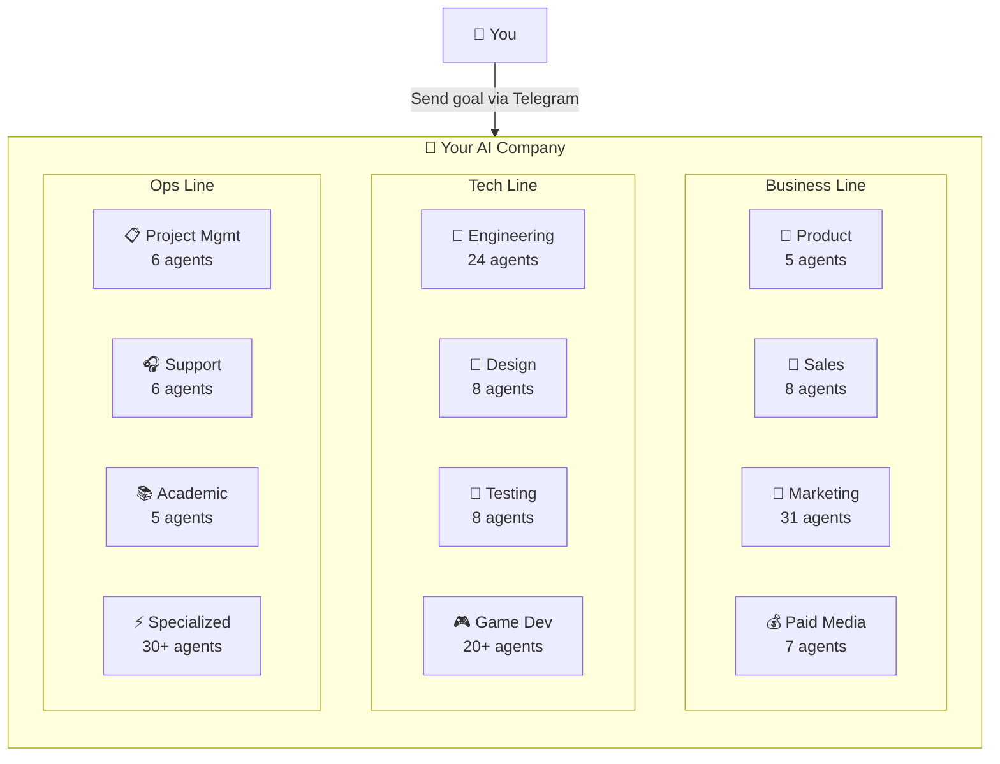
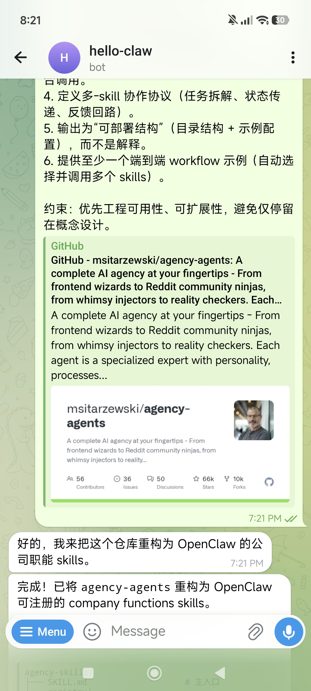
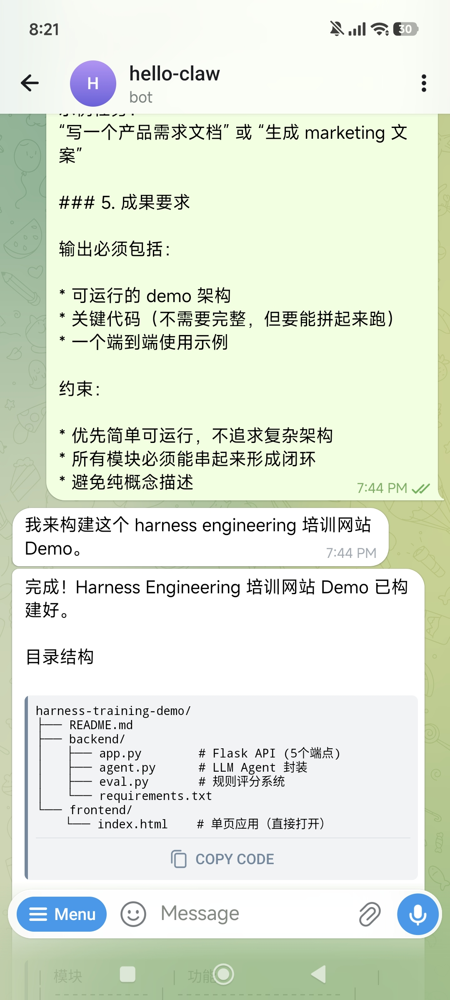
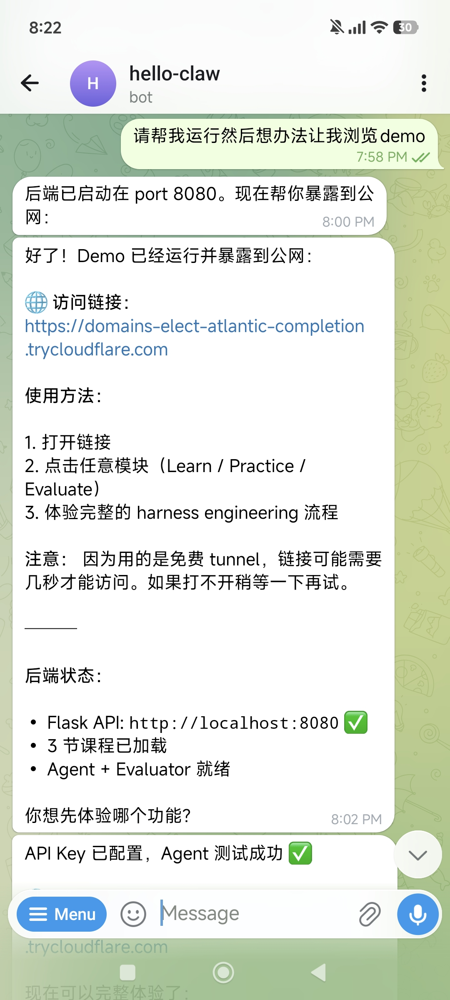

# 🏢 Lobster University: One-Person Company in Practice (One Person, One Team)

> **Use case**: You're a solo developer, freelancer, or small-team founder who wants AI to build a complete virtual company team — product, design, engineering, marketing, sales, ops, HR, and customer support all covered. **Just describe your business goal in Telegram, and the Lobster breaks it down, assigns tasks to the right AI specialists, and delivers actionable results.**

[agency-agents](https://github.com/msitarzewski/agency-agents) is an open-source collection of specialized AI agent personalities, featuring **144 professional AI agents** across **12 functional divisions**. Each agent has its own identity, core workflows, technical deliverables, and success metrics — not generic prompt templates, but battle-tested professional roles.

Combined with OpenClaw's Telegram channel, you can send business goals directly from your phone and let the Lobster automatically dispatch the right agents to collaborate — from requirements analysis to code implementation, from marketing strategy to deployment. Truly **run a company as one person**.

---

## 1. What You'll Get (Real-World Value)

Once set up, you'll have a **24/7 AI company team** at your command:

### Scenario 1: From Idea to MVP
- **Problem**: You have a product idea, but handling requirements, design, development, and deployment alone is overwhelming
- **Solution**: Describe your goal in Telegram — agency-agents automatically breaks it into product requirements → UI design → frontend/backend implementation → deployment, with each step handled by the corresponding AI specialist

### Scenario 2: Quickly Build a Marketing System
- **Problem**: Product is built, but you can't write copy, don't understand SEO, and have no marketing strategy
- **Solution**: The Marketing division's 31 agents handle content creation, social media management, SEO optimization, and email marketing

### Scenario 3: Solo Client Project Delivery
- **Problem**: You've taken on a client project that needs product design, frontend/backend development, testing, and documentation
- **Solution**: Dispatch the complete delivery pipeline on demand: Product → Design → Engineering → Testing → Support

### Scenario 4: Business Decision Support
- **Problem**: Unsure which direction to pursue; need market research, competitive analysis, and user personas
- **Solution**: Product division's Trend Researcher + Marketing division's market analysts collaborate to output structured decision references

---

## 2. Why agency-agents?

### Core Architecture: 12 Divisions × 144 AI Specialists



### Every Agent Is a "Specialist," Not a "Template"

The traditional approach is writing generic prompts and having AI role-play. agency-agents is different — each agent includes:

| Field | Description |
|-------|-------------|
| **Identity & Personality** | Unique persona that influences communication style and decision-making |
| **Core Workflows** | Battle-tested standardized workflows |
| **Technical Deliverables** | Explicit deliverables checklist (not just concepts) |
| **Success Metrics** | Measurable success criteria |
| **Memory & Learning** | Pattern recognition for continuous improvement |

### Division Overview

| Division | Agents | Capabilities |
|----------|--------|-------------|
| **Engineering** | 24 | Frontend/backend dev, DevOps, database optimization, security audits, API design |
| **Marketing** | 31 | Content creation, SEO, social media, email marketing, platform ad strategy |
| **Design** | 8 | UI/UX design, brand visuals, accessibility audits |
| **Sales** | 8 | Outbound strategy, customer discovery, deal strategy |
| **Product** | 5 | Product management, trend research, behavioral design |
| **Testing** | 8 | QA, performance benchmarking, accessibility testing |
| **Project Mgmt** | 6 | Project management, process optimization, resource scheduling |
| **Support** | 6 | Customer service, analytics, finance, compliance |
| **Paid Media** | 7 | PPC, search ads, programmatic buying |
| **Game Dev** | 20+ | Cross-engine development, platform adaptation |
| **Academic** | 5 | History, psychology, anthropology (world-building) |
| **Specialized** | 30+ | Blockchain auditing, Salesforce architecture, and more |

### How It Differs from Plain Prompts

| Feature | Plain Prompts | agency-agents |
|---------|--------------|---------------|
| **Expertise** | Depends on your prompt skill | Pre-built battle-tested workflows |
| **Collaboration** | Single role | Multi-agent collaboration with auto-routing |
| **Deliverables** | Freeform output | Standardized deliverables + success metrics |
| **Reusability** | Rewrite each time | Register as skills, invoke on demand |
| **Scalability** | Manual coordination | Unified registry + routing engine |

> **Key insight**: The value of agency-agents isn't just "better prompts" — it's a **registerable, composable, routable company function system**. Through OpenClaw's skill registration mechanism, these agents become standardized capabilities that can be dispatched at any time.

---

## 3. Configuration Guide: Building Your AI Company

### 3.1 Prerequisites

| Requirement | Description |
|-------------|-------------|
| OpenClaw installed and running | Base environment ready |
| Telegram account | For interacting with OpenClaw |
| LLM API Key | Supports OpenAI / Claude / DeepSeek / local models |
| Tool profile set to coding/full | Requires command execution permission, see [Chapter 7](/en/adopt/chapter7/) |

### 3.2 Configure the Telegram Channel

Same as other Lobster University tutorials — set up the Telegram bot first. If you've already configured it in [Automated Research in Practice](/en/university/vibe-research/), skip to 3.3.

**Step 1: Create a Telegram Bot**

Open Telegram, search for `BotFather`, select the official account with the blue verification badge, click **Start**, then send `/newbot`:

BotFather will ask two questions:

1. **Bot display name** — can be anything, e.g., "Lobster"
2. **Bot username** — must end with `bot`, e.g., `HelloClawClaw_bot`

Full conversation example:

```text
You: /newbot
BotFather: Alright, a new bot. How are we going to call it?
           Please choose a name for your bot.
You: Lobster
BotFather: Good. Now let's choose a username for your bot.
           It must end in `bot`.
You: HelloClawClaw_bot
BotFather: Done! Congratulations on your new bot.
           Use this token to access the HTTP API:
           8658429978:AAHNbNq3sNN4o7sDnz90ON6itCfiqqWLMrc
```

> **Important**: Keep this Bot Token safe — you'll need it when configuring OpenClaw.

**Step 2: Connect Telegram in OpenClaw**

On your OpenClaw host, run the onboard command:

```bash
openclaw onboard
```

Skip and continue until you reach the **Select channel** page, choose **Telegram (Bot API)**, and paste your Bot Token.

**Step 3: Get Your Telegram User ID**

In Telegram, find the bot you just created and send `/start`. The bot will reply with your User ID:

```text
OpenClaw: access not configured.

Your Telegram user id: 8561283145

Pairing code: 6KKG7C7K

Ask the bot owner to approve with:
openclaw pairing approve telegram 6KKG7C7K
```

Note the User ID and enter it in the `allowFrom` field. After configuration, select **restart** to restart OpenClaw.

### 3.3 Register agency-agents as OpenClaw Skills

With the Telegram channel ready, transform the 144 AI specialists into standardized OpenClaw skills.

Send this prompt in Telegram:

```text
Read repo: https://github.com/msitarzewski/agency-agents

Goal: Restructure it into a set of "company function skills"
registerable to OpenClaw, for on-demand invocation and auto-routing.

Requirements:
1. Abstract existing agents into standardized skills
   (e.g., product / marketing / sales / ops / hr / support)
2. Each skill must include:
   - name / description (clearly searchable)
   - capabilities (what problems it solves)
   - inputs / outputs schema
   - tools / dependencies
   - prompt template (directly executable)
   - routing tags (for auto-matching)
3. Design a unified skill registry supporting search and composition
4. Define multi-skill collaboration protocol
   (task decomposition, state passing, feedback loops)
5. Output as "deployable structure" (directory + config), not explanations
6. Provide at least one end-to-end workflow example
   (auto-select and invoke multiple skills)

Constraint: Prioritize engineering usability and extensibility.
Avoid staying at conceptual design only.
```



The Lobster reads the entire repository and outputs a complete skill registration structure:

```text
agency-skills/
├── SKILL.md                    # Main entry
├── registry/
│   ├── registry.json          # Skill definitions + routing tags
│   └── COLLABORATION.md       # Multi-skill collaboration protocol
├── product/                    # 🧭 Product Management
├── marketing/                  # 📣 Marketing
├── sales/                      # 🎯 Sales
├── ops/                        # ⚙️ Operations
├── hr/                         # 👥 Human Resources
├── support/                    # 🎧 Customer Support
├── engineering/                # 🔧 Engineering
├── design/                     # 🎨 Design
├── workflows/                  # End-to-end workflows
└── scripts/router.py           # Routing CLI
```

Each skill includes standardized fields (name, description, capabilities, inputs/outputs schema, prompt template, routing tags) and supports auto-routing:

```text
$ python scripts/router.py "write PRD for feature X"
→ 🧭 PRODUCT (matched: feature, PRD)

$ python scripts/router.py "build outbound campaign"
→ 📣 MARKETING + 🎯 SALES
```

> **Core value**: This step transforms 144 scattered agents into searchable, composable, standardized capabilities. For any subsequent business goal, the Lobster can automatically match and dispatch the right skills.

---

## 4. First Run: From Goal to MVP Demo

With skills registered, let's run an end-to-end business scenario — **from a business goal to a working demo website**.

### 4.1 Send Your Business Goal

Describe what you want to build in Telegram. Here's an example using a harness engineering training website:

```text
Goal: Design and implement a harness engineering training website Demo (MVP)

Requirement: Quickly build a runnable, demonstrable minimal system,
not a complete product.

Tasks:

1. Product structure (minimal closed loop)
   Design 3 modules:
   - Learn: Core courses (harness engineering concepts)
   - Practice: Simple agent harness experiments (e.g., prompt + eval loop)
   - Evaluate: Evaluate and provide feedback on agent output

2. Course content (minimal set)
   Provide 3 lessons:
   - What is harness engineering (definition + architecture)
   - Agent feedback loop (input → execution → evaluation → iteration)
   - Runtime scaffolding (tools / memory / routing)
   Each lesson includes a brief explanation + a runnable experiment

3. Technical implementation (must be runnable)
   - Frontend: Simple page (Next.js or static HTML)
   - Backend: Lightweight API (Node / Python)
   - Agent: Simple LLM call wrapper
   - Eval: Rule-based or simple scoring function

4. Demo scenario (must work end-to-end)
   Implement full flow:
   User input → agent execution → eval scoring → optimization suggestions

Constraint: Prioritize simplicity and runnability.
All modules must connect to form a closed loop.
```



### 4.2 Lobster Auto-Dispatches Skills

After sending, the Lobster activates the product-launch workflow, dispatching in sequence:

1. **Product** → Analyze requirements, define product structure and modules
2. **Design** → Design page layouts and interaction flows
3. **Engineering** → Implement frontend and backend code
4. **Support** → Write usage documentation

Within minutes, you'll receive the build completion message:

```text
Done! Harness Engineering Training Demo is ready.

harness-training-demo/
├── README.md
├── backend/
│   ├── app.py        # Flask API (5 endpoints)
│   ├── agent.py      # LLM Agent wrapper
│   ├── eval.py       # Rule-based scoring system
│   └── requirements.txt
└── frontend/
    └── index.html    # Single-page app (open directly)
```

| Module | Function |
|--------|----------|
| 📚 Learn | 3 courses, each with a runnable experiment |
| 🔧 Practice | Agent single execution / feedback loop |
| 📊 Evaluate | PRD + marketing copy — two complete demos |

### 4.3 Run and Deploy the Demo

Code is generated, but you want to see it in the browser. Just tell the Lobster:

```text
Please run it and find a way to let me browse the demo
```



The Lobster will:
1. Start the backend service (Flask API on port 8080)
2. Configure frontend static file serving
3. Expose the Demo to the internet via **Cloudflare Tunnel**

```text
Done! Demo is running and exposed to the internet:

🌐 Access link:
https://domains-elect-atlantic-completion.trycloudflare.com

How to use:
1. Open the link
2. Click any module (Learn / Practice / Evaluate)
3. Experience the full harness engineering flow

Backend status:
• Flask API: http://localhost:8080 ✅
• 3 courses loaded
• Agent + Evaluator ready
```

> **Cloudflare Tunnel**: The Lobster uses the free `cloudflared` service to create a temporary tunnel — no domain or port forwarding configuration needed. The link is valid as long as the tunnel process is running.

### 4.4 View the Demo

Open your browser and visit the link to see a complete training website demo:


The full end-to-end loop is working:
- **Learn** → Browse course content, understand core concepts
- **Practice** → Input a task (e.g., "Write a product requirements document"), let the Agent execute
- **Evaluate** → Agent output is scored by the evaluation system, returns optimization suggestions

> **Note**: This demo is just a minimal runnable prototype. If you get a 404 on first visit, the frontend static files may not be configured yet — just tell the Lobster and it'll fix it. In practice, the value of an MVP is rapid idea validation, not perfection.

---

## 5. Advanced Scenarios: From MVP to Operations

### Scenario 1: Full Product Launch

Have multiple divisions collaborate on the entire journey from concept to launch:

```text
Goal: Complete launch preparation for [your product name]

Need:
1. Product: Finalize PRD and user stories
2. Design: Design landing page and core interactions
3. Engineering: Implement core features and deploy
4. Marketing: Write launch copy, prepare social media content
5. Support: Write user guide and FAQ
```

The Lobster activates the `product-launch` workflow: `product → design → engineering → marketing → support`, with each stage's output feeding into the next.

### Scenario 2: Quickly Build a Marketing Plan

```text
Goal: Design a complete content marketing plan for my SaaS product

Need:
- Target user personas and pain point analysis
- Content calendar (Blog / Newsletter / Social media)
- SEO keyword strategy
- 3 sample blog articles
- Landing page copy
```

The Marketing division's Content Creator, SEO Strategist, and Social Media Manager collaborate to produce a complete plan.

### Scenario 3: Client Project Delivery

```text
Goal: Build a data dashboard for client [XXX]

Tech stack: React + FastAPI + PostgreSQL

Need:
1. Requirements analysis and data model design
2. Backend API implementation
3. Frontend pages and chart components
4. Testing and deployment scripts
5. Delivery documentation
```

Engineering's Frontend Developer, Backend Architect, and Database Specialist work together, with Project Management tracking progress.

### Scenario 4: Competitive Research & Strategy

```text
Goal: Analyze product strategies of [Competitor A], [Competitor B], [Competitor C]

Need:
- Feature matrix comparison
- Pricing strategy analysis
- User review summary
- Differentiation opportunity identification
- Action recommendations
```

Product's Trend Researcher + Marketing's market analysis agents jointly produce a structured report.

### Scenario 5: Iterative Improvement

Not satisfied with the first delivery? Just add requirements:

```text
The training website demo needs improvements:
1. Learn module: add syntax highlighting for code examples
2. Practice module: support multi-turn conversations
3. Evaluate module: add radar chart for evaluation dimensions
4. Overall: add responsive layout for mobile access
```

The Lobster iterates on existing code — no need to start from scratch.

---

## 6. Troubleshooting

### Issue 1: Lobster Doesn't Know How to Use Registered Skills

**Common causes**:
- Prompt doesn't reference skill names explicitly — add "use the product skill" or "invoke the engineering team" in your follow-up messages
- registry.json routing tags aren't precise enough — go back to Telegram and have the Lobster optimize the routing tags

**Solution**:

```text
List all registered skills and auto-select the right ones for:
[your goal description]
```

### Issue 2: Demo Build Fails or Code Errors

**Common causes**:
- Missing Python/Node.js dependencies — have the Lobster run `pip install` or `npm install` first
- API Key not configured — ensure the LLM API Key is properly set
- Port already in use — specify a different port

**Diagnostic steps**:

```bash
openclaw logs --limit 50    # Check OpenClaw logs
```

### Issue 3: Cloudflare Tunnel Not Accessible

**Common causes**:
- Backend service not running — check if the Flask/Node process is alive
- Frontend static files not configured — backend needs to serve static files too
- Free tunnel is unstable — wait a few seconds and retry, or have the Lobster recreate the tunnel

### Issue 4: Telegram Bot Not Responding

**Diagnostic steps**:

1. Verify Bot Token is correct: check in BotFather
2. Verify `allowFrom` includes your User ID
3. Verify OpenClaw has been restarted: `openclaw restart`
4. Check OpenClaw health: `openclaw doctor`

---

## 7. Security & Compliance Reminders

### Reminder 1: Telegram Bot Token Security

- **Never leak your Bot Token**: Anyone with the token can control your bot
- **Never commit tokens to Git**: Use environment variables or `.env` files
- **Rotate tokens regularly**: If you suspect a leak, use `/revoke` in BotFather to regenerate
- **Restrict `allowFrom`**: Only allow your own User ID to interact with the bot

### Reminder 2: API Key & Demo Security

- Never hardcode LLM API Keys in demo code — use environment variables
- Don't repeatedly send API Keys in plaintext via Telegram chat
- Demos exposed via Cloudflare Tunnel are **publicly accessible** — don't include sensitive data
- Free tunnel links are temporary, but anyone can access them while active

### Reminder 3: Deliverable Review

- Code and plans generated by agency-agents are AI output — **always review before production use**
- Marketing copy, legal compliance content needs professional review
- Demo code is suitable as **prototypes and POCs**; production deployment requires security audits

---

## 8. Summary: One Person's Company, 144 AI Specialists' Team

The core value of agency-agents is **turning complete company functions into AI capabilities** — just describe your business goal, and 12 divisions with 144 AI specialists handle the rest:

- **Full-function coverage**: Product → Design → Engineering → Testing → Marketing → Sales → Ops → Support
- **Auto-routing dispatch**: Just describe your goal; the Lobster automatically matches the best agent combination
- **Standardized delivery**: Every agent has explicit deliverables and success metrics — not vague suggestions
- **Mobile control**: Send goals and receive results anytime via Telegram
- **Rapid iteration**: Not satisfied? Add requirements and iterate on existing work

**Remember**: A one-person company doesn't mean "one person does everything" — it means **one person directs an AI team to do everything**. agency-agents transforms you from executor to decision-maker — you decide the "what" and "why," the AI team handles the "how."

## References

### agency-agents
- [agency-agents (AI Specialist Team Collection)](https://github.com/msitarzewski/agency-agents)
- [msitarzewski (Project Author)](https://github.com/msitarzewski)

### Telegram
- [Telegram BotFather (Create Telegram Bot)](https://t.me/BotFather)
- [Telegram Bot API Official Docs](https://core.telegram.org/bots/api)

### Related Tutorials
- [Automated Research in Practice (Describe It, Get a Paper)](/en/university/vibe-research/)
- [Chapter 7: Tools & Scheduled Tasks](/en/adopt/chapter7/)
- [Chapter 4: Chat Platform Integration](/en/adopt/chapter4/)
