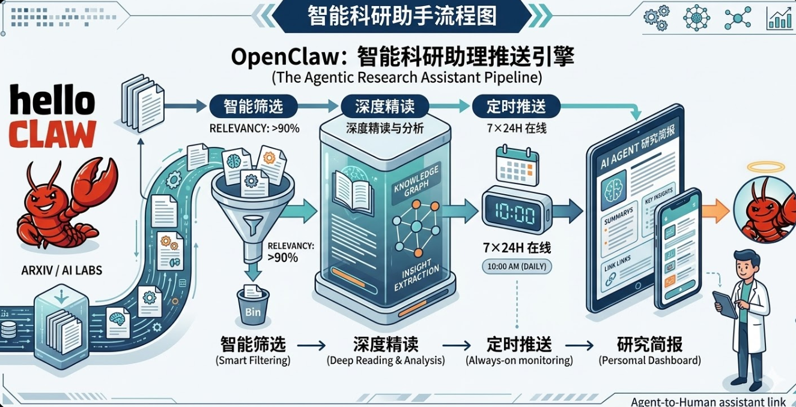
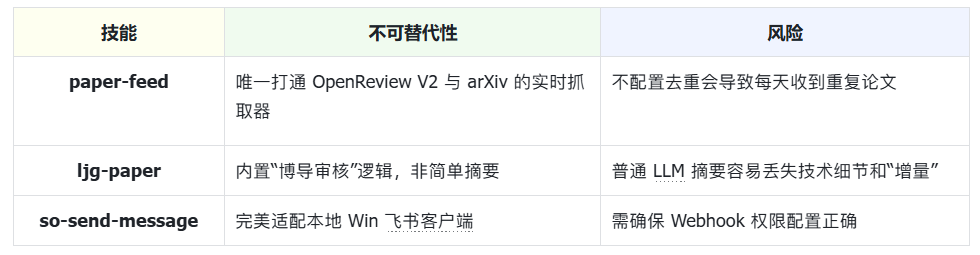
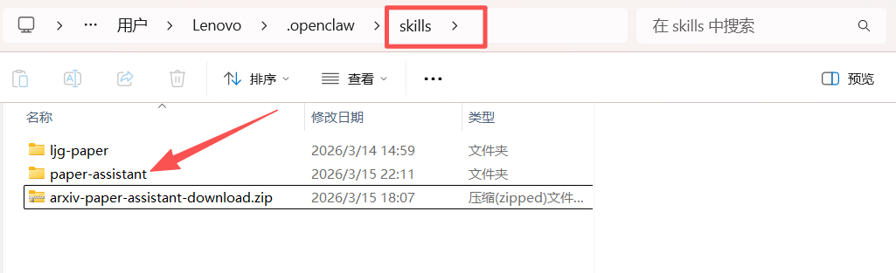
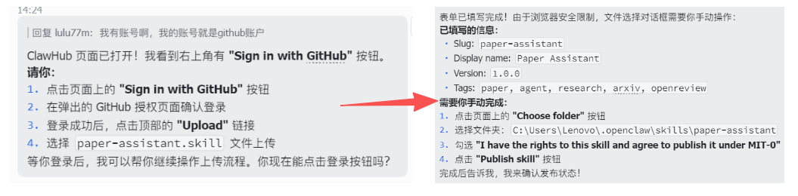
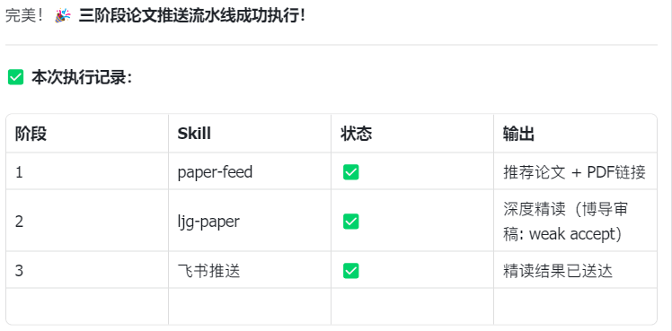

# Skill Development in Practice: Agent Paper Push Assistant

> Every day, hundreds of new papers appear on arXiv. Most of the time, we skim a few titles and close the tab, or collect a pile of PDFs that we never actually read. This article uses **OpenClaw** to build an automated research assistant that turns paper tracking into a fully automated pipeline: **fetch papers → smart filtering → auto deep-read → push notifications**.
> Once it's running, you'll have a **24/7 digital research assistant** at your disposal.



# 1 What This Research Assistant Can Do

**Imagine this scenario:**
While you're taking it easy during the day, this assistant automatically filters through **arXiv** and **top-conference paper pools** to surface new papers worth following. Every morning when you open Feishu, you'll find a neatly organized paper digest — including the abstract, link, and recommendation rationale. In just a few minutes, you can catch up on the most noteworthy paper of the day.

This article uses **Agent research papers** as the demonstration example, but you can apply it to any research direction simply by changing the keywords.


At its core, this research assistant is an **automated research intelligence pipeline** consisting of three capability modules:

* **Paper Fetching:** The system automatically retrieves the latest papers from **arXiv** and **OpenReview**, building a candidate paper pool.
* **Smart Filtering:** It uses an LLM to analyze paper titles and abstracts, keeping only those relevant to the target research direction and with genuine research value, while automatically filtering out engineering or tooling papers.
* **Auto Deep-Read and Push:** The system performs structured parsing of the filtered papers, generates brief interpretations, and automatically pushes them to a group chat via a **Feishu bot**.

This forms a complete pipeline: fetch papers → filter papers → generate interpretations → push notifications.

In practice, I typically spend just a few minutes each day browsing the push content to learn about the most noteworthy new paper of the day — dramatically reducing the time spent manually sifting through papers.

# 2 Skill Selection: Minimum Viable Toolchain

To quickly build a paper push system, we only need a **minimal toolchain**.

In OpenClaw, you don't even need to run these commands manually — just **tell the AI in natural language which components you want to install**, and it will complete the environment setup automatically.

```Plain
# Must install core scripts and Skills first
python scripts/setup_env.py      # Environment initialization
clawhub install paper-assistant  # Paper push engine (core)
clawhub install ljg-paper        # Paper deep-read Skill (the soul)
clawhub install so-send-message  # Feishu push plugin (closes the loop)
```

Once installed, a minimal working **automated paper pipeline** is ready:



*Note: Without deduplication, the system may push duplicate papers every day.*

# 3 Configuration Guide

I provide two configuration methods:

* **Install directly via ClawHub** (recommended, simplest configuration)
* **Manual configuration** (for readers who want to understand the full implementation process)

## 3.1 Install Directly via ClawHub

If you don't want to go through the **manual configuration in Section 3.2**, you can use the Skill I've already packaged. Simply enter the following instructions in the OpenClaw dialog:

1. Install the CLI:

```Markdown
Help me install the CLI
```

2. Install the Skill:

```Markdown
Please download this skill from ClawHub <arxiv-paper-assistant> and install it to ~/.openclaw/skills/paper-assistant
```

If the installation succeeds, you should see a file named `paper-assistant` in the `skills` directory.



3. Start a new OpenClaw session to load the new Skills.

## 3.2 Manual Configuration

If you want to understand **the entire Skill implementation process**, follow the steps below to configure it manually.

### 3.2.1 Project Directory (Reference)

The skill project directory we'll build looks like this:

```Bash
openclaw/ (this is your main project folder)
├── openclaw.json        # Core configuration file
└── skills/              # <--- Skill definition directory
    ├── paper-assistant/
    │   │── scripts/             # <--- Script directory you create
    │   │   ├── paper_feed.py    # Fetching logic
    │   │   └── mark_pushed.py   # Deduplication logic
    │   ├── data/                # <--- Data directory you create
    │   │   └── pushed.json      # Paper push history (database)
    │   └── skill.yaml
```

If any folders are missing, create them manually.

### 3.2.2 Environment Initialization

1. Create the paper-assistant skill directory under `skills`, and initialize the paper push record file:

```Plain
Create a Skill named paper-assistant:
1. Generate a paper-assistant folder under the skills directory
2. Create pushed.json under paper-assistant/data, with content {"pushed":[]}
```

`pushed.json` is used to record **paper IDs that have already been pushed**, preventing duplicate pushes.

2. Install dependencies:

```Markdown
Install dependencies pymupdf and unstructured
```

These two libraries are used for **subsequent paper parsing and structured processing**.

### 3.2.3 Deploy Local Scripts

Create two script files under `skills/paper-assistant/scripts/`:

1. `fetch_papers.py`: Responsible for fetching papers from arXiv and OpenReview, and generating the candidate paper pool.

```Plain
#!/usr/bin/env python3
"""
paper-assistant: fetch Agent-related papers from OpenReview and arXiv
Output a JSON-format list of candidate papers (excluding rejected papers and already-pushed papers)
"""

import json
import os
import sys
import urllib.request
import xml.etree.ElementTree as ET

SCRIPT_DIR = os.path.dirname(os.path.abspath(__file__))
DATA_DIR = os.path.join(SCRIPT_DIR, "..", "data")
PUSHED_FILE = os.path.join(DATA_DIR, "pushed.json")

# API endpoints
OPENREVIEW_SEARCH = "https://api2.openreview.net/notes/search"
ARXIV_API = "https://export.arxiv.org/api/query"

# Conference configs
CONFERENCES = [
    {"group": "ICLR.cc/2026/Conference", "label": "ICLR 2026"},
    {"group": "NeurIPS.cc/2025/Conference", "label": "NeurIPS 2025"},
]

ARXIV_QUERY = "cat:cs.AI+AND+all:agent+system"


def load_pushed():
    """Load already-pushed paper IDs."""
    if not os.path.exists(PUSHED_FILE):
        os.makedirs(DATA_DIR, exist_ok=True)
        with open(PUSHED_FILE, "w") as f:
            json.dump({"pushed": []}, f)
        return set()
    with open(PUSHED_FILE, "r") as f:
        data = json.load(f)
    return set(data.get("pushed", []))


def fetch_openreview(group, label, limit=100):
    """Fetch accepted agent papers from OpenReview."""
    url = f"{OPENREVIEW_SEARCH}?query=agent&group={group}&limit={limit}"
    try:
        req = urllib.request.Request(url)
        req.add_header("User-Agent", "paper-assistant/1.0")
        with urllib.request.urlopen(req, timeout=30) as resp:
            data = json.loads(resp.read().decode())
    except Exception as e:
        print(f"[WARN] Failed to fetch {label}: {e}", file=sys.stderr)
        return []

    papers = []
    for note in data.get("notes", []):
        fc = note.get("forumContent", {})
        if not fc:
            continue

        # Extract venue info
        venueid = fc.get("venueid", {})
        venueid_val = venueid.get("value", "") if isinstance(venueid, dict) else str(venueid)
        venue = fc.get("venue", {})
        venue_val = venue.get("value", "") if isinstance(venue, dict) else str(venue)

        # Skip rejected papers
        if "Rejected" in venueid_val or "Rejected" in venue_val:
            continue

        # Only keep accepted (Poster/Spotlight/Oral)
        accepted = any(k in venue_val for k in ["Poster", "Spotlight", "Oral"])
        if not accepted:
            continue

        # Extract fields
        title = fc.get("title", {})
        title_val = title.get("value", "") if isinstance(title, dict) else str(title)

        abstract = fc.get("abstract", {})
        abstract_val = abstract.get("value", "") if isinstance(abstract, dict) else str(abstract)

        authors = fc.get("authors", {})
        authors_val = authors.get("value", []) if isinstance(authors, dict) else []

        pdf = fc.get("pdf", {})
        pdf_val = pdf.get("value", "") if isinstance(pdf, dict) else str(pdf)
        pdf_url = f"https://openreview.net{pdf_val}" if pdf_val else ""

        keywords = fc.get("keywords", {})
        keywords_val = keywords.get("value", []) if isinstance(keywords, dict) else []

        forum_id = note.get("forum", note.get("id", ""))

        papers.append({
            "id": f"openreview:{forum_id}",
            "title": title_val,
            "authors": authors_val if isinstance(authors_val, list) else [authors_val],
            "abstract": abstract_val,
            "pdf": pdf_url,
            "venue": venue_val,
            "source": label,
            "keywords": keywords_val if isinstance(keywords_val, list) else [],
        })

    return papers


def fetch_arxiv(max_results=50):
    """Fetch recent agent papers from arXiv (2026+)."""
    url = f"{ARXIV_API}?search_query={ARXIV_QUERY}&sortBy=submittedDate&sortOrder=descending&max_results={max_results}"
    try:
        req = urllib.request.Request(url)
        req.add_header("User-Agent", "paper-assistant/1.0")
        with urllib.request.urlopen(req, timeout=30) as resp:
            data = resp.read().decode()
    except Exception as e:
        print(f"[WARN] Failed to fetch arXiv: {e}", file=sys.stderr)
        return []

    ns = {"a": "http://www.w3.org/2005/Atom"}
    root = ET.fromstring(data)

    papers = []
    for entry in root.findall("a:entry", ns):
        published = entry.find("a:published", ns).text[:10]
        # Only 2026+ papers
        if published < "2026-01-01":
            continue

        title = entry.find("a:title", ns).text.strip().replace("\n", " ")
        summary = entry.find("a:summary", ns).text.strip().replace("\n", " ")
        arxiv_id = entry.find("a:id", ns).text  # e.g. http://arxiv.org/abs/2603.xxxxx
        arxiv_short = arxiv_id.split("/abs/")[-1] if "/abs/" in arxiv_id else arxiv_id

        authors = []
        for author in entry.findall("a:author", ns):
            name = author.find("a:name", ns)
            if name is not None:
                authors.append(name.text)

        papers.append({
            "id": f"arxiv:{arxiv_short}",
            "title": title,
            "authors": authors,
            "abstract": summary,
            "pdf": f"https://arxiv.org/pdf/{arxiv_short}",
            "venue": "arXiv preprint",
            "source": "arXiv 2026",
            "keywords": [],
        })

    return papers


def main():
    pushed = load_pushed()

    all_papers = []

    # Fetch from OpenReview
    for conf in CONFERENCES:
        papers = fetch_openreview(conf["group"], conf["label"])
        all_papers.extend(papers)
        print(f"[INFO] {conf['label']}: fetched {len(papers)} accepted papers", file=sys.stderr)

    # Fetch from arXiv
    arxiv_papers = fetch_arxiv()
    all_papers.extend(arxiv_papers)
    print(f"[INFO] arXiv: fetched {len(arxiv_papers)} papers (2026+)", file=sys.stderr)

    # Deduplicate by title (case-insensitive)
    seen_titles = set()
    unique_papers = []
    for p in all_papers:
        t = p["title"].lower().strip()
        if t not in seen_titles:
            seen_titles.add(t)
            unique_papers.append(p)

    # Filter out already pushed
    candidates = [p for p in unique_papers if p["id"] not in pushed]

    print(f"[INFO] Total unique: {len(unique_papers)}, already pushed: {len(unique_papers) - len(candidates)}, candidates: {len(candidates)}", file=sys.stderr)

    # Output candidates as JSON to stdout
    json.dump(candidates, sys.stdout, ensure_ascii=False, indent=2)


if __name__ == "__main__":
    main()
```

2. `mark_pushed.py`: After a paper is pushed, writes the paper ID to `pushed.json` to prevent duplicate pushes.

```Plain
#!/usr/bin/env python3
"""
Mark a paper as pushed by adding its ID to data/pushed.json.
Usage: python3 mark_pushed.py <paper_id>
"""

import json
import os
import sys

SCRIPT_DIR = os.path.dirname(os.path.abspath(__file__))
DATA_DIR = os.path.join(SCRIPT_DIR, "..", "data")
PUSHED_FILE = os.path.join(DATA_DIR, "pushed.json")


def main():
    if len(sys.argv) < 2:
        print("Usage: python3 mark_pushed.py <paper_id>", file=sys.stderr)
        sys.exit(1)

    paper_id = sys.argv[1]

    os.makedirs(DATA_DIR, exist_ok=True)

    if os.path.exists(PUSHED_FILE):
        with open(PUSHED_FILE, "r") as f:
            data = json.load(f)
    else:
        data = {"pushed": []}

    if paper_id not in data["pushed"]:
        data["pushed"].append(paper_id)
        with open(PUSHED_FILE, "w") as f:
            json.dump(data, f, ensure_ascii=False, indent=2)
        print(f"Marked as pushed: {paper_id}")
    else:
        print(f"Already marked: {paper_id}")


if __name__ == "__main__":
    main()
```

### 3.2.4 Writing the Skill Logic Definition

Next, write the core logic for the Skill. The configuration file path is `skills/paper-assistant/skill.md`.

This file determines **how OpenClaw completes the entire paper push pipeline**:

Find papers → Select paper → Deep-read → Push → Record

This is therefore **the most critical part** of the entire Skill.

```Plain
---
# Fixed metadata header (required, AI reads this first)
name: paper-assistant
description: Automatically filter and recommend papers on Agent model underlying algorithms or reinforcement learning
version: 1.0.0
author: Liu Siyi
permissions: Network access (for fetching paper data)
homepage: https://github.com/your-repo/paper-assistant
---

# Paper Feed Skill

## 1. Description
Paper Feed is an automated paper recommendation Skill that filters high-value papers on **Agent model underlying algorithms or reinforcement learning** from the latest paper pool and generates structured recommendation content.
This Skill serves as the first link in the paper push pipeline, recommending one worthwhile research paper daily or on a scheduled basis.

## 2. When to use
- When the user wants to get the latest paper recommendations on Agent or reinforcement learning topics
- When you need to automatically filter the paper pool and avoid duplicate pushes
- When you need to chain the recommended paper with deep-read, push, and other Skills

## 3. How to use
### 3.1 Fetch Candidate Papers
Run the script to get the latest paper pool: python scripts/fetch_papers.py
- Description:
    Fetches the latest papers from OpenReview / arXiv
    Outputs a JSON list
### 3.2 LLM Paper Filtering
You are a senior research expert. From the following paper JSON list, select the one paper that best fits the category of "Agent model underlying algorithms or reinforcement learning".

[Filter Papers]
From the candidate pool, determine whether each paper belongs to the Agent model underlying algorithms or reinforcement learning direction.
Judgment criteria — look at the paper's core contribution:

  Belongs to this direction (include):
  - Core contribution is a model training method (e.g., RL, RLHF, PPO, DPO, etc.)
  - Core contribution is proposing a new evaluation benchmark or dataset
  - Involves model alignment, fine-tuning (Fine-tuning / PEFT)
  - Involves attention mechanism improvements, model compression, architecture innovation, or underlying algorithm optimization
  - Core contribution is Agent policy iteration in reinforcement learning

  Does not belong to this direction (exclude):
  - Only involves systems engineering, Agent orchestration frameworks, or application deployment
  - Involves tool use (Tool Use) or web navigation engineering implementations
  - Only discusses Agent planning, memory, reflection, or other system-level components

  For each candidate paper, read the title and abstract before making a judgment. You do not need to output the reasoning process for each paper — just filter out the papers that meet the criteria.

[Select One to Recommend]
From the filtered papers, select one to recommend. Priority strategy:
1. Prioritize papers that have not yet been pushed
2. Among unpushed papers, prioritize by Oral > Spotlight > Poster > arXiv
3. When conditions are equal, choose the one with more innovative system design

[Record as Pushed]
After selecting a paper, append its ID to data/pushed.json

[Data Files]
- data/pushed.json: Record of already-pushed papers, format: {"pushed": ["id1", "id2", ...]}
- If the file does not exist, the script will create it automatically

[Constraints]
- Only push papers published after January 1, 2026
- The paper pool is limited (approximately 400-500 papers), so pace the push schedule reasonably
- OpenReview API requires no authentication, arXiv API requires no authentication — both are free public interfaces

### 3.3 Output Format
Skill return format:
[Recommended Paper]
**Title**: {title}
**Authors**: {authors}
**Venue**: {venue}
**PDF**: {pdf_url}
[Abstract]
{abstract}
[Recommendation Rationale]
{reason}

## Edge cases
- No qualifying papers in the pool: Skill can return the message "No qualifying papers in the current pool"
- Duplicate papers: Skill automatically checks the pushed record to avoid duplicate pushes
- API fetch failure (OpenReview / arXiv): Skill returns the message "Failed to fetch paper data, please check network or API status"

## Pipeline Integration
This skill's output is the first link in the entire paper push pipeline:
- paper-assistant: Recommends a paper and outputs the title and PDF
- ljg-paper: Receives the PDF link, executes the deep-read pipeline (decompose paper, extract information, plain-language explanation, Feynman lecture, advisor review)
- so-send-message: Pushes the deep-read result to the group chat
- When a scheduled task triggers, call these three skills in sequence to complete the full pipeline

## Data Files
- data/pushed.json: Record of already-pushed papers, format: {"pushed": ["id1", "id2", ...]}
- If the file does not exist, the script will create it automatically

## Constraints
- Only push papers published after 2026-01-01
- Paper pool is approximately 400-500 papers
- OpenReview / arXiv API both require no authentication and are free public interfaces

## Directory Structure
paper-assistant
├─ skill.md
├─ scripts
│  ├─ mark_pushed.py
│  └─ fetch_papers.py
└─ data
   └─ pushed.json
```

### 3.2.5 Package as Your Own Skill (Optional)

If you want to share this Skill with others, you can publish it to **ClawHub**.

1. First register a ClawHub account: [https://clawhub.com](https://clawhub.com)
2. Then enter the following in the OpenClaw dialog:

```Markdown
Please register paper-assistant as a ClawHub-available Skill
- Check directory structure: skill.md, scripts/, data/
- Check whether dependencies are installed
- Prompt the user that they can directly invoke the fetch and filtering pipeline
```

OpenClaw will automatically:

* Check the Skill directory structure
* Check whether dependencies are installed
* Generate the Skill publishing form



3. Fields you need to confirm include:

* **Slug:** The unique identifier name for the Skill (used for system recognition)
* **Display name:** The skill name shown in the user interface
* **Version:** The skill version number, for iterative upgrades
* **Tags:** Skill classification tags for easier searching and management

4. Select the Skill directory, check the License, then click **Publish Skill** to complete the publication.

```Plain
~/.openclaw/skills/paper-assistant
```


# 4 Integrating Deep-Read and Push (Installing ljg-paper)

Install the `ljg-paper` skill to automatically download PDFs and perform deep analysis using an LLM. The skill's paper pipeline is: **"Fetch content → Decompose → Extract incremental insights → Plain-language method explanation → Key concepts → Quick sketch → Advisor review → Inspiration → Generate file".**

Navigate to the **.openclaw/skills** directory, clone the ljg-paper skill repository, and run:

```Plain
git clone https://github.com/lijigang/ljg-skills.git temp_repo
```

Move the deep-read skill to the **skills** root directory:

```Plain
# Windows
move temp_repo\ljg-paper .\

# Linux / macOS
mv temp_repo/ljg-paper ./
```

# 5 Officially Launch Your Paper Assistant

## 5.1 Initialization

Open your OpenClaw and send the following prompt:

```Plain
You are a paper recommendation engine. Your job is to find one high-quality paper on "Agent model underlying algorithms or reinforcement learning" from top conferences and preprints, for subsequent deep-reading and pushing.
[Trigger conditions]: Trigger when the user says "recommend paper", "paper-feed", "get papers", "paper push", "daily paper", or "agent papers". Also trigger automatically on scheduled tasks. Even if the user vaguely mentions wanting to see the latest agent papers or top-conference papers, this skill should be triggered.
[Invocation pipeline]
- Run paper-assistant → get candidate paper list
- Filter → papers matching the Agent/RL direction
- ljg-paper deep-read → complete breakdown (problem → explanation → concepts → insights → advisor review → inspiration)
- Mark as pushed → update pushed.json
- Push full report → to chat
```

Observe whether the output matches expectations, similar to:



## 5.2 Run the First Paper Push

```Plain
Now execute the above workflow once. Help me find the latest Agent paper from arXiv, deep-read it, and push it to Feishu.
```


## 5.3 Set Up a Scheduled Task

```Plain
openclaw gateway cron add "30 9 * * *" --message "Push daily paper digest"
```

Observe whether the output matches expectations, similar to:


# 6 Potential Issues and How to Handle Them

## 6.1 Failing to Fetch Key Papers (Missed Papers)

If the system doesn't retrieve new papers, the issue may be with the paper fetching script or retrieval keyword settings. Try running the fetching script independently first for testing:

```Plain
python3 scripts/fetch_papers.py
```

If the result is empty, try expanding the search keyword range, for example:

```Plain
agent OR multi-agent OR autonomous agent
```

## 6.2 Deep-Read Reports Are Shallow

If the generated paper analysis is too superficial, test whether the paper parsing module is running correctly:

```Plain
Here is a PDF link for a paper: xxx-xxxx,
please call ljg-paper to test it and generate a deep-read analysis.
```

If the parsing result is still too simple, add structured requirements to the prompt, for example:

```Plain
Please output:
1. The problem the paper addresses
2. Methodological innovations
3. Experimental design
```

## 6.3 Push Failed or No Notification Received

If the system completes but no notification is received, the issue may be with push channel configuration. Try sending a test message first:

```Plain
openclaw send-message "test message"
```

If sending fails, check the Webhook configuration or bot permission settings.

# 7 Advanced: How to Customize Your Paper Assistant

This paper assistant can not only push papers automatically, but can also be customized to match your research needs. Common adjustments include the following.

## 7.1 Change the Paper Push Direction

If you find the pushed papers are too basic or not in your area of interest, you **don't need to modify the code** — just change two things:

* The keywords in the fetching script

```Markdown
ARXIV_QUERY = "cat:cs.AI+AND+all:agent+system"
```

Can be changed to:

```SQL
all:large+language+model
all:diffusion+model
all:multi-agent
all:database+system
```

* The filtering rules in the Skill Prompt

```Markdown
Agent model underlying algorithms or reinforcement learning
```

Replace with:

```Markdown
Diffusion model training methods
Multi-agent collaboration strategies
Database query optimization
```

## 7.2 Deep-Read a Specific Paper

If you already have a paper you want to read in depth, you can call **ljg-paper** directly for parsing without going through the automatic fetching pipeline.

```Markdown
Here is a PDF link for a paper: https://arxiv.org/pdf/xxxx.xxxxx
Please call ljg-paper to parse the paper and generate a deep-read report
```

Suitable for:

* Papers recommended by your advisor
* Important papers just released at a conference
* A core paper you're preparing to study in depth

# 8 Summary: From "Finding" to "Internalizing"

The core value of this workflow is: **making static papers start flowing automatically**.

* **Monday to Friday**: The Agent filters and reads for you.
* **Saturday**: All you need to do is open Feishu and spend 10 minutes reviewing 5 already "squeezed-dry" notes.

Remember: the lobster (OpenClaw) doesn't learn for you — it helps you skip the manual hauling and filtering, so you can save your energy for what matters most: **logical reasoning and creative inspiration**.
