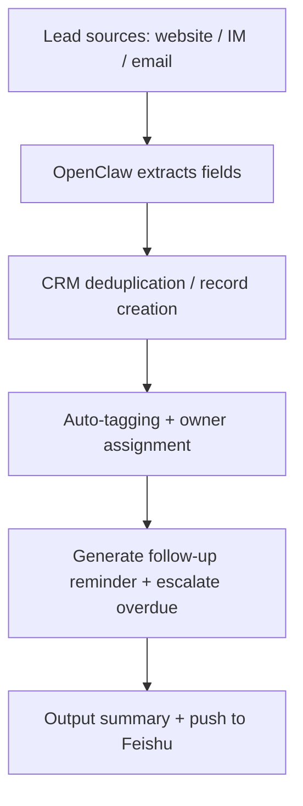

# Business Sales in Practice: Customer Support & CRM Coordination Assistant

> **Use case**: Leads come from scattered sources, sales follow-ups fall through the cracks, and customer service and sales are out of sync. This guide streamlines the "inquiry → record → follow-up → close/archive" flow. Start by getting Claw to reliably handle "auto-archiving + key reminders", then leave room to expand.

## 1. What You Will Get

Once set up, you'll have a transparent, trackable sales loop:

- New leads are automatically classified, tagged, and assigned to an owner
- CRM auto-creates records or merges duplicate leads
- Every interaction automatically generates a follow-up reminder (with owner and deadline)
- Overdue tasks are automatically escalated and pushed to Feishu

## 2. Copy This Prompt to Claw First

```text
Please help me build a "Customer Support & CRM Follow-up" workflow: when a new lead arrives, first extract name/company/budget/source, check the CRM for duplicates — if found, merge and append a conversation summary; if not, create a new lead with owner and next deadline filled in. Assign an intent level of A/B/C. Send an overdue reminder every day at 09:00. Output should include [Lead Summary / CRM Status / Next Action].
```

If you want to try an email-based lead capture version first, just add: "For email leads, use agentmail to capture the subject and body first."

## 3. Which Skills Are Needed

Here's what each Skill does:

- `skill-vetter`
  Link: <https://llmbase.ai/openclaw/skill-vetter/>
  Purpose: Safety check before installation.
- `hubspot`
  Links: <https://termo.ai/skills/hubspot-api>, <https://termo.ai/skills/hubspot-integration>, <https://termo.ai/skills/hubspot-crm>
  Purpose: Create records, query fields, write back status.
- `agentmail`
  Link: <https://docs.agentmail.to/integrations/openclaw>
  Purpose: Capture email leads, generate reply drafts.
- `feishu-doc`
  Links: <https://www.tmser.com/2026/03/02/%E6%AF%8F%E5%A4%A9%E4%B8%80%E4%B8%AAopenclaw-skill-feishu-doc/>, <https://clawhub.ai/skills/feishu-doc>
  Purpose: Save follow-up records, weekly reports, and retrospective documents.

Installation commands:

```bash
clawhub install skill-vetter
clawhub install hubspot
clawhub install agentmail
clawhub install feishu-doc
```

| Skill | Purpose |
| --- | --- |
| `skill-vetter` | Safety check before installation |
| `hubspot` (or whichever CRM skill you use) | Create records, write back status, query fields |
| `agentmail` | Capture leads from email / send auto-reply drafts |
| `feishu-doc` | Weekly follow-up reports, collaboration records, retrospective docs |

`feishu-cron-reminder` and similar scheduled-reminder skills don't have a confirmed slug yet. The recommended approach is to write it as "`openclaw cron` + Feishu send script" or let Claw build a reminder skill for you in Section 6.

## 4. What You'll See Once It's Working

```text
[Lead Summary]
Customer: Zhang San / ABC Robotics
Budget: 100,000–200,000
Source: Website form
Intent level: A

[CRM Status]
No duplicate found. Lead-2026-0318-07 created.
Owner: Li Si
Stage: First follow-up

[Next Action]
1) Complete initial phone call before 16:00 today
2) Send proposal email draft tomorrow at 10:00 and sync to agentmail for confirmation
Note: Phone number is a weak match with an older lead — please verify manually
```

As long as Claw outputs "Summary + Status + Action", the prompt and skill chain are working.

## 5. How to Configure It Step by Step

### Workflow Architecture



### Configuration Steps

1. Standardize fields: source, intent level, budget, owner, next action.
2. Lock the prompt into three sections: "Summary / CRM Status / Next Action".
3. Use `agentmail` to capture email leads and output "needs reply + draft".
4. Set overdue handling: e.g., auto-flag red after 2 hours overdue, push incomplete list every day at 09:00.
5. Let `feishu-doc` automatically accumulate weekly reports (fields + conversation summaries).

## 6. If There's No Ready-Made Skill, Have Claw Build One

If this is your first time doing this, send the following message to Claw directly and let it scaffold a minimal skill first:

```text
Please generate a minimal viable skill for "customer lead archiving, follow-up reminders, and CRM write-back". The first version only needs to parse input, check for duplicates, create or update a lead, and output a structured summary.
```

If it can already produce a directory structure and script draft following this approach, just refer to the minimal skeleton below:

```text
revops-followup/
├── SKILL.md
└── scripts/
    └── main.py
```

The minimal `SKILL.md` can look like this:

```md
---
name: revops-followup
description: Customer lead archiving, follow-up reminders, CRM write-back
---

# RevOps Followup

Use case: used when the user needs to organize leads, update status, and handle overdue reminders.

```

The first version of `scripts/main.py` should implement 4 things: parse input, query CRM, create or update a lead, output a structured summary. Get it working first, then upgrade — don't chase full automation from the start.

## 7. Further Optimization

- Use upstream source (website / IM / email) as metadata to enable per-channel automation.
- Add "follow-up history memory": each output includes push history and owner.
- Have Claw generate CSV/documents and auto-sync them to `feishu-doc` for weekly reports.

## 8. Frequently Asked Questions

**Q1: HubSpot has too many fields — how do I keep it manageable?**
A: List the "required fields" first, and only let Claw fill in `name/source/status/owner/next_action`. Leave other fields for manual entry by default.

**Q2: Nobody picks up the action items?**
A: Add to the prompt: "If owner is empty, return `owner pending` and stop execution."

**Q3: What if leads are duplicated?**
A: Add to the instruction: "If phone number or email matches, merge and list the matched fields."

## 9. Related Reading

- [Meeting Scheduling & Minutes Automation](/en/university/meeting-ops/)
- [Knowledge Base Sharing & Retrieval](/en/university/knowledge-base/)
