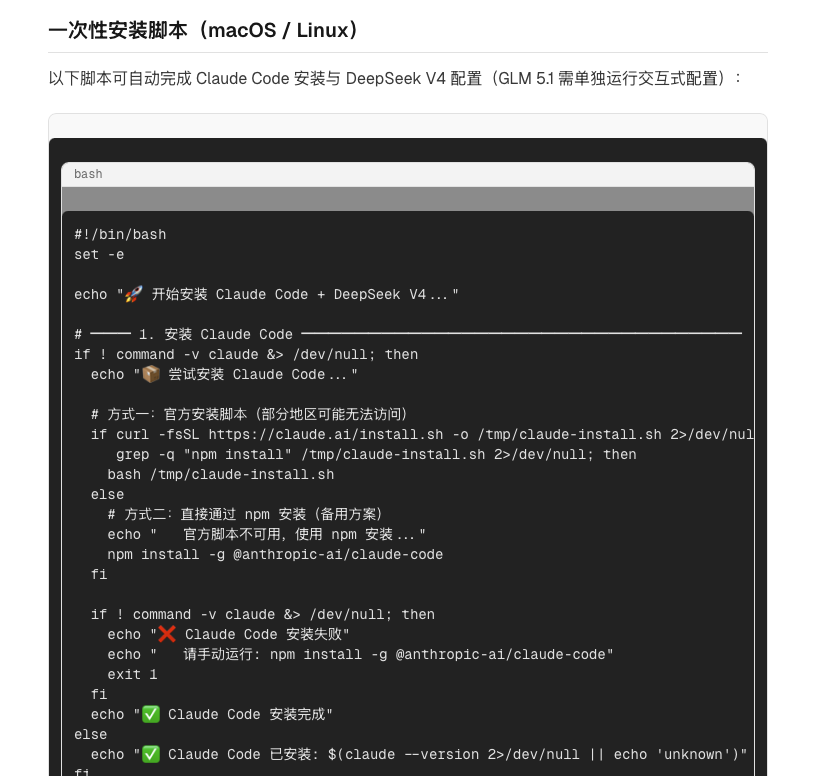

# CC GLM5.1 教程

## Task 1: 清理目前所有的教程

1. 检查是否清理当前目前所有的教程数据
2. 检查是否删除所有进度
3. 检查是否删除所有用户数据
4. 启动应用进行人工检查

## Task 2:  安装Claude Code + GLM 5.1 + DeepSeek V4 教程

1. 创建安装Claude Code + GLM 5.1 + DeepSeek V4 教程
2. 需要使用code-helper需要加入到教程中
3. 生成一次性安装教程

## Task 3: please fix issue

```
Runtime Error


Page "/tutorial/[id]/page" is missing param "/tutorial/[id]" in "generateStaticParams()", which is required with "output: export" config.
```

## Task 4: please fix bug

```


1/1

Next.js 16.2.2 (stale)
Turbopack
Runtime Error


Page "/tutorial/[id]/page" is missing param "/tutorial/[id]" in "generateStaticParams()", which is required with "output: export" config.
Call Stack
15
Hide 15 ignore-listed frame(s)
<unknown>
../../node_modules/.pnpm/next@16.2.2_@babel+core@7.29.0_react-dom@19.2.4_react@19.2.4__react@19.2.4/node_modules/next/src/server/dev/next-dev-server.ts (850:21)
process.processTicksAndRejections
node:internal/process/task_queues (104:5)
async DevServer.renderToResponseWithComponentsImpl
../../node_modules/.pnpm/next@16.2.2_@babel+core@7.29.0_react-dom@19.2.4_react@19.2.4__react@19.2.4/node_modules/next/src/server/base-server.ts (2342:28)
async DevServer.renderPageComponent
../../node_modules/.pnpm/next@16.2.2_@babel+core@7.29.0_react-dom@19.2.4_react@19.2.4__react@19.2.4/node_modules/next/src/server/base-server.ts (2525:16)
async DevServer.renderToResponseImpl
../../node_modules/.pnpm/next@16.2.2_@babel+core@7.29.0_react-dom@19.2.4_react@19.2.4__react@19.2.4/node_modules/next/src/server/base-server.ts (2617:24)
async DevServer.pipeImpl
../../node_modules/.pnpm/next@16.2.2_@babel+core@7.29.0_react-dom@19.2.4_react@19.2.4__react@19.2.4/node_modules/next/src/server/base-server.ts (1793:21)
async NextNodeServer.handleCatchallRenderRequest
../../node_modules/.pnpm/next@16.2.2_@babel+core@7.29.0_react-dom@19.2.4_react@19.2.4__react@19.2.4/node_modules/next/src/server/next-server.ts (1174:7)
```

## Task 5: 教程Bash不能在运行

1. 教程Bash不能运行，需要修复
2. 修复教程Bash的代码，确保在当前环境下正常运行


## Task 6: 文件教程中的脚本不能运行

1. 文件教程中[text](../../playground/apps/desktop/public/skills/install-claude-code-glm5-deepseek-v4.md)Markdown格式中的脚本不能运行
2. 整个项目是希望可以运行Markdown中的Shell命名，如果Windows下面的环境也要能运行，教程中分开写不同的脚本
3. Markdown教程中点击脚本，右边出现脚本运行内容
4.  这个图片里面没有可以点击的按钮Run按钮，所以需要添加这个按钮

## Task 7: Run按钮需要同时支持MDX和MD文件

1. Run按钮需要同时支持MDX和MD文件的脚本
2. fix bug:
```
Error: [next-mdx-remote] error compiling MDX: Could not parse expression with acorn More information: https://mdxjs.com/docs/troubleshooting-mdx
```

## Task 8: WayToAGI to Tutorials

- https://waytoagi.feishu.cn/wiki/space/7226178700923011075?ccm_open_type=lark_wiki_spaceLink&open_tab_from=wiki_home 这个是wayToAGI的王章
- 如何使用AI工具可以把这个网站的教程内容批量转化为教程请调研，给出方案，主要是一个Pipeline，给pipeline里面每个步骤
都分析可能性，和可以使用的工具
- 商业化可行性分析也需要调研

## Task 9: 请调研如何把下面内容转为教程

- [hello-claw](../../references/hello-claw) Hello-Claw转化为教程
- [text](../../references/Path2AGI) Path2AGI转化为教程

教程需要可以分等级：
1. 完全小白使用的
2. 可以是中等水平的，有点点基础的
4. 高级/资深的不是这些教程的用户

## Task 10:  第一次运行命令，不执行这个命令
1. 第一次执行教程内容的时候不会在terminal中之执行命令
2. 需要执行每次都能够执行命令
3. 需要增加验证，确保命令能够正常执行